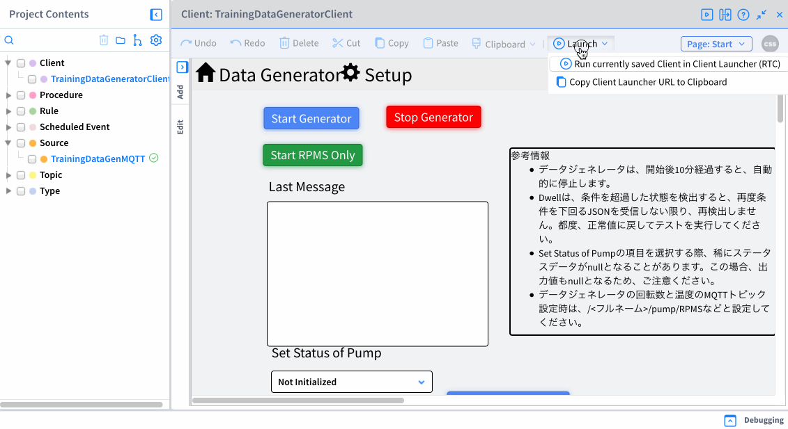

## トラブルシューティング

よくあるトラブルと対応方法についてのドキュメントです。

### 1. **アプリケーションが動かない**

VantiqでSourceやApplicationなど一部のリソースはアクティブ/インアクティブのステータス設定を持っています。インアクティブになっている場合は動作しませんのでアクティブに変更してください。

### 2. **データジェネレーターからMQTTブローカーにデータが届かない、Sourceでデータを受信することができない**

Topicが間違っていると想定しているものと違うTopicにPublishまたはSubscribeをしていることになります。`Topicの前後にスペースが入っていないか`、`大文字小文字を間違えていないか`、`タイプミスがないか`を確認してみてください。

### 3. **App Builderで開発中にエラーが発生する**

エラーが起こるタスクの前のタスクで「Task Eventsの表示」を行い、意図した通りのデータが出力されているか確認しましょう。
また表示されるエラーの内容と併せて原因を追っていき、修正してください。

### 4. **Generator の再起動の方法**

Source がアクティブであることを確認します。「TrainingDataGeneratorClient」の「起動」 > 「現在保存されているClientをClient Launcher(RTC)で実行」をクリックし、Data Generator を開きます。_Start Generator_ ボタンをクリックします。データの生成が開始されます。  

      
