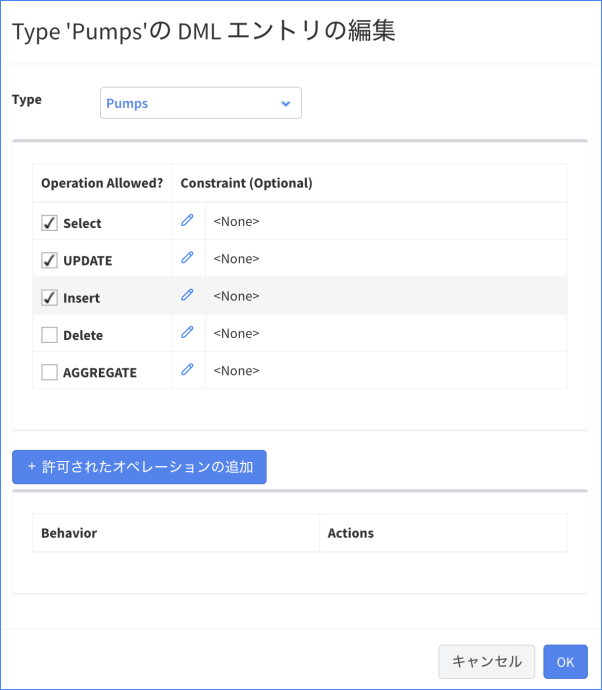

# アクセストークンとプロファイルを使った Vantiq のアクセス制御

Vantiq には REST API が実装されており、外部システムから Vantiq 内のリソースを操作したりデータを送信したりすることができます。  
Vantiq から発行されるアクセストークンを持っているユーザーのみが REST API を使用することができます。  

アクセストークンには必ず1つ以上のプロファイル紐づいており、プロファイルで細かな権限の設定を行います。  

## 目次

- [アクセストークンとプロファイルを使った Vantiq のアクセス制御](#アクセストークンとプロファイルを使った-vantiq-のアクセス制御)
  - [目次](#目次)
  - [プロファイル](#プロファイル)
    - [プロファイルの作成手順](#プロファイルの作成手順)
  - [アクセストークン](#アクセストークン)
    - [アクセストークンの作成手順](#アクセストークンの作成手順)
  - [アクセス制御の例](#アクセス制御の例)
    - [1. イベントデータを送信する](#1-イベントデータを送信する)
    - [2. マスターデータを更新する](#2-マスターデータを更新する)

## プロファイル

プロファイルでは Type に対する権限を設定することができます。  
許可できる権限は `SELECT,UPDATE,INSERT,DELETE,AGGREGATE` です。  

> AGGREGATE は現在非推奨で将来的に削除されます。

Namespace に存在する Type ごとに、上記の権限をそれぞれ設定します。  
デフォルトでは全て許可されていない状態になっており、必要な Type 操作のみ許可します。

### プロファイルの作成手順

1. Vantiq IDE のメニューの `管理` → `Advanced` → `Profile` からプロファイルの一覧を開き、 `+ 新規` をクリックします。
1. 任意の名前をつけ、 `+ Typeの追加` から許可したいTypeを選び、許可する操作にチェックを入れます。
1. 許可したい内容の設定が全て済んだら保存します。（後から編集できます）

   
    
    上の画像では `Pumps` Type に対して `SELECT` `UPDATE` `INSERT` することを許可しています。

## アクセストークン

アクセストークンに設定できる項目は2つあり、 `有効期限` と `プロファイル` です。  
アクセストークンを持つユーザーにプロファイルで設定されている内容を許可することになります。  

### アクセストークンの作成手順

1. Vantiq IDEのメニューの `管理` → `Advanced` → `Access Tokens` からアクセストークンの一覧を開き、 `+ 新規` をクリックします。
1. 任意の名前、プロファイル、有効期限を設定し、保存します。
   - デフォルトでは Admin 権限を持つ Profile が設定されておりますので、必要な時以外は削除して自作した最低限の権限を持つプロファイルのみを設定します。

## アクセス制御の例

### 1. イベントデータを送信する

IoT デバイスなどから直接 Vantiq にデータを直接送信する場合などが該当します。  
多くの場合、 Topic に対して POST を行うことになるので Type への操作許可は不要です。  
空のプロファイルを作成し、そのプロファイルを紐付けたアクセストークンを作成します。  

> **注意点**  
> 特定のTopicのみに POST を許可するという制御はできません。

### 2. マスターデータを更新する

センサーデータに対してマスターデータを Enrich するというような実装になるケースがあります。  
その際に Vantiq 上ではマスタデータを Type に持つことになりますが、外部にマスタの管理システムがある場合、そのシステムにアクセストークンを渡す必要があります。  

その際のアクセストークンには必要に応じて、マスタデータ格納用のTypeの `SELECT` 、 `UPDATE` 、 `INSERT` 等の操作を許可します。  
