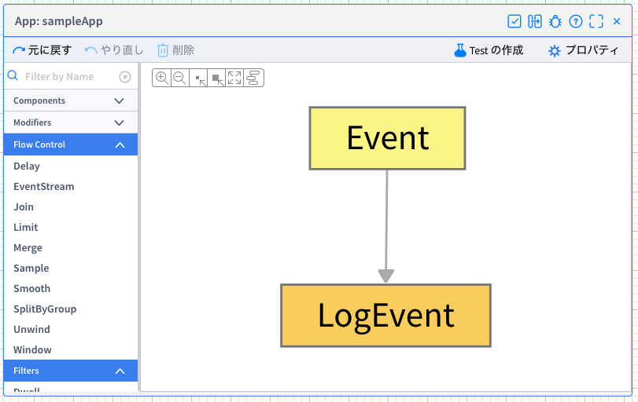
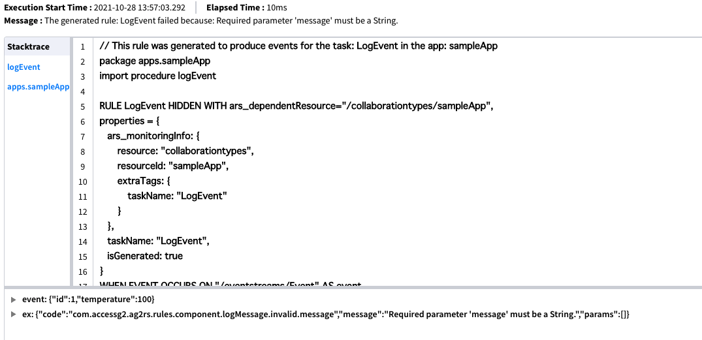
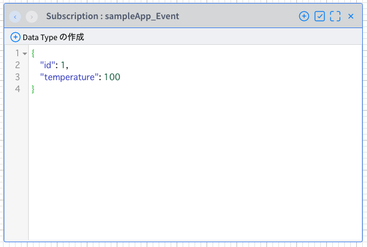
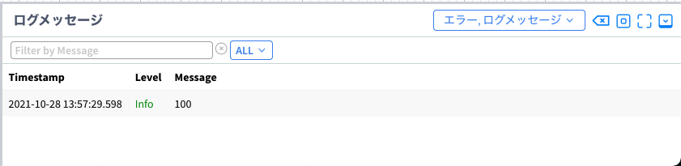

# Vantiqアプリのデバッグデモ


<br/>
<br/>

# デバッグデモの解説

上のデモ動画の解説です。以下をご一読いただき、動画を見ていただくとより理解が深まります。

## デバッグ対象のアプリの説明



このアプリケーションは`Event`と`LogEvent`という名前の2つのタスクだけで構成されたシンプルなアプリケーションです。それぞれのアクティビティパターンとして`Event`には`EventStream`、`LogEvent`には`Procedure`が設定されています。

詳細な設定は以下の通りですが、アプリケーションの動作としては`「EventStreamで受け取ったイベントの1つのプロパティの値をロギングする」`というだけのものです。

**Eventタスクの設定**

|項目|値|
| :-- | :-- |
|アクティビティパターン|EventStream|
|inboudResource|topics|
|inboudResource|/debug/sample/app|


**LogEventタスクの設定**

|項目|値|
| :-- | :-- |
|アクティビティパターン|Procedure|
|procedure|logEvent|

LogEventタスクで呼び出している`logEvent Procedure`の内容
```VAIL
PROCEDURE logEvent(event Object)
// temperatureの値をロギング
log.info(event.temperature)
```

### 送信されるデータ

`/debug/sample/app` Topicに次のデータが送信され、アプリケーションが動作するというシナリオです。
アプリケーションはtemperatureの値である`100`をロギングしようとしています。

```JSON
{
	"id": 1,
    "temperature": 100
}
```

## デバッグの流れ

### 1. エラーの発生

動画の冒頭でイベントを受信した際にLogEventタスクでエラーが発生しています。エラーの内容は以下の方法で確認することができます。`2.`で出力されたエラー名、または`3.`で表示したリストからエラー名をクリックするとエラーの詳細を確認できます。
詳細では、エラーメッセージのほか、スタックトレースやエラー発生時に処理したイベントや変数の内容を確認することができます。

1. エラーが起きたタスクにカーソルを当てる
1. 開発画面下部にエラー出力部
1. メニューの`Test` → `エラー`から確認、またはメニュー部のエラーリストへのアイコンをクリック

    

### 2. エラー内容の確認



エラーメッセージを見ると以下のような内容になっています。

`Message : The generated rule: LogEvent failed because: Required parameter 'message' must be a String.`

String型でないためエラーになっていると書かれています。また`event`を見ると`{"id":1,"temperature":100}`とあり、どうやら送信されてきているイベントに含まれるtemperatureがString型ではない、ということがわかります。

### 3. 送信されてきたデータの確認

アプリケーションのタスクを右クリックし`Task Eventの表示`をクリックするとそのタスクのSubscriptionが表示されます。ここにはタスクで処理した結果が出力されていきます。エラーが起こっているLogEventタスクの前にあるEventタスクの出力結果を確認することでどのようなイベントがLogEventタスクの入力値となっているかがわかります。



やはりtemperatureの値がString型ではなくInteger型のようです（温度でしょうから自然ですが）。

### 4. Procedureを修正

LogEventタスクで呼び出されているProcedureを確認すると`log.info(event.temperature)`というようにtemperatureの値をそのままロギングしようとしています。つまりInteger型の値をそのままにしているということです。これがエラーの原因でいたのでString型に変換する処理を追加します。

**元のProcedure**
```VAIL
PROCEDURE logEvent(event Object)
// temperatureの値をロギング
log.info(event.temperature)
```

**修正後のProcedure**
```VAIL
PROCEDURE logEvent(event Object)
// temperatureの値をロギング
log.info(toString(event.temperature))
```

### 5. 動作確認
古いエラーを消し、再度アプリケーションの動作を確認します。
無事、開発画面下部のログ出力部分に`100`と表示されたのでアプリケーションのバグが修正されたことがわかります。

