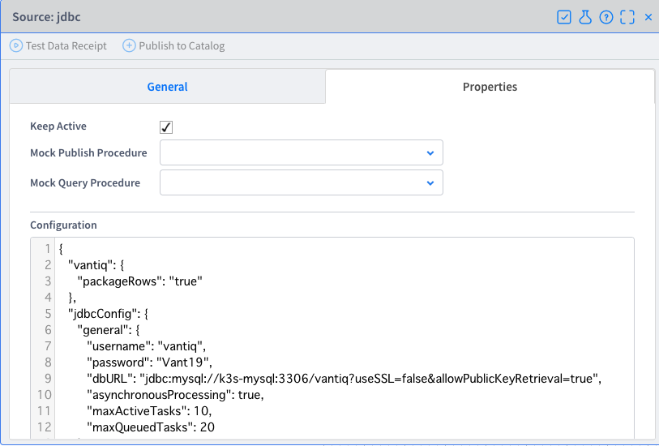
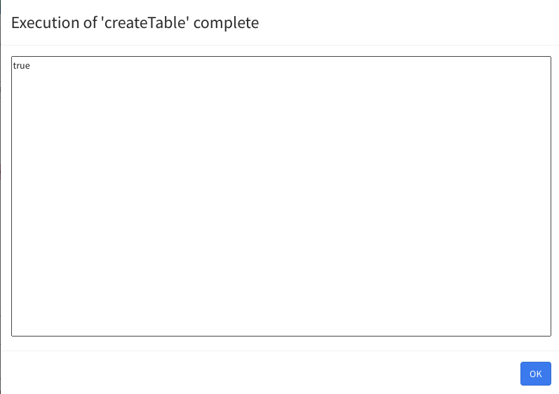

# **Vantiq External Lifecycle Management setup procedure**

# Contents

[Introduction](#introduction)  
[Prerequisites](#prerequisites)  
[Prepare Extension Source with Databases Admin](#prepare-with-databases-admin)  
[Preparation by Vantiq Namespace Admin](#preparation-by-vantiq-namespace-admin)  
[Deploy the k8s worker by Kubernetes Admin](#deploy-the-k8s-worker-by-kubernetes-admin)  
[Deploy container image by Namespace Admin](#deploy-container-image-by-namespace-admin)   
[Check the Extension Source works](#check-the-extension-source-works)  

# Introduction<a id="introduction"></a>
This document describes the configuration procedures for the External Lifecycle Management, the feature added in Vantiq r1.31.

# Prerequisites<a id="prerequisites"></a>
## Procedure confirmation date:
May 22, 2021
## Software environment:
- Vantiq instance r1.31 or later
- Kubernetes installation: K8s, AWS EKS, Azure AKS, K3s or Minikue work. If you want to get K3s installation procedure, please refer to other guide [k3s configuration guide](https://github.com/fujitake/k8slearn/blob/main/docs/eng/configure_k3s_w_notepc.md).
- Have access from your Kubernetes Cluster to your container repository
- Quay.io Access, be able to retrieve /vantiq/vantiq-k8sworker (if not, check with your Vantiq contact)


# Prepare Extension Source with Databases Admin<a id="prepare-with-databases-admin"></a>
## Create an Extension Source image:
As for the detailed instructions, refer to the following URL.

https://github.com/Vantiq/vantiq-extension-sources

Create a gradle.properties in the Git clone directory and set the following elements.

```sh
dockerRegistry=docker.io
pathToRepo=YOURREPO
dockerRegistryUser=YOURACCOUNT
dockerRegistryPassword=YOURPASSWORD
```

Example: For JDBC Extension Source, download the required Java version of the driver and specify it in the variable.

```sh
export JDBC_DRIVER_LOC=/home/ubuntu/mysql-connector-java-8.0.24/mysql-connector-java-8.0.24.jar
```

Execute the following command to build.

```sh
./gradlew jdbcSource:assemble
```

Import the jdbcExample.zip file in the following directory into the Vantiq IDE to see the Source, Procedure and other samples.  
For the Extension Source setting, jdbcImpl.json in the same directory ...

```sh
cd vantiq-extension-sources/jdbcSource/src/test/resources/
```

Load jdbcImpl.json in the above directory into the relevant Namespace in Vantiq.

```sh
vantiq -b https://YOURDOMAIN -t YOURACCESSTOKEN load sourceimpls jdbcImpl.json
```

The container image will be pushed to the repository specified by the following command.

```sh
./gradlew jdbcSource:pushConnectorImage
```

Check the pushed image on your repo.


# Preparation by Vantiq Namespace Admin<a id="preparation-by-vantiq-namespace-admin-1"></a>
## Configure of External Lifecycle Management:
Access the target namespace and specify the name of the Cluster to connect to using Deploy -> Clusters -> +NEW.


The created Cluster Name will be written in overlays/worker/provideClusterName.yaml, so <font color="red">the information needs to be passed to Kubernetes Admin.</font>  
The following shows how the Cluster Name is defined.


# Deploy the k8s worker by Kubernetes Admin<a id="deploy-the-k8s-worker-by-kubernetes-admin"></a>
## Get information from Vantiq Namespace Admin:
Confirm the Cluster Name configured in Vantiq IDE that you received from Vantiq Namespace Admin.

## Configuring the k8s worker with Kubernetes Admin:

This procedure is described with reference to the Vantiq document (/docs/system/extlifecycle/index.html).  
Download and unzip the Kustomize template for starting the K8s workers.

```sh
curl -OL https://dev.vantiq.com/downloads/k8sworkerTemplates.zip
  % Total % Received % Xferd Average Speed Time Time Time Current
Dload Upload Total Spent Left Speed
100 8817 100 8817 0 0 7292 0 0:00:01 0:00:01 --:--:-- 7292

sudo apt install unzip
unzip k8sworkerTemplates.zip
[sudo] password for ubuntu:
Reading package lists... Done
Building dependency tree
Reading state information... Done
Suggested packages:
  zip
The following NEW packages will be installed:
  unzip
0 upgraded, 1 newly installed, 0 to remove and 97 not upgraded.
Need to get 169 kB of archives.
After this operation, 593 kB of additional disk space will be used.
Get:1 http://archive.ubuntu.com/ubuntu focal/main amd64 unzip amd64 6.0-25ubuntu1 \[169 kB\]
Fetched 169 kB in 2s (80.6 kB/s)
Selecting previously unselected package unzip.
(Reading database ... 71229 files and directories currently installed.)
Preparing to unpack .../unzip_6.0-25ubuntu1_amd64.deb ...
Unpacking unzip (6.0-25ubuntu1) ...
Setting up unzip (6.0-25ubuntu1) ...
Processing triggers for mime-support (3.64ubuntu1) ...
Processing triggers for man-db (2.9.1-1) ...

unzip k8sworkerTemplates.zip
Archive: k8sworkerTemplates.zip
  creating: plainText/
 inflating: plainText/vantiq-k8sworker.yaml
 inflating: plainText/vantiq-access-token-secret.yaml
 inflating: plainText/vantiq-service-account.yaml
  creating: kustomize/
  creating: kustomize/vantiq-k8sworker/
  creating: kustomize/vantiq-k8sworker/prerequisites/
 inflating: kustomize/vantiq-k8sworker/prerequisites/vantiq-access-token-secret.yaml
  creating: kustomize/vantiq-k8sworker/overlays/
  creating: kustomize/vantiq-k8sworker/overlays/worker/
 inflating: kustomize/vantiq-k8sworker/overlays/worker/provideServiceAccount.yaml
 inflating: kustomize/vantiq-k8sworker/overlays/worker/kustomization.yaml
 inflating: kustomize/vantiq-k8sworker/overlays/worker/provideQuaySecret.yaml
 inflating: kustomize/vantiq-k8sworker/overlays/worker/provideClusterName.yaml
 inflating: kustomize/vantiq-k8sworker/overlays/worker/provideAccessToken.yaml
 inflating: kustomize/vantiq-k8sworker/overlays/worker/provideVantiqIP.yaml
  creating: kustomize/vantiq-k8sworker/base/
 inflating: kustomize/vantiq-k8sworker/base/kustomization.yaml
 inflating: kustomize/vantiq-k8sworker/base/vantiq-k8sworker.yaml
 inflating: kustomize/vantiq-k8sworker/base/vantiq-service-account.yaml

ls -l
total 20
-rw-rw-r-- 1 ubuntu ubuntu 8817 May 8 09:45 k8sworkerTemplates.zip
drwxrwxr-x 3 ubuntu ubuntu 4096 Apr 10 15:13 kustomize
drwxrwxr-x 2 ubuntu ubuntu 4096 Apr 10 15:13 plainText
```

Create a secret using your own Quay.io.

The account must have permission to retrieve vantiq/k8s-worker.  
Password should be prepared by creating a CLI Password in advance on Quay.io; Account Settings -> User Settings -> Docker CLI Password (the Password used for docker login).

```sh
kubectl create secret docker-registry quay-secret --docker-server=quay.io --docker-username=YOURUSERNAME --docker-password=YOURPASSWORD --docker-email=YOUREMAIL
secret/quay-secret created
```

Generate an Access Token with access rights to the destination Namespace and describe it in the accessToken section.

```sh
vi kustomize/vantiq-k8sworker/prerequisites/vantiq-access-token-secret.yaml
# This defines a Secret that contains the access token for connecting to Vantiq
# This is used by the Vantiq K8sworker job
apiVersion: v1
kind: Secret
metadata:
  name: vantiq-access-token
  annotations:
   relatedTo: "vantiq-k8sworker"
type: Opaque
stringData:
  token: accessToken # Vantiq Token String
```

Create a secret using the yaml file you created.

```sh
kubectl apply -f kustomize/vantiq-k8sworker/prerequisites/vantiq-access-token-secret.yaml
secret/vantiq-access-token created
```

Provide the Cluster Name specified by Vantiq Namespace Admin.

```sh
vi kustomize/vantiq-k8sworker/overlays/worker/provideClusterName.yaml
# This file defines the kustomize update to set the cluster name to be used by the K8sWorker.
# This is the name of the K8s Cluster object created in Vantiq.
#
# To change the value, please update the value of the CLUSTER_NAME environment variable, specifically replacing the
# YOUR_CLUSTER_NAME_HERE text.
#
# Further information can be found in the documentation.
#
apiVersion: batch/v1beta1
kind: CronJob
metadata:
  name: vantiq-k8sworker
  namespace: default # Namespace in which to run this job
spec:
  jobTemplate:
   spec:
    template:
      spec:
        containers:
          - name: vantiq-k8sworker
            env:
              - name: CLUSTER_NAME
                value: fujik3s # name of Vantiq K8s cluster that you received from Vantiq Namespace Admin
```

Specify the Vantiq instance.

```sh
vi kustomize/vantiq-k8sworker/overlays/worker/provideVantiqIP.yaml
# This file defines the kustomize update to set the URL for the Vantiq server.
#
# To change this value, please update the VANTIQ_URL value, specifically the
# vantiq.install value.
#
# Further information can be found in the documentation.
#
apiVersion: batch/v1beta1
kind: CronJob
metadata:
  name: vantiq-k8sworker
  namespace: default # Namespace in which to run this job
spec:
  jobTemplate:
  spec:
    template:
      spec:
        containers:
          - name: vantiq-k8sworker
            env:
              - name: VANTIQ_URL
                value: https://dev.vantiq.com # https://dev.vantiq.com for example.
```

Build the Kustomization target.

```sh
kubectl kustomize kustomize/vantiq-k8sworker/overlays/worker
apiVersion: v1
imagePullSecrets:
- name: quay-secret
kind: ServiceAccount
metadata:
    labels:
      app: vantiq-k8sworker
    name: vantiq-service-account
    namespace: default
# The following is omitted.
```

Execute the command to start the K8s worker.

```sh
kubectl apply -k kustomize/vantiq-k8sworker/overlays/worker
serviceaccount/vantiq-service-account created
rolebinding.rbac.authorization.k8s.io/vantiq-service-account created
cronjob.batch/vantiq-k8sworker created
```

Check the status the pods.  
Periodically, the Cronjob will be executed, and a pod named vantqi-k8sworker-{execution date}-{suffix} will be started.

```sh
kubectl get pods -w
NAME READY STATUS RESTARTS AGE
vantiq-k8sworker-1620550920-g5hk5 0/1 Pending 0 0s
vantiq-k8sworker-1620550920-g5hk5 0/1 Pending 0 0s
vantiq-k8sworker-1620550920-g5hk5 0/1 ContainerCreating 0 0s
vantiq-k8sworker-1620550920-g5hk5 1/1 Running 0 2s
vantiq-k8sworker-1620550920-g5hk5 0/1 Completed 0 6s
vantiq-k8sworker-1620550980-zx8bq 0/1 Pending 0 0s
vantiq-k8sworker-1620550980-zx8bq 0/1 Pending 0 0s
vantiq-k8sworker-1620550980-zx8bq 0/1 ContainerCreating 0 0s
vantiq-k8sworker-1620550980-zx8bq 1/1 Running 0 1s
vantiq-k8sworker-1620550980-zx8bq 0/1 Completed 0 6s
```

## Stop using External Lifecycle Management.
If you want to stop using External Lifecycle Management, just delete the cronjob.

```sh
kubectl delete cronjobs/vantiq-k8sworker
cronjob.batch "vantiq-k8sworker" deleted
```

# Deploy container image by Namespace Admin<a id="deploy-container-image-by-namespace-admin"></a>
## Deploy Extension Source
From the Deploy -> Clusters pane in the Vantiq IDE menu, click on the Cluster Name that you have already set.  
Click the the Deploy button.


　Fill in the required fields and click the OK button.


Installation Names: This will be the StatefulSet name of the remote Kubernetes.  
Image: Specify the Extension Source image you created (for docker hub, specify as above).  
File: Specify the configuration items to be passed to the Extension Source as configmap (required for the Extension Source configuration).  
Host Alias: In the example, specify the IP address of mysql.

*In the example, authToken (the configuration item is CONNECTOR_AUTH_TOKEN) is written directly, but in a production environment, it is preferable to specify it with secrets.*

The sample command to create and configure a configmap in advance is shown below.  
Create a file name with the key name and provide the contents you want to pass to configmap in the file.

```sh
cat data
targetServer=https://dev.vantiq.com
sources=jdbc
kubectl create configmap <configmap-name> --from-file data
kubectl describe cm/<configmap-name>
Name: jsc
Namespace: default
Labels: <none>
Annotations: <none>

Data
====
data:
----
targetServer=https://dev.vantiq.com
source=jdbc
Events: <none>
```

Configure the Source setting in Vantiq IDE.

At this time, specify the information of the destination to be accessed via JDBC Driver such as MySQL.



Check with your DB administrator for username, password, dbURL, etc., and make the appropriate settings.

# Check the Extension Source works<a id="check-the-extension-source-works"></a>
## Check by Namespace Admin
Check the settings of the Extension Source you created.


Run Procedure: createTable to create a table on MySQL.


Click the Execute button.


Check the result.



If an error occurs, check the error code, etc., because there is something wrong with the settings.

## Check by Kubernetes Admin:
Check the settings of the Extension Source you created.

```sh
kubectl get pods -w
NAME READY STATUS RESTARTS AGE
k3s-mysql 1/1 Running 0 2d8h
vantiq-k8sworker-1621704960-7lrl4 0/1 Completed 0 2m25s
vantiq-k8sworker-1621705020-v8pmv 0/1 Completed 0 85s
vantiq-k8sworker-1621705080-2vgqg 0/1 Completed 0 24s
jdbcsource-0 1/1 Running 0 8s
```

Execute the MySQL command and check the operation (Database vantiq is created in advance, and Table does not exist).

```sh
kubectl exec k3s-mysql -it -- /bin/sh
# mysql -u vantiq -p -h localhost
Enter password:
Welcome to the MySQL monitor. Commands end with ; or ¥g.
Your MySQL connection id is 75
Server version: 5.7.34 MySQL Community Server (GPL)

Copyright (c) 2000, 2021, Oracle and/or its affiliates.

Oracle is a registered trademark of Oracle Corporation and/or its
affiliates. Other names may be trademarks of their respective
owners.

Type 'help;' or '¥h' for help. Type '¥c' to clear the current input statement.

mysql> show databases;
+--------------------+
| Database           |
+--------------------+
| information_schema |
| vantiq             |
+--------------------+
2 rows in set (0.00 sec)

mysql> use vantiq;
Reading table information for completion of table and column names
You can turn off this feature to get a quicker startup with -A

Database changed
mysql> show tables;
Empty set (0.00 sec)
```

Check after running Procedure: createTable on Vantiq IDE.

```sh
kubectl exec k3s-mysql -it -- /bin/sh
# mysql -u vantiq -p -h localhost
Enter password:
Welcome to the MySQL monitor. Commands end with ; or ¥g.
Your MySQL connection id is 75
Server version: 5.7.34 MySQL Community Server (GPL)

Copyright (c) 2000, 2021, Oracle and/or its affiliates.

Oracle is a registered trademark of Oracle Corporation and/or its
affiliates. Other names may be trademarks of their respective
owners.

Type 'help;' or '¥h' for help. Type '¥c' to clear the current input statement.

mysql> show databases;
+--------------------+
| Database           |
+--------------------+
| information_schema |
| vantiq             |
+--------------------+
2 rows in set (0.00 sec)

mysql> use vantiq;
Reading table information for completion of table and column names
You can turn off this feature to get a quicker startup with -A

Database changed
mysql> show tables;
+------------------+
| Tables_in_vantiq |
+------------------+
| Test             |
+------------------+
1 row in set (0.00 sec)
```
