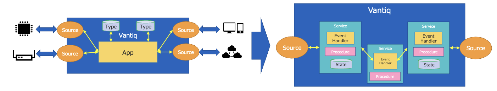
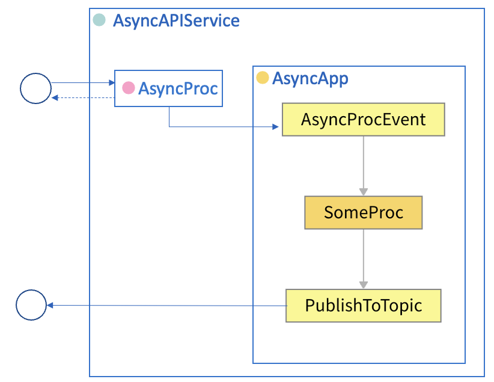
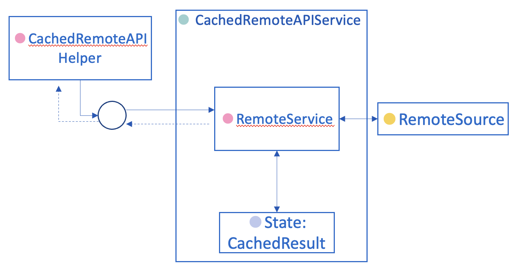
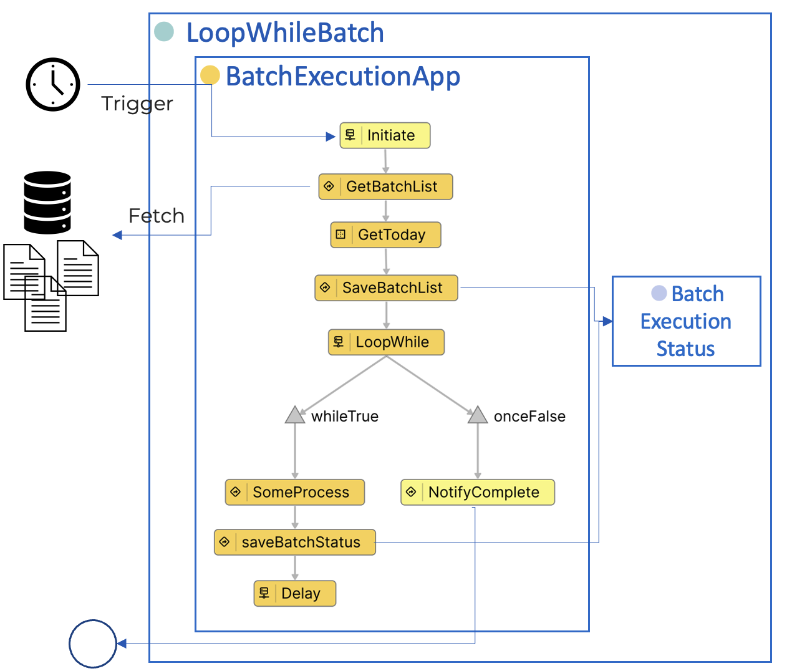
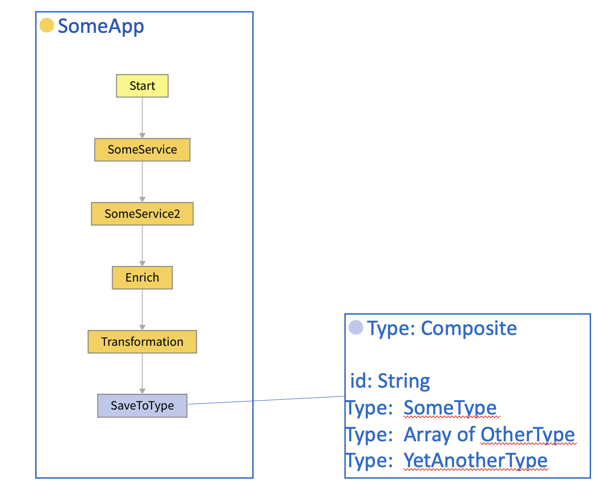
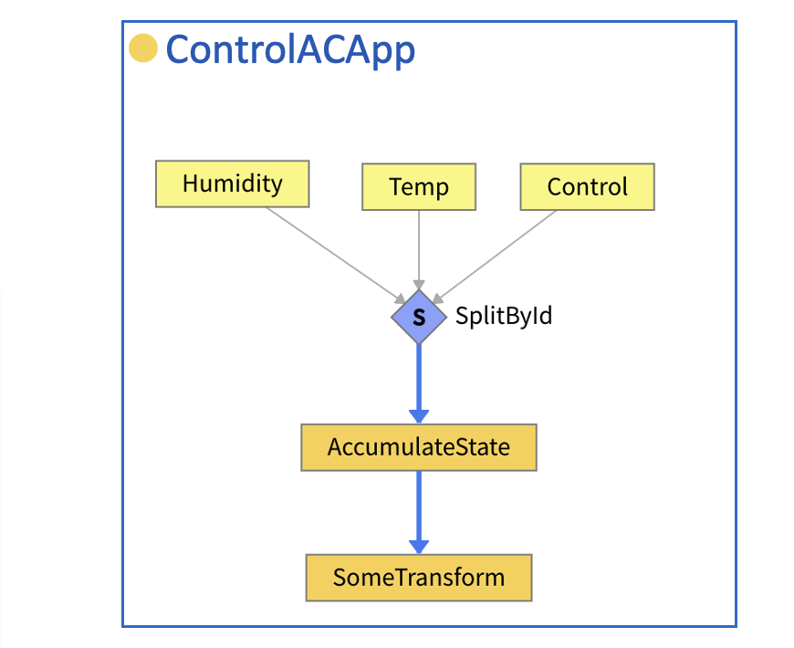
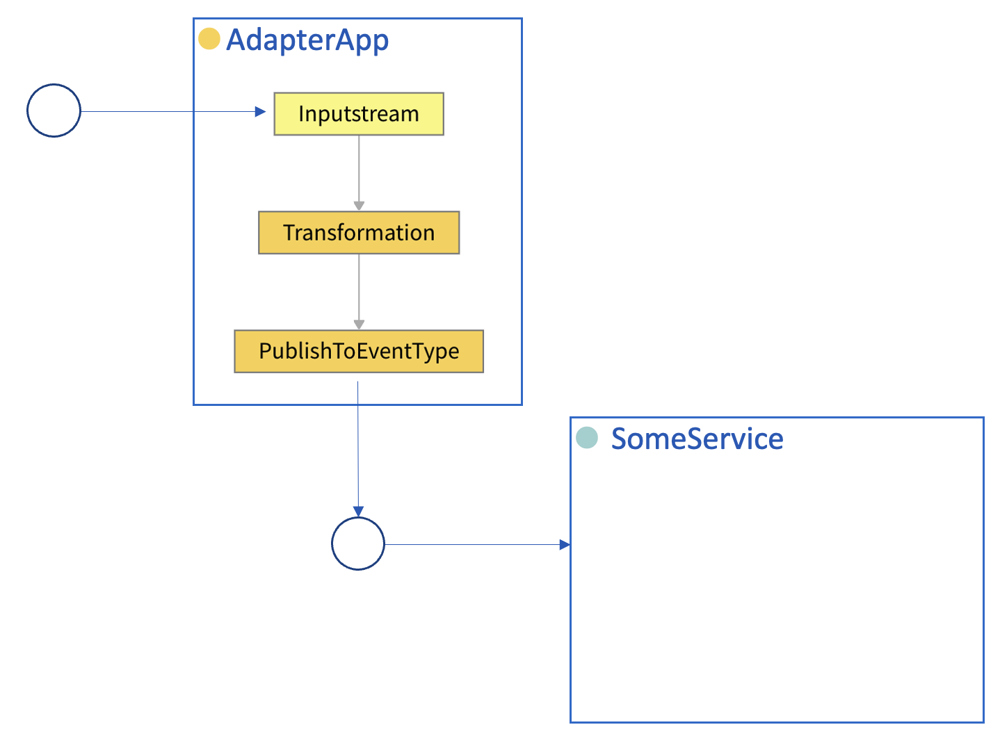
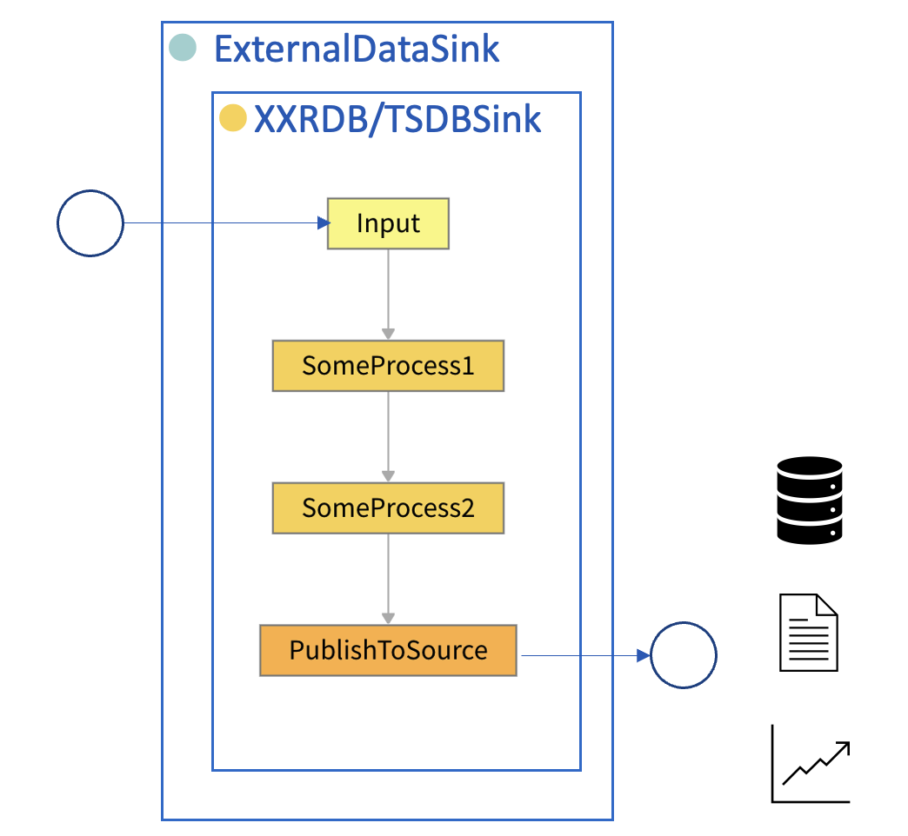

# Reusable application design patterns

## About this document

__Objective\.__

- Abstract the design patterns of applications that maximize the value of Vantiq and make them easy to reuse\, so that the developer can focus on the logic of your applications in line with best practices\.

- Facilitate communication during the development phase and training by naming design patterns\.

- Consider design patterns to be candidates for extensions and parts \(Assembly\) of the Vantiq platform\.

#### How the Vantiq application should be

- Since Vantiq is a platform for stream data processing\, applications should implement __Speed Layer__ as in **[the Lambda Architecture](https://learn.microsoft.com/en-us/azure/architecture/data-guide/big-data/#lambda-architecture)** and **[the Kappa Architecture](https://learn.microsoft.com/en-us/azure/architecture/data-guide/big-data/#kappa-architecture)** \.

  - __Process the stream in real time__ \(not in batches\)\.Process data flowing through the pipe __one__  __by one__  __\,__ not in chunks\.

  - It is desirable to implement the logic only one time for both batch and stream processing\, as in the kappa architecture\.


#### The basic form of Vantiq Application

* The Basic form of Vantiq application is\.\.\.
  * Various independent data sources \(Source\) can be set up as input sources and output sinks\, which can later be connected by applications \(App\)\. \("dependency injection"\)
  * Streams can be merged \(JOIN\) or fanned out as desired\.
* Although Vantiq is quite flexible to implement the complex logic that is not in its basic form\. However\, It will diminish the advantage of Vantiq features if implemented with the conventional database\-centered batch\-processing approach\.



# Principles of the Vantiq Design Pattern

* The Vantiq design pattern leverages "service" resources to create applications that conform to the basic form\, even with complex logic\.
* Service resource features:
  * Grouping the Procedures
  * Implmenting stream input/output\(Inbound/Outbound\)interfaces
  * _→_  _Encapsulate related logic and event streams into the_  _Service_
  * Keep the state in memory \(Stateful Services\)
  * _→_  _Faster processing\, improved scalability_
* Wrapping Source with Service ensures modularity while adding functionality transparently\.

  - [Polling-To-Stream Pattern](#polling-to-stream)
  - [Observer Pattern](#observer)  
  - [Async API Pattern](#async-api)
  - [Cached Remote API Pattern](#cached-remote-api)
  - [In-Memory Master Pattern](#in-memory-master)  
  - [Echo Back Pattern](#echo-back)
  - [Loopwhile Batch Pattern](#loopwhile-batch)
  - [Memento Pattern](#memento)
  - [Composite Entity Pattern](#composite-entity)  
  - [Transpose Pattern](#transpose)  
  - [Adapter/Bridge Pattern](#adapter)   
  - [Lookup Pattern](#lookup)
  - [Upsert State Pattern](#upsert-state)
  - [Stream-To-Bulk Pattern](#stream-to-bulk)
  - [External Datasink Pattern](#external-datasink)
  - [Websocket Pattern](#websocket)
  - [Journal Pattern](#journal)
  - [Smooth Remote Service Pattern](#smooth-remote-service)

### Notes on implementation
- Some design patterns depend on features in [Version 1.34](https://community.vantiq.com/forums/topic/1-3-4-release-notes-%e6%97%a5%e6%9c%ac%e8%aa%9e/). Importing into earlier versions may result in compile errors or may not function as expected.
  - [Map type in Stateful Service](https://dev.vantiq.co.jp/docs/system/rules/index.html#map) - Replaced the use of Object types in Stateful Service
  - Automatic Smoothing – Automatically buffer events that flow excessively through the application
  - [LoopWhile](https://dev.vantiq.co.jp/docs/system/apps/index.html#loop-while) – Sequential execution of a series of processes across multiple tasks

## Input section

### Polling-To-Stream Pattern<a id="polling-to-stream"></a>


__Overview__

- Periodically Polled dataset or file is divided into individual records and output as an event stream\.

__Motivation__

- Polled data is in the form of an array\, which is not suitable for stream processing as it is\.

__Usage__

- To read latest diff data from REST API of external system

- Importdata viaCSVfiles

- Mainly event data such as transactions and telemetry

**Note**
- _Unwind_ - Convert an array to a Stream.


**Sample Project**
- [PollingToStream.zip](https://github.com/fujitake/vantiq-related/raw/main/vantiq-apps-development/conf/reusable-design-patterns/PollingToStream.zip)

---

### Observer Pattern<a id="observer"></a>


__Overview__

- The slowly changing input data is stored in memory on Vantiq and observed at fixed points for changes\. Each detected change is dispatched as an event\.

- Input can be InboundStream\, Return Value from Polling Remote Source \(as in Polling\-To\-Stream pattern\) or a File\.

__Motivation__

- Want to process large data in Vantiq\, but want to reduce unnecessary MongoDB writes or processing\.

__Usage__

- Processing of slowly changing large data \(weather forecast data\, train service alerts\, etc\.\)

- Mainly event data such as transactions and telemetry

**Note**
- _State: LastResult_ - Put the previous \(n\-1th\) data in the State of Service\.
- _InputStream_ - Fetch/Input the latest data \(nth\)
- _DataChange_ - The datasets are compared and if it detect differences or satisfy certain conditions\, then output as outbound streams\.

**Sample Project**
- [Observer.zip](https://github.com/fujitake/vantiq-related/raw/main/vantiq-apps-development/conf/reusable-design-patterns/Observer.zip)

---

### Async API Pattern<a id="async-api"></a>



__Overview__
- Asynchronous processing is performed by derived events while synchronous invocation\ (Request/Response\) of service procedures from external systems\.

__Motivation__

- Want to implement asynchronous invocation and ensure that the Ack signal is received\.

- Want to ensure that responses \(Ack\) are returned promptly\, even for processes that take a long time\.

__Usage__

- Update the state for devices\, etc\.

- Coordination of control instructions

- Request to run time\-consuming jobs

**Note**
- _AsyncProc_ - Publish To Topic in the Procedure\.

**Sample Project**
- [AsyncAPI.zip](https://github.com/fujitake/vantiq-related/raw/main/vantiq-apps-development/conf/reusable-design-patterns/AsyncAPI.zip)

---

### Cached Remote API Pattern<a id="cached-remote-api"></a>



__Overview__

- Cache REST API query results for large\, slowly changing reference data and return repeated query result from the cache

- Periodically clear expired cache

__Motivation__

- When the reference data of the external service changes\, it is difficult to import it on Vantiq\, so it is reasonable to query it via Remote Source\, but Remote Source calls are slow\, avoiding the bottleneck that occurs when the number of calls increases\.

__Usage__

- External service calls for regularly updated data \(weather forecasts\, dynamic demographics statistics\, etc\.\)

**Note**
- _CachedRemoteAPIHelper_ - Wrapper to calculate PartitionKey from query
- _RemoteService_ - If Cache is a hit\, return Cache\. If it is not a hit or expired\, query Remote Source\.

**Sample Project**
- [CachedRemoteAPI.zip](https://github.com/fujitake/vantiq-related/raw/main/vantiq-apps-development/conf/reusable-design-patterns/CachedRemoteAPI.zip)


---

### In-Memory Master Pattern<a id="in-memory-master"></a>


__Overview__

- Master data \(or equivalent reference data\) to be loaded from outside is stored in in\-memoryState\,  not Type\. Since State can only be used for hash index searches\, a cache is required foreach search pattern\.

- Search is better optimized if multiple masters are joined then stored at the time of loading\. \(as in Composite Entity pattern\)

__Motivation__

- Faster data integration and enrichment process\.

__Usage__

- Reference master data

- Data integration

**Note**
- _UpdateMaster Procedure_ - Trigged by Scheduled Procecure or Initializer of the Service\.
- _Purge Procedure_ - Purge old data from State on a regular basis.

**Sample Project**
- [InMemoryMaster.zip](https://github.com/fujitake/vantiq-related/raw/main/vantiq-apps-development/conf/reusable-design-patterns/InMemoryMaster.zip)

---

### Echo Back Pattern<a id="echo-back"></a>


__Overview__

- Return data input via Broker\, REST API\, etc\. to the external Broker as it is\.

__Motivation__

- During integration\,Want to confirm that the data is successfully ingested from the external system's perspective\.

__Usage__

- For integration test with external systems

**Note**
- N/A

**Sample Project**
- [EchoBack.zip](https://github.com/fujitake/vantiq-related/raw/main/vantiq-apps-development/conf/reusable-design-patterns/EchoBack.zip)

---
### Loopwhile Batch <a id="loopwhile-batch"></a>


**Overview**
- Enter a list of batches (file list, table subset, etc.) divided into smaller batches (not timed out by Vantiq, not overloaded) in advance, execute the batches sequentially in LoopWhile, and record the status of each execution.
- If it fails in the middle of the process, it is restarted in its entirety or in the middle of the process based on the recorded progress status.
- Use with the Async Procedure pattern, the Polling-To-Stream pattern, etc.

**Motivation**
- Ensure processing that requires a large amount of input
- To improve operational efficiency based on the assumption that errors occur with a certain probability

**Usage**
- Data integration
- Machine Learning data pre-processing

**Note**
- N/A

**Sample Project**
- [LoopWhileBatch.zip](https://github.com/fujitake/vantiq-related/raw/main/vantiq-apps-development/conf/reusable-design-patterns/LoopWhileBatch.zip)

---
### Memento <a id="memento"></a>


**Overview**
- Label and persist files, data sets, etc. (daily history, etc.) and restore them when needed.
- Even large data sets (e.g., JSON with tens of thousands of records, etc.) are persisted as a single record.
- Set the expiration date and maximum storage capacity in the destination table (Type) as appropriate. (e.g., 7 days)


**Motivation**
-  The logic to be processed requires input data several generations old, and we want to call it very fast.
- To ensure reproducibility of processing results, we want to preserve several generations of input data regardless of the server's operating status.


**Usage**
- Processes involving comparisons with long-term historical data with a large number of records.

**Note**
- _Load_ - Implement the process of restoring to State at the caller side (Upsert State)


**Sample Project**
- [Memento.zip](https://github.com/fujitake/vantiq-related/raw/main/vantiq-apps-development/conf/reusable-design-patterns/Memento.zip)

---
## App Edition

### Composite Entity Pattern<a id="composite-entity"></a>



__Overview__

- Process multiple entities together in a composite entity

__Motivation__

- Reduce the number of times the table is read/written\, prepare in the form of denormalized/composite entities as joins are not possible in NoSQL\.

__Usage__

- Increase search performance of multiple masters

- Optimal representation of relationships in NoSQL

- As a data structure for UI display

**Note**
- N/A

**Sample Project**
- N/A

---

### Transpose Pattern<a id="transpose"></a>



__Overview__

- Use the AccumulateState task to perform transpose and join input of the properties of three or more streams with a common ID in timing\-independent way\.

__Motivation__

- Stream integration by Join depends on the timing of either input event\.

__Usage__

- Integration of various streams

**Note**
- Sample code to implement in AccumulateState
```vail
if (!state) {
    // if this is the first time, initialize it.
    state = {     
    }
}

// copy properties if present
state.controlCode = event.controlCode ? event.controlCode : state.controlCode
state.temp        = event.temp ? event.temp : state.temp
state.humidity    = event.humidity ? event.humidity : state.humidity

state.timestamp = event.timestamp
state.machineID = event.machineID
```

**Sample Project**
- [Transpose.zip](https://github.com/fujitake/vantiq-related/raw/main/vantiq-apps-development/conf/reusable-design-patterns/Transpose.zip)

---

### Adapter / Bridge Pattern<a id="adapter"></a>



__Overview__

- Match the format of the input stream to the interface of theService\.

- Transform or wrap in Procedure as appropriate when connecting to Service Inbound\, Service Outbound\, and Service Procedure\.

__Motivation__

- To use Service without compromising their versatility as Service components\.

__Usage__

- Various

**Note**

- This example is an Adapter for Service Inbound\. A similar pattern can be used for the Service Outbound and Service Procedure interfaces\.

**Sample Project**
- N/A

---

### Lookup Pattern<a id="lookup"></a>


__Overview__

- Properties are added incrementally as multiple data sources are integrated into the input stream\.

- Use withIn\-Memory Master Pattern\, Cached Remote API\, and Cached Enrich to improve efficiency\.

__Motivation__

- To integrate various dataset\, such as REST API queries and Enrich tasks in addition to stream integration\.

__Usage__

- Data integration

**Note**
- _SomeService.Get()_ - Service Procedure returns a record for given a Key.
- _SomeService_, _SomeService2_ Task - Call Service Procedure to "__Attach Return Value to Return Property"__\.
- _Sink_ - If the data is for analysis\, it better be sent to outside Vantiq via Broker\, etc\.

**Sample Project**
- N/A

---
### Upsert State <a id="upsert-state"></a>


**Overview**
- Integrate records with different data sources having the same key on the Service State.
- When integrating multiple data which come in asynchronously, an event is emitted if necessary.
- If the input is an array, it is processed in bulk.
-
**Motivation**
- Efficiently integrate data sources that are input asynchronously in batches.

**Usage**
- Data Integration

**Note**
- _UpsertState()_ - Binds the properties to an object of the same key held by State.
  ```vail
  package jp.co.vantiq.designpattern.upsertstate
  PROCEDURE JoinXXXData.upsertState(keyName String, obj Object, propName String)

  var key = event[keyName]
  joinedState.compute(key, (pKey, value) => {
      if (value == null) {
          value = {}
      }
      value[propName] = obj
      return value
  })
  return true
  ```
- _BulkUpsertState_ -UpsertState() is performed on each element of the array.


**Sample Project**
- [UpsertState.zip](https://github.com/fujitake/vantiq-related/raw/main/vantiq-apps-development/conf/reusable-design-patterns/UpsertState.zip)

---
### Constant <a id="constant"></a>


**Overview**
- Use constant values held in DB (Type) for the application.
- Replace and reflect constant values without build.

**Motivation**
- Want to switch constants manually or by operational timing.

**Usage**
- Adjustment of parameters for test operations
- Adjustable operational calendar creation

**Note**

**Sample Project**
- [Const.zip](https://github.com/fujitake/vantiq-related/raw/main/vantiq-apps-development/conf/reusable-design-patterns/Const.zip)
---

## Output section

### Stream-To-BulkInsert Pattern<a id="stream-to-bulk"></a>


__Overview__

- Stream data is stored in memory\, and when a certain amount of time or a certain number of records have been accumulated\, the data is written to the DB in batches\.

- Applicable to bulk Remote Source POST to external APIs\.

__Motivation__

- In Vantiq processing\, database operations are relatively slow and avoid credit overruns if the stream is flowing as\-is during parallel processing\.

- To reduce billing by avoiding overage in external API services\.

__Usage__

- Efficient export toType

- Efficient export toRemote Source

**Note**
- N/A

**Sample Project**
- [StreamToBulkInsert.zip](https://github.com/fujitake/vantiq-related/raw/main/vantiq-apps-development/conf/reusable-design-patterns/StreamToBulkInsert.zip)

---

### Sink-To-External Pattern<a id="external-datasink"></a>



__Overview__

- Send processed data from Vantiq application to external sources for storing\.

- RDB\, time\-series DB\, etc\. as destinations for such data\.

__Motivation__

- Vantiq is not a data analysis platform or storage for archiving\. So such data should be stored in respective external services\.

__Usage__

- Storage of historical data

- Accumulation of visualization dashboards\, reporting\, and data analytics platform

**Note**
- N/A

**Sample Project**
- N/A

---

### WebSocket Pattern<a id="websocket"></a>


__Overview__

- Stream data output to Vantiq Topic and retrieved via WebSocket from client app

__Motivation__

- Avoid excessive polling from client apps and ensure real\-time performance

__Usage__

- Update map information \(for location tracking\) to the WebClient

**Note**
- N/A

**Sample Project**
- [websocket_client.zip](https://github.com/fujitake/vantiq-related/raw/main/vantiq-apps-development/conf/reusable-design-patterns/websocket_client.zip)
- [WebSocket_Server.zip](https://github.com/fujitake/vantiq-related/raw/main/vantiq-apps-development/conf/reusable-design-patterns/WebSocket_Server.zip)

---

### Journal Pattern<a id="journal"></a>


__Overview__

- Updates are made to the in\-memory cache\, the Journal is maintained for updated information\, and Persist is performed at a certain timing\.

__Motivation__

- Minimize writes to Type while ensuring Persistency\.

__Usage__

- Temporary to permanent storage of state

**Note**
- _ScheduledProc_ - Write in Scheduled Procedure in Service

**Sample Project**
- N/A

---
### Smooth Remote Service <a id="smooth-remote-service"></a>


**Overview**
- Buffer the portion of the Remote Source that calls external services and control the number of calls per fixed time.

**Motivation**
- If Vantiq processing is too fast for an external service, control the call on the Vantiq side so that it does not result in an error.

**Usage**
- Use external services that have an API call limit per hour

**Note**
- N/A

**Sample Project**
- [SmoothRemoteService.zip](https://github.com/fujitake/vantiq-related/raw/main/vantiq-apps-development/conf/reusable-design-patterns/SmoothRemoteService.zip)

---
