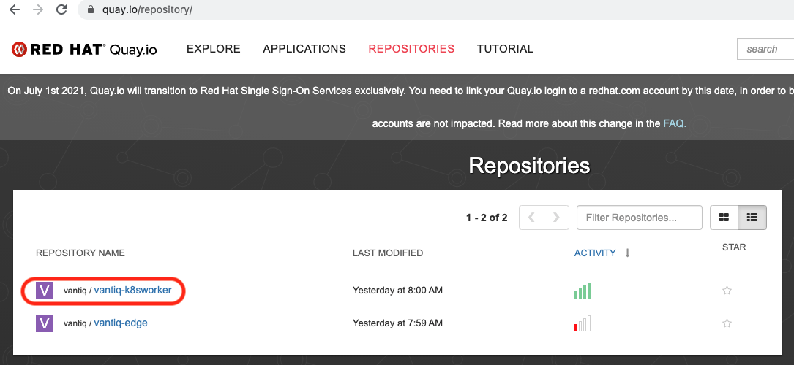
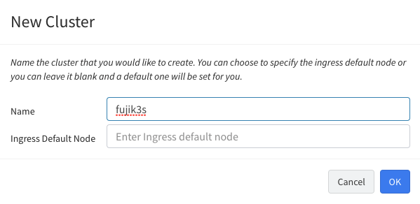
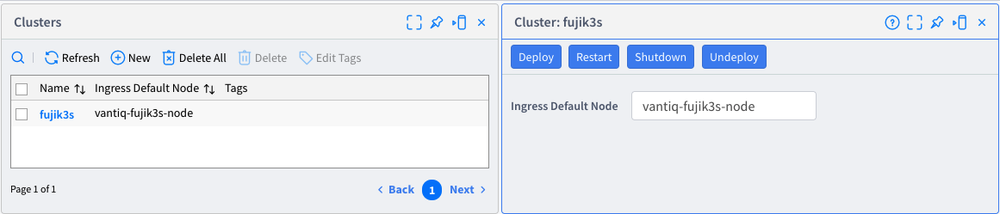
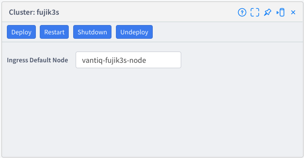
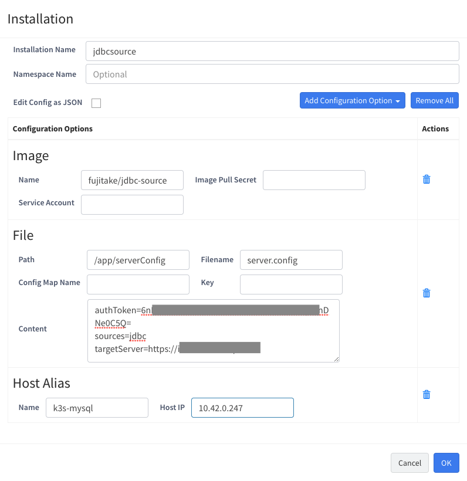
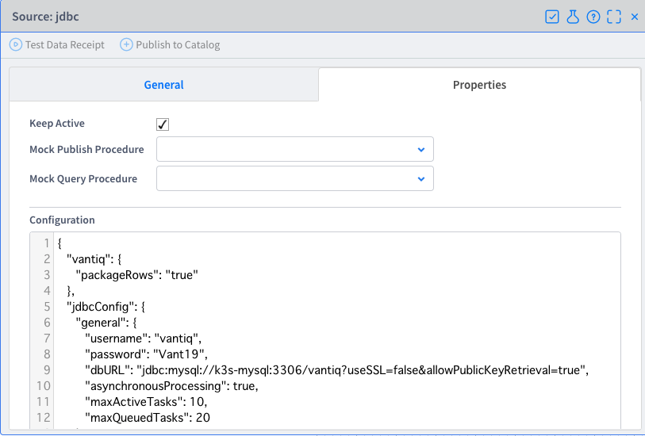
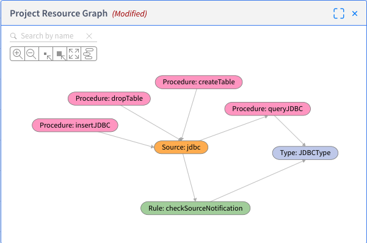
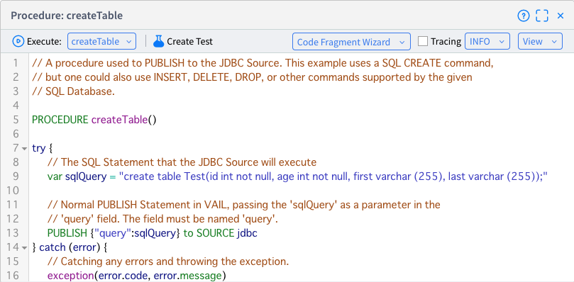
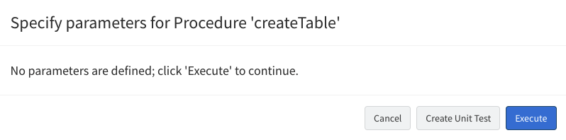
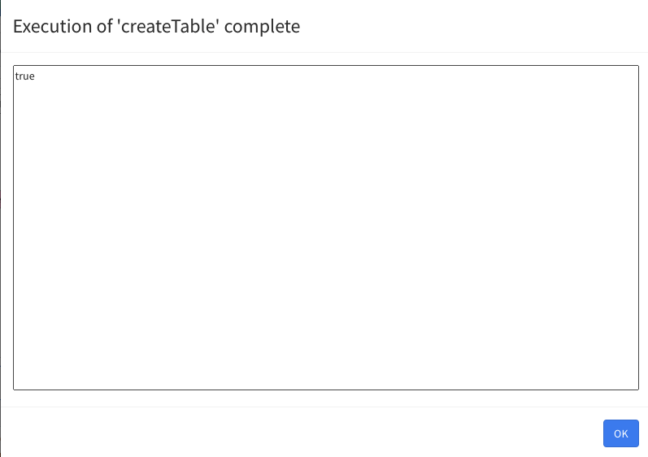

# **Vantiq External Lifecycle Management 設定手順**

# 目次

[はじめに](#introduction)  
[対象環境及び条件](#prerequisites)  
[Database Adminと一緒にExtension Sourceを準備](#prepare-with-databases-admin)  
[Vantiq Namespace Adminによる準備](#preparation-by-vantiq-namespace-admin)  
[Kubernetes Adminによるk8s workerの設定](#deploy-the-k8s-worker-by-kubernetes-admin)
[Namespace Adminによるコンテナイメージのデプロイ](#deploy-container-image-by-namespace-admin)  
[Extension Sourceの動作確認](#check-the-extension-source-works)  

# はじめに<a id="introduction"></a>
Vantiq r1.31より追加された機能External Lifecycle Managementの設定手順及びExtension Sourceを含めた周辺環境の事前準備に必要とする手順を記載する。

# 前提条件<a id="prerequisites"></a>
## 手順確認日:
2021/05/22
## ソフトウェア環境:
- Vantiq インスタンス r1.31以降
- Kubernetes環境: K8s, AWS EKS, Azure AKS, K3s, Minikue など。Kubernetesセットアップガイドが必要であれば、[ノートPCにK3sをセットアップする](https://github.com/fujitake/k8slearn/blob/main/docs/jp/configure_k3s_w_notepc.md)を参照ください。
- Kubernetes クラスタがインターネットにある任意(自分が使っている)のコンテナリポジトリにアクセスできること
- Quay.ioへのアクセスおよび vantiq/vantiq-k8sworker が取得できること。(アクセス権がない場合、Vantiq社員に相談ください)



# Database Adminと一緒にExtension Sourceを準備<a id="prepare-with-databases-admin"></a>
## Extension Sourceのイメージを作成:
詳細手順は、下記を参照  
https://github.com/Vantiq/vantiq-extension-sources

Git cloneしたディレクトリにgradle.propertiesを作成し、下記要素を設定

```sh
dockerRegistry=docker.io
pathToRepo=YOURREPO
dockerRegistryUser=YOURACCOUNT
dockerRegistryPassword=YOURPASSWORD
```

例: JDBC Extension Sourceの場合、必要なJava版ドライバをダウンロードし、変数に指定

```sh
export JDBC_DRIVER_LOC=/home/ubuntu/mysql-connector-java-8.0.24/mysql-connector-java-8.0.24.jar
```

  下記コマンドを実行しビルド

```sh
./gradlew jdbcSource:assemble
```

下記ディレクトリにあるjdbcExample.zipをVantiq IDEにインポートするとSource、Procedureなどのサンプルが確認できる  
Extension Sourceの設定は、同じディレクトリにあるjdbcImpl.jsonを

```sh
cd vantiq-extension-sources/jdbcSource/src/test/resources/
```

上記ディレクトリにあるjdbcImpl.jsonをVantiqの当該Namespaceにloadする

```sh
vantiq -b https://YOURDOMAIN -t YOURACCESSTOKEN load sourceimpls jdbcImpl.json
```

下記コマンドにて指定したリポジトリにコンテナイメージがプッシュされる

```sh
./gradlew jdbcSource:pushConnectorImage
```

プッシュしたイメージを確認


# Vantiq Namespace Adminによる準備<a id="preparation-by-vantiq-namespace-admin"></a>
## External Lifecycle Managementの事前設定:
接続先Namespaceにアクセスし、Deploy -> Clusters -> +NEWから接続先Cluster名を指定



作成したCluster Nameは、overlays/worker/provideClusterName.yamlに記述するため、<font color="red">設定した情報をKubernetes Adminに渡す必要がある</font>

Cluster Nameを定義した状態



# Kubernetes Adminによるk8s workerの設定<a id="deploy-the-k8s-worker-by-kubernetes-admin"></a>
## Vantiq Namespace Adminから情報を入手:
Vantiq IDEにて設定したCluster Nameを確認

## Kubernetes Adminによるk8s workerの設定:

本手順は、Vantiq document (/docs/system/extlifecycle/index.html)を参照しつつ、記載している

K8s worker起動用のKustomizeテンプレートをダウンロードしunzip

```sh
curl -OL https://dev.vantiq.com/downloads/k8sworkerTemplates.zip
  % Total % Received % Xferd Average Speed Time Time Time Current
Dload Upload Total Spent Left Speed
100 8817 100 8817 0 0 7292 0 0:00:01 0:00:01 --:--:-- 7292

sudo apt install unzip
unzip k8sworkerTemplates.zip
[sudo] password for ubuntu:
Reading package lists... Done
Building dependency tree
Reading state information... Done
Suggested packages:
  zip
The following NEW packages will be installed:
  unzip
0 upgraded, 1 newly installed, 0 to remove and 97 not upgraded.
Need to get 169 kB of archives.
After this operation, 593 kB of additional disk space will be used.
Get:1 http://archive.ubuntu.com/ubuntu focal/main amd64 unzip amd64 6.0-25ubuntu1 \[169 kB\]
Fetched 169 kB in 2s (80.6 kB/s)
Selecting previously unselected package unzip.
(Reading database ... 71229 files and directories currently installed.)
Preparing to unpack .../unzip_6.0-25ubuntu1_amd64.deb ...
Unpacking unzip (6.0-25ubuntu1) ...
Setting up unzip (6.0-25ubuntu1) ...
Processing triggers for mime-support (3.64ubuntu1) ...
Processing triggers for man-db (2.9.1-1) ...

unzip k8sworkerTemplates.zip
Archive: k8sworkerTemplates.zip
  creating: plainText/
 inflating: plainText/vantiq-k8sworker.yaml
 inflating: plainText/vantiq-access-token-secret.yaml
 inflating: plainText/vantiq-service-account.yaml
  creating: kustomize/
  creating: kustomize/vantiq-k8sworker/
  creating: kustomize/vantiq-k8sworker/prerequisites/
 inflating: kustomize/vantiq-k8sworker/prerequisites/vantiq-access-token-secret.yaml
  creating: kustomize/vantiq-k8sworker/overlays/
  creating: kustomize/vantiq-k8sworker/overlays/worker/
 inflating: kustomize/vantiq-k8sworker/overlays/worker/provideServiceAccount.yaml
 inflating: kustomize/vantiq-k8sworker/overlays/worker/kustomization.yaml
 inflating: kustomize/vantiq-k8sworker/overlays/worker/provideQuaySecret.yaml
 inflating: kustomize/vantiq-k8sworker/overlays/worker/provideClusterName.yaml
 inflating: kustomize/vantiq-k8sworker/overlays/worker/provideAccessToken.yaml
 inflating: kustomize/vantiq-k8sworker/overlays/worker/provideVantiqIP.yaml
  creating: kustomize/vantiq-k8sworker/base/
 inflating: kustomize/vantiq-k8sworker/base/kustomization.yaml
 inflating: kustomize/vantiq-k8sworker/base/vantiq-k8sworker.yaml
 inflating: kustomize/vantiq-k8sworker/base/vantiq-service-account.yaml

ls -l
total 20
-rw-rw-r-- 1 ubuntu ubuntu 8817 May 8 09:45 k8sworkerTemplates.zip
drwxrwxr-x 3 ubuntu ubuntu 4096 Apr 10 15:13 kustomize
drwxrwxr-x 2 ubuntu ubuntu 4096 Apr 10 15:13 plainText
```

自分のQuay.ioを用いてsecretを作成  
当該アカウントがvantiq/k8s-workerの取得権限を持っていることが条件となる  
Passwordは、CLI Passwordを事前にQuay.ioのAccount Settings -> User Settings -> Docker CLI Passwordにて作成し、用意しておくこと (docker loginで使うPasswordのこと)

```sh
kubectl create secret docker-registry quay-secret --docker-server=quay.io --docker-username=YOURUSERNAME --docker-password=YOURPASSWORD --docker-email=YOUREMAIL
secret/quay-secret created
```

接続先Namespaceにアクセス権限を持つAccess Tokenを生成してaccessTokenの箇所に記述

```sh
vi kustomize/vantiq-k8sworker/prerequisites/vantiq-access-token-secret.yaml
# This defines a Secret that contains the access token for connecting to Vantiq
# This is used by the Vantiq K8sworker job
apiVersion: v1
kind: Secret
metadata:
  name: vantiq-access-token
  annotations:
   relatedTo: "vantiq-k8sworker"
type: Opaque
stringData:
  token: accessToken # Vantiq Token String
```

作成したyamlファイルを使ってsecretを作成

```sh
kubectl apply -f kustomize/vantiq-k8sworker/prerequisites/vantiq-access-token-secret.yaml
secret/vantiq-access-token created

```

Vantiq Namespace Adminが指定したCluster Nameを入力

```sh
vi kustomize/vantiq-k8sworker/overlays/worker/provideClusterName.yaml
# This file defines the kustomize update to set the cluster name to be used by the K8sWorker.
# This is the name of the K8s Cluster object created in Vantiq.
#
# To change the value, please update the value of the CLUSTER_NAME environment variable, specifically replacing the
# YOUR_CLUSTER_NAME_HERE text.
#
# Further information can be found in the documentation.
#
apiVersion: batch/v1beta1
kind: CronJob
metadata:
  name: vantiq-k8sworker
  namespace: default # Namespace in which to run this job
spec:
  jobTemplate:
   spec:
    template:
      spec:
        containers:
          - name: vantiq-k8sworker
            env:
              - name: CLUSTER_NAME
                value: fujik3s # name of Vantiq K8s cluster this worker should represent
```

接続先Vantiq インスタンス (<https://dev.vantiq.co.jp>など)を指定

```sh
vi kustomize/vantiq-k8sworker/overlays/worker/provideVantiqIP.yaml
# This file defines the kustomize update to set the URL for the Vantiq server.
#
# To change this value, please update the VANTIQ_URL value, specifically the
# vantiq.install value.
#
# Further information can be found in the documentation.
#
apiVersion: batch/v1beta1
kind: CronJob
metadata:
  name: vantiq-k8sworker
  namespace: default # Namespace in which to run this job
spec:
  jobTemplate:
  spec:
    template:
      spec:
        containers:
          - name: vantiq-k8sworker
            env:
              - name: VANTIQ_URL
                value: https://dev.vantiq.co.jp # https://dev.vantiq.com for example.
```

Kustomization targetをビルド

```sh
kubectl kustomize kustomize/vantiq-k8sworker/overlays/worker
apiVersion: v1
imagePullSecrets:
- name: quay-secret
kind: ServiceAccount
metadata:
    labels:
      app: vantiq-k8sworker
    name: vantiq-service-account
    namespace: default
# 省略
```

K8s workerを起動するコマンドを実行

```sh
kubectl apply -k kustomize/vantiq-k8sworker/overlays/worker
serviceaccount/vantiq-service-account created
rolebinding.rbac.authorization.k8s.io/vantiq-service-account created
cronjob.batch/vantiq-k8sworker created
```

Podの状態を確認  
定期的にCronjobが実行され、vantqi-k8sworker-{実行日時}-{サフィックス}のPodが起動する

```sh
kubectl get pods -w
NAME READY STATUS RESTARTS AGE
vantiq-k8sworker-1620550920-g5hk5 0/1 Pending 0 0s
vantiq-k8sworker-1620550920-g5hk5 0/1 Pending 0 0s
vantiq-k8sworker-1620550920-g5hk5 0/1 ContainerCreating 0 0s
vantiq-k8sworker-1620550920-g5hk5 1/1 Running 0 2s
vantiq-k8sworker-1620550920-g5hk5 0/1 Completed 0 6s
vantiq-k8sworker-1620550980-zx8bq 0/1 Pending 0 0s
vantiq-k8sworker-1620550980-zx8bq 0/1 Pending 0 0s
vantiq-k8sworker-1620550980-zx8bq 0/1 ContainerCreating 0 0s
vantiq-k8sworker-1620550980-zx8bq 1/1 Running 0 1s
vantiq-k8sworker-1620550980-zx8bq 0/1 Completed 0 6s
```

Cronjobの削除方法  
External Lifecycle Managementの利用を終了する場合、cronjobを削除する

```sh
kubectl delete cronjobs/vantiq-k8sworker
cronjob.batch "vantiq-k8sworker" deleted
```

# Namespace Adminによるコンテナイメージのデプロイ<a id="deploy-container-image-by-namespace-admin"></a>
## Extension Sourceをデプロイ<a id="ExtSrcをデプロイ"></a>
Vantiq IDEメニューのDeploy -> Clustersのウインドウより設定済みのCluster Nameをクリック
Deployボタンをクリック



必要項目を入力し、OKをクリック



Installation Names: リモート側KubernetesのStatefulSet名となる  
Image: 作成したExtension Sourceのイメージを指定 (docker hubの場合、上記のように指定)  
File: Extension Sourceに渡す設定項目をconfigmapとして指定 (Extension Sourceの設定に必須)  
Host Alias: 例では、mysqlのIPアドレスを指定

*例は、authToken (設定項目はCONNECTOR_AUTH_TOKEN)を直書きしているが、本番環境では、secretsで指定する方が望ましい*

事前にconfigmapを作成して構成するサンプルコマンドは以下  
キー名をつけたファイル名を作成し、ファイル内にconfigmapに渡したい内容を入力

```sh
cat data
targetServer=https://dev.vantiq.com
sources=jdbc
kubectl create configmap <configmap-name> --from-file data
kubectl describe cm/<configmap-name>
Name: jsc
Namespace: default
Labels: <none>
Annotations: <none>

Data
====
data:
----
targetServer=https://dev.vantiq.com
source=jdbc
Events: <none>
```

Vantiq IDE上で、Source設定を行う  
この際、MySQLなどJDBC Driver経由でアクセスする先の情報を指定する



username、password、dbURLなど、DB管理者に確認の上、適切な設定を行うこと

# Extension Sourceの動作確認<a id="check-the-extension-source-works"></a>
## Namespace Adminによる確認
作成したExtension Sourceの設定を確認する



Procedure: createTableを実行し、MySQL上にテーブルを作成



Executeを押下



結果の確認



エラーが出る場合は、設定に不備があるため、エラーコード等を確認

## Kubernetes Adminによる確認:
作成したExtension Sourceの設定を確認する

```sh
kubectl get pods -w
NAME READY STATUS RESTARTS AGE
k3s-mysql 1/1 Running 0 2d8h
vantiq-k8sworker-1621704960-7lrl4 0/1 Completed 0 2m25s
vantiq-k8sworker-1621705020-v8pmv 0/1 Completed 0 85s
vantiq-k8sworker-1621705080-2vgqg 0/1 Completed 0 24s
jdbcsource-0 1/1 Running 0 8s
```

MySQLのコマンドを実行し、動作を確認 (Database vantiqは、事前作成、Tableは存在しない)

```sh
kubectl exec k3s-mysql -it -- /bin/sh
# mysql -u vantiq -p -h localhost
Enter password:
Welcome to the MySQL monitor. Commands end with ; or ¥g.
Your MySQL connection id is 75
Server version: 5.7.34 MySQL Community Server (GPL)

Copyright (c) 2000, 2021, Oracle and/or its affiliates.

Oracle is a registered trademark of Oracle Corporation and/or its
affiliates. Other names may be trademarks of their respective
owners.

Type 'help;' or '¥h' for help. Type '¥c' to clear the current input statement.

mysql> show databases;
+--------------------+
| Database           |
+--------------------+
| information_schema |
| vantiq             |
+--------------------+
2 rows in set (0.00 sec)

mysql> use vantiq;
Reading table information for completion of table and column names
You can turn off this feature to get a quicker startup with -A

Database changed
mysql> show tables;
Empty set (0.00 sec)
```

Vantiq IDE上にてProcedure: createTableを実行後に確認

```sh
kubectl exec k3s-mysql -it -- /bin/sh
# mysql -u vantiq -p -h localhost
Enter password:
Welcome to the MySQL monitor. Commands end with ; or ¥g.
Your MySQL connection id is 75
Server version: 5.7.34 MySQL Community Server (GPL)

Copyright (c) 2000, 2021, Oracle and/or its affiliates.

Oracle is a registered trademark of Oracle Corporation and/or its
affiliates. Other names may be trademarks of their respective
owners.

Type 'help;' or '¥h' for help. Type '¥c' to clear the current input statement.

mysql> show databases;
+--------------------+
| Database           |
+--------------------+
| information_schema |
| vantiq             |
+--------------------+
2 rows in set (0.00 sec)

mysql> use vantiq;
Reading table information for completion of table and column names
You can turn off this feature to get a quicker startup with -A

Database changed
mysql> show tables;
+------------------+
| Tables_in_vantiq |
+------------------+
| Test             |
+------------------+
1 row in set (0.00 sec)
```
