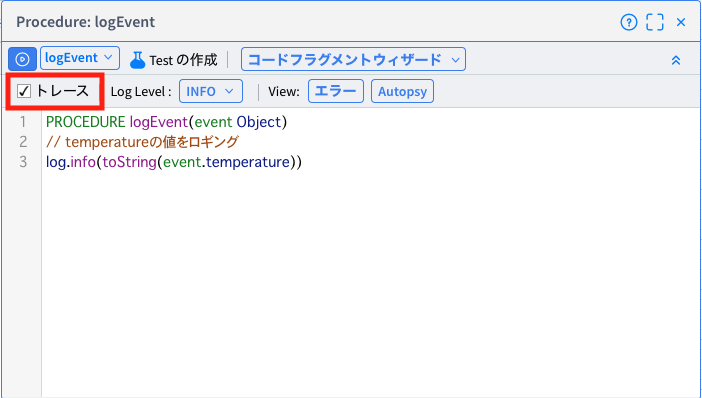
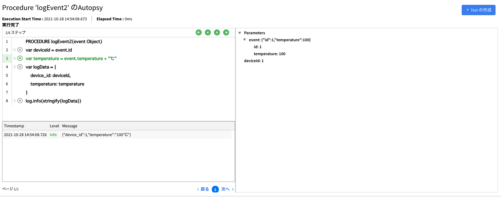

# Autopsyの解説

[Vantiqアプリのデバッグデモ](./README.md)の続編です。Vantiqのデバッグ機能の一つである`Autopsy`いついての解説です。

Vantiqの性質上、データを貯めずに処理を行うため、場合によっては後から何が起こっていたのか？ということを追跡するのが困難な場合があります。しかしこの機能を有効化しておくことで後からどのような値のデータを処理し、どの段階でエラーになったのかなどを確認でき、問題を解剖するのに役立ちます。

## 1. Autopsy有効化

Procdure、Ruleに対して使用することができ、`トレース`にチェックを入れることで有効になります。
エラーの発生の有無に関わらず、`どのようにProcedure/Ruleが実行されたのか`ということを記録に残します。

## 2. Autopsy確認
Autopsyを有効にしたProcedureまたはRuleの`View`にある`Autopsy`をクリック、またはメニューの`Test` → `Autopsy`から確認することができます。

緑のボタンをクリックしていくことで一行ずつステップでどう実行されたかを確認でき、その時の変数の内容も確認できます。これによって一行単位で詳細に過去の処理内容を解剖してみていくことができます。

## Autopsyの注意点

Autopsyは便利な機能ではありますが、処理した全てのイベントを記録します。大量のProcedue/Ruleで有効にしてしまうとそのアプリで処理するイベントの量によってはストレージの圧迫やパフォーマンスの悪化に繋がりますので、必要最低限のProcedure/Ruleで有効にするようにしてください。