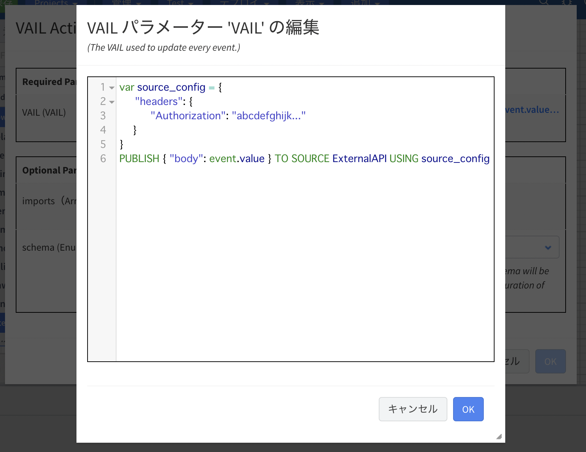
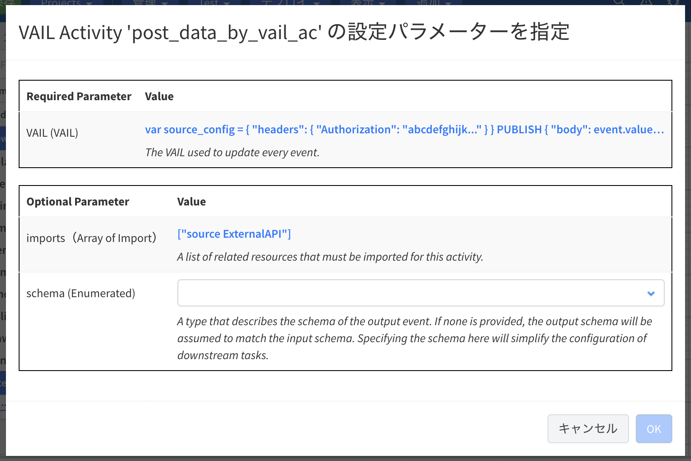

# Vantiq Sourceを使った外部へのデータ送信のまとめ

## 内容

1. [実装基本パターン](#implement-basic)
    1. [Procedureでの実装](#implement-proc)
    1. [VAIL Activity](#implement-ac-vail)
    1. [Transformation + PublishToSource Activity](#implement-ac-pts)

1. [各Source別実装サンプル](#samples)
    1. [REMOTE Source](#sample-remote)
    1. [MQTT Source](#sample-mqtt)
    1. [AMQP Source](#sample-amqp)
    1. [KAFKA Source](#sample-kafka)
    1. [EMAIL Source](#sample-email)
    1. [SMS Source](#sample-sms)

1. [注意点](#notes)
    1. [パスの設定（REMOTE）](#note-path)
    1. [Topicの設定の意味](#note-topic)
    1. [QoSとDelivery Mode](#note-qos-and-delivery-mode)
    1. [Sourceのステータス](#note-source-status)

---
<br><br>

<a id="implement-basic"></a>

## 1. 実装基本パターン
データ送信処理の実装には以下の3つのパターンがあります。
1. Procedureでの実装
2. VAIL Activityでの実装
3. Transformation + PublishToSource Activityでの実装

いずれのパターンでも基本は同じで、以下の形式をそれぞれ別の方法で実装することになります。

`PUBLISH <送信したい内容> TO SOURCE <使用するSource名> USING <送信時のコンフィグ>`

また、使用するSourceの種類によって、`送信したい内容部分の形式`と`送信時のコンフィグの項目`が異なります。

<table>
<tbody>
<tr>
<th>Source</th>
<th>メッセージの形式</th>
<th>設定例</th>
</tr>
<tr>
<td>REMOTE</td>
<td>

```json
{ "body": <送信したい内容> }
```
</td>
<td>

```json
{
    // Source自体のURIに追加するパス
    "path": "/anything",
    // ヘッダー
    "headers": {
        "Content-type": "application/json",
        "Authorization": "abcdefghijk..."
    },
    // クエリパラメータ
    "query": {
        "sensor_id": 100
    }
}
```
上記以外に設定できるプロパティもあります。必要に応じてリファレンスを参照ください。
[Remote Source Integration](https://dev.vantiq.co.jp/docs/system/sources/remote/index.html)
</td>
</tr>
<tr>
<td>MQTT</td>
<td>

```json
{ "message": <送信したい内容> }
```
</td>
<td>

```json
{
    // 送信先のブローカーのTopic
    "topic": "/your/topic",
    // 送信時のQoS
    "qos": "AT_LEAST_ONCE"
}
```
</td>
</tr>
<tr>
<td>AMQP</td>
<td>

```json
{ "message": <送信したい内容> }
```
</td>
<td>

```json
{
    // 送信先のブローカーのTopic
    "topic": "your-topic"
}
```
</td>
</tr>
<tr>
<td>KAFKA</td>
<td>

```json
{ "value": stringify(<送信したい内容>) }
```
</td>
<td>

```json
{
    // 送信先のブローカーのTopic
    "topic": "your-topic"
}
```
</td>
</tr>
<tr>
<td>EMAIL</td>
<td>

HTMLメールの場合
```json
{ "html": <メールの本文> }
```
テキストメールの場合
```json
{ "text": <メールの本文> }
```
</td>
<td>

```json
{ 
    // 送信先のメールアドレス
    "to": "yamada@your-domain.co.jp",
    // 送信元のメールアドレス
    "from": "info@your-domain.com",
    // メールの件名
    "subject": "From Vantiq" 
}
```
</td>
</tr>
<tr>
<td>SMS</td>
<td>

```json
{ "body": <SMSの本文> }
```
</td>
<td>

```json
{ 
    // 送信先の電話番号
    "to": "+81xxxxxxxxxx" 
}
```
</td>
</tr>
</tbody>
</table>

<a id="implement-proc"></a>

### **1. Procedureでの実装**

Procedureで送信処理を実装する方法です。そのProcedureをAppやRuleで呼び出し、データ送信を行います。

例えば、他システムのAPIを実行してデータをPOSTする際は以下のようなProcedureを実装します。

```js
PROCEDURE post_data(event Object)
var source_config = {
    "headers": {
        "Authorization": "abcdefghijk..."
    }
}
PUBLISH { "body": event } TO SOURCE YourSource USING source_config
```
このProcedureでは`YourSource`というSourceに設定されたエンドポイントに対して引数である`event`の内容をPOSTしています。

この例で`送信したい内容`、`使用するSource`、`送信時に必要な設定`はそれぞれ以下のようになります。

<table>
<tbody>
<tr>
<th>項目</th>
<th>内容</th>
</tr>
<tr>
<td>送信したい内容</td>
<td>event</td>
</tr>
<tr>
<td>使用するSource</td>
<td>YourSource</td>
</tr>
<tr>
<td>送信時に必要な設定</td>
<td>

```json
{
    "headers": {
        "Authorization": "abcdefghijk..."
    }
}
```
</td>
</tr>
</tbody>
</table>

このProcedureを`Procedure` Activityで呼び出すことでAppで使用することができます。

<a id="implement-ac-vail"></a>

#### **2. VAIL Activity**

`VAIL` Activityを使用するとタスクに直接VAILを記述することができます。

先ほどと同じように前のタスクの出力を、他システムへREST APIの実行によりPOSTする処理を記述する場合は以下のようになります。

```js
var source_config = {
    "headers": {
        "Authorization": "abcdefghijk..."
    }
}
PUBLISH { "body": event.value } TO SOURCE ExternalAPI USING source_config
```
`ExternalAPI`はご自身のSource名に置き換えてください。



記述したVAIL内で他のリソースを使用している場合はImportする必要があります。


Procedure ActivityでProcedureを呼び出す場合の違いとしては前タスクの出力内容にアクセスする場合はeventではなく、`event.value`とする必要があります。また、このActivityが設定されたタスクの出力の内容も`event.value`となります。


<br>

<a id="implement-ac-pts"></a>

#### **3. Transformation + PublishToSource Activity**
VAILの記述自体をしない場合は`PublishToSource` Activityを使用します。また、Sourceの種類によって送信するデータに必要なプロパティが異なるため、前もってTransformation Activityで必要な形式に加工します。

PublishToSource Activityの設定では以下の画像のように送信先として使用するSourceを設定します。


送信先のTopicなど送信の際の設定がある場合は、`sourceConfig`にJSON形式で記述します。


また、例えば送信先にREMOTE Sourceを使う場合は、前述の通り送信内容を`body`プロパティのバリューに設定する必要があります。

```json
{
    "id": 1,
    "value": 100
}
```
上記のような内容で送信したい場合は、
```json
{
   "body": {
      "id": 1,
      "value": 100
   }
}
```
とする必要があります。
そのため、PublishToSource Activityの前にTransformation Activityで加工しておきます。


PublishToSource Activityの出力は、以下のように送信時に使用した内容となります。
```json
{
   "body": {
      "id": 1,
      "value": 100
   }
}
```
<a id="samples"></a>

## 2. 各Source別実装サンプル

各Sourceごとに送信処理を実装したVAILのサンプルを紹介します。

<a id="sample-remote"></a>

### **1. REMOTE Source**
```js
var data = {
    "id": 1,
    "value": 100
}
var source_config = {
	"path": "/anything",
	"headers": {
		"Content-type": "application/json",
		"Authorization": "abcdefghijk..."
	},
	"query": {
		"sensor_id": 100
	}
}
PUBLISH { "body": data } TO SOURCE YourRemoteSource USING source_config
```
`PUBLISH { "body": <送信したい内容> } TO SOURCE <Source名> USING <パス、ヘッダー、クエリパラメータなどの設定>`が基本形になります。

パス、ヘッダー、クエリパラメータなどコンフィグの部分はそれぞれ`Source自体に設定することができます`がリクエストの時点で上書きしたい場合などにVAIL側に記述します。

また、REMOTE Sourceに限り`SELECT`文でPOSTすることができます。
```js
var data = {
    "id": 1,
    "value": 100
}
var method = "POST" 
var path = "/anything"
var headers = {
    "Content-type": "application/json",
    "Authorization": "abcdefghijk..."
}
var query = {
    "sensor_id": 100
}
var response = SELECT FROM SOURCE YourRemoteSource WITH body = data, method = method, path = path, headers = headers, query = query
```
`SELECT FROM SOURCE <Source名> WITH body = <送信したい内容>`が基本形になります。SELECT文にはUSING句は存在しないため、上記の例のように必要な設定は`WITH`句に記述します。

PUBLISH文とSELECT文の違いは以下の通りです。

||デフォルトのメソッド|返り値|
|-|-|-|
|PUBLISH|POST|true/false|
|SELECT|GET|リクエスト結果のレスポンスの内容|

PUBLISH文では、返り値はリクエストが成功したかどうかがtrue/falseで返るのみなのでレスポンスのステータスコードなどは分かりません。後続の処理でそういった内容が必要な場合はSELECT文を使用します。

> PUBLISH文のメソッドをGETにしてリクエストをすることもできますが、返り値はtrue/falseにしかならないため、この実装をすることはほとんどありません。

SELECT文でPOSTするProcedureをAppで呼び出して使用する場合の例は以下の通りです。

```js
PROCEDURE post_data(event Object)
var response = SELECT FROM SOURCE ExternalAPI WITH path = path, method = "POST", body = event
```


画像右側にAppがあり、`post_data_by_proc`というタスクで`post_data` Procedureを`Procedure Activity`を使って呼び出しています。
post_data Procedureの引数は`event`ですが、これには同Appの`event`タスクの出力が該当します。

つまり、このAppではeventタスクの出力をPOSTしています。post_data_by_procタスクの出力（画面左下）はREST APIを実行した際のレスポンス内容が表示されています。

これは、Procedureの最終行が以下のようにREST API実行時のレスポンスとなっているためです。
```js
var response = SELECT FROM SOURCE ExternalAPI WITH path = path, method = "POST", body = event
```

<a id="sample-mqtt"></a>

### **2. MQTT Source**
```js
var data = {
    "id": 1,
    "value": 100
}
var source_config = {
    "topic": "/your/topic",
    "qos": "AT_LEAST_ONCE" // 指定しない場合は AT MOST ONCE
}
PUBLISH { "message": data } TO SOURCE YourMqttSource USING source_config
```
`PUBLISH { "message": <送信したい内容> } TO SOURCE <Source名> USING { "topic": <送信先のブローカーのTopic> }`が基本形になります。MQTTブローカーへの送信の際には`QoS`の設定が可能です。デフォルトは`AT MOST ONCE`ですが変更したい場合は上記の例のように`qos`プロパティを設定します。

MQTT Source自体に`Topic`、`QoS`の設定がございますが、これらの設定項目はデータのSubscribeのためのもので、`Publishでは使用されません`。`Topic`, `QoS`は送信の都度、必要です。また、`Delivery Mode`はMQTTブローカーとの通信と無関係です。`Topic`、`QoS`,`Delivery Mode`の詳細については以下を参照してください。

[Topic設定の意味](#note-topic)

[Delivery ModeとQoS](#note-qos-and-delivery-mode)

<a id="sample-amqp"></a>

### **3. AMQP Source**
```js
var data = {
    "id": 1,
    "value": 100
}
var source_config = {
    "topic": "your-topic"
}
PUBLISH { "message": data } TO SOURCE YourAmqpBroker USING source_config
```
MQTT Sourceの場合と同様に`PUBLISH { "message": <送信したい内容> } TO SOURCE <Source名> USING { "topic": <送信先のブローカーのTopic> }`が基本形になります。

VantiqのAMQPは`AMQP 1.0`であり、RabbitMQなどで使用される`AMQP 0.9.1`との互換性はありません。
接続する際はブローカーの仕様を確認するようにしてください。

<a id="sample-kafka"></a>

### **4. KAFKA Source**
```js
var partition_key = "some_key"
var data = {
    "id": 1,
    "value": 100
}
var source_config = {
    "topic": "your-topic"
}
PUBLISH { "key": partition_key, "value": stringify(data) } TO SOURCE YourKafkaBroker USING source_config
```
`PUBLISH { "value": stringify(<送信したい内容>) } TO SOURCE <Source名> USING { "topic": <送信先のブローカーのTopic> }`が基本形になります。`key`は必須ではありません。
KAFKAで送信する際は、`key`と`value`をString型にする必要があります。

<a id="sample-email"></a>

### **5. EMAIL Source**
```js
var to_address = "yamada@your-domain.co.jp"
var from_address = "info@your-domain.com"
var subject = "From Vantiq"
var body = "<div>Hello!</div>"
var source_config = { 
    "to": to_address,
    "from": from_address,
    "subject": subject 
}  
PUBLISH { "html": body } TO SOURCE YourMailServer USING source_config
```
`PUBLISH { "html": <メールの本文> } TO SOURCE <Source名> USING { "to": <送信先のアドレス>, "from": <送信元のアドレス>, "subject": <メールの件名> }`が基本形になります。

`{ "html": <メールの本文> }`の部分はHTMLメールを送る場合です。テキストメールを送る場合は`{ "text": <メールの本文> }`となります。

また、送信先のメールアドレスが複数ある場合は、`"to":["yamada@your-domain.co.jp","suzuki@your-domain.co.jp","kawai@your-domain.co.jp"]`というように`to`プロパティに配列でメールアドレスを設定します。

<a id="sample-sms"></a>

### **6. SMS Source**
```js
var phone_number = "+81xxxxxxxxxx‬"
var body = "Hello!"
var source_config = { 
    "to": phone_number
}
PUBLISH { "body": body } TO SOURCE YourSmsSource USING source_config
```
`PUBLISH { "body": <SMSの本文> } TO SOURCE <Source名> USING { "to": <送信先の電話番号> }`の形式で送信します。`to`プロパティは配列にすることはできません。

<br>

<a id="sample-summary"></a>


<a id="notes"></a>

## 3. 注意点

<a id="note-path"></a>

### **1. パスの設定（REMOTE Source）**

REMOTE Sourceを使用してデータ送信を行う際、`path`を追加で設定することができます。
REMOTE Sourceの`Server URI`の値をベースとして`path`の値が追加されます。
その際、pathの先頭に`/`があるかどうかで挙動が変わるので注意が必要です。

||ベースURI|path|結果|
|-|-|-|-|
|パターンA|https://vantiq-sample.com/aaa/bbb/|ccc|https://vantiq-sample.com/anything/aaa/bbb/ccc|
|パターンB|https://vantiq-sample.com/aaa/bbb/|/ccc|https://vantiq-sample.com/ccc|

先頭に`/`がある場合はルートから置き換わり、ない場合は追加されます。


<a id="note-topic"></a>

### **2. Topicの設定の意味**


ブローカー関連のSourceのTopicの設定はデータをSubscribeする際に使用するものであり、`送信時に使用されるものではありません。`

送信先のTopicは`送信処理の実装で設定する`必要があります。

>送信だけに使うSourceである場合は、`Source自体へのTopicの設定はしないでください`。送信先と同じTopicを設定してしまうと、送信してそのまま受信することになりリソースを消費します。

<a id="note-qos-and-delivery-mode"></a>

### **3. QoSとDelivery Mode**


MQTT SourceにはDelivery ModeとQoSの設定項目があり、それぞれ`AT LEAST ONCE`、`AT MOST ONCE`というような値を持つ設定項目です(KAFKA SourceにはQoSの設定項目がなくAMQPには両方存在しません)。それぞれが何のQoSかは以下の通りです。

|項目|内容|
|-|-|
|QoS|Subscribe時のブローカーとSource間のQoS|
|Delivery Mode|Sourceがデータを受け取ってからVantiq内部（Appなど）にデータを渡す際のQoS <br> ※ブローカーとの通信には関係ありません|

どちらも`データの送信には関係がない`ことに注意してください。


<a id="note-source-status"></a>

### **4. Sourceのステータス**

#### Active/Inactive
1枚目の画像のようにチェックが入っている場合はActiveの状態でSourceが動作していることを表しています。チェックがない場合はInactiveとなり、Sourceは動作していません。


#### Mock mode
Sourceは Mock modeを使用すると外部との接続を行わず、そのSourceに設定されたMock用のProcedureの結果を出力するようになります。

以下の画像ようにフラスコのアイコンに中身がある場合はON、空の場合はOFFとなっています。
`外部と接続してSourceを使用する場合はOFFになっている必要があります`。


Mock modeについての詳細は[こちら](https://dev.vantiq.co.jp/docs/system/sources/source/index.html#source-mocking)を参照してください。