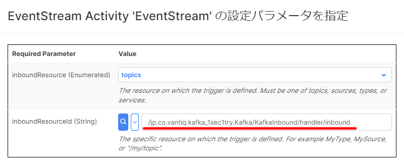

# Vantiq アプリ開発のよくある質問

Vantiq アプリケーション開発時に出てくる `よくある質問` を掲載します。

## 目次
- [Service 関連](#Service関連)
  - [イベントストリームのinboundResourceIdは変更しても平気ですか？](#イベントストリームのinboundResourceIdは変更しても平気ですか？)

## Service 関連

### イベントストリームのinboundResourceIdは変更しても平気ですか？

#### バージョン
- VANTIQ Ver1.34

#### 質問
Serviceビルダーから設定できるイベントストリームの `inboundResourceId` は変更しても平気ですか？

#### 回答
インターフェースと紐づいているため、変更すると不具合が出る可能性があります。  
そのため変更することは非推奨です。  
なお、 VANTIQ Ver1.35 からは変更ができなくなります。

