# バージョンアップに伴う互換性について

Vantiq マイナーバージョンアップ（ex. `1.34.x` -> `1.35.x`)に伴い機能追加されます。基本的に互換性は保証されますが、一部機能については互換性が保証されず、コンパイルエラー等になる場合があります。
こちらの記事に解消方法について記載します。

変更の一覧については、[Release Notes](https://dev.vantiq.com/docs/system/releasenotes/index.html) を参照ください。

## 1.34 -> 1.35

### スタンドアロンAppからService Event Handlerへの移行する

#### 背景
>## Customer Impacts
>Features Deprecated with R1.35
>- Standalone Apps are deprecated in R1.35 and will be removed entirely in a future release. All existing standalone Apps should be converted to Service Event Handlers as soon as possible. No new standalone Apps should be created.

#### 移行の手順

まず、移行する対象のAppを確認します。  リソースタイプ "App "のスタンドアロンAppと、それに対応するペアリングサービスを確認します。 
なお、スタンドアロンAppが属するパッケージによって、Service Package名が変わることに注意してください。

| App のパッケージ |  Service のパッケージ |
|---|---|
| (デフォルトのパッケージ)  |  apps.services |
| jp.co.vantiq.apps | jp.co.vantiq.apps |

この説明では、デフォルトパッケージのスタンドアロンApp「PumpDetection」を例としていますが、実際のパッケージ名にあわせ適宜読み替えてください。

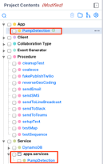

パッケージ名 `apps.services` とし、既に存在するServiceとは別名で、Service を作成します。  この例では、Service の名前を "`PumpDetectionService`" とします。

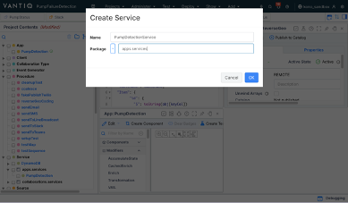

新規作成したServiceで、「Implement」タブを開き、「Internal Event Handler」タブから「Copy existing Apps」を選択します。 

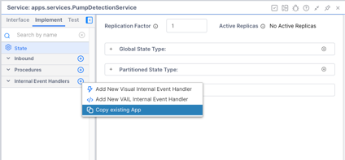

ポップアップしたダイアログで、Event Handlerの名前を移行先のAppと同じ「`PumpDetection`」にします。 

対象の App を新しい Internal Event Handler にコピーしたら、App "PumpDetection" のコンテキストメニューから元のスタンドアロン App を削除してください。
スタンドアロンアプリを削除すると、ペアのServiceである apps.services.PumpDetection も削除されます。

### Topicを設定したService Inboundを1.35でサポートされたService Inboundに移行する。

#### 背景
>## Customer Impacts
>Capabilities Removed with R1.35
>- Services: Inbound Service Event Handlers must be triggered by the Inbound Event Type they implement. This was a warning in R1.34.

#### 想定

ここでは、Service Inbound Event Handler で Topic をイベントストリームに指定しているケースを例とします。 1.34では以下の通り動作しています。

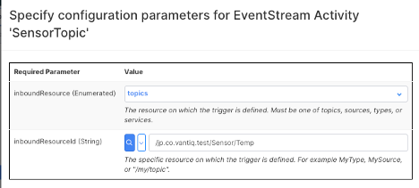

1.35では、INBOUNDに設定されているTopicが無効となり、警告が表示されます。

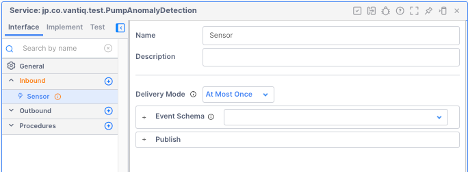

#### 移行の手順

1.35で導入された変更により、Topic からのEvent Streamは、"Internal Event Handler "で受けるようになりました。

TopicからのEvent Streamを受け取るInternal Event Handlerを作成します。Implementタブの「Internal Event Handler」メニューから、「Visual Event Handler」を作成を行います。

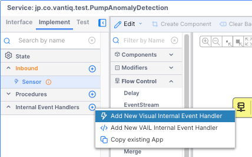
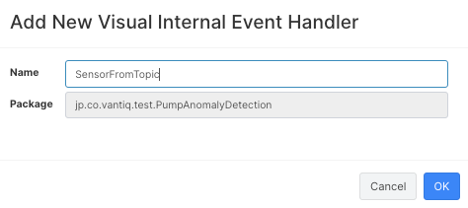

Event StreamのタスクがTopicを見るように設定します。

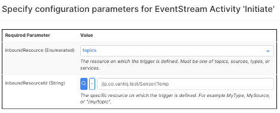

EventStreamに続きPublishToServiceタスクを追加し、自身のServiceのInboundにPublishするよう設定します。 

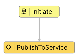
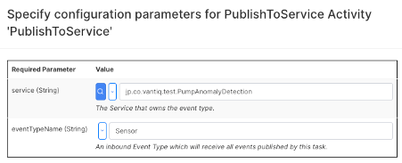

Implementタブで警告が表示された「Inbound Event handler」を開きます。 
Event Streamタスクに移動し、Service Inbound Eventを見るように設定します。 

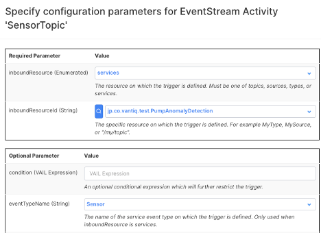

#### CLI Java Version Runtime

1.35からJava バージョンが11となりました。 Vantiq CLIを使用している場合、お使いのJavaのバージョンを11に更新してください。

#### アクティビティパターンの実行間隔

以下のアクティビティパターンの最小の実行間隔（interval)が変更され、最小間隔が1分になりました。

- Missing
- Rate

1分より短い間隔が必要な場合、ScheduledEvent を用いて独自に実装が必要となります。

## 1.33 -> 1.34

#### Service State における、 Object型の廃止

従来 Object型 を宣言し、Concurrent.Map オブジェクトを生成していましたが、1.34では Object型を適用しようとするとコンパイルエラーとなります。
新たに導入された、Map型、 Value型 に置き換える必要があります。

#### 型の宣言時、大文字小文字の区別が厳密になった

例えば Procedureの引数の型を “string” とすると、コンパイルエラーとなります。 正しくは “String” とする必要があります。

## 将来のバージョン変更で予定されているもの
- Collaboration Builderの廃止、Visual Event Handlerへの統合

1.34より Collaboration Builder の機能が Visual Event Handlerに統合され、従来の Collaboration Builder は Deprecated となりました。

