# Integration Test リソースを作成する

本記事では、Vantiq の[Integration Tests](https://dev.vantiq.com/docs/system/tests/#integration-tests) リソースを使用してVantiqアプリケーションのテストを行うための、Integration Test リソースの作成方法について説明します。
Integration Tests リソースおよびVantiqにおけるテストの詳細に関しては[公式リファレンス](https://dev.vantiq.com/docs/system/tests/#vantiq-testing-reference-guide)、[チュートリアル](https://dev.vantiq.com/docs/system/tutorials/testIntroTutorial/) を参照してください。

## テスト対象

この記事では以下のようなアプリケーションをテスト対象とします。
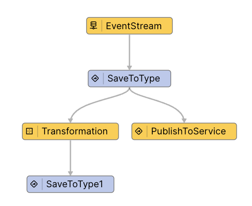

サンプルアプリケーションの機能は以下の通りです。

1. Service の Inbound Event でメッセージを受信
2. Type にデータを保存
3. Service の Outbound Event にメッセージを送信
4. TransformationでTimestampを追加
5. Typeを更新

## Integration Test を作成する

### General

- IDEのメニューバーで[Test] > [Tests] を選択します。
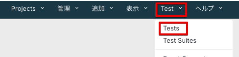

- 作成済みのTestのリストが表示されます。[+Test] をクリックして新しいTestを作成します。
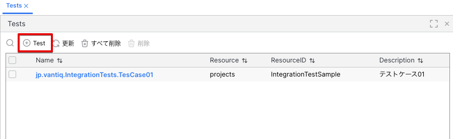

- Testの各項目を入力します。
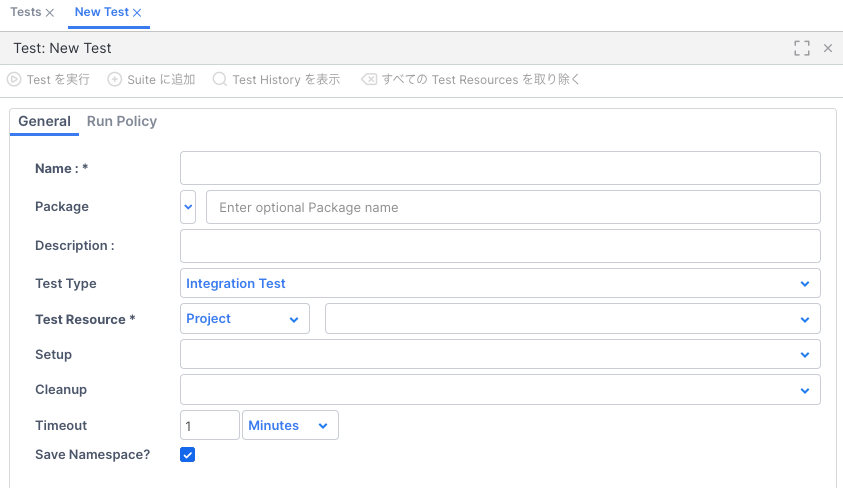
  - Name: テストの名前を入力します。プロジェクト毎に命名規約を定めておくと良いでしょう。
  - Package: パッケージ名を入力します。Name同様、プロジェクト毎に命名規約を定めておくと良いでしょう。
  - Description: テストの説明を入力します。必ず入力する必要はありませんが、他の開発者がテストの目的を理解しやすくするために入力すると良いでしょう。
  - Test Type: Unit Test または Integration Test を選択します。本記事では Integration Test を選択します。
  - Test Resource: Integration Test ではService または Project が選択できます。この記事ではProject全体のテストを行うためProject を選択します。
  - Setup: テスト実行前に実行するProcedureを選択します。詳細は後述します。
  - Cleanup: テスト実行後に実行するProcedureを選択します。詳細は後述します。
  - Timeout: テストがタイムアウトするまでの時間を設定します。Integration Test は ログレベルが[DEBUG] で実行されるため、通常の実行に比べて時間がかかる場合があります。適切な時間を設定する必要がありますが、テスト内でエラーが発生する場合設定したTimeout時間まで結果が返されません。
  - Save Namespace?: Integration Testはテスト実行時にNamespaceを作成し、そこで実行されます。テスト成功時は自動でNamespaceが削除されますが、テスト失敗時にNamespaceを残すかどうかを選択します。エラーの原因を調査するためにはNamespaceを残す必要がありますが、後で自分で削除する必要があります。

- 以下のように入力します。
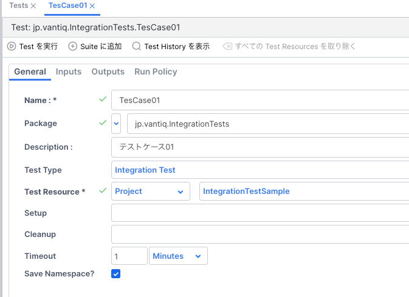

### Inputs

Test Resource を入力すると、Inputs や Outputsの設定が可能になります。Inputsは、テストの実行に対する入力です。テストシナリオ毎に必要なInputを設定します。今回のシナリオは、1回の正常なInputがあるケースとします。

- Inputs タブを選択し、[+ Input を追加]ボタンをクリックします。
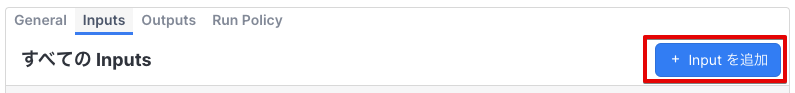

- Input の各項目を入力します。
  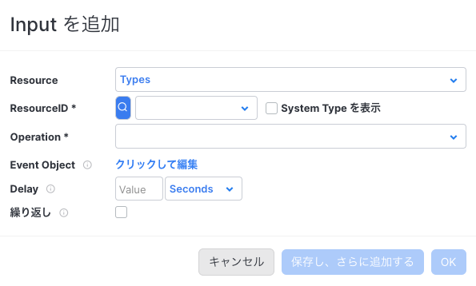
  - Resource: Inputのリソースを選択します。この記事では、Service の Inbound Event にメッセージを送信するため、Service Eventsを選択します。その他 Type・Topic・Source などのリソースも選択可能です。 
  - ResourceID: Resource の ID を入力します。この記事では、Service の Inbound Event の ID を入力します。
  - Event Object: テストに入力するEvent Onjectを入力します。この記事では、Service の Inbound Event に送信するメッセージを入力します。
   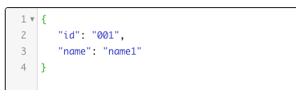
  - Delay: このInputの後に次のInputを実行するまでの時間を設定します。LLMの処理結果待つ必要がある、などの場合に使用します。
  - 繰り返し: このInputを繰り返し実行する回数を設定します。

- 今回のテストシナリオではInputは1件とします。シナリオに応じて複数のInputを作成してください。
  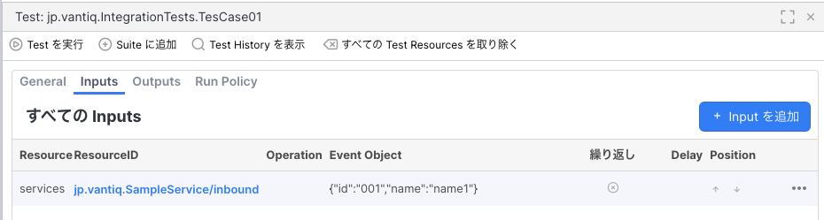

### Outputs

Outputs は、Inputsにより発生するOutputと、Output内容の検証方法を設定します。今回のサンプルアプリでは、

1. Type へのInsert
2. Outbound Event へのPublish
3. Type のUpdate

と3つのOutput が発生します。それぞれのOutputに対して、期待するOutput内容を設定します

#### 1つめのOutput: Type へのInsert

- Outputs タブを選択し、[+ Output を追加]ボタンをクリックします。
- Output の各項目を入力します。
  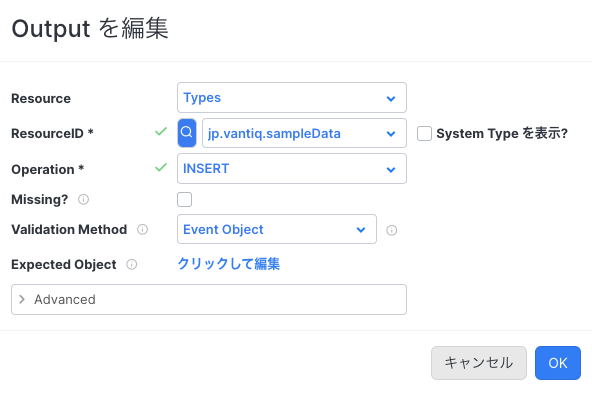
  - Resource: Outputのリソースを選択します。Typeへの保存を検証するため Type を選択します。その他 Topic・Source などのリソースも選択可能です。
  - ResourceID: Resource の ID を入力します。ここでは保存するType を指定します。
  - Operation: Type に対して行われる操作を選択します。ここでは Insert を選択します。
  - Missing: このOutputが**発生しないこと** を検証する場合にチェックします。
  - Validation Method: Outputの検証方法を選択します。ここでは Event Object を指定します。その他、Procedureによる検証も可能です。(後述)
  - Expected Object: Outputの期待値を入力します。ここでは、Type に保存される想定のデータとしてInputと同じ値を入力します。
  
  - Advanced: さらに詳細な検証を設定します
    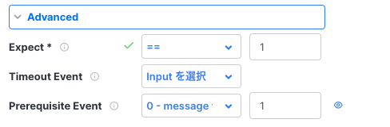
    - Expect: 期待値を実行回数を指定します。この場合、1回のみの実行を期待するため、1を入力します。
    - Timeout Event: Outputが指定した時間内にOutputが発生することを検証する場合に設定します
    - Prerequisite Event: Outputが発生する前に発生するEventを指定します。この場合、Type にデータが保存される前にInputのService Inbound Event が1回発生することを検証します。
  - [OK] をクリックし、Outputを追加します。

#### 2つめのOutput: Service Event へのPublish

- Outputs タブを選択し、[+ Output を追加]ボタンをクリックします。
- Output の各項目を入力します。
  - Resource: Outputのリソースを選択します。Service Event へのPublishを検証するため Service Events を選択します。
  - ResourceID: Resource の ID を入力します。ここではPublishするService Event を指定します。
  - Missing: このOutputが**発生しないこと** を検証する場合にチェックします。
  - Validation Method: Outputの検証方法を選択します。ここでは Event Object を指定します。
  - Expected Object: Outputの期待値を入力します。ここでは、Publishされる想定のデータとしてInputと同じ値を入力します。
  
  - Advanced: さらに詳細な検証を設定します
    
    - Expect: 期待値を実行回数を指定します。この場合、1回のみの実行を期待するため、1を入力します。
    - Timeout Event: Outputが指定した時間内にOutputが発生することを検証する場合に設定します
    - Prerequisite Event: Outputが発生する前に発生するEventを指定します。この場合、Type にデータが保存される前にInputのService Inbound Event が1回発生することを検証します。
  - [OK] をクリックし、Outputを追加します。

#### 3つめのOutput: Type へのUpdate

- Outputs タブを選択し、[+ Output を追加]ボタンをクリックします。
- Output の各項目を入力します。
  - Resource: Outputのリソースを選択します。Typeへの保存を検証するため Type を選択します。
  - ResourceID: Resource の ID を入力します。ここでは保存するType を指定します。
  - Operation: Type に対して行われる操作を選択します。ここでは Update を選択します。
  - Missing: このOutputが**発生しないこと** を検証する場合にチェックします。
  - Validation Method: Outputの検証方法を選択します。Procedureによる検証を行います。事前に以下のようなProcedureを作成しておきます。

	```javascript
	package jp.vantiq.testing
	stateless PROCEDURE IntegrationTestUtil.TestCase01_Type_Validator(received Object)
	log.info("TestCase01_Type_Validator received: {}", [stringify(received)])

	var assert = {}
	assert.id = (received.id =="001") ? true : false
	assert.name = (received.name =="name1") ? true : false
	assert.timestamp = (typeOf(received.timestamp) == "DateTime") ? true : false

	var result = true
	for key in assert until result == false {
			if key.value == true {
				result = true
		}   else {
			result = false
		}
	}
	if !result {
		log.error("TestCase01_Type_Validator_validation error. result: {}, {}  received object:{}", [result, stringify(assert), stringify(received)])
	}

	return result
	```
	  - 検証用のProcedureは、受信したイベントを引数として受け取り、検証結果をtrue/false として返すように作成します。

  - Advanced: さらに詳細な検証を設定します
    
    - Expect: 期待値を実行回数を指定します。この場合、1回のみの実行を期待するため、1を入力します。
    - Timeout Event: Outputが指定した時間内にOutputが発生することを検証する場合に設定します
    - Prerequisite Event: Outputが発生する前に発生するEventを指定します。この場合、Type にデータが保存される前にInputのService Inbound Event が1回発生することを検証します。
  - [OK] をクリックし、Outputを追加します。

以下のようにOutputsが定義されました。
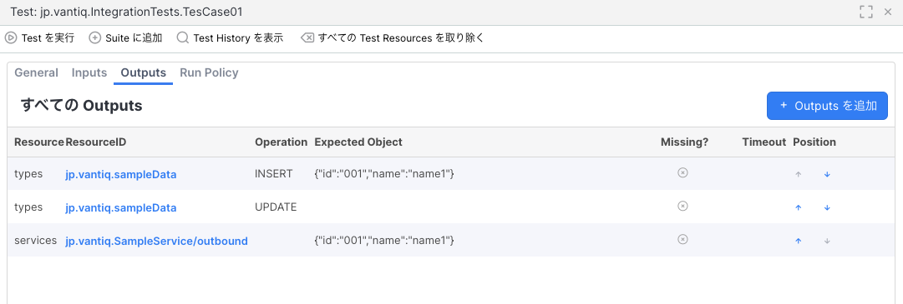

## Setup,Cleanup Procedure

- Setup Procedureは、テスト実行前に実行するProcedureを指定します。Cleanup Procedureは、テスト実行後に実行するProcedureを指定します。
- Setup Procedure では、テスト実行前に必要なデータの準備や、テスト実行前の状態の確認を行います。IntegrationTestでは自動的にSourceはMockモードとなるためMockモードへの切り替えをSetupで行う必要はありませんが、Sourceからのレスポンスに指定がある場合設定する必要があります。[公式リファレンス](https://dev.vantiq.com/docs/system/sources/source/#source-mocking)
- Cleanup Procedure では、テスト実行後の状態の確認などで必要があれば作成・設定してください。VantiqのIntegrationTestは専用のNamespaceで実行されるため、Unit Testとは異なりテスト用データの削除やMockモードをStopする必要はありません。

## まとめ

ここまででIntegration Test リソースおよび関連するProcedureなどのリソースの作成が完了し、テスト実行の準備が整いました。
テストの実行・デバッグ方法については別記事をご参照ください。
