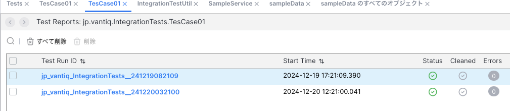
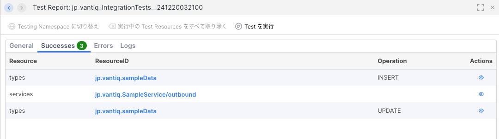
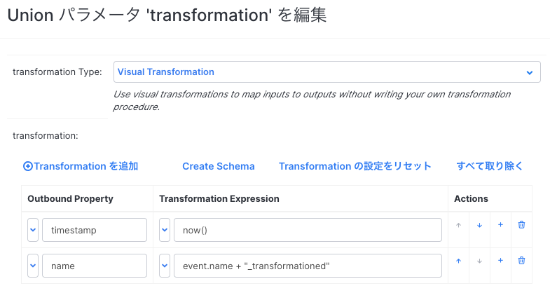
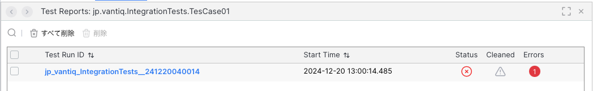
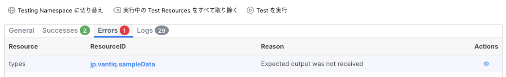
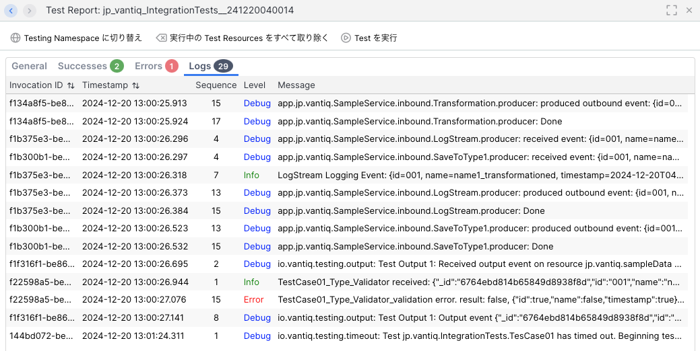
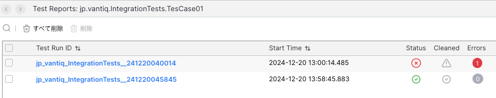

# Integration Test 実施のTips

本記事では、[Integration Test リソースを作成する](./integrationTest-create-resource.md) で作成した Integration Test 実行方法や結果の確認方法、デバッグ方法について説明します。

## Integration Test の実行

- 作成したTestを保存し、[Test を実行] をクリックしてテストを実行します。
- [Test History を表示] をクリックすると、テストの実行結果を確認できます。
  
- Test Run ID をクリックすると、テストの詳細を確認できます。
  
  - 3つのOutputがすべて成功していることが確認できます。

## デバッグ

テストが失敗した場合、デバッグしエラーの原因を特定する必要があります。まずは、エラーを発生させます。

- Visual Event Handler で、Transformationを以下のように変更します。
  
  
  - nameの値を変更する仕様変更があったとします。この変更により、テストが失敗することが予想されます。

- テストを実行します。
  

- エラーが発生しました。詳細を確認します。
  - 成功しているOutputの確認
  
  - 失敗しているOutputの確認

  - Logの確認。テストが失敗した場合、テスト実行用Namespaceが削除されず、出力されたログが確認できます。検証用Procedureで適切にログ出力しておくと、デバッグに役立ちます。


- テストが失敗した場合、テスト実行用Namespaceが削除されないため実際に実行されたNamespaceに入って動作確認することが可能です。[Testing Namespace に切り替え] をクリックしてテスト実行用Namespaceに切り替え、Typeのデータを確認したり、実際に処理を流して動作確認することが可能です。
  

- エラーを特定します。Errorログを確認すると、以下のエラーが出力されています。
  ```
	Invocation ID : f22598a5-be86-11ef-8121-b645c40e4353
	Timestamp : 2024-12-20 13:00:27.076
	Sequence : 15
	Level : ERROR
	Message : TestCase01_Type_Validator_validation error. result: false, {"id":true,"name":false,"timestamp":true}  received object:{"_id":"6764ebd814b65849d8938f8d","id":"001","name":"name1_transformationed","ars_namespace":"jp_vantiq_IntegrationTests__241220040014","ars_version":2,"ars_createdAt":"2024-12-20T04:00:24.897Z","ars_createdBy":"adminaccess__jp_vantiq_integrationtests__241220040014","ars_modifiedAt":"2024-12-20T04:00:26.332Z","ars_modifiedBy":"adminaccess__jp_vantiq_integrationtests__241220040014","timestamp":"2024-12-20T04:00:25.818Z"}
  ```
  - TypeへのOutputの検証時のエラーで、`name` の値の検証に失敗していることがわかります。

- Validation Procedure を修正します。修正されたアプリケーションの仕様通り、`assert.name = (received.name =="name1") ? true : false`  ->  `assert.name = (received.name =="name1" + "_transformationed") ? true : false` に変更します。

- 再度テストを実行し、正常に完了することを確認します。
  

## Integration Tests の注意事項

### LLM,RAG のテスト

- SemanticIndexEntry は元のNamespaceからコピーされないため、Setupで必要なEntryを入れる必要があります
- SubmitPrompt、SemanticSearchの結果は常に同じではないのでValidation に考慮が必要です。

### General

- Documentsを使用している場合、Documentが元のNamespaceからデプロイされないためSetupで自分で入れる必要があります。
