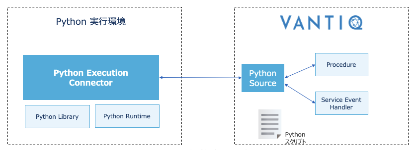
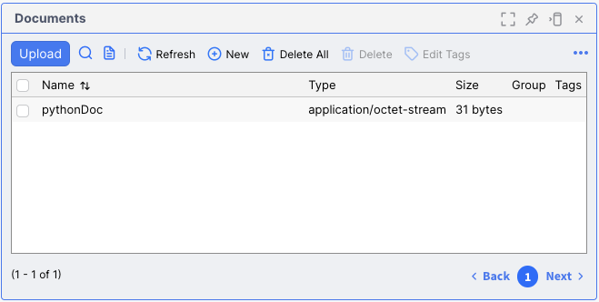

# Python Execution Connector
- Pythonコードの実行を可能にするコネクタであり、Vantiq/VAIL ProcedureからPythonコードの実行を要求し、その結果をVantiqサーバーに返すことができます。



- Vantiq の接続性を拡張する [Extension Source](https://github.com/Vantiq/vantiq-extension-sources/tree/master) の一つであるが、任意のコードを利用できることで汎用性が高いことが特徴である。


## Precondition
- Vantiq サーバー
  - Vantiq 1.23 or later が用意されていること
  - 開発者用 Namespace を作成済みであること
- Python 実行環境
  - Python 3.8 or later がインストールされていること
- [Vantiq CLI](./cli-quick-reference.md) がインストールされていること

## Setup 

この説明では以下の環境の作業を例にしています。
- Vantiq サーバー : 
  - dev.vantiq.com
- Python実行環境 : 
  - Macbook Pro M1 
  - Python 3.11 (venv使用)
- ローカル環境 (CLI実行環境)
  - Macbook Pro M1 
  - Python 3.11 (venv使用)


### Vantiqサーバー

1. 開発者用 Namespace にてアクセストークンを生成します。 
   メニュー >> Admminister >> Advanced >> Access Token 
   生成したアクエストークンは、次ステップのCLI、およびローカル環境(Python実行環境)の`server.config`で使用します。

2. 新しい Source Type `PYTHONEXECUTION`を追加します。
   1. [`pythonExecImpl.json`](https://github.com/Vantiq/vantiq-extension-sources/blob/master/pythonExecSource/src/main/resources/pythonExecImpl.json) をダウンロードして、CLIを実行するディレクトリに置きます。
   2. Vantig CLI から以下のコマンドを実行します。
   （[参照](https://github.com/Vantiq/vantiq-extension-sources/blob/master/pythonExecSource/docs/Usage.md#defining-the-source-in-vantiq)）

    ```sh
    vantiq -s <profileName> load sourceimpls pythonExecImpl.json
    ```

   3. メニュー Add >> Source >> New Source で、Source新規作成 ペインを開き、Source Type: `PYTHONEXECTUION` が追加されていることを確認します。


3. Sourceを作成します。指定するパラメータは以下のとおりです。
   -  Source Type: `PYTHONEXECTUION`  （前ステップで作成したもの） 
   -  Source Name: 任意の名前 （ただし、ローカル環境(Python実行環境)の `server.config` で指定したものと一致させること。
   Sourceを作成した後、ローカル環境(Python実行環境)から接続要求があると、直ちに接続が確立します。


### Python実行環境ですること

1. `pip`を使って`vantiqPythonExecConnector`をインストールします。

    ```sh
    pip install vantiqPythonExecConnector
    ```

    以下のようなログとともにインストールされます。

    ```sh
    Collecting vantiqPythonExecConnector
    Obtaining dependency information for vantiqPythonExecConnector from https://files.pythonhosted.org/packages/34/d1/2567090d14dd914bac117cf77bc66ec701a166688d93f5210ee7f362887f/vantiqPythonExecConnector-1.1.11-py3-none-any.whl.metadata
    Downloading vantiqPythonExecConnector-1.1.11-py3-none-any.whl.metadata (5.5 kB)
    Collecting aiohttp>=3.8 (from vantiqPythonExecConnector)
    ...
    ```

2. `server.config` を作成し、`config/`に配置します。

    ```properties
    targetServer = https://dev.vantiq.com  
    authToken = P91-WB0Gjs1-C7iM3VdYG70CeFRzPllS4tU_xxxxxxx=
    sources = jp.co.vantiq.test.pythonSource
    ```

    `targetServer` : Vantiqサーバーのホスト
    `authToken` : アクセストークン。 Vantiqサーバーのアクセストークンを生成する、ステップにて生成したもの。
    `sources` : Sourceの名前。Vantiqサーバーの Source を作成するステップにて指定した名前。


3. `logger.ini` を作成し、`config/`に配置します。特別な要件がなければ、以下のサンプルのまま作成します。

    ```properties
    [loggers]
    keys=root

    [handlers]
    keys=consoleHandler

    [formatters]
    keys=simpleFormatter

    [logger_root]
    level=INFO
    handlers=consoleHandler

    [handler_consoleHandler]
    class=StreamHandler
    level=INFO
    formatter=simpleFormatter
    args=(sys.stdout,)

    [formatter_simpleFormatter]
    format=%(asctime)s - %(name)s - %(levelname)s - %(message)s
    datefmt=
    ```

    ここまでで、ファイルの配置は以下のようになっています。

    ```sh
    .
    ├-- serverConfig
        ├-- server.config
        ├-- logger.ini
    ```

4. `vantiqPythonExecutionConnector` を起動します。

    ```sh
    vantiqPythonExecConnector
    ```

    接続する Source が見つからないと、接続施行を繰り返す。

    ```sh
    2023-10-19 14:43:49,937 - vantiqconnectorsdk - INFO - Connector for source jp.co.vantiq.test.pythonSource is connecting to Vantiq at: wss://dev.vantiq.com/api/v1/wsock/websocket
    2023-10-19 14:43:49,986 - vantiqconnectorsdk - INFO - Connector for source jp.co.vantiq.test.pythonSource is connecting to Vantiq at: wss://dev.vantiq.com/api/v1/wsock/websocket
    ...
    ```
    Source と接続が確立できると施行がとまります。


## How to use

### インラインでスクリプトを渡す

インラインで実行するには、`SELECT FROM SOURCE` の WITH句の以下のプロパティを使います。
-  `code` - てスクリプト文字列を指定します。（ 以下の例では `pythonCode`）
-  `name` - スクリプトをキャッシュするのに使用される名前です。

```vail
package jp.co.vantiq.test
PROCEDURE testPythonSource()
var pythonCode = "print('loop count', loop_count)"

var result = SELECT * FROM SOURCE jp.co.vantiq.test.pythonSource

    WITH name = "py_code_example", code = pythonCode, presetValues = { loop_count: 20 }
log.info("Got result: {}", [result])
```

Pyhon実行環境にて実行され、ログが出力されているのがわかります。

```sh
loop count 20
Removing task from user_task list <Task finished name='user_code-py_code_example-da0c39eb-960a-4dc8-b8db-629c8dd983a0' coro=<PyExecConnector.run_python_code() done, defined at /Users/kono/workspace/python-execution-connector-=/myenv/lib/python3.11/site-packages/pyExecConnector.py:498> result=None>
```

Vantiq 側の `log.info()`で出力されています。

    Invocation Id: 2fa32091-6e46-11ee-9812-5a2d0d3ad4a5
    Timestamp: 2023-10-19 15:10:22.135
    Sequence: 0
    Level: INFO
    Message: Got result: [{pythonCallResults={loop_count=20}}]

### Vantiq Document からスクリプトを渡す

Vantiq Documentに `pythonDoc` として保存したスクリプトを使用します。




`SELECT FROM SOURCE` の WITH句のプロパティを指定します。
-  `script` -  Document名を指定します。

```vail
package jp.co.vantiq.test
PROCEDURE testPythonSource()

var result = SELECT * FROM SOURCE jp.co.vantiq.test.pythonSource
    WITH script = "pythonDoc", code = pythonCode, presetValues = { loop_count: 20 }

log.info("Got result: {}", [result])
```

### Python側に値を渡す

`SELECT FROM SOURCE` の WITH句のプロパティを指定します。
-  `presetValues`  - Python 側に渡したい値を key:valueで渡します。下記の例では、 `{"loop_count": 20 }` を渡しています。 Python 側で `loop_count`というグローバル変数が暗黙的に宣言された上でスクリプトが実行されます。

```vail
package jp.co.vantiq.test
PROCEDURE testPythonSource()
var pythonCode = "print('loop count', loop_count)"

var result = SELECT * FROM SOURCE jp.co.vantiq.test.pythonSource
    WITH name = "py_code_example", code = pythonCode, presetValues = { loop_count: 20 }

log.info("Got result: {}", [result])
```

### Python 側から実行後を値を返す

実行した Python スクリプトの中で宣言したグローバル変数は、デフォルトではそのまま `SELECT FROM SOURCE`の戻り値(`pythonCallResults`)として得られます。 以下の例では `decimal` という変数の値が得られます。

関連するWITH句のプロパティ：
- `codeHandlesReturn` - `false`(デフォルト)の時、Python側のグローバル変数の値を戻します。
- `limitReturnTo` - 指定された場合、指定したグローバル変数のみ戻します。

```vail
package jp.co.vantiq.test
PROCEDURE testPythonSource()var pythonCode = "decimal = int('1010111010101', 2)"

var result = SELECT * FROM SOURCE jp.co.vantiq.test.pythonSource
WITH name = "py_code_example", code = pythonCode

log.info("Got result: {}", [result])

```
Vantiq側のログ出力

    Invocation Id: 24a2ddc1-6e4b-11ee-a8df-22b8e8a6636b
    Timestamp: 2023-10-19 15:45:51.150
    Sequence: 0
    Level: INFO
    Message: Got result: [{pythonCallResults={decimal=5589}}]


### Python 側から非同期に値を返す

実行中の Python スクリプトから Vantiq 側へ非同期にデータを送信することができます。

関連するWITH句のプロパティ：
- `codeHandlesReturn` - `true` にすると、後述の関数を使ってVantiqへデータを戻します。グローバル変数の値は戻りません。

関連する関数: （[参考](https://github.com/Vantiq/vantiq-extension-sources/blob/master/extpsdk/README.md#processing-messages)）
- `send_query_response( connector_context, return_code, message )` - 実行結果をVantiqに送ります。
  - `return_code` - `100`: (QUERY_PARTIAL)は結果の部分を返します。複数回実行可能です。 `200`: (QUERY_COMPLETE) 最後の結果であることを示し、実行するとデータ送信が終了します。 
- `send_query_error( connector_context, message )` - エラーを返すのに使用します。
- `send_notification( message )` - Python Sourceに対してイベントを送信します。

Vantiq側

```VAIL
    var result
    var allResults = []
    for (result in SELECT * FROM SOURCE MyPythonSource
        WITH script = "myPythonDoc",
             codeHandlesReturn = true,
             presetValues = { loop_count: 20 } ) {
      log.info("Got (partial) document result: {}", [result])
      allResults.push(result)
    }
```

Python 側
```python
import asyncio
import uuid

async def looper(count):
    global connector_context
    global connector_connection
    print('Looper: Context: ', connector_context)
    print('Looper: Our source is: ', connector_connection.get_source())

    try:
        for i in range(count-1):
            print('Looper: In loop, returning results for iteration: ', i)
            await connector_connection.send_query_response(connector_context, 100, 
                                                           {'item': 'I am list item {0}'.format(i)})
        print('Looper: In loop, returning final result')
        await connector_connection.send_query_response(connector_context, 200, {'item': 'I am the last item'})
        await connector_connection.send_notification({'notify_msg':
                                                      'note this is a notification: ' + str(uuid.uuid4())})

        print('Connector connection is: ', connector_connection)
        print('Looper: Loop completed')
    except Exception as exc:
        print('Looper TRAPPED EXCEPTION', exc)

def main():
    print('Looper -- in main')
    loop = asyncio.get_event_loop()
    tasks = []
    tasks.append(loop.create_task(looper(loop_count)))

    
if __name__ == '__main__':
    main()
```

補足解説
- `connector_context`, `connector_connection` は Python Execution Connector の中でグローバル変数として暗黙的に宣言されている。 
- `loop_count` は Vantiqからパラメータとして渡している（`looper()`関数ないで20回ループさせる）
- ループの中で、`send_query_response()` で、 `100` (QUERY_PARTIAL)でメッセージを計20回送っている。 Vantiq側は `SELECT` の結果としてメッセージを都度受け取って処理する。（つまり、QUERY_COMPLETEを待たず、非同期で処理を行う）
- ループ終了後、 `send_query_response()` で、 `200` (QUERY_COMPLETE)により、クエリが終了する。(Vantiq側で、forループが終了する)
- `send_query_resopnse()` は `async` 関数内で実行し、`await`をつける必要がある。


## Use Cases

Vantiqがビルトインとして対応していないプロトコルによる接続として使用する。

- RDB, NoSQLへの接続で、JDBC Connector や REST API以外の手段で繋ぐ
- カメラから最新のフレームを任意のタイミングで取得する
- ファイルシステム上にあるファイルを取得する

ストリーム処理の中で、Python のライブラリを活用する。
- バイナリデータを含むデータをパースする
- MLの推論など部分的にVantiq外で実行する


## Note
- 継続的にデータが流れていないと Python Execution Connectorの接続が切れ、再起動が必要になる (2023/10/19現在）。 切断を回避するには、Vantiqの`Scheduled Event`を使って、継続的にpingするようにする。
    ```VAIL
    var python_code = "print('current_time', current_time)"
    var result = SELECT * FROM SOURCE jp.co.vantiq.test.pythonSource 
    WITH code = python_code, presetValues = { current_time: now()}
    log.info("Got Result:{}", [result])
    ```
    （追記）この問題はVersion 1.38.3以降で解消しています。
- Python Execution Connector (PEC) で実行する Python スクリプトがimport必要とするライブラリは、予め Python実行環境で pip でインストールした上で、PECを実行すればよい。 同様に、環境変数のロードもPECを通じて行うことができる。
- Python Execution Connector (PEC) は任意のPythonスクリプトを実行できる。悪意のあるコードも実行されうる。PECを実行をするユーザーの権限や、PECが接続する先のサービス（例えばDBサーバー）への権限等は適切に設定すること。
- SELECTは30秒でタイムアウトする。よって、Pythonコードを実行できる時間は30秒。
- PEC側では、コルーチンで実行するため、同時に実行できるのは1スレッドのみ。同時にPECへのリクエストがある場合、待ち合わせて順次実行する。


## References
- [Python Execution Connector](https://github.com/Vantiq/vantiq-extension-sources/blob/master/pythonExecSource/docs/Usage.md)
- [Usage](https://github.com/Vantiq/vantiq-extension-sources/blob/master/pythonExecSource/docs/Usage.md)

