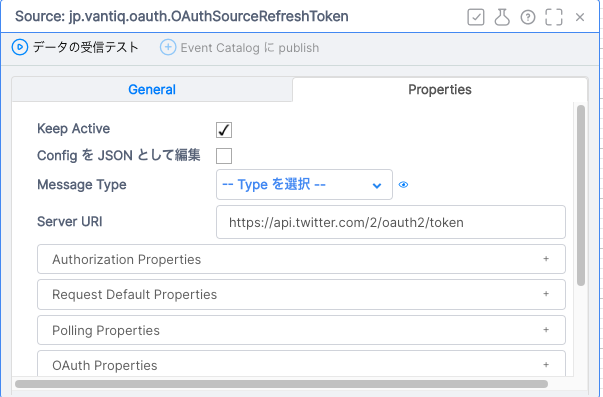
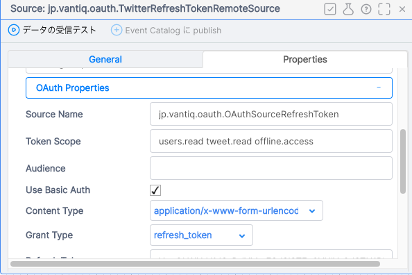
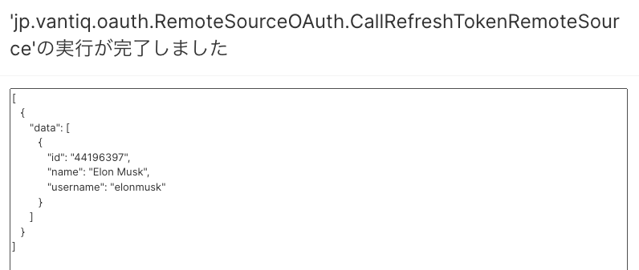
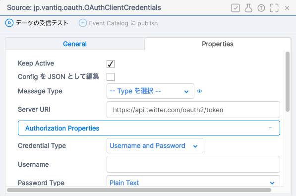
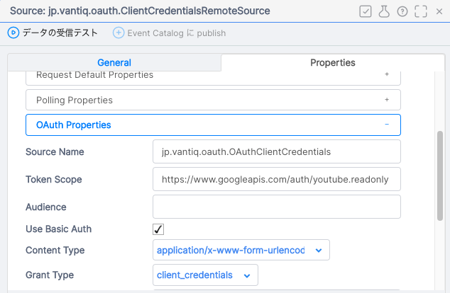

# **Remote Source で OAuth2.0 認可フローによるアクセストークン再発行を受けAPIリクエストするための設定**

# 目次

[はじめに](#introduction)  
[前提条件](#prerequisites)  
[事前準備](#prepare)   
[Remote Source とOAuth Source の概要](#overview)   
[Refresh Token flow の設定](#refreshTokenFlow)   
[Client Credentials flow の設定](#clientCredentialsFlow)  


# はじめに<a id="introduction"></a>
Vantiq 1.34より追加された機能 `OAuth Source` の設定手順及び動作検証を記載する。

# 前提条件<a id="prerequisites"></a>
## 手順確認日:
2022/10/03
## 環境:
- Vantiq 1.34以降

# 事前準備<a id="prepare"></a>
## 対象のサービスから必要とする情報を取得する
この記事では、Twitter API のOAuth2.0 を利用してVantiq Remote SourceからTwitter APIを利用する設定を記載します。
以下の記事を参照し、Twitter Developer Apps の登録、API Key等必要な情報の取得を行ってください。

- [Twitter Developer Apps](https://developer.twitter.com/en/docs/apps/overview)
[OAuth 2.0](https://developer.twitter.com/en/docs/authentication/oauth-2-0)

必要な情報は以下の通りです。
- API Key
- API Key Secret
- Bearer Token
- Client ID
- Client Secret


[こちら](https://developer.twitter.com/en/docs/authentication/oauth-2-0/user-access-token) を参照し、アクセス トークンとリフレッシュ トークンをします。この手順で取得したリフレッシュトークンを後で利用します。

# Remote Source とOAuth Source の概要<a id="overview"></a>  
Remote Sourceに指定するRESTサービスによっては、有効期限の短いアクセストークンを利用しなければならない場合があります。

期限の切れたアクセストークンを手動で更新するのではなく、有効なアクセストークンを再取得するための専用のSourceを作成することができるようになりました。これが `OAuth Source` です。

Remote Source に、OAuth Sourceからアクセストークンを取得するように設定すると、以下の流れでアクセストークンを取得し、Remote Source でAPIリクエストを行います。
1. 有効なトークンかどうか確認する（期限切れでないことも含む） 
2. 有効でない場合、OAuth Sourceを呼び出して新しいトークンを取得する
3. 新しいトークンを使用して Remote Source でAPIリクエストを行う


# Refresh Token flow の設定<a id="refreshTokenFlow"></a>
## Refresh Token flow によりアクセストークンを取得するための設定

### OAuth Source の設定
OAuth Source はエンドポイントのみを指定します。
ConfigのJsonは以下のようになるでしょう。
```json
{
    "uri": "https://api.twitter.com/2/oauth2/token",
    "query": {},
    "requestDefaults": {},
    "passwordType": "string",
    "oauthContentType": "application/x-www-form-urlencoded",
    "oauthUseBasicAuth": false
}
```



### Remote Source の設定
次に、実際にAPI リクエストするRemote Sourceを作成します。このSourceのAuthorization Properties には何も設定せず、OAuth Properties に設定を行います。
ConfigのJsonは以下のようになるでしょう。

```json
{
    "uri": "https://api.twitter.com/2/users",
    "query": {},
    "requestDefaults": {
        "query": {
            "ids": "44196397"
        }
    },
    "oauthGrantType": "refresh_token",
    "oauthClientId": "<事前準備で取得したクライアントID>",
    "oauthClientSecret": "<事前準備で取得したクライアントシークレット>",
    "oauthRefreshToken": "<事前準備で取得したリフレッシュトークン>",
    "oauthScope": "users.read tweet.read offline.access",
    "oauthContentType": "application/x-www-form-urlencoded",
    "oauthUseBasicAuth": true,
    "passwordType": "string",
    "oauthSourceName": "<使用するOAuth Source 名>"
}

```



### API 呼び出し
Procedure よりRemote Sourceを呼び出します。

```javascript
var response =  SELECT FROM SOURCE jp.vantiq.oauth.TwitterRefreshTokenRemoteSource WITH method = "GET"

return response
```

Twitter API のレスポンスが返ってくるはずです。


# Client Credentials flow の設定<a id="clientCredentialsFlow"></a>
## Client Credentials flow によりアクセストークンを取得するための設定

OAuth Source はエンドポイントのみを指定します。
ConfigのJsonは以下のようになるでしょう。
```json
{
    "uri": "https://api.twitter.com/oauth2/token",
    "oauthContentType": "application/x-www-form-urlencoded",
    "oauthUseBasicAuth": false,
    "passwordType": "string",
    "query": {},
    "requestDefaults": {},
}
```

**Note**
Twitter APIでは、Client Credential flowとRefresh Token flow でToken Endpointが異なります。利用するAPIの仕様に合わせ変更してください。




### Remote Source の設定
次に、実際にAPI リクエストするRemote Sourceを作成します。このSourceのAuthorization Properties には何も設定せず、OAuth Properties に設定を行います。
ConfigのJsonは以下のようになるでしょう。

```json
{
    "uri": "https://api.twitter.com/2/users",
    "query": {},
    "requestDefaults": {
        "query": {
            "ids": "44196397"
        }
    },
    "oauthGrantType": "client_credentials",
    "oauthClientId": "<事前準備で取得したAPI Key>",
    "oauthClientSecret": "<事前準備で取得したAPI Keyシークレット>",
    "oauthScope": "users.read tweet.read offline.access",
    "oauthContentType": "application/x-www-form-urlencoded",
    "oauthUseBasicAuth": true,
    "passwordType": "string",
    "oauthSourceName": "<使用するOAuth Source 名>"
}
```
**Note**
Twitter APIのClient Credential flowでは、API KeyとAPI Key Secretを使用します。利用するAPIの仕様に合わせ変更してください。





### API 呼び出し
Procedure よりRemote Sourceを呼び出します。

```javascript
var response =  SELECT FROM SOURCE jp.vantiq.oauth.ClientCredentialsRemoteSource WITH method = "GET"

return response
```

Twitter API のレスポンスが返ってくるはずです。


