# 再利用可能なアプリケーションデザインパターン

## デザインパターンの目的

- Vantiqの価値を最大限に発揮させるアプリケーションのデザインパターンを抽象化し、再利用することでベストプラクティスに沿ったアプリケーションのロジックに注力できるようにする。

#### Vantiq アプリケーションの位置づけ

- Vantiqはストリームデータ処理を行うプラットフォームなので、アプリケーションは、**[ラムダアーキテクチャ](https://docs.microsoft.com/ja-jp/azure/architecture/data-guide/big-data/#lambda-architecture)**、**[カッパアーキテクチャ](https://docs.microsoft.com/ja-jp/azure/architecture/data-guide/big-data/#kappa-architecture)** におけるSpeed Layer の位置づけであるべきである。
  - ストリームをリアルタイムで処理する（バッチではない）。パイプを流れるデータをチャンクではなく１件ずつ処理する。従来のデータベース中心のバッチ処理的な発想で実装をすると、特徴を活かすことができなくなる
  - カッパアーキテクチャのように、バッチ処理とストリーム処理で同じ1つのロジックを実装できるのが望ましい。

#### Vantiq アプリケーションの理想形

- Vantiqのアプリケーションの基本形
  - それぞれ独立に外部システムとの接続部である **Source**
  - 流通するデータを柔軟につなぎビジネスロジックを実装する **App**

- Vantiqデザインパターンは、**[Vantiq ”Service”](./vantiq-service.md)** リソースを活用することで複雑なロジックも基本形に準拠したアプリケーションを作成する。

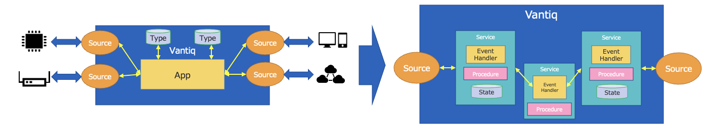


# デザインパターン例

### 実装に関する注意点
- いくつかのデザインパターンは[バージョン1.34](https://community.vantiq.com/forums/topic/1-3-4-release-notes-%e6%97%a5%e6%9c%ac%e8%aa%9e/)の機能に依存しています。それ以前のバージョンにインポートするとコンパイルエラーとなったり、想定通り機能しない可能性があります。
  - [Stateful ServiceにおけるMap型](https://dev.vantiq.co.jp/docs/system/rules/index.html#map) - Stateful Serviceにて従来Object型を使用していたものが置き換えられた
  - Automatic Smoothing – アプリケーション内に過度に流れるイベントを自動的にバッファする
  - [LoopWhile](https://dev.vantiq.co.jp/docs/system/apps/index.html#loop-while) – 複数のタスクに渡る一連の処理をシーケンシャルに実行する


## 入力編

---
### Polling-To-Stream <a id="polling-to-stream"></a>

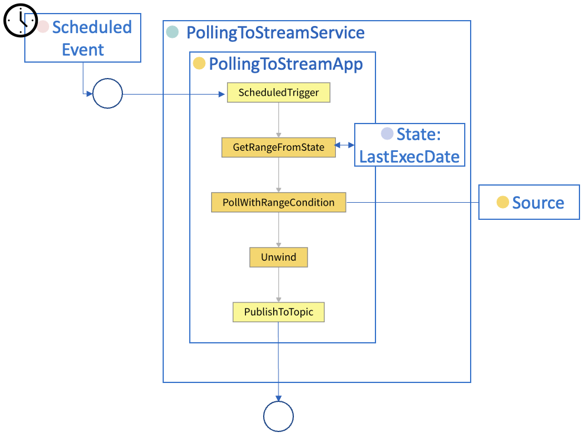

**Overview**
- 定期的にPollingしたデータ（ファイル）を個々のレコードに分割して、イベントストリームとして出力する。

**Motivation**
- Pollingしたデータは配列の形になっているが、そのままではストリーム処理に適さない。

**Usage**
- 外部システムのREST APIから最新の差分データの読み込み
- CSVファイルの読み込み
- 主にトランザクションやテレメトリ等のイベントデータ

**Note**
- _Unwind_ - 配列をストリームに変換している。

**Sample Project**
- [PollingToStream.zip](https://github.com/fujitake/vantiq-related/raw/main/vantiq-apps-development/conf/reusable-design-patterns/PollingToStream.zip)

---

### Observer <a id="observer"></a>

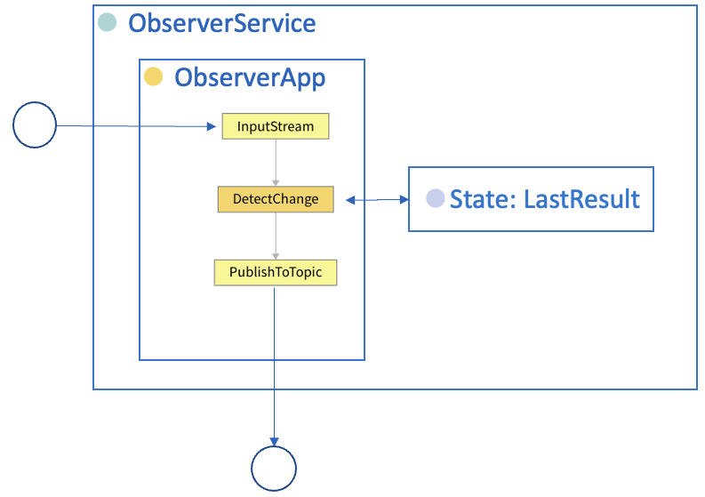


**Overview**
- 緩やかに変化する入力したデータをVantiq上でメモリに保持して定点観測し、差異が発生した時にイベントとして発出する。
- 入力の候補として、Inboundストリームや、Remote SourceにPollingした戻り値 (Polling-To-Streamパターンと併用)、ファイルなど。

**Motivation**
- Vantiqで大きなデータを処理したいが、不必要なMongoDBへの書き込みや処理を発生させたくない。

**Usage**
- 変化の少ない大きなデータの処理（天気予報データ、列車運行情報など）
- 主にトランザクションやテレメトリ等のイベントデータ

**Note**
- _State: LastResult_ -  LastResult: Serviceの State: LastResult に前回(n-1th)のデータを入れる。
- _InputStream_ - 今回（nth)データをフェッチ/入力する
- _DataChange_ - 比較をして、差異を検出やある一定条件を満たしたもののみOutboundストリームとして出力する。

**Sample Project**
- [Observer.zip](https://github.com/fujitake/vantiq-related/raw/main/vantiq-apps-development/conf/reusable-design-patterns/Observer.zip)

---

### Async API <a id="async-api"></a>

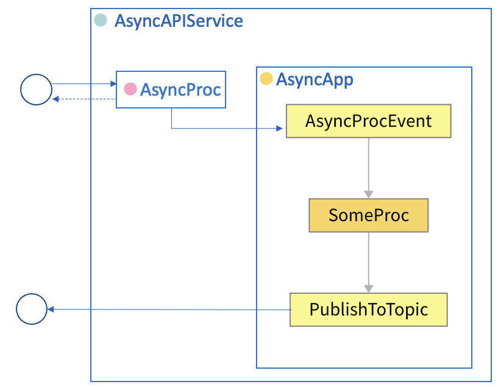

**Overview**
- 外部システムからService Procedureを同期呼び出し (Request / Response) しながら、派生イベントにより非同期処理を行う

**Motivation**
- 非同期の連携をしたいが、Ackシグナルを確実に受け取るよう実装したい。
- 時間がかる処理でもレスポンス(Ack)が速やかに返るようにしたい

**Usage**
- デバイスなどの状態更新処理
- 制御指示の連携
- 時間がかかるジョブの実行リクエスト

**Note**
- _AsyncProc_ - Procedureの中で Publish To Topicをする。

**Sample Project**
- [AsyncAPI.zip](https://github.com/fujitake/vantiq-related/raw/main/vantiq-apps-development/conf/reusable-design-patterns/AsyncAPI.zip)

---

### Cached Remote API <a id="cached-remote-api"></a>

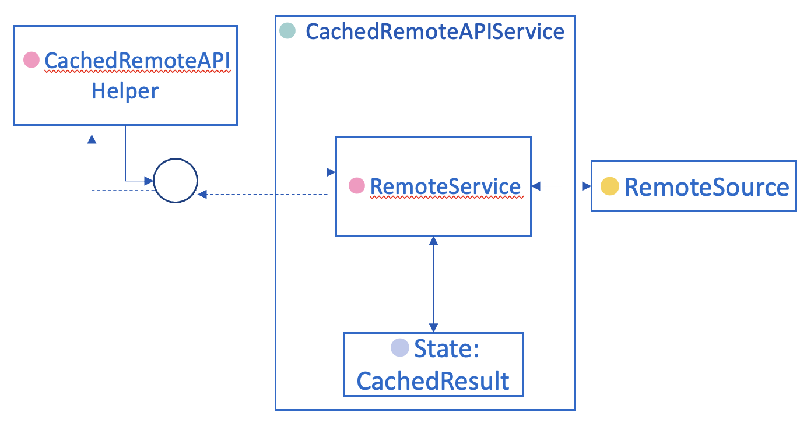

**Overview**
- 緩やかに変化する大きな参照データに対するREST APIのクエリ結果をキャッシュし、同一のパラメータの呼び出しをキャッシュから返す
- 定期的に期限切れキャッシュをクリアする

**Motivation**
- 参照したい外部サービスのデータが変化する場合、Vantiq上に持つことは難しいので、Remote Sourceで問い合わせるのが妥当だが、Remote Sourceの呼び出しは遅いので、件数が多くなるとボトルネックとなるのを回避する。

**Usage**
- 定期的に更新されるデータ（天気予報、動態人口統計など）の外部サービス呼び出し

**Note**
- _CachedRemoteAPIHelper_ - クエリから PartitionKey を算出するラッパー
- _RemoteService_ - Cache がヒットすれば Cache を返す。ヒットしない、有効期限切れならば Remote Source に問い合わせる。

**Sample Project**
- [CachedRemoteAPI.zip](https://github.com/fujitake/vantiq-related/raw/main/vantiq-apps-development/conf/reusable-design-patterns/CachedRemoteAPI.zip)


---

### In-Memory Master <a id="in-memory-master"></a>
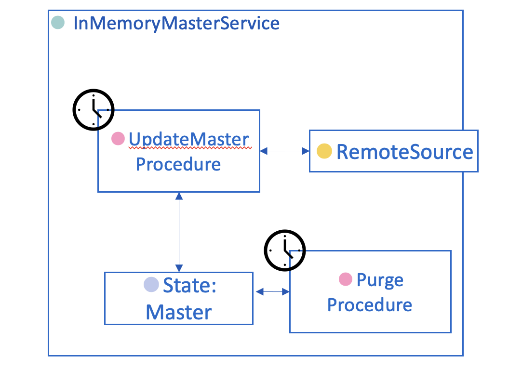

**Overview**
- 外部からロードするマスタデータ（またはそれに準ずる参照系データ）をTypeではなくインメモリのStateで保持する。 Stateは、hash検索のみ可能なので、検索に使う列の数の分キャッシュが必要になる。
- ロードする時点で複数のマスターレコードを集約しておくことで、より高速化する。（Composite Entityパターンとの併用）

**Motivation**
- データ統合、エンリッチ処理の高速化。

**Usage**
- 参照用マスタデータ
- データ統合

**Note**
- _UpdateMaster Procedure_ - ServiceのScheduled Procecureや、Initializeで更新をする
- _Purge Procedure_ - 古いデータをStateから定期的に消去する

**Sample Project**
- [InMemoryMaster.zip](https://github.com/fujitake/vantiq-related/raw/main/vantiq-apps-development/conf/reusable-design-patterns/InMemoryMaster.zip)

---

### Echo Back <a id="echo-back"></a>
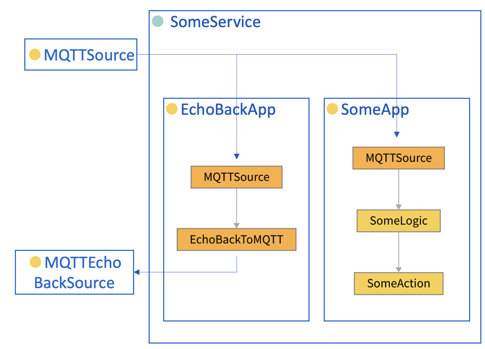

**Overview**
- BrokerやREST API等を通じて入力したデータをそのままの形で外部向けのBrokerに返す。

**Motivation**
- インテグレーション時に外部システムの視点から正しくデータがつながっているかを確認したい。

**Usage**
- 外部システムとのインテグレーション時の確認用

**Note**
- N/A

**Sample Project**
- [EchoBack.zip](https://github.com/fujitake/vantiq-related/raw/main/vantiq-apps-development/conf/reusable-design-patterns/EchoBack.zip)

---

### Loopwhile Batch <a id="loopwhile-batch"></a>
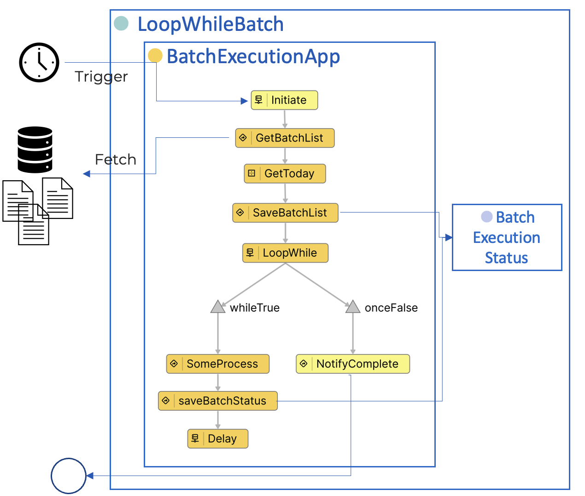

**Overview**
- あらかじめ小さく（Vantiqでタイムアウトしない、過負荷にならない程度）分割したバッチのリスト（ファイルリスト、テーブルのサブセット等）を入力し、LoopWhileで順次バッチ実行を行い、実行ごとにステータスを記録する。
- 途中で失敗した場合、記録された進捗ステータスに基づき、全体、もしくは途中から再開させる。
- Async Procedureパターン、Polling-To-Streamパターン等と併用する。

**Motivation**
- 大量の入力が必要な処理を確実に行いたい。
- エラーが一定の確率でおこる前提で、運用を効率化する

**Usage**
- データ統合
- 機械学習データ前処理

**Note**
- N/A

**Sample Project**
- [LoopWhileBatch.zip](https://github.com/fujitake/vantiq-related/raw/main/vantiq-apps-development/conf/reusable-design-patterns/LoopWhileBatch.zip)


---

## App 編

---

### Composite Entity <a id="composite-entity"></a>

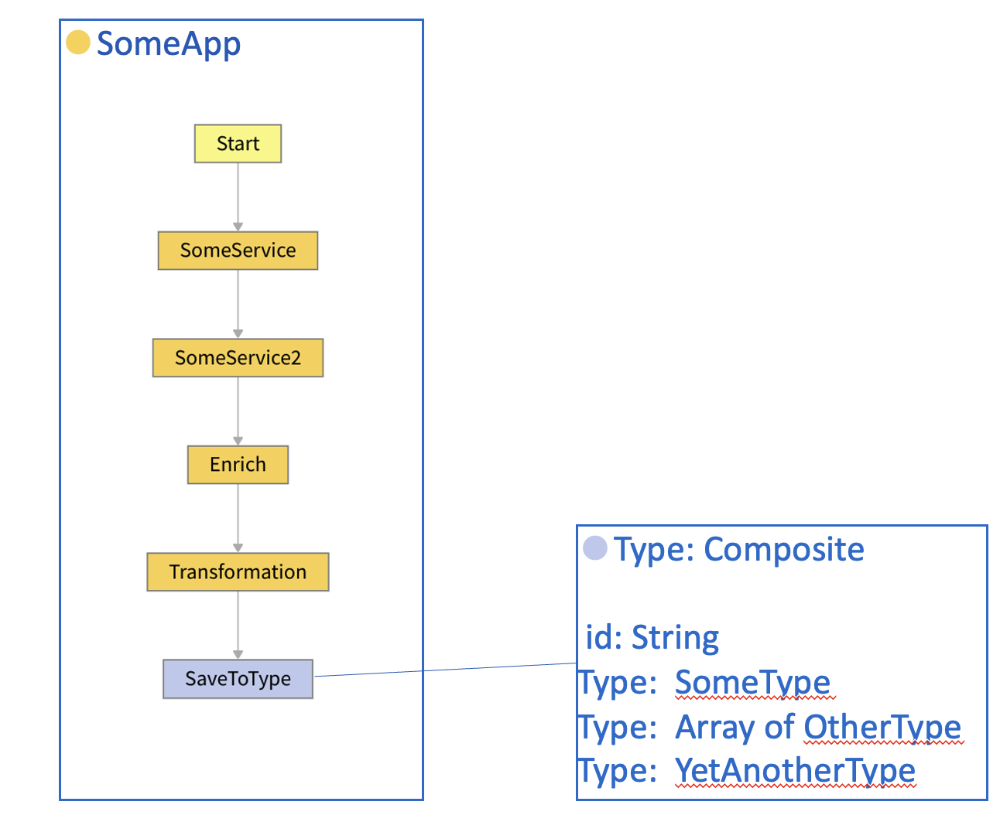

**Overview**
- 複数のエンティティをまとめた複合エンティティで処理を行う

**Motivation**
- テーブルの読み書きの回数を減らす、JoinができないNoSQLに予め非正規化/複合エンティティの形で保存する

**Usage**
- 複数マスタのある場合に検索パフォーマンスを高める
- NoSQLにおいて、リレーション（関連）を最適に表現する
- UI表示用のデータ構造として

**Note**
- N/A

**Sample Project**
- N/A

---

### Transpose <a id="transpose"></a>


**Overview**
- AccumulateState タスクを用いて、共通のIDを持つ3つ以上のストリームのプロパティを横並びに入力タイミングに依らない統合をする。

**Motivation**
- Joinによるストリーム統合は、どちらか出力イベントがどちらか一方のタイミングに依存する。

**Usage**
- さまざまなストリームの統合

**Note**
- AccumulateState で実装するサンプルコード
```vail
if (!state) {
    // if this is the first time, initialize it.
    state = {
        machineID : "",
        temp: 0.0,
        humidity: 0.0,
        controlCode : "0"        
    }
}

if (event.controlCode) {
    state.controlCode = event.controlCode
}
if (event.temp) {
    state.temp = event.temp
}
if (event.humidity) {
    state.humidity = event.humidity
```

**Sample Project**
- [Transpose.zip](https://github.com/fujitake/vantiq-related/raw/main/vantiq-apps-development/conf/reusable-design-patterns/Transpose.zip)

---

### Adapter <a id="adapter"></a>


**Overview**
- Serviceのインタフェースに入力ストリームの形式を合わせる。
- Service Inbound, Service Outbound, Service Procedureとの接続時に適宜 Transform したり、Procedure でラップすること。

**Motivation**
- Service モジュールの汎用性を損なわずに利用したい。

**Usage**
- さまざま

**Note**
- この例はService Inboundに対するAdapterだが、Service Outbound, Service Procedureインタフェースについても同様のパターンが取れる。

**Sample Project**
- N/A

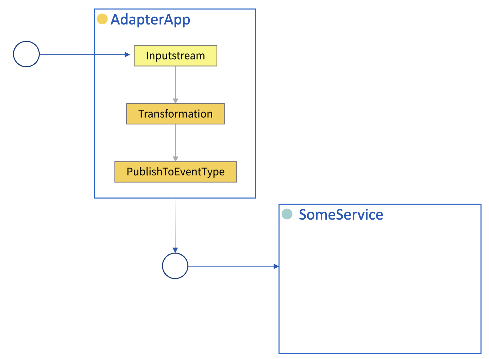

---

### Decorator <a id="decorator"></a>

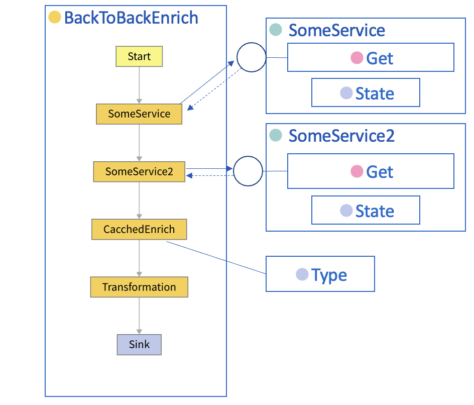

**Overview**
- 入力ストリームに複数のデータソースを統合しながら段階的に情報を付加していく。
- In-Memory Masterパターン、Cached Remote API、Cached Enrich と併用して効率化する。

**Motivation**
- ストリームの統合だけでなく、REST API問い合わせやEnrichタスクも含めてデータ統合したい

**Usage**
- データ統合

**Note**
- _SomeService.Get()_ - Keyに対するレコードを返す
- _SomeService_, _SomeService2_ タスク - Service Procedureを呼び出し、`Attach Return Value to Return Property`とする
- _Sink_ - 分析用データであれば Brokerなど通じてVantiq外に連携する

**Sample Project**
- N/A

---

## 出力編

---

### Stream-To-Bulk <a id="stream-to-bulk"></a>

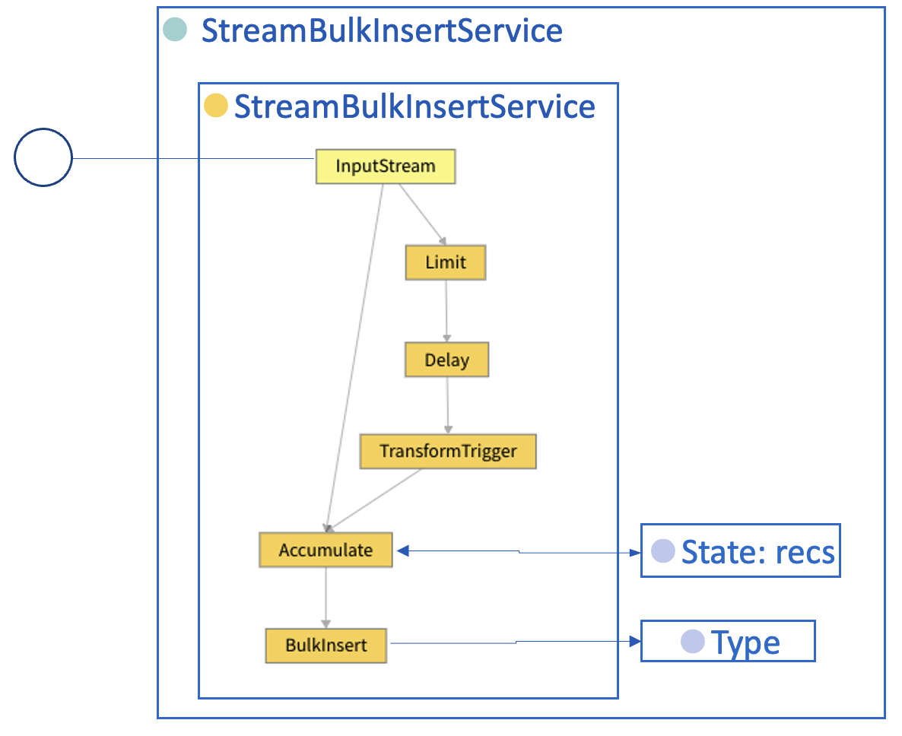

**Overview**
- ストリームデータをメモリ上に蓄積し、一定時間、もしくは一定数レコードが溜まった時点でまとめてDBに書き出す。
- Insert, Remote Sourceで外部API連携する処理に適用可能。

**Motivation**
- Vantiq処理においてデータベース操作は比較的パフォーマンスが低く、並行処理中のストリームをそのまま流すとクレジット超過となるのを回避する。
- 外部APIサービスで回数超過による課金を抑えたい。

**Usage**
- Typeへの効率的書き出し
- Remote Sourceへの効率的書き出し

**Note**
- N/A

**Sample Project**
- [StreamToBulkInsert.zip](https://github.com/fujitake/vantiq-related/raw/main/vantiq-apps-development/conf/reusable-design-patterns/StreamToBulkInsert.zip)


---

### External Datasink <a id="external-datasink"></a>

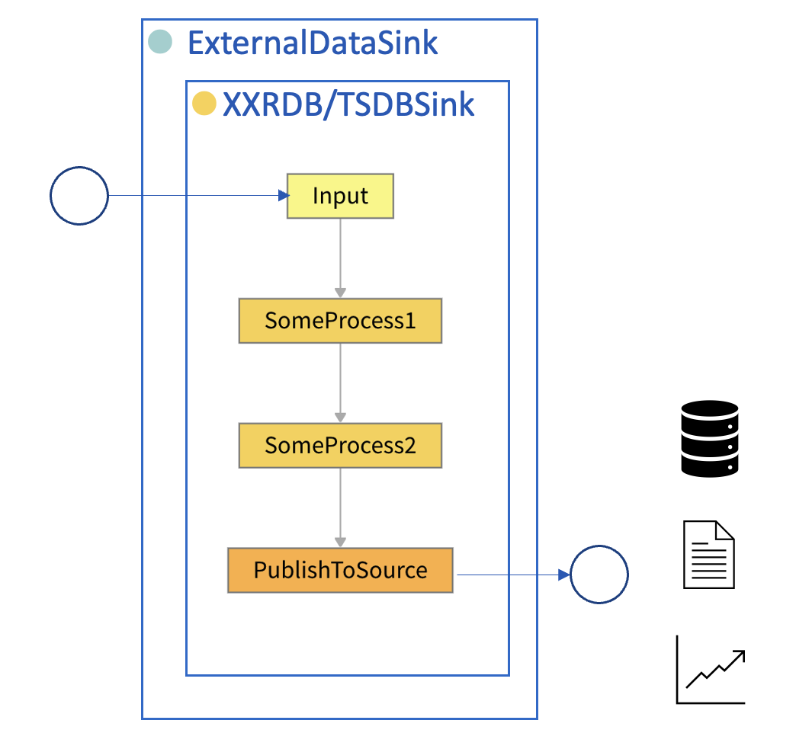

**Overview**
- Vantiqアプリケーションで処理したデータを蓄積のため、外部に連携する。
- 連携先としてRDB、時系列DBなど

**Motivation**
- Vantiqはデータ分析基盤やアーカイブのためのストレージではないため、目的に応じた外部サービスに連携する

**Usage**
- 過去データの蓄積
- 可視化ダッシュボード、レポーティング、分析基盤への連携

**Note**
- N/A

**Sample Project**
- N/A

---

### WebSocket <a id="websocket"></a>

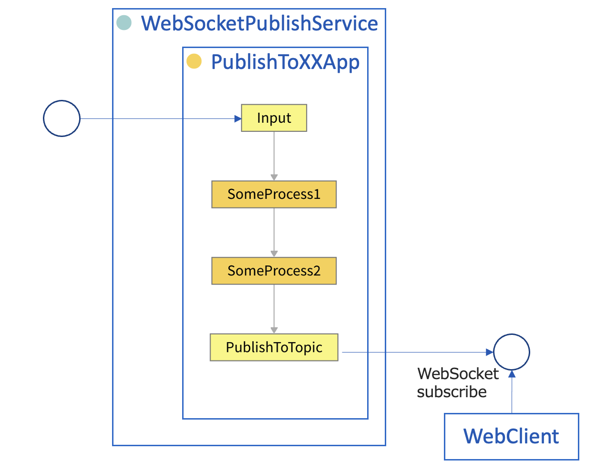

**Overview**
- Vantiq Topicに出力したストリームデータをクライアントアプリからWebSocketで取りに来る

**Motivation**
- クライアントアプリからの過多のポーリングを回避と、リアルタイム性を確保する

**Usage**
- Webクライアントへマップ情報（位置情報）を更新する

**Note**
- N/A

**Sample Project**
- [websocket_client.zip](https://github.com/fujitake/vantiq-related/raw/main/vantiq-apps-development/conf/reusable-design-patterns/websocket_client.zip)
- [WebSocket_Server.zip](https://github.com/fujitake/vantiq-related/raw/main/vantiq-apps-development/conf/reusable-design-patterns/WebSocket_Server.zip)

---

### Journal <a id="journal"></a>
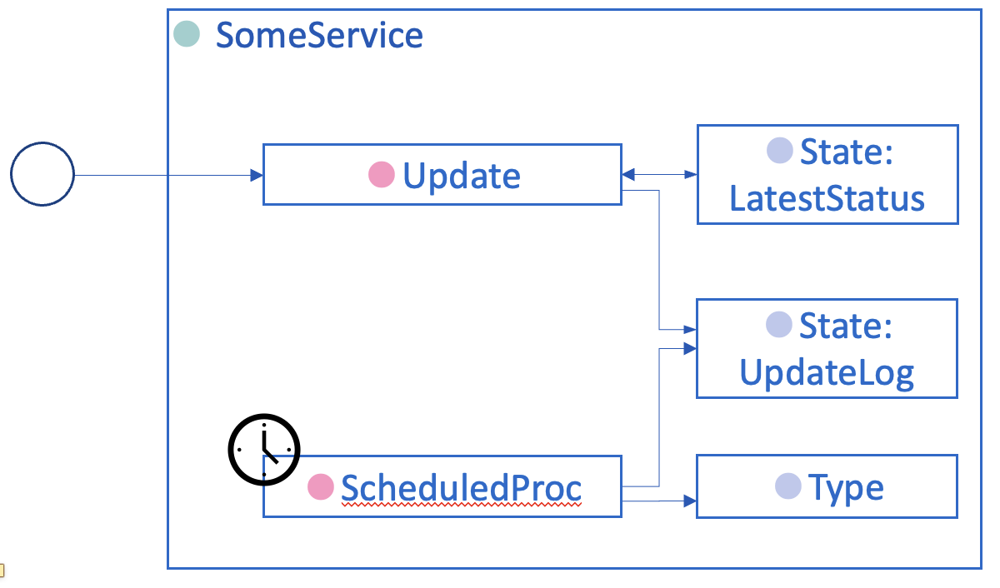

**Overview**
- インメモリのキャッシュに更新を行い、更新情報についてはJournalを保持し、一定のタイミングでPersistする。

**Motivation**
- Persistencyの確保をしつつ、Typeへの書き込みを最小化する。

**Usage**
- 状態の一時〜永続的保存

**Note**
- _ScheduledProc_ - ServiceのScheduled Procecureで書き込みをする

**Sample Project**
- N/A

---

### Smooth Remote Service <a id="smooth-remote-service"></a>

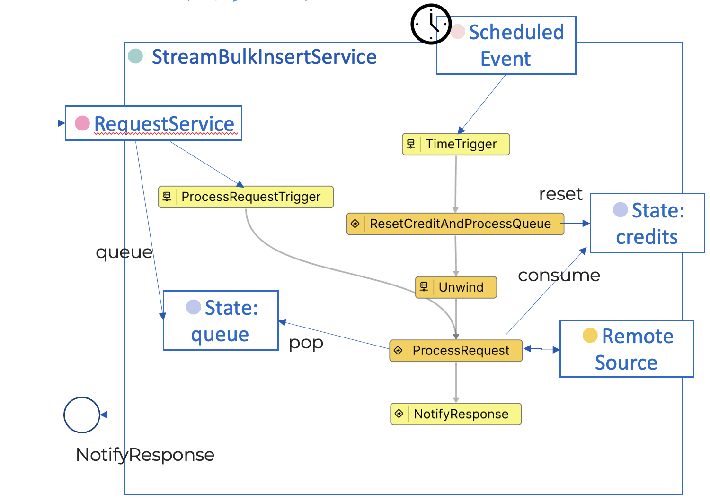

**Overview**
- Remote Sourceで外部サービスを呼び出す部分をバッファし、一定時間あたりの呼び出し数を制御する。

**Motivation**
- 外部サービスに対してVantiqの処理が速すぎる場合、Vantiq側で呼び出しをコントロールしてエラーとならないようにする。

**Usage**
- 時間あたりのAPI呼び出し制限がある外部サービスを使用する

**Note**
- N/A

**Sample Project**
- [SmoothRemoteService.zip](https://github.com/fujitake/vantiq-related/raw/main/vantiq-apps-development/conf/reusable-design-patterns/SmoothRemoteService.zip)

---
