# Vantiq アプリ開発 逆引きリファレンス

Vantiq アプリケーション開発時によく使われるパターンについて実装方法を説明します。

## TOC
- [Source 関連](#source-関連)
  - [どのような Source を作成すればよいか](#どのような-source-を作成すればよいか)
  - [ひとつの Source の定義でさまざまな Web サービスを呼び分けしたい](#ひとつの-source-の定義でさまざまな-web-サービスを呼び分けしたい)
  - [CSV ファイルを入力したい](#csv-ファイルを入力したい)
  - [複数の Topic をまとめてサブスクライブしたい](#複数の-topic-をまとめてサブスクライブしたい)
  - [Sourceを変数に置き換えたい](#sourceを変数に置き換えたい)
  - [Remote SourceにOAuth認証を使いたい](#remote-sourceにoauth認証を使いたい)
  - [Podの再起動時もMQTT SourceのQoSを保証したい](#podの再起動時もmqtt-sourceのqosを保証したい)
- [アプリケーション実装関連](#アプリケーション実装関連)
  - [前後のイベント情報を蓄積して処理したい](#前後のイベント情報を蓄積して処理したい)
  - [デバッグしたい](#デバッグしたい)
  - [イベントが高頻度すぎてバッジが更新しなくなったが、件数を確認したい](#イベントが高頻度すぎてバッジが更新しなくなったが件数を確認したい)
  - [一定時間イベントが発生しない場合にアラートを出したい](#一定時間イベントが発生しない場合にアラートを出したい)
  - [3つ以上のストリームデータを効率よく結合したい](#3つ以上のストリームデータを効率よく結合したい)
  - [イベントに紐づけるマスターデータの欠損を、任意の内容のエラーでログ用の DB に送信して残したい](#イベントに紐づけるマスターデータの欠損を任意の内容のエラーでログ用の-db-に送信して残したい)
  - [条件分岐を書きたい](#条件分岐を書きたい)
  - [動的な条件で filter したい](#動的な条件で-filter-したい)
  - [いらないイベントを無視したい](#いらないイベントを無視したい)
  - [テスト用のイベントを簡易的に使いたい](#テスト用のイベントを簡易的に使いたい)
  - [定期的に動く処理を実装したい](#定期的に動く処理を実装したい)
  - [JSON の配列になっている、もしくは JSON の配列を含む入力イベントを処理したい](#json-の配列になっているもしくは-json-の配列を含む入力イベントを処理したい)
  - [定数を使いたい](#定数を使いたい)
  - [エラーが発生した場合に再送したい](#エラーが発生した場合に再送したい)
  - [プロパティが入れ子になっている複雑な Type を定義したい](#プロパティが入れ子になっている複雑な-type-を定義したい)
  - [一定時間経過すると自動的に古いレコードを消去したい](#一定時間経過すると自動的に古いレコードを消去したい)
  - [複数のアプリケーションで使用できる共通なロジックを実装したい](#複数のアプリケーションで使用できる共通なロジックを実装したい)
  - [ある位置情報を元に、最寄りのオブジェクトを検索したい](#ある位置情報を元に最寄りのオブジェクトを検索したい)
  - [アプリケーションを再利用したい](#アプリケーションを再利用したい)
  - [Type への書き込みでクレジットエラーが出るのを回避したい](#type-への書き込みでクレジットエラーが出るのを回避したい)
  - [バイナリデータを処理したい](#バイナリデータを処理したい)
  - [日付に1ヶ月足したり引いたりしたい ](#日付に1ヶ月足したり引いたりしたい-)
  - [フォーム送信でPOSTしたい ](#フォーム送信でpostしたい-)
  - [XMLを処理したい](#xmlを処理したい)
    - [補足情報:XMLを返すエンドポイントを設定したREMOTE Source](#補足情報xmlを返すエンドポイントを設定したremote-source)
  - [Objectをループさせて、keyとvalueをそれぞれ取得したい ](#objectをループさせてkeyとvalueをそれぞれ取得したい-)
- [構成管理関連](#構成管理関連)
  - [作ったものをテンプレートとして配布したい](#作ったものをテンプレートとして配布したい)
  - [複数人で共同で作業したい](#複数人で共同で作業したい)
  - [Resource の一覧を csv で出力したい](#resource-の一覧を-csv-で出力したい)
  - [Namespace 間でイベントを連携させたい](#namespace-間でイベントを連携させたい)
  - [アクセストークンを定期的にリフレッシュさせたい](#アクセストークンを定期的にリフレッシュさせたい)
  - [Vantiq から外部への API 呼び出しの数を制限したい](#vantiq-から外部への-api-呼び出しの数を制限したい)
  - [Source のリクエストヘッダー等に使うクレデンシャルを安全に保管したい](#source-のリクエストヘッダー等に使うクレデンシャルを安全に保管したい)
  - [自己証明書を使用したい](#自己証明書を使用したい)
  - [アクセストークンを一元管理したい](#アクセストークンを一元管理したい)
  - [Namespace ごとに環境変数を使いたい](#namespace-ごとに環境変数を使いたい)
  - [Vantiq 上のログをファイルに出力したい](#vantiq-上のログをファイルに出力したい)
  - [開発中のNamespaceに他のユーザーを招待したい ](#開発中のnamespaceに他のユーザーを招待したい-)
  - [Vantiq ServerのGlobal IPを調べたい ](#vantiq-serverのglobal-ipを調べたい-)
  - [発生したVantiqアプリケーションのエラーを把握したい](#発生したvantiqアプリケーションのエラーを把握したい)
  - [リソースのステータスをまとめて制御したい](#リソースのステータスをまとめて制御したい)


## Source 関連<a id="Source関連"></a>

### どのような Source を作成すればよいか<a id="どのようなSourceを作成すればよいか"></a>

Vantiq システムを 1つの箱と捉えると、外部との入出力を行う `Source` と、`Source` をつなぎロジックを実装する `App` で主に構成される、と見ることができます。

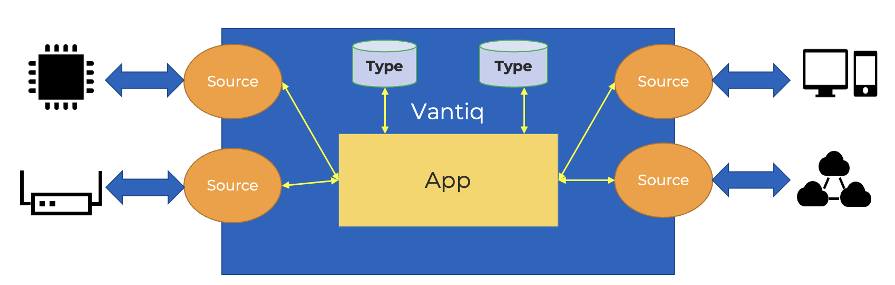

外部と連携したいデータの種類ごとに以下の項目を整理します。それぞれが Source の候補となります (REST(POST)、WebSocket については `source` ではなく `topic` を用います)。
1. データのフォーマット
2. データの頻度
3. データの用途 (マスタ、テレメトリ、時系列)
4. データ連携のプロトコル (REST、MQTT、AMQP、Kafka etc.)

データ連携のプロトコル種類により設定を行います。
1. 入力 ([REST(POST)](../../1-day-workshop/docs/jp/a08-Lab05_VANTIQ_REST_API.md)、[REST(Polling)](https://dev.vantiq.co.jp/docs/system/tutorials/sourcetutorial/index.html#source))
1. 出力 ([REST(POST)](../../1-day-workshop/docs/jp/../../1-day-workshop/docs/jp/a08-Lab05_VANTIQ_REST_API.md))
1. 双方向 ([WebSocket、MQTT、AMQP、Kafka](https://dev.vantiq.co.jp/docs/system/sources/source/index.html))

### ひとつの Source の定義でさまざまな Web サービスを呼び分けしたい<a id="ひとつのSourceの定義でさまざまなWebサービスを呼び分けしたい"></a>
固定の Request URI と可変の Path を組み合わせて URL を生成します。Path の指定方法 (具体的には "/" から始まるかどうか) により URL 算出結果が変わるので注意してください。
[パスの設定 (REMOTE Source)](./data_sending.md#note-path)

### CSV ファイルを入力したい<a id="CSVファイルを入力したい"></a>
`Procedure` で CSV ファイルを JSON 配列に変換し、`unwind` で配列を要素ごとにばらしてイベント処理に適した形にします。


以下の VAIL サンプルは Remote Source を使って CSV データをフェッチしている。
```vail
PROCEDURE loadCSV()

var path = "xxxxx.csv"
var csv = SELECT ONE FROM SOURCE SampleCSVSource WITH path=path

// CSV file -> CSV records
var lines = split(csv, "\r\n")

// extract header
var header = split ( lines[0], ",")
var recs = slice(lines, 1)

// Transform CSV to JSON
var json_recs = MAP (rec in recs) {
    var json_rec = {}
    var values = split(rec, ",")
    for i in range(0, length(header)) {
   		json_rec[header[i]] = values[i]
	}
	return json_rec
}
```

### 複数の Topic をまとめてサブスクライブしたい<a id="複数のトピックをまとめてサブスクライブしたい"></a>
1. MQTT や AMQT のプロトコルにおいてサポートされるワイルドカード指定で Topic をサブスクライブする。
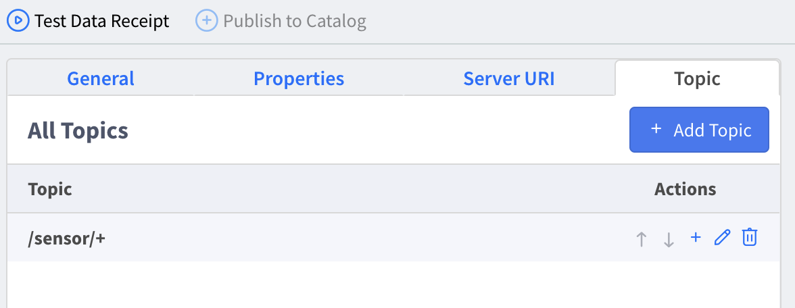

1. Topic 名を識別する必要がある場合、RULE を記述し、メッセージ変数 `msg` から `msg.topic` プロパティを取得して後続の処理に渡す。

```vail
RULE SensorMQTTWildcard
when
  EVENT OCCURS ON "/sources/Sensors" as msg

log.debug("Received from Sensors, topic: {}, payload: ", [msg.topic, msg.value])

var payload = msg.value[0]
payload.topicname = msg.topic

publish payload to TOPIC "/downstream/sensor/telemetry"
```

### Sourceを変数に置き換えたい<a id="Sourceを変数に置き換えたい"></a>
Sourceを変数に置き換えたい場合は、変数名に`@`をつけて使用します。

※SELECT文でもPUBLISH文でも利用できます。

```vail
var sourceName = "ExternalAPI"
var response = SELECT FROM SOURCE @sourceName
```

```vail
PROCEDURE getUsers(sourceName String)
var response = SELECT FROM SOURCE @sourceName
return response
```

[VAIL Reference Guide ： Variable References](https://dev.vantiq.com/docs/system/rules/index.html#variable-references)

### Remote SourceにOAuth認証を使いたい<a id="remote-sourceにoauth認証を使いたい"></a>
[Remote SourceでOAuth2.0認可フローによるアクセストークン再発行を受けAPIリクエストするための設定](./remote_source_oauth.md)

### Podの再起動時もMQTT SourceのQoSを保証したい<a id="Podの再起動時もmqtt-sourceのQoSを保証したい"></a>
MQTT Source で `QoS: At least once` を設定していても、Vantiq Podの過負荷による再起動が発生した場合などにEventがDropされる可能性があります。この様な場合にも信頼性の高いメッセージングを有効にするには、設定パラメータ `clientId` と `cleanSession` を指定する必要があります。

[MQTT Source Integration ： QoS](https://dev.vantiq.co.jp/docs/system/sources/mqtt/index.html#qos)

`clientId` には固定のユニークな値を設定し、`cleanSession` は false に設定する必要があります。`clientId` 値により、ブローカーはクライアントセッションを識別できるため、ソースがオフラインの間にブローカーが保持したメッセージはすべて配信することができます。

```json:MQTT Source Configuration
{
    ...,
    "cleanSession": false,
    "clientId": "uniqueClientId",
    ...
}
```

## アプリケーション実装関連<a id="アプリケーション実装関連"></a>

### 前後のイベント情報を蓄積して処理したい<a id="前後のイベント情報を蓄積して処理したい"></a>

汎用的な用途には、[`AccumulateState`](https://dev.vantiq.co.jp/docs/system/apps/index.html#accumulate-state) taskを使います。
もしくは特定の用途であれば、[`Window`](https://dev.vantiq.co.jp/docs/system/apps/index.html#window)、 [`ComputeStatistics`](https://dev.vantiq.co.jp/docs/system/apps/index.html#compute-statistics) を使用します。


### デバッグしたい<a id="デバッグしたい"></a>
[Task Events の表示]、Autopsy、Profiling などを活用します。
[デバッグの流れ (デモを通してデバッグの基礎を学ぶ)](./debug_demo.md)

### イベントが高頻度すぎてバッジが更新しなくなったが、件数を確認したい<a id="イベントが高頻度すぎてバッジが更新しなくなったが件数を確認したい"></a>
Grafana を使用する。  
管理 >> Grafana から、目的のダッシュボードを選択する。
- App Execution - App Builder `App` の処理状況
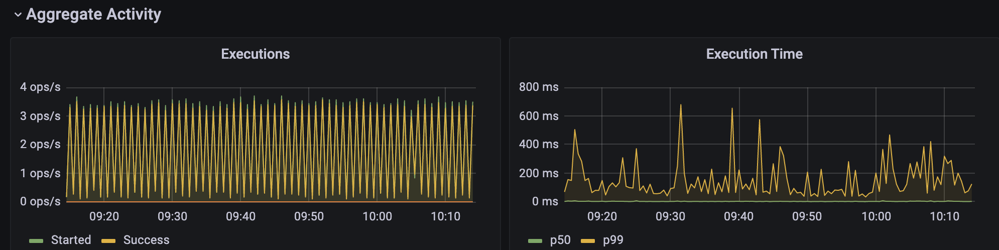
- Procedure Execution - `Procedure` の処理状況
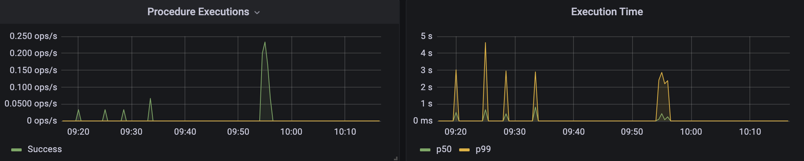
- Service Execution - `Service` 内の `Procedure` の処理状況
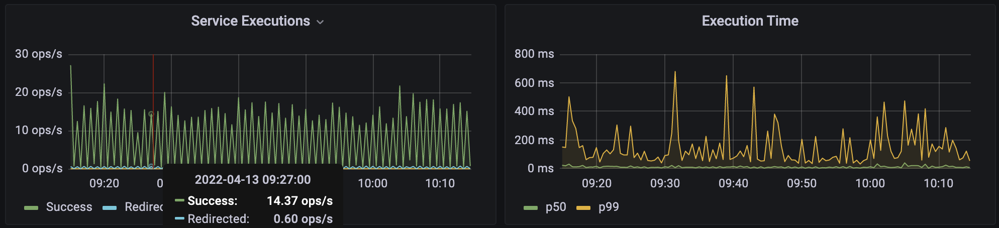
- Rule Execution - `Rule` の処理状況
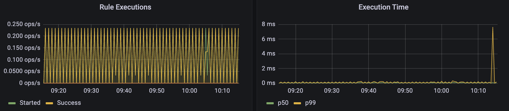

各ダッシュボードとも、処理件数 (単位は ops/s)、処理時間統計 (単位は milliseconds/seconds/minutes) で表示される。


### 一定時間イベントが発生しない場合にアラートを出したい<a id="一定時間イベントが発生しない場合にアラートを出したい"></a>
[`missing`](https://dev.vantiq.co.jp/docs/system/apps/index.html#missing) タスクを使用します。missing は一定時間入力がない場合にイベントが発火します。

### 3つ以上のストリームデータを効率よく結合したい<a id="3つ以上のストリームデータを効率よく結合したい"></a>
以下のいずれかの方法で実装します。
- [`join`](https://dev.vantiq.co.jp/docs/system/apps/index.html#join) を使います。
- `AccumulateState` を使い、一連のイベントのプロパティを同一イベントにトランスポーズします。（参考： [Transpose パターン](./reusable-design-patterns.md#transpose))


### イベントに紐づけるマスターデータの欠損を、任意の内容のエラーでログ用の DB に送信して残したい<a id="イベントに紐づけるマスタデータの欠損を任意の内容のエラーでログ用のDBに送信して残したい"></a>
SELECT EXACTLY ONE + Try-catch + catch したら PUBLISH

### 条件分岐を書きたい<a id="条件分岐を書きたい"></a>
2つ `Filter` を使い、それぞれが排他となるように条件を記述します。
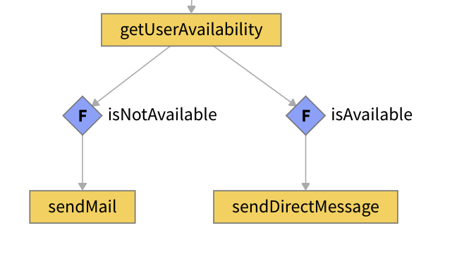

### 動的な条件で filter したい<a id="動的な条件でfilterしたい"></a>
`Filter` の条件を VAIL で記述します。`Filter` を始めとするほとんどのタスクは、直前のタスクから渡されたイベント情報を `event` という変数で受けており、イベントごとの固有の値を条件に用いることができます。
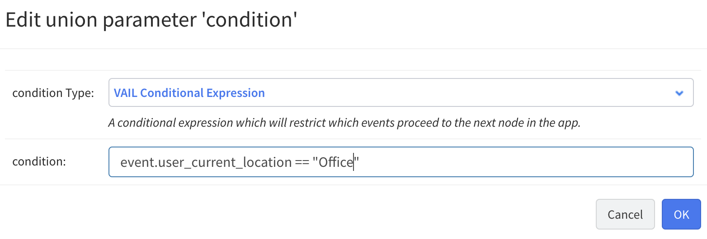

### いらないイベントを無視したい<a id="いらないイベントを無視したい"></a>
以下のいずれかの方法で行います。
- `Filter` を使う。
- `EventStream` の Condition を指定することで、余計なイベントがそもそも `App` に入力されないようにする。
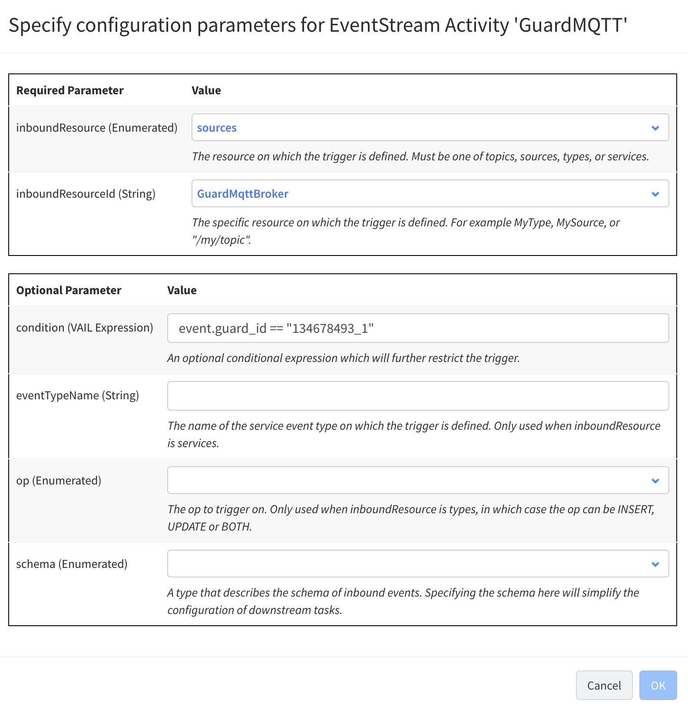

### テスト用のイベントを簡易的に使いたい<a id="テスト用のイベントを簡易的に使いたい"></a>
[`Event Generator`](https://dev.vantiq.co.jp/docs/system/eventgenerators/index.html) を使って簡単な設定で `Source`、`Topic`、`Type` に対して任意のイベントを発生させることができます。

### 定期的に動く処理を実装したい<a id="定期的に動く処理を実装したい"></a>
以下のいずれかの方法で行います。
- `ScheduledEvent` を作成し、任意の `Topic` に対してイベントを発生させます。後続のタスクで任意の処理を実装できます。
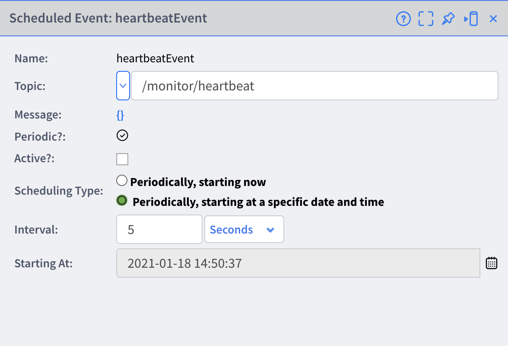

- 外部サービスへの定期的なポーリングの場合、種別が `Remote` の `Source` を作成、Polling を設定することができます。
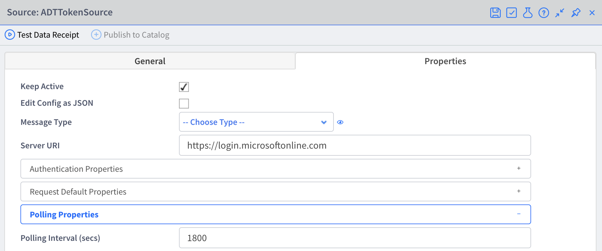
`App` の `EventStream` でポーリング結果をイベントとして受け取ります。
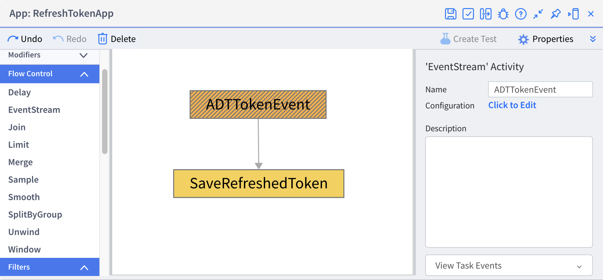
(ただし V1.33 現在、この方法では固定の URL に対する Polling のみ可能)

### JSON の配列になっている、もしくは JSON の配列を含む入力イベントを処理したい<a id="JSONの配列になっているもしくはJSONの配列を含む入力イベントを処理したい"></a>
[`unwind`](https://dev.vantiq.co.jp/docs/system/apps/index.html#unwind) タスクを使用すると、入力イベント全体、もしくは一部が配列になっているプロパティを指定し、個別のイベントとしてバラすことができます。バラされたイベントはそれぞれ並列処理されるので、処理時間の短縮にも有効です。

### 定数を使いたい<a id="定数を使いたい"></a>
VAIL で Vantiq は定数を使うことはできません。Type などに保存した定数値を返す Procedure を記述することで実現します。

### エラーが発生した場合に再送したい<a id="エラーが発生した場合に再送したい"></a>
送信側において、try ~ catch ~ finally で再送処理を実装します。

### プロパティが入れ子になっている複雑な Type を定義したい<a id="プロパティが入れ子になっている複雑なTypeを定義したい"></a>
以下のいずれかの方法で行います。
- Property の追加で Type に `Object` を指定することで、任意の JSON データを格納するプロパティを定義できます。
- Property の追加で Type に `Type` を指定することで、入れ子の構造を定義できます。

### 一定時間経過すると自動的に古いレコードを消去したい<a id="一定時間経過すると自動的に古いレコードを消去したい"></a>
Type の Advanced 設定で、`Expires After` を設定します。

### 複数のアプリケーションで使用できる共通なロジックを実装したい<a id="複数のアプリケーションで使用できる共通なロジックを実装したい"></a>
以下のいずれかの方法で実現します。いずれの方法においても、意図しない Resource 名の競合を避けるため、`package` を指定しておくのが無難です。
- 最も簡易的には Project をエクスポートして配布します。
- 共通処理を `Service` として実装し、Vantiq Catalog を通じて公開します。

### ある位置情報を元に、最寄りのオブジェクトを検索したい<a id="ある位置情報を元に最寄りのオブジェクトを検索したい"></a>
- 比較したい情報を `GeoJSON` の `Polygon` や `Point` 型にしておき、[`geoNear`、`geoWithin` などの演算子を使ったクエリ](https://dev.vantiq.co.jp/docs/system/rules/index.html#select)を実装します。
- 簡易的には Procedure でも実装できます。

### アプリケーションを再利用したい<a id="アプリケーションを再利用したい"></a>
- App Builder の一部を汎用的に再利用するなら [`App Component`](https://dev.vantiq.co.jp/docs/system/apps/index.html#components) を作成します。
- さまざまな Resource を再利用する場合は、対象の Resource を Project としてエクスポートするか、Assembly 化します。

### Type への書き込みでクレジットエラーが出るのを回避したい<a id="Typeへの書き込みでクレジットエラーが出るのを回避したい"></a>
バルク更新を使い、Type へのアクセス数を減らす。

```vail
// Save to Type (By Bulk) with batch of 1000 records
// recs: array of json data
var saveRecs = []
for rec in recs {
    push (saveRecs, rec)
    if length(saveRecs) == 1000 {
        INSERT XXXXXXXX(saveRecs)
        saveRecs = []
    }
}
if length(saveRecs) > 0 {
    INSERT XXXXXXXX(saveRecs)
}
```

### バイナリデータを処理したい<a id="binary_data_process"></a>

Vantiqは バイナリーデータの入力はできません。
Base64等でエンコードした文字列を受けることはできます。
また制限がありますが、文字列からbyte配列を抽出し、処理を行うことができます。 (V1.34以降）

```vail
procedure printBase64( encodedValue String )
// encodedValue is base64 encoded like "AXXXXXXXXXXXXXXXXXXw=="

var decodedValue = Decode.base64Raw(encodedValue)
var bytes = decodedValue.getBytes()

for (i in range(0, bytes.length())) {
    log.info("Byte value {}:{}", [i, bytes[i].intValue()])
}
```

また、バイナリデータを含むファイルを Vantiq Documentリソースとしてアップロードすることはできますが、この場合の扱いは基本的にメディアファイルであり、Vantiq Appの中でデータ加工はできません。
https://dev.vantiq.co.jp/docs/system/resourceguide/index.html#documents

### 日付に1ヶ月足したり引いたりしたい<a id="add_months"> </a>
`<date>.plusMillis(interval)`を使用できますが、1ヶ月の足し算は月によって日数が異なるので、以下のサンプルでは直接月数を増減します。

```vail
PROCEDURE addMonths(date DateTime, plusMonth Integer)

var year = getFullYear(date)
var month = getMonth(date) + plusMonth
var day = getDate(date)

var plusYear = floor((month-1) /12)
year = year + plusYear
month = month + (plusYear * (-12))

var monthStr = format("{0,number,0000}{1,number,00}{2,number,00}", year, month, day)
var newDate = parseDate( monthStr, "yyyyMMdd")

return newDate
```

### フォーム送信でPOSTしたい <a id="form_submit"></a>
フォーム送信でPOSTするには、以下のパラメータのを設定します。
- Content-Type: `application/x-www-form-urlencoded`

`body`に、パラメータをx-www-form-urlencoded形式にエンコードした文字列をセットします。
実装例:

```vail
var params = {
   "client_id": "f20ba0ef-XXXXX-XXXXXXXX",
   "scope": "https://digitaltwins.azure.net/.default",
   "grant_type": "client_credentials",
   "client_secret": "aB3zWGo1ZFuo1v16iFXXXXXXXXXXXXXXXx"
}
var body = to_x_www_form_urlencoded(params)
```
```vail
PROCEDURE to_x_www_form_urlencoded(json Object)
var retStr = ""
for prop in json {
    retStr = retStr + (length(retStr) > 0 ? "&" : "")
	retStr = retStr + encodeUri(prop.key) + "=" + encodeUri(prop.value)
}
return retStr
```

### XMLを処理したい<a id="handle_xml"></a>

VantiqでXML形式のデータを処理する場合はBuilt-inのProcedureである[parseXml(str)](https://dev.vantiq.co.jp/docs/system/rules/index.html#content-parsing-procedures)を使用します。

引数にはString型のデータが必要ですのでXMLのデータは文字列に変換されている必要があります。

XMLデータをTopicで受信し、App（Procedure Activity）で処理するケースを考えてみます。

まずTopicに対して送信する際、XMLデータは文字列になっている必要があります。エスケープして文字列に変換し、使用します。

**文字列に変換前**
```xml
<slideshow title="Sample Slide Show" date="Date of publication" author="Yours Truly">
  <!--  TITLE SLIDE  -->
  <slide type="all">
    <title>Wake up to WonderWidgets!</title>
  </slide>
  <!--  OVERVIEW  -->
  <slide type="all">
    <title>Overview</title>
    <item> Why <em>WonderWidgets</em> are great </item>
    <item/>
    <item> Who <em>buys</em> WonderWidgets </item>
  </slide>
</slideshow>
```
[XML引用元](http://httpbin.org/xml)

**文字列に変換後**
```xml
"<slideshow date=\"Date of publication\" author=\"Yours Truly\" title=\"Sample Slide Show\">\n <slide type=\"all\">\n <title>Wake up to WonderWidgets!</title>\n </slide>\n <slide type=\"all\">\n <title>Overview</title>\n <item>Why <em>WonderWidgets</em> are great</item>\n <item/>\n <item>Who <em>buys</em> WonderWidgets</item>\n </slide>\n</slideshow>\n"
```

TopicにPOSTする際、curlの場合は以下のようになります。
```sh
curl --request POST 'https://<your vantiq FQDN>/api/v1/resources/topics/<your topic name>' \
--header 'Authorization: Bearer <your access token>' \
--header 'Content-Type: application/json' \
--data-raw '"<slideshow date=\"Date of publication\" author=\"Yours Truly\" title=\"Sample Slide Show\">\n <slide type=\"all\">\n <title>Wake up to WonderWidgets!</title>\n </slide>\n <slide type=\"all\">\n <title>Overview</title>\n <item>Why <em>WonderWidgets</em> are great</item>\n <item/>\n <item>Who <em>buys</em> WonderWidgets</item>\n </slide>\n</slideshow>\n"'
```
> Content-Typeはtext/plainではなく、application/jsonであることに注意してください

次にVantiq側のAppで呼び出すProcedureの実装を考えていきます。
以下のProcedureの引数である`event`に先のcurlコマンドでPOSTした文字列に変換したxmlが格納されています。
```js
PROCEDURE App.getXmlValues(event)
var original_data_type = typeOf(event)
// String
```
文字列をPOSTしているので、データ型はStringとなります。

`parseXml(str)`を使用できる状態ですので、parseXmlと以降のXMLの各要素へのアクセス方法のサンプルを確認してみましょう。
```js
PROCEDURE App.getXmlValues(event)
var original_data_type = typeOf(event)
var xml_object = parseXml(event)

// nodeの名前
var node_name = xml_object.name()

// 属性を取得
var slide1_type = xml_object.slide[0]["@type"].text()

// 値を取得
var slide1_title = xml_object.slide[0].title.text()
var slide2_title = xml_object.slide[1].title.text()
var slide2_item1 = xml_object.slide[1].item[0].text()

// slide 1つ目、2つ目のtitleを同時に取得
var slide1_2_title = xml_object.slide.title.text()

// 子要素の値をまとめて取得
var children_text = xml_object.children().text()

var result = {
    original_data_type: original_data_type,
    node_name: node_name,
    slide1_type: slide1_type,
    slide1_title: slide1_title,
    slide2_title: slide2_title,
    slide2_item1: slide2_item1,
    slide1_2_title: slide1_2_title,
    children_text: children_text
}
```
このProcedureの返り値は以下のようになります。
```json
{
   "original_data_type": "String",
   "node_name": "slideshow",
   "slide1_type": "all",
   "slide1_title": "Wake up to WonderWidgets!",
   "slide2_title": "Overview",
   "slide2_item1": "Why WonderWidgets are great",
   "slide1_2_title": "Wake up to WonderWidgets!Overview",
   "children_text": "Wake up to WonderWidgets!OverviewWhy WonderWidgets are greatWho buys WonderWidgets"
}
```

元のXMLと見比べると指定した要素にアクセスできていることがわかります。
```xml
<slideshow title="Sample Slide Show" date="Date of publication" author="Yours Truly">
  <!--  TITLE SLIDE  -->
  <slide type="all">
    <title>Wake up to WonderWidgets!</title>
  </slide>
  <!--  OVERVIEW  -->
  <slide type="all">
    <title>Overview</title>
    <item> Why <em>WonderWidgets</em> are great </item>
    <item/>
    <item> Who <em>buys</em> WonderWidgets </item>
  </slide>
</slideshow>
```

Procedureの中で`name(), text(), children()`などVantiqのリファレンスに記載のない関数が登場しています。
こちらはVantiqの関数ではなく、[Groovy GPath](https://groovy-lang.org/processing-xml.html#_gpath)により提供されるものです。parseXmlで提供されるオブジェクトはGPathのルールで操作することができます。

#### 補足情報:XMLを返すエンドポイントを設定したREMOTE Source
以下の設定値を持つREMOTE Sourceの場合、parseXmlを使用する必要がありません。
```json
{
    "passwordType": "string",
    "pollingInterval": 0,
    "uri": "http://httpbin.org/xml", ← XMLを返すエンドポイント
    "query": {},
    "requestDefaults": {}
}
```

```js
var xml_object = SELECT ONE FROM SOURCE xmlSource
// parseXmlを使用しておりませんが自動でオブジェクトに変換されています。
// GPathでアクセスできます。
var node_name = xml_object.name()
// "slideshow"
```

### Objectをループさせて、keyとvalueをそれぞれ取得したい <a id="object_loop"></a>
Objectをループさせ、Objectの `key` と `value` を取得するには次のようにします。

Objectのkey は `.key` で、Objectのvalue は `.value` でアクセスできます。

```vail
PROCEDURE ObjectLoop()
var obj = {
    id: 33
    , name: "Creeper"
    , nickname: "Takumi"
    , height: 1.8
    , width: 0.6
}
for(kv in obj){
    var key = kv.key
    var value = kv.value
    log.info("key:" + key + ", " + "value:" + value)
}
return null
```

例：Objectの中からvalueがnull以外のものを返すProcedure

```vail
PROCEDURE ExcludeNull(obj Object REQUIRED): Object

var newObj = {}
for(kv in obj){
    if(kv.value != null){
        newObj[kv.key] = kv.value
    }
}

return newObj
```

## 構成管理関連<a id="構成管理関連"></a>

### 作ったものをテンプレートとして配布したい<a id="作ったものをテンプレートとして配布したい"></a>
以下のいずれかの方法で配布します。
- 対象の Resource を Project としてエクスポートする。
- Project を Assembly に変換し、Vantiq Catalog を通じて配布する。

### 複数人で共同で作業したい<a id="複数人で共同で作業したい"></a>
基本は作業者ごとに Namespace を作成し、それぞれ作業を行うことを推奨します。 同一 Namespace で使用した場合、以下の点に留意する必要があります。
1. 各作業者ごとに Project を定義し、作業範囲を限定することで互いの更新が干渉しないようにする。
1. Namespace 全体のエラーが見えてしまう。自分の作業範囲外のエラーが見えてしまうことで作業の支障になる可能性がある。

※開発中のNamespaceに他のユーザーを招待する方法はこちら（[開発中のNamespaceに他のユーザーを招待したい](#invite_users_to_ns)）

### Resource の一覧を csv で出力したい<a id="リソースの一覧をcsvで出力したい"></a>
Namespace が含む Resource の一覧は [すべての Resource] (メニュー右上の歯車 >> すべての Resources の表示) から確認できます。
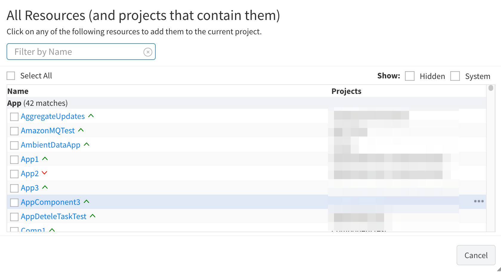

ファイルとして出力はできませんが、以下の方法で間接的に出力できます。
1. [孤立した Resource] (メニュー右上の歯車 >> 孤立した Resources の表示) ですべての必要な Resource が Project に含まれていることを確認する。
1. Project をエクスポートする。
1. Project の zip を解凍し、ディレクトリとファイル一覧を元にリスト化する。
   スクリプト例）
   ```sh
   # 解凍したディレクトリのルートで、tree と jq コマンドを使って整形
   tree -J | jq -r  ' .[0] | .contents[] | select(.type == "directory") | .contents[].name as $name | [.name,  $name] | @csv ' > resources.csv
   ```

### Namespace 間でイベントを連携させたい<a id="Namespace間でイベントを連携させたい"></a>
以下のいずれかの方法で可能です。
- 外部のブローカー (AmazonMQ、Azure EventHubs など) を経由してイベントを連携する。この方法は Namespace 間がもっとも簡易的、かつ疎結合になります。
- Vantiq Catalog 経由でイベントを連携する。
- Vantiq Node (デプロイ >> Nodes) にて、外部の Namespace を Node として設定しておく。VAIL の中で Procedure の呼び出しや Topic への Publish を行う時、`processed by` 句により、外部 Namespace の Resource を指定する。

### アクセストークンを定期的にリフレッシュさせたい<a id="アクセストークンを定期的にリフレッシュさせたい"></a>
アクセストークンが有効なうちに、[アクセストークンを生成する API](https://dev.vantiq.co.jp/docs/system/resourceguide/index.html#tokens) から新トークンを取得し、保持しておく仕組みを、Vantiq と連携する外部アプリケーション側で実装します。

### Vantiq から外部への API 呼び出しの数を制限したい<a id="Vantiqから外部へのAPI呼び出しの数を制限したい"></a>
一般的には Vantiq 側ではなく、外部サービスへの接続を仲介する API Gateway にてクォータを設定します。

### Source のリクエストヘッダー等に使うクレデンシャルを安全に保管したい<a id="Sourceのリクエストヘッダー等に使うクレデンシャルを安全に保管したい"></a>  
`Secret` (管理 >> Advanced >> Secrets) を定義し、[Secret への参照を Source に埋め込み](https://dev.vantiq.co.jp/docs/system/sources/source/index.html#using-secrets) ます。Secret は一度作成すると内容を閲覧することができず、エクスポートもされないため、安全に運用することができます。


### 自己証明書を使用したい<a id="自己証明書を使用したい"></a>
Source の Property 定義の中で、trustAll プロパティを設定します。
Source の [Properties] タブで [Config を JSON として編集] を選択し、[JSON の設定] で `clientOptions.trustAll : true` を追加する。
```json
{
  "clientOptions": {
    "trustAll": true
  }
}
```

### アクセストークンを一元管理したい<a id="アクセストークンを一元管理したい"></a>
Organization Admin はそれぞれの Namespace においてすべてのアクセストークンを参照できます。Organization Admin が各 Namespace へアクセスできるよう予め招待しておく必要があります。

### Namespace ごとに環境変数を使いたい<a id="Namespaceごとに環境変数を使いたい"></a>
環境変数の機能はありません。以下のいずれかの方法を用いることになります。
- 環境変数用に `Type` を作成する。この Type は運用 (Project のエクスポートやインポートなど) する中で他の Resource (アプリケーションのロジックを構成する Resource) とは別に管理します。
- Project を `Assembly` に変換し、環境変数的な要素 (外部サービスの URL など) をパラメーター化し、デプロイ時に設定できるようにします。

### Vantiq 上のログをファイルに出力したい<a id="Vantiq上のログをファイルに出力したい"></a>
- **ログ**:  メニュー [表示] >> [レコードの検索] >> Type で `system.logs` を選択 >> クエリの実行 >> ダウンロード
- **監査ログ**: メニュー [表示] >> [レコードの検索] >>  Type で `system.audits` を選択 >> クエリの実行 >> ダウンロード
- **エラーログ**: メニュー [表示] >> [レコードの検索] >> [System Type の表示] をチェック >> Type で `arsRuleSnapshot` を選択 >> クエリの実行 >> ダウンロード

### 開発中のNamespaceに他のユーザーを招待したい<a id="invite_users_to_ns"> </a>

Namespaceの管理者（= Namespaceの作成者）は、***登録済み*** のユーザーを招待することができます。（未登録のユーザーを招待する場合、まずOrganization Adminに[ユーザー登録の招待](../../1-day-workshop/docs/jp/0-01_Prep_for_Account.md)を依頼してください。）

メニュー [管理] >> Advanced >> 保留中の招待 >> New をクリックする。
以下を設定の上、[招待を送信]ボタンを押下する。
- Invite Destination: 招待するユーザーのメールアドレス
- Invite Source: "Default"でよい
- Priviledges: `User` / `Developer` - 開発者であれば`Developer`

### Vantiq ServerのGlobal IPを調べたい<a id="vantiq_global_ip"> </a>

Vantiq ServerのGlobal IP（Internet GatewayのGlobal IP)を以下の方法で調べることができます。

1. 以下のSourceを作成する。
   - name: `IfConfigSource`
   - type: `REMOTE`
   - url: `https://ifconfig.me`
2. Procedureで以下を実行する
  ```vail
  var ip = select one from source IfConfigSource
  ```

### 発生したVantiqアプリケーションのエラーを把握したい<a id="error_notify"></a>
Vantiq アプリケーションでは通常、[IDE上](https://dev.vantiq.co.jp/docs/system/ide/index.html#unseen-errors)でエラー発生の状態を確認します。

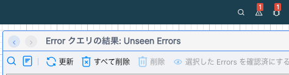

しかしながら、Vantiq IDEへのログインや操作自体がサーバへの負荷を高め、稼働中の処理に影響を及ぼすことも考えられます。
また、アプリケーションのエラー監視という観点では、運用者が自発的にIDEからエラーの発生状況を把握するのではなく、エラーが発生した際に通知を受け取ることが望ましいと考えられます。

一つの方法として、以下のようなProcedure を作成し、[定期的に実行する](#定期的に動く処理を実装したい)定期的に実行することで、エラーの発生状況を把握することができます。

```vail
PROCEDURE NotifyAppError()

var errorLogs = SELECT * FROM ArsRuleSnapshot
WHERE hasBeenSeen == false

var targetNamespace = Context.namespace() 
var targetEnv = Context.serverUri() 

// 送信先メールアドレス
var toAddress = "sysadmin@exanple.com"
// 送信元メールアドレス
var fromAddress = "notify@exanple.com"
// 送信内容
var subject = "【VANTIQ Nitification】 Some errors are occurring in your namespace"
var body = "<p>Some errors are occurring in your namespace.</p>"
body += "<p>Please login to Vantiq IDE and check the error message.</p>"

body += "<div  style = \"border: solid 3px #000\">" + "Server URL: " + targetEnv + "<br>"
body += "Namespace: " + targetNamespace +  "<br>"
body += "Error Count: " + length(errorLogs) + "</div>"


// 送信
PUBLISH { html: body } TO SOURCE AppErrorNotifyEmailServer USING { from: fromAddress, to: toAddress, subject: subject } 
```

`ScheduledEvent` で定期的にイベントを発生させ、上記のProcedure を実行します。
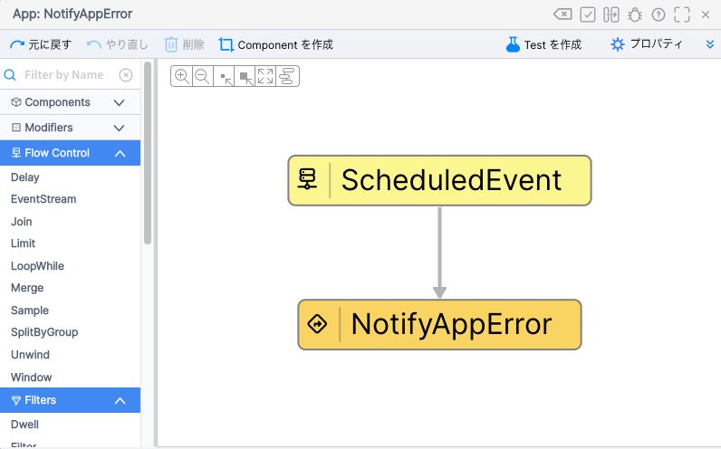

サンプルのProcedureでは、`AppErrorNotifyEmailServer` というSourceを作成し、メール送信を行っています。
必要に応じSourceを変更することで、SlackやMicrosoft Teamsへの通知なども実現できます。

### リソースのステータスをまとめて制御したい<a id="activate_resources"></a>

以下の2つの方法で、まとめて制御することができます。

1.  [Active Resource Control Center](https://dev.vantiq.co.jp/docs/system/namespaces/index.html#active-resource-control-center) で対象を確認可能（v1.35〜）
2.  REST APIでActive状態を切り替える

```sh
curl --location --request POST 'https://dev.vantiq.co.jp/api/v1/resources/sources' \
--header 'Authorization: Bearer xxx' \
--header 'Content-Type: application/json' \
--data-raw '{  "name": "JsonPlaceHolder",  "active": true}'
111
```

VAILからActive状態を切り替え
```js
var operation = {    "op": "update",    "resourceName": "collaborationtypes",    "object": {         "name": "sampleApp",        "active": true     }
}
var result = ResourceAPI.executeOp(operation)
```