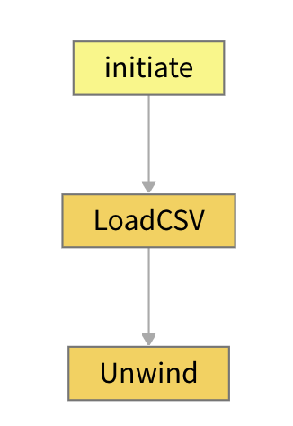

# Vantiqアプリ開発 逆引きリファレンス

Vantiqアプリケーション開発時によく使われるパターンについて実装方法を説明します。

## TOC
- [Source 関連](#Source関連)
  - [どのようなSourceを作成すればよいか](#どのようなSourceを作成すればよいか)
  - [ひとつのSourceの定義でさまざまなWebサービスを呼び分けしたい](#ひとつのSourceの定義でさまざまなWebサービスを呼び分けしたい)
  - [CSV ファイルを入力したい](#CSVファイルを入力したい)
  - [複数のトピックをまとめてサブスクライブしたい](#複数のトピックをまとめてサブスクライブしたい)
- [アプリケーション実装関連](#アプリケーション実装関連)
  - [前後のイベント情報を蓄積して処理したい](#前後のイベント情報を蓄積して処理したい)
  - [デバッグしたい](#デバッグしたい)
  - [イベントが高頻度すぎてバッジが更新しなくなったが、件数を確認したい](#イベントが高頻度すぎてバッジが更新しなくなったが件数を確認したい)
  - [一定時間イベントが発生しない場合にアラートを出したい](#一定時間イベントが発生しない場合にアラートを出したい)
  - [3つ以上のストリームデータを効率よく結合したい](#3つ以上のストリームデータを効率よく結合したい)
  - [イベントに紐づけるマスタデータの欠損を、任意の内容のエラーでログ用のDBに送信して残したい](#イベントに紐づけるマスタデータの欠損を任意の内容のエラーでログ用のDBに送信して残したい)
  - [条件分岐を書きたい](#条件分岐を書きたい)
  - [動的な条件でfilterしたい](#動的な条件でfilterしたい)
  - [いらないイベントを無視したい](#いらないイベントを無視したい)
  - [テスト用のイベントを簡易的に使いたい](#テスト用のイベントを簡易的に使いたい)
  - [定期的に動く処理を実装したい](#定期的に動く処理を実装したい)
  - [JSONの配列になっている、もしくはJSONの配列を含む入力イベントを処理したい](#JSONの配列になっているもしくはJSONの配列を含む入力イベントを処理したい)
  - [定数を使いたい](#定数を使いたい)
  - [エラーが発生した場合に再送したい](#エラーが発生した場合に再送したい)
  - [プロパティが入れ子になっている複雑な Type を定義したい](#プロパティが入れ子になっている複雑なTypeを定義したい)
  - [一定時間経過すると自動的に古いレコードを消去したい](#一定時間経過すると自動的に古いレコードを消去したい)
  - [複数のアプリケーションで使用できる共通なロジックを実装したい](#複数のアプリケーションで使用できる共通なロジックを実装したい)
  - [ある位置情報を元に、最寄りのオブジェクトを検索したい](#ある位置情報を元に最寄りのオブジェクトを検索したい)
  - [アプリケーションを再利用したい](#アプリケーションを再利用したい)
  - [Typeへの書き込みでクレジットエラーが出るのを回避したい](#Typeへの書き込みでクレジットエラーが出るのを回避したい)
- [構成管理関連](#構成管理関連)
  - [作ったものをテンプレートとして配布したい](#作ったものをテンプレートとして配布したい)
  - [複数人で共同で作業したい](#複数人で共同で作業したい)
  - [リソースの一覧を csv で出力したい](#リソースの一覧をcsvで出力したい)
  - [Namespace間でイベントを連携させたい](#Namespace間でイベントを連携させたい)
  - [アクセストークンを定期的にリフレッシュさせたい](#アクセストークンを定期的にリフレッシュさせたい)
  - [Vantiq から外部への API 呼び出しの数を制限したい](#Vantiqから外部へのAPI呼び出しの数を制限したい)
  - [Sourceのリクエストヘッダー等に使うクレデンシャルを安全に保管したい](#Sourceのリクエストヘッダー等に使うクレデンシャルを安全に保管したい)
  - [自己証明書を使用したい](#自己証明書を使用したい)
  - [アクセストークンを一元管理したい](#アクセストークンを一元管理したい)
  - [Namespaceごとに環境変数を使いたい](#Namespaceごとに環境変数を使いたい)
  - [Vantiq 上のログをファイルに出力したい](#Vantiq上のログをファイルに出力したい)


## Source関連<a id="Source関連"></a>

### どのようなSourceを作成すればよいか<a id="どのようなSourceを作成すればよいか"></a>

Vantiqシステムを1つの箱と捉えると、外部との入出力を行う`Source`と、`Source`をつなぎロジックを実装する`App`で主に構成される、と見ることができます。


外部と連携したいデータの種類ごとに以下の項目を整理します。それぞれがSourceの候補となります。（REST(POST), WebSocketについては`source`ではなく`topic`を用います。）
1. データのフォーマット
2. データの頻度
3. データの用途（マスタ、テレメトリ、時系列）
4. データ連携のプロトコル (REST, MQTT, AMQP, Kafka etc.)

データ連携のプロトコル種類により設定を行います。
1. 入力（ [REST(POST)](../../1-day-workshop/docs/jp/a08-Lab05_VANTIQ_REST_API.md), [REST(Polling)](https://dev.vantiq.co.jp/docs/system/tutorials/sourcetutorial/index.html#source) )
1. 出力 ( [REST(POST)](../../1-day-workshop/docs/jp/../../1-day-workshop/docs/jp/a08-Lab05_VANTIQ_REST_API.md) )
1. 双方向 ([WebSocket, MQTT, AMQP, Kafka](https://dev.vantiq.co.jp/docs/system/sources/source/index.html))

### ひとつのSourceの定義でさまざまなWebサービスを呼び分けしたい<a id="ひとつのSourceの定義でさまざまなWebサービスを呼び分けしたい"></a>
固定のRequest URIと可変のPathを組み合わせてURLを生成します。Pathの指定方法（具体的には"/"から始まるかどうか）によりURL算出結果が変わるので注意してください。
[パスの設定（REMOTE Source）](./data_sending.md#note-path)

### CSV ファイルを入力したい<a id="CSVファイルを入力したい"></a>
`Procedure`でCSVファイルをJSON配列に変換し、 `unwind`で配列を要素ごとにばらしてイベント処理に適した形にします。


以下のVAILサンプルはRemote Sourceを使ってCSVデータをフェッチしている。
```vail
PROCEDURE loadCSV()

var path = "xxxxx.csv"
var csv = SELECT ONE FROM SOURCE SampleCSVSource WITH path=path

// CSV file -> CSV records
var lines = split(csv, "\r\n")

// extract header
var header = split ( lines[0], ",")
var recs = slice(lines, 1)

// Transform CSV to JSON
var json_recs = MAP (rec in recs) {
    var json_rec = {}
    var values = split(rec, ",")
    for i in range(0, length(header)) {
   		json_rec[header[i]] = values[i]
	}
	return json_rec
}
```

### 複数のトピックをまとめてサブスクライブしたい<a id="複数のトピックをまとめてサブスクライブしたい"></a>
1. mqttやamqtのプロトコルにおいてサポートされるワイルドカード指定でtopicをサブスクライブする。


1. topic名を識別する必要がある場合、RULEを記述し、メッセージ変数`msg`から`msg.topic`プロパティを取得して後続の処理に渡す。

```vail
RULE SensorMQTTWildcard
when
  EVENT OCCURS ON "/sources/Sensors" as msg

log.debug("Received from Sensors, topic: {}, payload: ", [msg.topic, msg.value])

var payload = msg.value[0]
payload.topicname = msg.topic

publish payload to TOPIC "/downstream/sensor/telemetry"
```

## アプリケーション実装関連<a id="アプリケーション実装関連"></a>

### 前後のイベント情報を蓄積して処理したい<a id="前後のイベント情報を蓄積して処理したい"></a>

汎用的な用途には、[`AccumulateState`](https://dev.vantiq.co.jp/docs/system/apps/index.html#accumulate-state) taskを使います。
もしくは特定の用途であれば、[`Window`](https://dev.vantiq.co.jp/docs/system/apps/index.html#window), [`ComputeStatistics`](https://dev.vantiq.co.jp/docs/system/apps/index.html#compute-statistics)を使用します。


### デバッグしたい<a id="デバッグしたい"></a>
View Task Events, Autopsy, Profilingなどを活用します。
[デバッグの流れ（デモを通してデバッグの基礎を学ぶ）](./debug_demo.md)

### イベントが高頻度すぎてバッジが更新しなくなったが、件数を確認したい<a id="イベントが高頻度すぎてバッジが更新しなくなったが件数を確認したい"></a>
Grafanaを使用する。
管理 >> Grafanaから、目的のダッシュボードを選択する。
- App Execution - App Builder `App`の処理状況

- Procedure Execution - `Procedure`の処理状況

- Service Execution - `Service`内の`Procedure`の処理状況

- Rule Execution - `Rule`の処理状況


各ダッシュボードとも、処理件数（単位は ops/s)、処理時間統計（単位は milliseconds/seconds/minutes)で表示される。


### 一定時間イベントが発生しない場合にアラートを出したい<a id="一定時間イベントが発生しない場合にアラートを出したい"></a>
[`missing`](https://dev.vantiq.co.jp/docs/system/apps/index.html#missing)タスクを使用します。missingは一定時間入力がない場合にイベントが発火します。

### 3つ以上のストリームデータを効率よく結合したい<a id="3つ以上のストリームデータを効率よく結合したい"></a>
以下のいずれかの方法で実装します。
- [`join`](https://dev.vantiq.co.jp/docs/system/apps/index.html#join)を使います。
- `AccumulateState`を使い、一連のイベントのプロパティを同一イベントにトランスポーズします。


`AccumulateState`タスクの中で、`state`変数は前回の処理の状態を保持しています。新たな入力である`event`変数と合わせるように処理します。
```vail
if (!state) {
    // if this is the first time, initialize it.
    state = {
        machineID : "",
        temp: 0.0,
        humidity: 0.0,
        controlCode : "0"        
    }
}

if (event.controlCode) {
    state.controlCode = event.controlCode
}
if (event.temp) {
    state.temp = event.temp
}
if (event.humidity) {
    state.humidity = event.humidity
}
state.timestamp = event.timestamp
state.machineID = event.machineID
```


### イベントに紐づけるマスタデータの欠損を、任意の内容のエラーでログ用のDBに送信して残したい<a id="イベントに紐づけるマスタデータの欠損を任意の内容のエラーでログ用のDBに送信して残したい"></a>
SELECT EXACTLY ONE + Try-catch + catchしたらPUBLISH

### 条件分岐を書きたい<a id="条件分岐を書きたい"></a>
2つ`Filter`を使い、それぞれが排他となるように条件を記述します。


### 動的な条件でfilterしたい<a id="動的な条件でfilterしたい"></a>
`Filter`の条件をVAILで記述します。`Filter`を始めとするほとんどのタスクは、直前のタスクから渡されたイベント情報を`event`という変数で受けており、イベントごとの固有の値を条件に用いることができます。


### いらないイベントを無視したい<a id="いらないイベントを無視したい"></a>
以下のいずれかの方法で行います。
- `Filter`を使う。
- `EventStream`のConditionを指定することで、余計なイベントがそもそも`App`に入力されないようにする。


### テスト用のイベントを簡易的に使いたい<a id="テスト用のイベントを簡易的に使いたい"></a>
[`Event Generator`](https://dev.vantiq.co.jp/docs/system/eventgenerators/index.html)を使って簡単な設定で`Source`,`Topic`,`Type`に対して任意のイベントを発生させることができます。

### 定期的に動く処理を実装したい<a id="定期的に動く処理を実装したい"></a>
以下のいずれかの方法で行います。
- `ScheduledEvent`を作成し、任意の`Topic`に対してイベントを発生させます。後続のタスクで任意の処理を実装できます。


- 外部サービスへの定期的なポーリングの場合、種別が`Remote`の`Source`を作成、 Pollingを設定することができます。

`App`の`EventStream`でポーリング結果をイベントとして受け取ります。

(ただしV1.33現在、この方法では固定のURLに対するPollingのみ可能)

### JSONの配列になっている、もしくはJSONの配列を含む入力イベントを処理したい<a id="JSONの配列になっているもしくはJSONの配列を含む入力イベントを処理したい"></a>
[`unwind`](https://dev.vantiq.co.jp/docs/system/apps/index.html#unwind)タスクを使用すると、入力イベント全体、もしくは一部が配列になっているプロパティを指定し、個別のイベントとしてバラすことができます。バラされたイベントはそれぞれ並列処理されるので、処理時間の短縮にも有効です。

### 定数を使いたい<a id="定数を使いたい"></a>
VAILでVantiqは定数を使うことはできません。Typeなどに保存した定数値を返すProcedureを記述することで実現します。

### エラーが発生した場合に再送したい<a id="エラーが発生した場合に再送したい"></a>
送信側において、try ~ catch ~ finallyで再送処理を実装します。

### プロパティが入れ子になっている複雑な Type を定義したい<a id="プロパティが入れ子になっている複雑なTypeを定義したい"></a>
以下のいずれかの方法で行います。
- Propertyの追加でTypeに`Object`を指定することで、任意のJSONデータを格納するプロパティを定義できます。
- Propertyの追加でTypeに`Type`を指定することで、入れ子の構造を定義できます。

### 一定時間経過すると自動的に古いレコードを消去したい<a id="一定時間経過すると自動的に古いレコードを消去したい"></a>
TypeのAdvanced設定で、`exipires after`を設定します。

### 複数のアプリケーションで使用できる共通なロジックを実装したい<a id="複数のアプリケーションで使用できる共通なロジックを実装したい"></a>
以下のいずれかの方法で実現します。いずれの方法においても、意図しないリソース名の競合を避けるため、`package`を指定しておくのが無難です。
- 最も簡易的にはプロジェクトをエクスポートして配布します。
- 共通処理を`Service`として実装し、Vantiq Catalogを通じて公開します。

### ある位置情報を元に、最寄りのオブジェクトを検索したい<a id="ある位置情報を元に最寄りのオブジェクトを検索したい"></a>
- 比較したい情報を`GeoJSON`の`Polygon`や`Point`型にしておき、[`geoNear`, `geoWithin`などの演算子を使ったクエリ](https://dev.vantiq.co.jp/docs/system/rules/index.html#select)を実装します。
- 簡易的にはprocedureでも実装できます。

### アプリケーションを再利用したい<a id="アプリケーションを再利用したい"></a>
- App Builderの一部を汎用的に再利用するなら[`App Component`](https://dev.vantiq.co.jp/docs/system/apps/index.html#components)を作成します。
- さまざまなリソースを再利用する場合は、対象のリソースをプロジェクトとしてエクスポートするか、Assembly化します。

### Typeへの書き込みでクレジットエラーが出るのを回避したい<a id="Typeへの書き込みでクレジットエラーが出るのを回避したい"></a>
バルク更新を使い、Typeへのアクセス数を減らす。

```vail
// Save to Type (By Bulk) with batch of 1000 records
// recs: array of json data
var saveRecs = []
for rec in recs {
    push (saveRecs, rec)
    if length(saveRecs) == 1000 {
        INSERT XXXXXXXX(saveRecs)
        saveRecs = []
    }
}
if length(saveRecs) > 0 {
    INSERT XXXXXXXX(saveRecs)
}
```

## 構成管理関連<a id="構成管理関連"></a>

### 作ったものをテンプレートとして配布したい<a id="作ったものをテンプレートとして配布したい"></a>
以下のいずれかの方法で配布します。
- 対象のリソースをプロジェクトとしてエクスポートする。
- プロジェクトをAssemblyに変換し、Vantiq Catalogを通じて配布する。

### 複数人で共同で作業したい<a id="複数人で共同で作業したい"></a>
基本は作業者ごとにNamespaceを作成し、それぞれ作業を行うことを推奨します。 同一Namespaceで使用した場合、以下の点に留意する必要があります。
1. 各作業者ごとにプロジェクトを定義し、作業範囲を限定することで互いの更新が干渉しないようにする。
1. namespace全体のエラーが見えてしまう。自分の作業範囲外のエラーが見えてしまうことで作業の支障になる可能性がある。

### リソースの一覧を csv で出力したい<a id="リソースの一覧をcsvで出力したい"></a>
namespaceが含むリソースの一覧はShow All resources(メニュー右上の歯車 >> すべてのResourcesの表示)から確認できます。


ファイルとして出力はできませんが、以下の方法で間接的に出力できます。
1. Show Orphaned Resources (メニュー右上の歯車 >> 孤立したResourcesの表示) ですべての必要なリソースがプロジェクトに含まれていることを確認する。
1. プロジェクトをエクスポートする。
1. プロジェクトのzipを解凍し、ディレクトリとファイル一覧を元にリスト化する。
   スクリプト例）
   ```sh
   # 解凍したディレクトリのルートで、treeとjqコマンドを使って整形
   tree -J | jq -r  ' .[0] | .contents[] | select(.type == "directory") | .contents[].name as $name | [.name,  $name] | @csv ' > resources.csv
   ```

### Namespace間でイベントを連携させたい<a id="Namespace間でイベントを連携させたい"></a>
以下のいずれかの方法で可能です。
- 外部のブローカー(AmazonMQ, Azure EventHubsなど)を経由してイベントを連携する。この方法はNamespace間がもっとも簡易的、かつ疎結合になります。
- Vantiq Catalog経由でイベントを連携する。
- Vantiq Node (デプロイ >> Nodes) にて、外部のNamespaceをNodeとして設定しておく。VAILの中でprocedureの呼び出しやTopicへのPublishを行う時、`processed by`句により、外部Namespaceのリソースを指定する。

### アクセストークンを定期的にリフレッシュさせたい<a id="アクセストークンを定期的にリフレッシュさせたい"></a>
アクセストークンが有効なうちに、[アクセストークンを生成するAPI](https://dev.vantiq.co.jp/docs/system/resourceguide/index.html#tokens)から新トークンを取得し、保持しておく仕組みを、Vantiqと連携する外部アプリケーション側で実装します。

### Vantiq から外部への API 呼び出しの数を制限したい<a id="Vantiqから外部へのAPI呼び出しの数を制限したい"></a>
一般的にはVantiq側ではなく、外部サービスへの接続を仲介するAPI Gatewayにてクォータを設定します。

### Sourceのリクエストヘッダー等に使うクレデンシャルを安全に保管したい<a id="Sourceのリクエストヘッダー等に使うクレデンシャルを安全に保管したい"></a>  
`Secret` (管理 >> Advanced >> Secrets)を定義し、[Secretへの参照をSourceに埋め込み](https://dev.vantiq.co.jp/docs/system/sources/source/index.html#using-secrets)ます。Secretは一度作成すると内容を閲覧することができず、エクスポートもされないため、安全に運用することができます。


### 自己証明書を使用したい<a id="自己証明書を使用したい"></a>
SourceのProperty定義の中で、trustAllプロパティを設定します。
SourceのPropertiesをEdit Config as JSONで開く >> `clientOptions.trustAll : true`を追加する。
```json
{
  "clientOptions": {
    "trustAll": true
  }
}
```

### アクセストークンを一元管理したい<a id="アクセストークンを一元管理したい"></a>
Organization AdminはそれぞれのNamespaceにおいてすべてのアクセストークンを参照できます。Organization Adminが各Namespaceへアクセスできるよう予め招待しておく必要があります。

### Namespaceごとに環境変数を使いたい<a id="Namespaceごとに環境変数を使いたい"></a>
環境変数の機能はありません。以下のいずれかの方法を用いることになります。
- 環境変数用に`Type`を作成する。このTypeは運用（プロジェクトエクスポートやインポートなど）する中で他のリソース（アアプリケーションのロジックを構成するリソース）とは別に管理します。
- プロジェクトを`Assembly`に変換し、環境変数的な要素（外部サービスのURLなど）をパラメータ化し、デプロイ時に設定できるようにします。

### Vantiq 上のログをファイルに出力したい<a id="Vantiq上のログをファイルに出力したい"></a>
- **ログ**:  メニュー [表示] >> [レコードの検索] >> Typeで `system.logs` を選択 >> クエリの実行 >> ダウンロード
- **監査ログ**: メニュー [表示] >> [レコードの検索] >>  Typeで`system.audits` を選択 >> クエリの実行 >> ダウンロード
- **エラーログ**: メニュー[表示] >> [レコードの検索] >> [System Typeの表示] をチェック >> Typeで`arsRuleSnapshot`を選択 >> クエリの実行 >> ダウンロード
