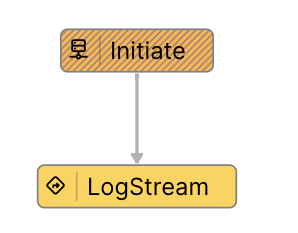
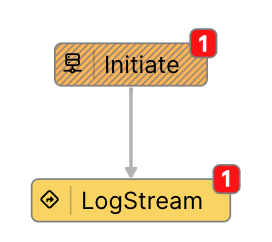

# Vantiq UDP Source

Vantiq UDP Source は Vantiqが標準で対応していないUDPでのメッセージ送受信を可能にします。

## 環境セットアップ

大まかな流れは手順は以下となります。

1. Vantiqサーバーに `UDP` Sourceを作成する
2. Vantiq extension Source をGithubリポジトリから取得し、UDP Sourceをビルドする
3. UDP Source にVantiqサーバーとの接続情報を設定し、実行する

### 前提

- Vantiq サーバー
  - 開発者用 Namespace を作成済みであること
- UDP Source 実行環境
  - Java 11 以上がインストールされていること
- Vantiq CLI 実行端末
  - [Vantiq CLI](./cli-quick-reference.md) がインストールされ使用可能であること

本説明では以下の環境での実行例を示します。

- Vantiq サーバー :
  - dev.vantiq.com
- UDP Source実行環境 / Vantiq CLI実行端末 :
  - Macbook Pro M1
  - Java 11

#### Vantiqサーバー

1. 開発者用 Namespace にてアクセストークンを生成します。 
   メニュー >> Admminister >> Advanced >> Access Token 
   生成したアクセストークンは、次ステップのCLI、およびUDP Source実行環境の`server.config`で使用するため、控えておきます。

1. 新しい Source Type `UDP`を追加します。
   1. [`udpImpl.json`](https://github.com/Vantiq/vantiq-extension-sources/blob/master/udpSource/src/test/resources/udpImpl.json) をダウンロードして、CLIを実行するディレクトリに置きます。

   1. Vantig CLI から以下のコマンドを実行します。
   （[参照](https://github.com/Vantiq/vantiq-extension-sources/blob/master/pythonExecSource/docs/Usage.md#defining-the-source-in-vantiq)）

        ```sh
        vantiq -s <profileName> load sourceimpls udpImpl.json
        ```

        もしくは

        ```sh
        vantiq -b https://<host> -t <ACCESS_TOKEN> load sourceimpls udpImpl.json
        ```

   1. メニュー Add >> Source >> New Source で、Source新規作成 ペインを開き、Source Type: `UDP` が追加されていることを確認します。

1. Sourceを作成します。指定するパラメータは以下のとおりです。

   - Source Type: `UDP`  （前ステップで作成したもの）
   - Source Name: 任意の名前 （ただし後のステップでUDP Source実行環境の `server.config` で指定したものと一致させること。)
   Sourceを作成した後、UDP Source実行環境から接続要求があると、直ちに接続が確立します。

1. Source の Properties を設定します。

    ```json
    {
        "udpSourceConfig": {
            "incoming": {
                "receiveAllAddresses": true,
                "passPureMapIn": true
            }
        }
    }
    ```

    今回は、全てのアドレスからのメッセージを受信し、受信したJSONメッセージをそのまま受け取る設定です。その他の設定に関しては、[ドキュメント](https://github.com/Vantiq/vantiq-extension-sources/tree/master/udpSource#source-configuration-document)を参照してください。

#### UDP Source 実行環境

1. [Vantiq Extension Source](https://github.com/Vantiq/vantiq-extension-sources/tree/master) からリポジトリをpullします。 `git clone` もしくは、zipでダウンロードして展開します。

1. `<リポジトリをダウンロードした場所>/vantiq-extension-sources` 直下に `gradle.properties` を作成し、以下の内容を記述します。

    ```properties
    dockerRegistry=docker.io
    pathToRepo=/your-namespace/
    ```

    UDP SourceのビルドではDockerイメージの作成はスキップされますが、`gradle.properties` と必須プロパティの設定が必要です。設定内容はダミーでも問題ありません。

1. `<リポジトリをダウンロードした場所>/vantiq-extension-sources` に移動し、`./gradlew udpSource:assemble` を実行します。

1. `<リポジトリをダウンロードした場所>/vantiq-extension-sources/udpSource/build/distributions` に実行ファイルを含む zip と tarファイルが作成されているので、いずれかを利用します。このファイルに実行ファイルが含まれます。

    ```sh
    udpSource
    ├-- build
        ├-- distributions
            ├-- udpSource.zip    # これを任意のディレクトリで解凍する
            ├-- udpSource.tar
    ```

1. `udpSource` を展開すると以下が得られます。これ以降の説明は`udpSource` を起点とします。

    ```sh
    .
    ├-- udpSource
        ├-- bin
            ├-- udpSource       # shell
            ├-- udpSource.bat   # bat
            ...
    ```

1. `server.config` を作成し、`udpSource` ディレクトリと同列に配置します。

    ```properties
    targetServer = https://dev.vantiq.com
    authToken = P91-WB0Gjs1-C7iM3VdYG70CeFRzPllS4tU_xxxxxxx=
    sources = jp.co.vantiq.test.udp.UDPSource  
    ```

    `targetServer` : Vantiqサーバーのホスト
    `authToken` : アクセストークン。 `Vantiqサーバーのアクセストークンを生成する` ステップにて生成したもの。
    `sources` : Sourceの名前。`Vantiqサーバーの Source を作成する` ステップにて指定した名前。

1. `./udpSource/bin/udpSource` を実行すると起動します。 Sourceと接続を確立します。

### 動作確認
1．Vantiq Namespace に動作確認用の App を作成します。Event Stream に作成したUDP Sourceを指定し、受信したメッセージをLog出力するようにします。


1. 以下のPythonスクリプトを作成し、UDP Source実行環境に送信します。

    ```python
    import socket
    import json
    import datetime
    import uuid

    # 送信先のIPアドレスとポート番号
    UDP_IP = "127.0.0.1"  # ローカルホスト
    UDP_PORT = 3141

    current_time = datetime.datetime.now().strftime("%Y%m%d%H%M%S%f")[:-3]
    # 送信するJSONデータ
    data = {
        "time": current_time,
        "id": uuid.uuid4().hex,
    }

    # JSONデータを文字列に変換
    MESSAGE = json.dumps(data)

    # ソケットを作成
    sock = socket.socket(socket.AF_INET, socket.SOCK_DGRAM)

    # メッセージを送信
    sock.sendto(MESSAGE.encode(), (UDP_IP, UDP_PORT))
    ```

1. Pythonスクリプトを実行し、VantiqアプリケーションのEvent Streamでメッセージが受信できていることを確認します。


```log
Invocation ID : d90d8034-4faa-11ef-9317-321530331878
Timestamp : 2024-08-01 11:07:47.635
Sequence : 0
Level : INFO
Message : LogStream Logging Event: {time=20240801110743307, id=7dcdb1930c2d4d4da598dbf3563b1cc3} produced by task: Initiate in app TestApp

```

## Reference

- [Vantiq UDP Source Readme](https://github.com/Vantiq/vantiq-extension-sources/blob/master/udpSource/README.md)