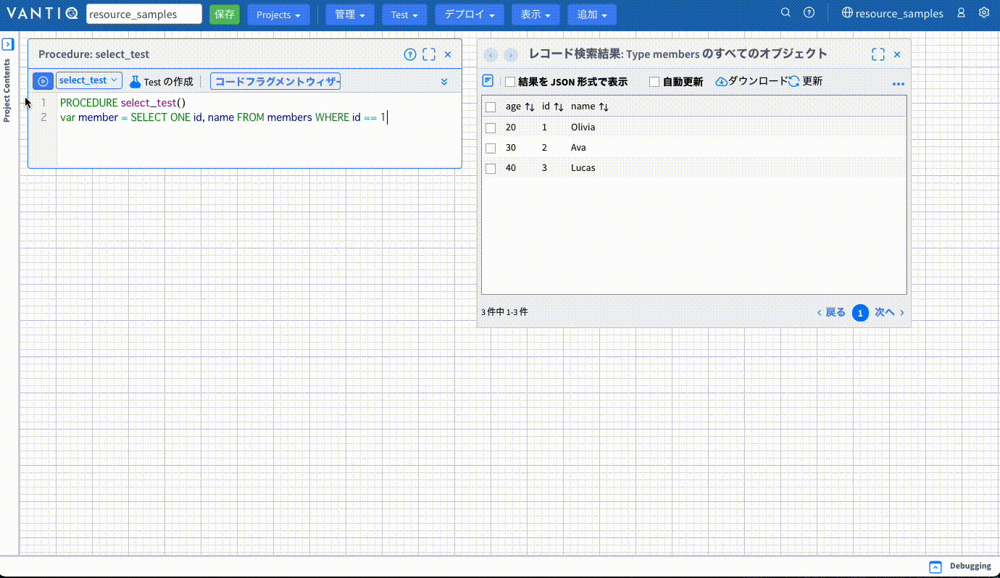
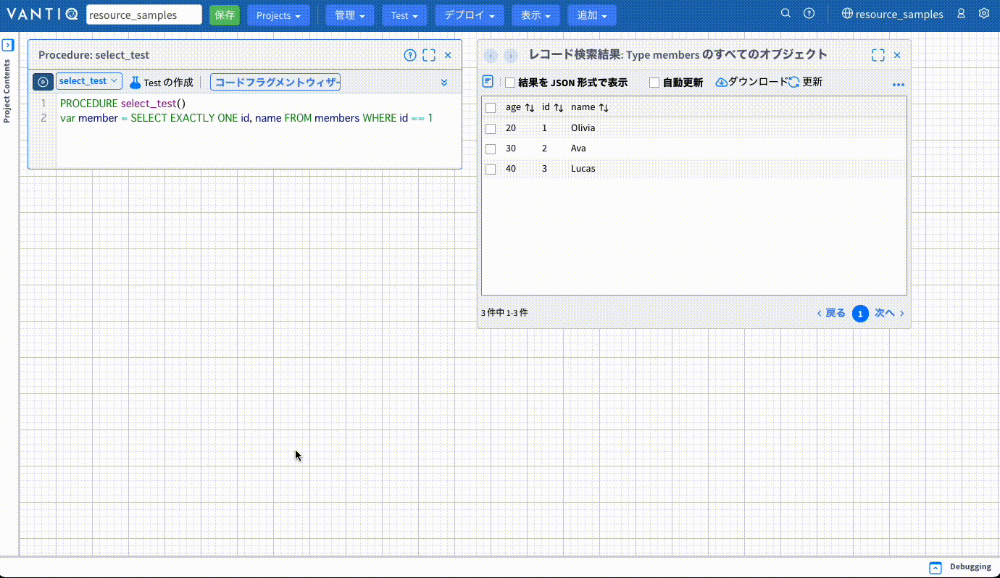
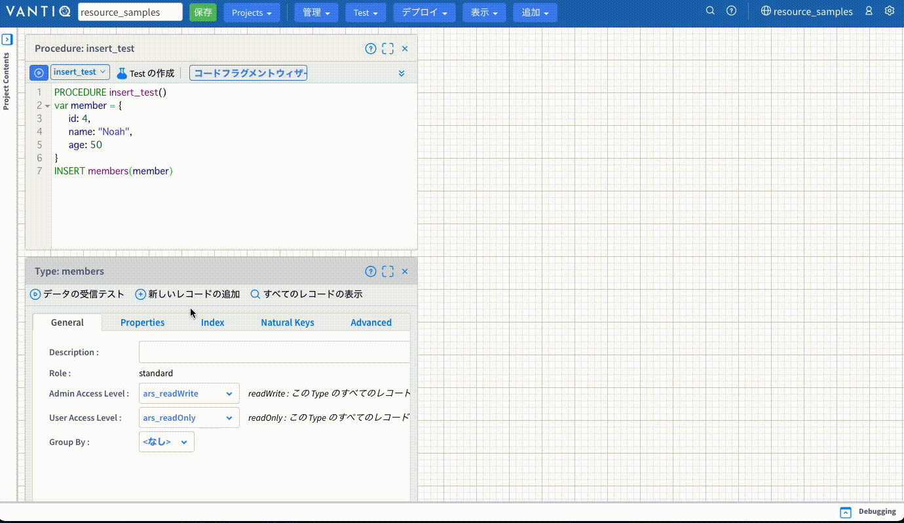
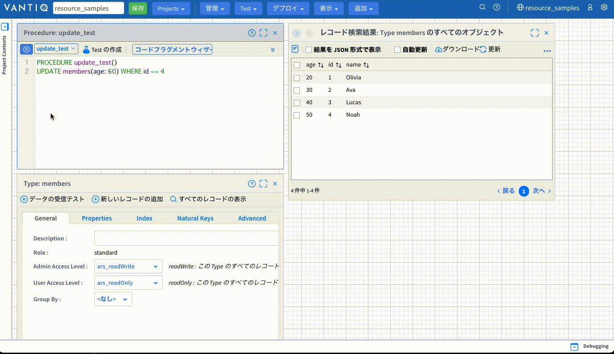
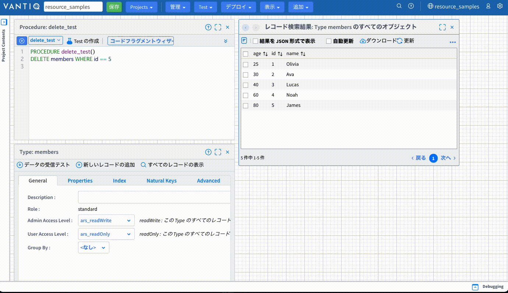
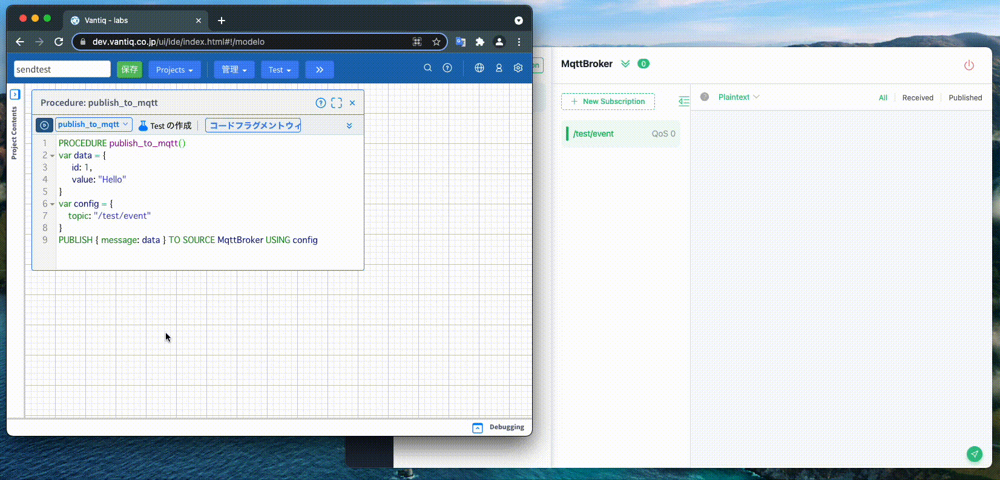

# VAIL 入門

Vantiqアプリケーション開発時に使用する言語である`VAIL`の基本についての説明です。

詳細事項に関しては[リファレンス](https://dev.vantiq.co.jp/docs/system/rules/index.html)をご参照ください。

## 基本事項

```VAIL
// 1行ずつ、
// コメントを書くことができます

/*
複数行まとめてコメントを書くことができます
1. xxxxxxxx
2. yyyyyyy
3. wwwww
*/


// 変数の宣言方法
var a // varを使います。
var b = 0 // 宣言と値の割り当てを同時に行うこともできます


// JavaScript likeですが";"は使用しません
var c = "Hello!"
```

## データ型
```VAIL
// String
var a = "Hello"

// Interger
var b = 1

// Real
var c = 1.23

// Boolean
var d = true

// DateTime
var e = now()

// Object
// keyに""があってもなくても動作します
var d = {
    "id": 1,
    "value": 100
}

var e = {
    id: 1,
    value: 100
}
```

## 演算子
```VAIL
var a = 2
var b = 3
var c = "Hello"

var d = a + b  // 5
var e = a * b  // 6
var f = a ** b // 8
var g = f / 2  // 4
var h = b % a  // 1
var i = c + " World " + a // Hello World 2
a += 1 // 3
b -= 1 // 2
```

## 比較
```VAIL
3 == 3 // true
3 == "3" // false

"foo" == "hoge" // false
"foo" != "hoge" // true

true AND true // true
true and true // true
true && true // true

true OR false // true
true or false // true
true || false // true

NOT true // false
!true // false
```

## if文
```VAIL
var a = 10
if a > 11 {
    log.info("hoge")
} else if a > 9 {
    log.info("fuga")
}
```

結果
```
fuga
```

条件部分は括弧付きでも動作します。
```VAIL
if (a > 11) {
    log.info("hoge")
} else if (a > 9) {
    log.info("fuga")
}
```
***注意:*** VAILは論理演算子のショートカットを行わないことがあります。以下の例では右辺も評価されるため、エラーとなります。
```vail
var stack = ["first"]
// stackの最後の2要素を比べて同じであればpopする
if length(stack) > 1 && compare(stack[-2], stack[-1]) {
    pop(stack)    
}
```
以下の様に実装すると安全です。
```vail
var stack = ["first"]
// stackの最後の2要素を比べて同じであればpopする
if length(stack) > 1 {
  if compare(stack[-2], stack[-1]) {
      pop(stack)    
  }
}
```
参照: https://dev.vantiq.co.jp/docs/system/rules/index.html#logical-operators


## for文
```VAIL
// range(from, to, increment)
for i in range(0, 5, 1) {
    log.info("hoge")
}
```
結果
```
hoge
hoge
hoge
hoge
hoge
```

`UNTIL`を使うと条件に一致した時点でループから抜けます。
```VAIL
for i in range(0, 5, 1) UNTIL i == 2 {
    log.info("hoge")
}
```

結果
```
hoge
hoge
hoge
```

Typeからレコードを取得し、レコードごとに処理を実行することができます。
```VAIL
for member in SELECT FROM members {
    log.info(member.name)
}
```

## 配列
```VAIL
var myArray = [1,2,3,"Apple","Peach"]
var firstElement = myArray[0] // 1
var lastElement = myArray[-1] // "Peach"
myArray[10] = "Banana"
return myArray
/*
[
   1,
   2,
   3,
   "Apple",
   "Peach",
   null,
   null,
   null,
   null,
   null,
   "Banana"
]
*/
```

## Try catch
```VAIL
try {
    var a = toInteger("Hello") // エラーになるソースコード
    log.info("Hello, try")
} catch(error) {
    // tryブロック内の処理でエラーが発生した際に実行される
    log.info("Hello, catch: " + error)
} finally {
	/* tryブロック内の処理でのエラーが発生の有無に関わらず実行される
		finallyブロックは無くてもOK
   */
    log.info("Hello, finally")
}
```

catch、finally内のソースコードが実行されます。

結果
```
Hello, catch: [code:io.vantiq.runtime.exception, message:Encountered exception during execution: For input string: "Hello", params:[For input string: "Hello"]]

Hello, finally
```

## データ操作
VantiqではSELECT、INSERT、UPDATE、UPSERT、DELETEというSQLのようなクエリを使用してTypeに保存されているデータの操作を行います。

以下の`members`というTypeがある仮定で説明を行います。

>`members Type`

| プロパティ | 型 | 必須 | ナチュラルキー |　インデックス | ユニーク |
| :---: | :---: | :---: | :---: | :---: | :---: |
| id | Integer | ◯ | ◯ | ◯ | ◯ |
| name | String | ◯ | - | - | - |
| age | Integer | - | - | - | - |

保持しているデータ（計3件）
| id | name | age |
| :---: | :---: | :---: |
| 1 | Olivia | 20 |
| 2 | Ava | 30 |
| 3 | Lucas | 40 |


### SELECT (取得)
---

#### 1. 全件、全プロパティを取得

```VAIL
var members = SELECT * FROM members
```
`_id`、`ars_*`はシステムが自動で付与するプロパティです。

`var members = SELECT FROM members`というようにSELECTとFROMの間の`*`を省略することもできます。

結果
```
[
   {
      "_id": "6178fd24d45ac017f4c6c15f",
      "name": "Olivia",
      "id": 1,
      "ars_namespace": "resource_samples",
      "ars_version": 2,
      "ars_createdAt": "2021-10-27T07:17:56.103Z",
      "ars_createdBy": "446b7d1d-2d7a-45f0-b74c-ba60866ced11",
      "age": 20,
      "ars_modifiedAt": "2021-10-27T08:13:01.815Z",
      "ars_modifiedBy": "446b7d1d-2d7a-45f0-b74c-ba60866ced11"
   },
   {
      "_id": "6178fd2ee0178a573fda4614",
      "name": "Ava",
      "id": 2,
      "ars_namespace": "resource_samples",
      "ars_version": 2,
      "ars_createdAt": "2021-10-27T07:18:06.028Z",
      "ars_createdBy": "446b7d1d-2d7a-45f0-b74c-ba60866ced11",
      "age": 30,
      "ars_modifiedAt": "2021-10-27T08:13:08.837Z",
      "ars_modifiedBy": "446b7d1d-2d7a-45f0-b74c-ba60866ced11"
   },
   {
      "_id": "6178fd40e0178a573fda46cb",
      "name": "Lucas",
      "id": 3,
      "ars_namespace": "resource_samples",
      "ars_version": 2,
      "ars_createdAt": "2021-10-27T07:18:24.978Z",
      "ars_createdBy": "446b7d1d-2d7a-45f0-b74c-ba60866ced11",
      "age": 40,
      "ars_modifiedAt": "2021-10-27T08:13:13.902Z",
      "ars_modifiedBy": "446b7d1d-2d7a-45f0-b74c-ba60866ced11"
   }
]
```

#### 2. 全件、特定のプロパティを取得
```VAIL
var members = SELECT name FROM members
```
nameのみを取得します。`_id`はこの場合でも含まれます。

結果
```
[
   {
      "_id": "6178fd24d45ac017f4c6c15f",
      "name": "Olivia"
   },
   {
      "_id": "6178fd2ee0178a573fda4614",
      "name": "Ava"
   },
   {
      "_id": "6178fd40e0178a573fda46cb",
      "name": "Lucas"
   }
]
```

#### 3. WHEREによる絞り込み
```VAIL
var members = SELECT id, name FROM members WHERE id == 1
```
WHERE句の条件に合致するレコードのみを取得します。

結果
```
[
   {
      "_id": "6178fd24d45ac017f4c6c15f",
      "name": "Olivia",
      "id": 1
   }
]
```

#### 4. 該当するレコードが1件のみと予めわかっている場合の記述
```VAIL
var member = SELECT ONE id, name FROM members WHERE id == 2
```
WHERE句の条件に合致するレコードが1件だとわかっている場合`SELECT ONE`を使用することができます。通常の`SELECT`と異なり、配列ではなく1つのObjectが返り値となります。



結果
```
{
   "_id": "6178fd2ee0178a573fda4614",
   "name": "Ava",
   "id": 2
}
```

```VAIL
var member = SELECT ONE id, name FROM members WHERE id == 2
```

該当するレコードが複数件存在する場合はエラーとなり、1件も存在しない場合は`null`が返り値となります。

また、該当する必須の関連データが存在しない場合`null`を返すのではなく明示的にエラーにしたい場合があります。（例:デバイスから送信されたイベントにセンサーのマスタデータを紐付けたい場合など）

その場合は`SELECT EXACTLY ONE`を使用することでレコードが存在しない場合にエラーを発生させることができます。




### INSERT (追加)
---



```VAIL
var member = {
    id: 4,
    name: "Noah",
    age: 50
}
INSERT members(member)
```
members Typeに以下のレコードが追加されます。

| id | name | age |
| :---: | :---: | :---: |
| 4 | Noah | 50 |


上記のINSERT文は次のように書くこともできます。
```VAIL
INSERT members(id: 4, name: "Noah", age: 50)
```

今回のシナリオでは`age`プロパティは必須項目ではありません。そのため、以下のように実行しても処理は成功します。必須項目を抜いたり、ユニーク設定をしている項目で既存レコードと重複がある場合はエラーになります。

```VAIL
var member = {
    id: 4,
    name: "Noah"
}
INSERT members(member)
// INSERT members(id: 4, name: "Noah")
```

### UPDATE (更新)
---



```VAIL
UPDATE members(age: 60) WHERE id == 4
```

WHERE句の条件に合致するレコードを全て更新します。

membets Typeの更新されたレコード
| id | name | age |
| :---: | :---: | :---: |
| 4 | Noah | 60 |


UPDATE文はWHERE句が必須ですが、INSERT文のように更新するプロパティをObjectで記述することもできます。
```VAIL
var member = {
    name: "Taro",
    age: 70
}
UPDATE members(member) WHERE id == 4
```

### UPSERT (既存レコードがない場合はINSERT、既存がある場合はUPDATE)
---


ナチュラルキー（今回のシナリオでは`id`）を基準として既存レコードがない場合はINSERTされ、ある場合はUPDATEされます。
ナチュラルキーが設定されていないTypeに対しては使用できません。

`id`が`5`のレコードが存在しない場合に次のVAILを実行するとINSERTされます。
```VAIL
var member = {
    id: 5,
    name: "James",
    age: 80
}
UPSERT members(member)
```
membets Typeに追加されたレコード
| id | name | age |
| :---: | :---: | :---: |
| 5 | James | 80 |

`id 1`のように既にレコードが存在する場合はUPDATEされます。
```VAIL
var member = {
    id: 1,
    age: 25
}
UPSERT members(member)
```
membets Typeの更新されたレコード
| id | name | age |
| :---: | :---: | :---: |
| 1 | Olivia | 25 |

UPSERT文で使用するObjectには`ナチュラルキーに設定されたプロパティ`と`更新したい全てのプロパティ`が必要です。

INSERT、UPDATEのように次のように記述することもできます。
```VAIL
UPSERT members(id: 1, age: 28)
```

### DELETE (削除)
---



WHERE句の条件に合致するレコードを全て削除します。


```VAIL
DELETE members WHERE id == 5
```

members Typeから削除されたレコード
| id | name | age |
| :---: | :---: | :---: |
| 5 | James | 80 |


## データ送信・取得
外部のブローカーへのデータ送信や他サービスのAPIの実行をする際に使用する構文についての説明です。
プロトコルごとに一部異なる部分がありますが、基本は同じです。PUBLISH文、SELECT文を使用することができます。

**MQTTブローカーへの送信イメージ**



### HTTP

#### GET
---
最もシンプルな例は次のような記述になります。ExternalAPIは`REMOTE` Sourceです。
エンドポイントやAuthorizationはSource側に設定済みです。これらの設定はVAIL側、Source側どちらにでも設定することができます。この例では`response`にGETした内容が入ります。
```VAIL
var response = SELECT FROM SOURCE ExternalAPI
```

次の例では、VAIL側に設定値を記述しています。`WITH`句を使うことで設定値をリクエストに反映させることができます。`path`を設定するとSouceの`Source URIに設定設定されているURI + path`でリクエストします。つまりSourceに`https://xxxx.com`と設定されている場合は`https://xxxx.com/anything`となります。`headers`はヘッダーの設定、`query`はクエリパラメータです。
```VAIL
var path = "/anything"
var headers = {
    "Content-type": "application/json",
    "Authorization": "xxxxxxxx"
}
var query = {
    xxx_id: 100
}
var response = SELECT FROM SOURCE ExternalAPI WITH path = path, headers = headers, query = query
```


#### POST
---
POSTしたい場合はSELECT文とPUBLISH文の両方を使用できます。

SELECT文を使用する場合デフォルトではメソットは`GET`になります。POSTしたい場合は`WITH`句を使用してPOSTを設定します。またPOSTしたい内容も設定します。
```VAIL
var data = {
    id: 1,
    value: "Hello"
}
var response = SELECT FROM SOURCE ExternalAPI WITH method = "POST", body = data
```

PUBLISH文を使用する場合、こちらはデフォルトでPOSTになりますのでbody以外の追加の設定は必要ありません。
```VAIL
var data = {
    id: 1,
    value: "Hello"
}
PUBLISH { body: data } TO SOURCE ExternalAPI
```

SELECT文の時のように設定値をVAIL側で持たせたい場合はWITH句ではなく`USING`句を使います。WITH句と記述方法が異なり、objectを使用します。USING句を使用せず、bodyと合わせて一つのObjectで書くこともできます。
```VAIL
var data = {
    id: 1,
    value: "Hello"
}
var config = {
    method: "PUT",
    path: "/anything"
}
PUBLISH { body: data } TO SOURCE ExternalAPI USING config
//PUBLISH { body: data, method: "PUT", path: "/anything" } TO SOURCE ExternalAPI
```

PUBLISH文で注意が必要なのは`{ body: data }`の部分です。HTTP POSTの場合、keyに`body`が必要です。
例えば`{ message: data }`などとするとエラーとなります。

SELECT文とPUBLISH文をどう使い分けるかに関しては`返り値`が必要かどうかで決定します。SELECT文の場合はGETの時と同様、レスポンス内容が返り値となります。PUBLISH文は単純にPOSTが成功したかどうかを`true`か`false`のみで返します。

PUTやDELETEなどこの他のメソッドに関しては、SELECT文、PUBLISH文いずれもデフォルトのメソッドではありませんので`method`に設定を行って使用してください。


### MQTT、AMQP、Kafka

ブローカーにPUBLISHする際にはPUBLISH文を使用します。次の例はMQTTブローカーにPUBLISHする例ですがAMQP、Kafkaの場合でもほとんど同じです。

```VAIL
var data = {
    id: 1,
    value: "Hello"
}
var config = {
	topic: "/test/event"
}
PUBLISH { message: data } TO SOURCE MqttBroker USING config
//PUBLISH { topic: "/test/event", message: data } TO SOURCE MqttBroker
```
送信先となる`topic`の設定が必要となります。

注意点はHTTPの時と同様に`{ message: data }`の部分です。HTTPでは`body`がkeyとなる必要がありますが、`MQTTとAMQP`の場合は`message`、`Kafka`の場合は`value`がkeyとなる必要があります。
