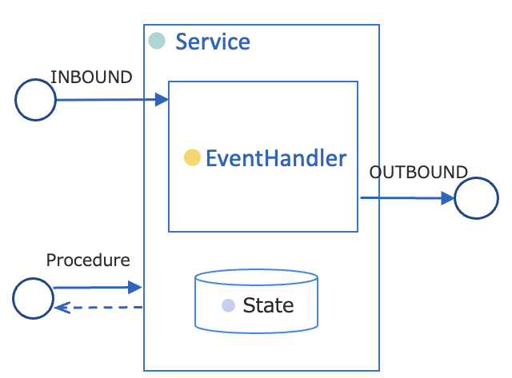
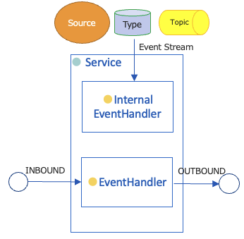
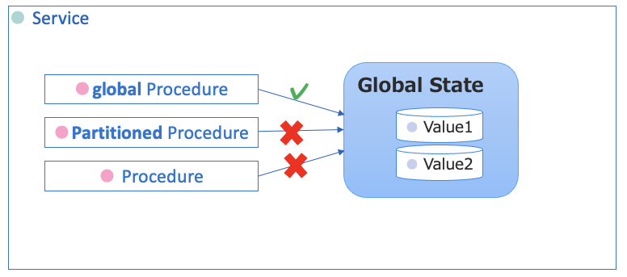
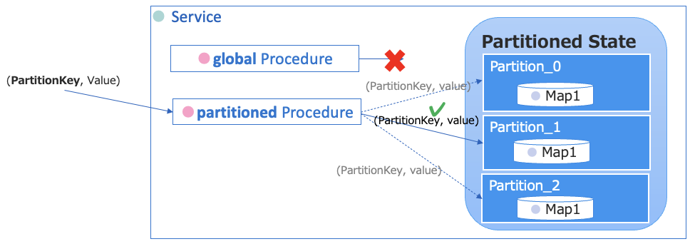
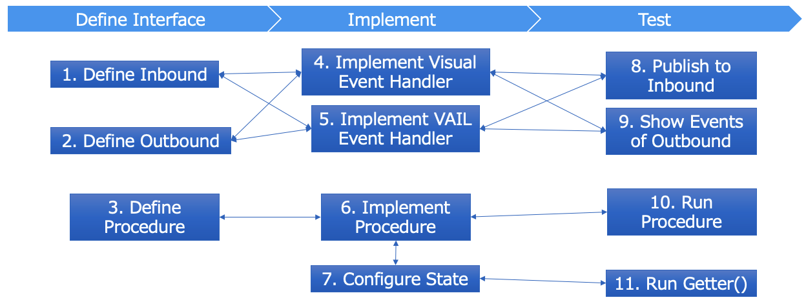
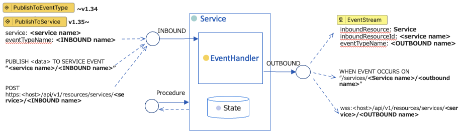

# Vantiq Service

## 関連リソース

- Vantiq Academy (要ログイン)
  - [2.7: Service Builder](https://community.vantiq.com/courses/%e3%82%a2%e3%83%97%e3%83%aa%e3%82%b1%e3%83%bc%e3%82%b7%e3%83%a7%e3%83%b3%e9%96%8b%e7%99%ba%e8%80%85-level-1-%e3%82%b3%e3%83%bc%e3%82%b9-%e6%97%a5%e6%9c%ac%e8%aa%9e/lessons/lesson-2-vantiq-%e9%96%8b%e7%99%ba%e3%83%97%e3%83%a9%e3%83%83%e3%83%88%e3%83%95%e3%82%a9%e3%83%bc%e3%83%a0/topic/2-7-service-builder-copy-2/)
  - [5.1: State](https://community.vantiq.com/courses/%e3%82%a2%e3%83%97%e3%83%aa%e3%82%b1%e3%83%bc%e3%82%b7%e3%83%a7%e3%83%b3%e9%96%8b%e7%99%ba%e8%80%85-level-1-%e3%82%b3%e3%83%bc%e3%82%b9-%e6%97%a5%e6%9c%ac%e8%aa%9e/lessons/lesson-5-stateful-services-copy-2/topic/5-1-state-copy-2/)
  - [5.2: App Builder: Service State](https://community.vantiq.com/courses/%e3%82%a2%e3%83%97%e3%83%aa%e3%82%b1%e3%83%bc%e3%82%b7%e3%83%a7%e3%83%b3%e9%96%8b%e7%99%ba%e8%80%85-level-1-%e3%82%b3%e3%83%bc%e3%82%b9-%e6%97%a5%e6%9c%ac%e8%aa%9e/lessons/lesson-5-stateful-services-copy-2/topic/5-2-app-builder-service-state-copy-2/)

## Vantiq Serviceとは

- 関連した機能の実装をまとめて __カプセル化__ し、より __高スループット__ かつ __高スケーラビリティ__ なアプリケーションを作成するモジュール単位です。
- 以下の5つの主要な要素があります。
  - __Procedure__ - 同期処理
  - __Inbound__ – 非同期のイベント入力
  - __Outbound__  - 非同期のイベント出力
  - __イベントハンドラ__ – 非同期の処理ロジック
  - __State__ - インメモリで状態を保持する変数

#### Procedure
- Procedure をカプセル化し、同期処理のインタフェースを定義する
  - 作成した Procedureは `<Service名>.<Procedure名>` で参照可能になる。
  - `Private`スコープを設定することで、Service内からのみ参照可に設定できる。
- State のスコープを設定することで、__暗黙的に宣言された State変数__ にアクセスできる。

#### Inbound / Outbound
- ストリーム入出力 (Inbound/Outbound) のインタフェースを定義する
- Serviceの外部から、`Service` + `インターフェース名` でイベントストリームを受けたり渡したりできる。

#### イベントハンドラ
- 2通りのイベントハンドラーを用いて非同期イベント処理を実装する。
  - __Visual Event Handler__ – ビジュアルなツールを使ってローコードに実装する。
  - __VAIL Event Handler__ – VAILで実装する。

#### State
- __メモリ上に状態を保持する__（Stateful Services）
- __イベント間で共有可能な変数__ を持つことができる
- Serviceスコープを持ち、Service 内の Procedure やイベントハンドラのタスクから参照可能である
- Service外部からアクセスする場合、アクセサ（getter, setterなどの Procedure ）を実装する必要がある

#### Internal Event Handler
Source, Type, Topicから発生するイベントを受ける。
- イベントのソースが変わるだけで、それ以外の機能は INBOUND/OUTBOUNDと同様。
- V1.35 に導入された。V1.34以前は INBOUND Event Handler と Internal Event Handlerの区別はない。 

### カプセル化されたリソース

Serviceにカプセル化されたリソースは、機能的に以下の要素に相当します。
要素 | カプセル化されたリソース
--|--
INBOUND, OUTBOUND   |  Topic
Visual Event Handler   |  App
VAIL Event Handler   |  Rule
Procedure  |  Procedure
State  |  一時保存用途としてのType (クエリは使用不可)

## Stateful Serviceとは

- 本来イベント処理は状態を保持しない（Stateless）が、Stateful Serviceは複数のProcedure、Ruleの実行にまたがり、__「状態(State)」をメモリ上で保持する__ 仕組みを提供します。
- Stateful Serviceは DBに依存しないため、__軽量でスケールアウト__ でき、かつ大量処理を行いやすい。
- 分散の方式2種類あり、それぞれ異なるスコープを持ちます。
  - __Global__ – Serviceごとに１つの状態インスタンスをもつ
  - __Partitioned__ – VantiqクラスタメンバーごとにPartition化した状態インスタンスをもつ
- Stateを参照・更新できるのは、Serviceに実装したProcedureのみ。
- [Stateful Serviceのリファレンス](https://dev.vantiq.co.jp/docs/system/services/index.html#stateful-services)

### Global State
- Serviceごとに１つの状態インスタンスを持つ
- `global`修飾子の Procedure からアクセス可能である。Procedure 内に暗黙の変数となる。
- [Global Stateのリファレンス](https://dev.vantiq.co.jp/docs/system/services/index.html#global-state)

### Partioned State + Partitioned Procedure
- Vantiqクラスタメンバーごとに、Partition化した状態インスタンスを持つ
- `partitioned`修飾子の Procedure からアクセス可能である。Procedure 内に暗黙の変数となる。
- Paritioned Procedureは第1引数の __PartitionKey__ (String) が必須である。
- ParitionKey から算出されたいずれか1つの Partition 上で Procedure が実行される。
- [Partitioned Stateのリファレンス](https://dev.vantiq.co.jp/docs/system/services/index.html#partitioned-state)

### Partioned State + Multi-Partitioned Procedure
- multi partitonedのProcedureは、すべてのPartitioned Stateインスタンスに対して、並行に処理を実行する
- Partition Keyの指定は不要
- 用途としては、初期化、永続化処理など
- [Multi-Partitioned Procedureのリファレンス](https://dev.vantiq.co.jp/docs/system/services/index.html#partitioned-state)

### Stateful なアクティビティパターン
- いくつかのアクティビティパターンは、Stateに状態を保持する。そのため、Serviceは保存時に自動的に State変数や 関連する補助 Procedure を作成する。
- アクティビティパターンの例
  - **_AccumulateState_**
  - _**CachedEnrich**_
  - _**ComputeStatistics**_
- [Stateful Activity Pattern のリファレンス](https://dev.vantiq.co.jp/docs/system/apps/index.html#app-service)

### Replication Factor
- Replication Factorを2以上に設定すると、クラスタメンバー間でデータを冗長化する。
  - クラスタメンバーに障害があってもデータが失われず、信頼性を向上できる。
- **Map** 型または **Value** 型の State プロパティのみが複製される。
- [Service Replication のリファレンス](https://dev.vantiq.co.jp/docs/system/services/index.html#service-replication)

### Initializer
- 定義しておくと、Partitionが変更されたり、再起動したときにSystemに呼び出される。以下のシグニチャで作成する。
  - Global: _globalStateInitializer_
  - Partitioned:  _partitionedStateInitializer_
  - 修飾子はprivate, parameterはなし
  - アクセス修飾子(global, muti partitoned等）なし
- State変数は初期化済みなので、Initializerで初期化する必要はない。
- [Service Initializer のリファレンス](https://dev.vantiq.co.jp/docs/system/services/index.html#state-initialization)

## Vantiq Serviceの実装

### Service Builder
- Service Builderは Serviceを作成するツールです。
- 3つのタブで構成されています。
  - Interface - インタフェースを定義
  - Implement - インタフェースを実装
  - Test - テストケースを作成

#### Service作成のフロー
1. [Inbound を定義する](https://dev.vantiq.co.jp/docs/system/services/index.html#event-types)
2. [Outbound を定義する](https://dev.vantiq.co.jp/docs/system/services/index.html#event-types)
3. [Procedure を定義する](https://dev.vantiq.co.jp/docs/system/services/index.html#procedure-signatures)
4. [Visual Event Handler で実装する](https://dev.vantiq.co.jp/docs/system/apps/index.html)
5. [VAIL で実装する](https://dev.vantiq.co.jp/docs/system/rules/index.html#rules)
6. [Procedure を実装する](https://dev.vantiq.co.jp/docs/system/services/index.html#procedures)
7. [State を設定する](https://dev.vantiq.co.jp/docs/system/services/index.html#stateful-services)

### 他のモジュール、外部サービスとの統合
- Serviceの外部から、Service + インタフェース名でイベントを受けたり渡したりできる。

### Concurrent Service
- Stateへのアクセスはスレッドまたがることが不可避である。スレッドセーフに行うため、**Concurrent Service** が提供されている。
  - _Concurrent.Lock()_ – コードブロックの実行を排他的に実行するためのロックを取得する。
    - _synchronize(function)_ – 引数で渡したコード (Lambda) を排他実行する。
- **Map** 型, **Value** 型は State専用の型で、Concurrent Serviceが予め実装されているので、Lockを意識する必要はない。ただし、Lambdaの形でロジックを引数で渡す必要がある。
  - _ConcurrentMap_
    - _compute(key, remappingFunction)_ – キーに対応するvalueを更新する
    - _computeIfAbsent(key, remappingFunction)_ - Mapにキーが存在しない場合にエントリーを作成する
    - _computeIfPresent(key, remappingFunction)_ - キーに対応するvalueを更新する
- [Concurrent Service リファレンス](https://dev.vantiq.co.jp/docs/system/rules/index.html#concurrent)

## Vantiq Service の派生機能
- **[Concurrent.Cache](https://dev.vantiq.co.jp/docs/system/rules/index.html#concurrent)** (v1.35~) – ConcurrentMapの派生で、メモリで保持するオブジェクト数上限、期間、超過時の通知イベントを設定できる。 
- **Cache Service** (v1.35~) -  Type への読み書きを仲介することで、永続化の負荷を吸収する Service。 読み取り専用 (Lookup) or 読み書き両用 (Update)を設定可能。
- **[Storage Manager](https://dev.vantiq.co.jp/docs/system/storagemanagers/index.html)** (v1.35~) – 外部ストレージサービスへのCRUDオペレーションを VAIL SQLで行うラッパーを実装する Service. 

## Vantiq Service ベストプラクティス

- Replicationを適切に設定する
  - 信頼性とスループットはトレードオフであるので、必要であれば設定する
  - 最大でも2で十分
- メモリにため過ぎない
  - Stateに保持したデータは明示的に消去（Serviceを変更、StateをClearなど）しない限り、永久に残る。貯めすぎるとメモリを圧迫し、サービスがダウンしたりインメモリデータが失われる恐れがある。
  - 古いデータをパージするProcedureを実装し、スケジュール実行する
  - Circular Bufferを実装して、古い要素は順次が消去する
- 接続するシステムもしくはSourceにつき1つのServiceにする。
  - 再利用性が向上する。
  - Source同士の依存性がなくなり、インクレメンタルに機能追加、変更が容易になる。
- Package名をつける
  - 再利用性、移植性が向上する
- カプセル化された個々の要素へはアクセスしない。
  - Serviceとそれを利用するリソース間を疎結合に保つ → 実装工数を削減につながる。
