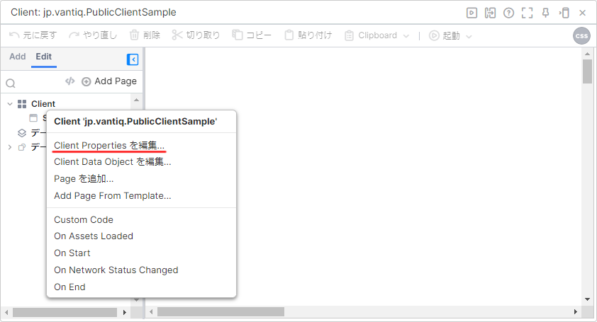
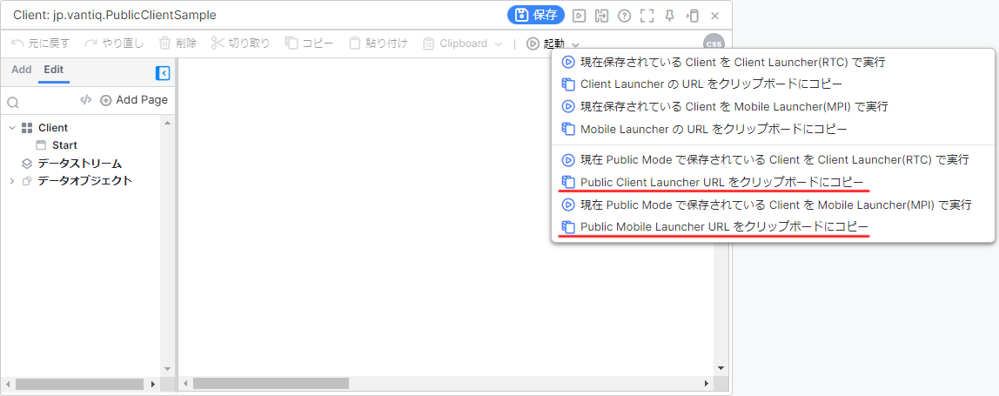

# Vantiq Public Client

## 概要

Vantiq Client では通常、 Vantiq へのログイン認証を行ったあとに利用することが前提となっています。  

しかし、一定の制約はあるものの `Cleint` を **Public Cleint** として設定することで、 Vantiq へのログイン認証なしで利用することができます。  

## 目次

- [Vantiq Public Client](#vantiq-public-client)
  - [概要](#概要)
  - [目次](#目次)
  - [Public Client の設定方法](#public-client-の設定方法)
  - [Public Client の起動方法とURL](#public-client-の起動方法とurl)
  - [Public Client からプロシージャを実行するには？（Client 編）](#public-client-からプロシージャを実行するにはclient-編)
    - [解説](#解説)
  - [Public Client からプロシージャを実行するには？（Procedure 編）](#public-client-からプロシージャを実行するにはprocedure-編)

## Public Client の設定方法

`Client` を **Public Client** に設定するには以下の手順を行います。  

1. `Client Properties を編集...` をクリックします。

   

1. `Advanced` にタブを切り替え、 `Client から起動可能にする` と `Public Client にする` にチェックを入れます。

   

1. `Client` を保存します。

## Public Client の起動方法とURL

`Client` を **Public Client** として起動するには以下の手順を行います。  

1. `起動` をクリックし、 `現在 Public Mode で保存されている Client を Client Launcher(RTC) で実行` または `現在 Public Mode で保存されている Client を Mobile Launcher(MPI) で実行` をクリックします。

   

`Client` を **Public Client** として起動するための URL は以下の手順で取得できます。  

1. `起動` をクリックし、 `Public Client Launcher URL をクリップボードにコピー` または `Public Mobile Launcher URL をクリップボードにコピー` をクリックします。

   

## Public Client からプロシージャを実行するには？（Client 編）

Public Client からプロシージャを実行するには以下の JavaScript コードを使用します。  

```JavaScript
var procedure = "PackageName.ServiceName.ProcedureName";
var args = {};

var http = new Http();
http.setVantiqUrlForSystemResource("procedures", client.getNamespace());
http.setVantiqHeaders();
http.execute(
    args
    , procedure
    , function(response){
        window.location.href = response;
    }, function(error){
        window.location.href = error;
    }
);
```

### 解説

#### プロシージャ

```JavaScript
var procedure = "PackageName.ServiceName.ProcedureName";
```

実行したいプロシージャ名をパッケージ名やサービス名を含めて指定します。  

#### プロシージャの引数

```JavaScript
var args = {};
```

プロシージャの引数をオブジェクトで指定します。  
引数がないプロシージャの場合は空のオブジェクトを代入します。  

##### 引数があるプロシージャの例

```JavaScript
var args = {
    id: client.data.id
    , message: "Hello World!"
    , timestamp: new Date()
};
```

##### 引数がないプロシージャの例

```JavaScript
var args = {};
```

#### HTTP インスタンス

```JavaScript
var http = new Http();
```

プロシージャを実行するための `execute()` を実行する際には、あらかじめ `Http` インスタンスを作成します。  

#### プロシージャリソースの指定

```JavaScript
http.setVantiqUrlForSystemResource("procedures", client.getNamespace());
```

プロシージャを実行するための `execute()` を実行する際には、あらかじめ http インスタンスに `setVantiqUrlForSystemResource()` を指定します。  

引数は固定値になります。  

#### Vantiq Header の追加

```JavaScript
http.setVantiqHeaders();
```

http インスタンスのヘッダーに Vantiq のヘッダー情報（Authorization ヘッダーなど）を追加します。  

#### Vantiq Header の追加

```JavaScript
http.execute(
    args
    , procedure
    , function(response){
        client.data.hogehoge = response
    }, function(error){
        window.location.href = error;
    }
);
```

プロシージャを実行します。  

プロシージャ成功時の処理は `function(response)` に記述します。  
プロシージャ失敗時の処理は `function(error)` に記述します。  

なお、 `Public Client` からプロシージャを実行するには、後述するプロシージャ側での設定も必要になります。  

- :globe_with_meridians: [execute - Client Builder User's Guide](https://dev.vantiq.com/docs/system/cbuser/#executeprocedureargumentsany-procedurenamestring-successcallbackfunction-failurecallbackfunctionvoid)

## Public Client からプロシージャを実行するには？（Procedure 編）

`Public Client` からプロシージャを実行するには、プロシージャに `WITH句` で追加設定をする必要があります。  

なお、呼び出せるのは `Public Procedure` のみになります。（`Private Procedure` は呼び出せません）  

```JavaScript
package hoge.fuga
public stateless PROCEDURE ServiceName.ProcedureName(): Any
WITH ars_public = true
```
