## Prerequisites for starting Hands-On

### For Instructors
- Trainees should have already been invited to Vantiq.
- `event_generator` should be running in the instructor's environment.
- Refer [here](https://vantiq.sharepoint.com/:f:/s/jp-tech/EvUXuLjTXnNKqCaJ0e5QapIBrkWoLn-rR1cj2jO-kruZaw?e=h5IUQP) for the current configuration.

### For Trainees
- Vantiq user registration should be completed.
- Vantiq development Namespace should have been created.

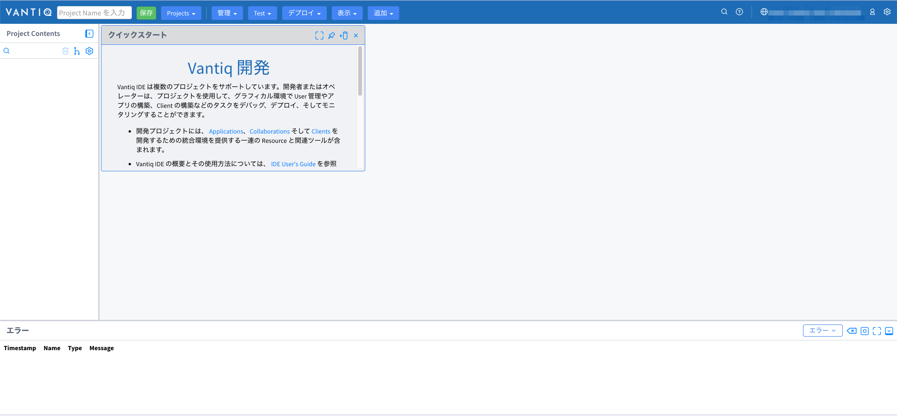

## Hands-on Assignment (30 mins)

1. [Import Project into Namespace](#01_project_import)
2. [Check the received data from Source](#02_source)
3. [Check the data processing step by step](#03_view_task_events)
4. [Input data to Type](#04_types)
5. [Generate simulated events (Procedure, Topic)](#05_adhoc_events)
6. [Add collaboration with an external service (reverse geocoding)](#06_external_service)

### 1. Import Project into Namespace
Download the Project that will be used in this Hands-on Assignment (Link will be provided by the Instructor).  

Go to [Navigation bar] >> [Projects] >> [Import].

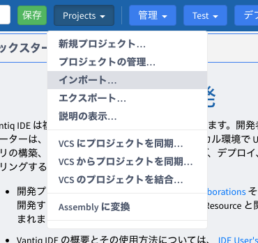

Drag and drop the Project zip file. Then, Import and reload the screen.
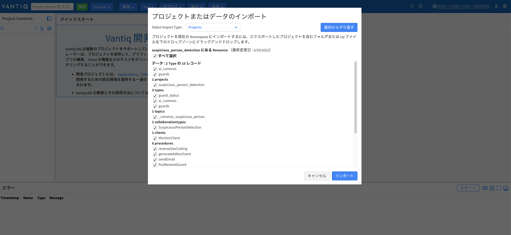

Project has been imported.
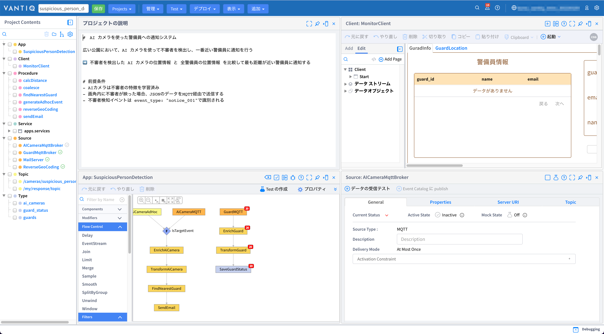

### 2. Check the received data from Source
The App Builder shows that three inputs have already been defined.  
1. `GuardMQTT` - `GuardMqttBroker` Data from Source
2. `AiCameraMQTT` - `AiCameraMqttBroker` Data from Source
3. `AiCameraAdhoc`- Input simulated events for suspicious person detection

Of the above, follow the data flowing from `GuardMQTT`, which sends Guard location updates in JSON format once every 5 seconds.  
1. Right click on `GuardMQTT`, and select [View Task Events].
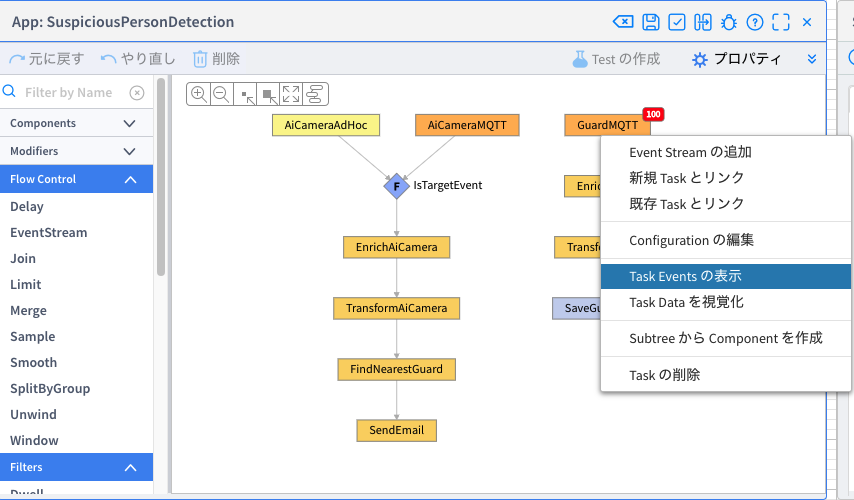
1. You can observe the data flowing through `GuadMQTT`.
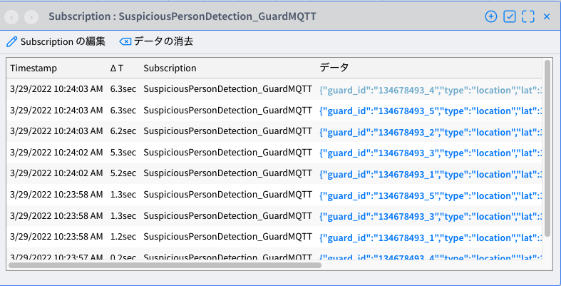
1. Clicking on one of them will display the details and show that the data is in JSON format. It represents the location of the security guard.
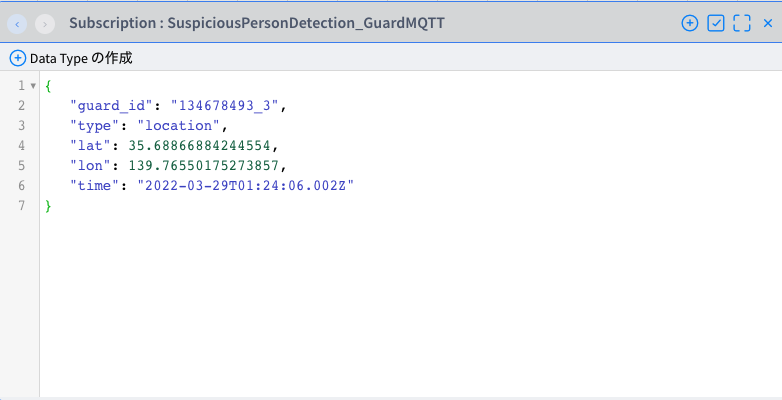

### 3. Check the data processing step by step
As for the `EnrichGuard` and `TransformGuard`, perform [View Task Events] as in the previous section.  

1. `EnrichGuard` queries the security guard master (`guards` Type) and adds (Enrich) the security guard information whose `guard_id` matches. Compared to the previous step, notice that the `guards` property has been added.  
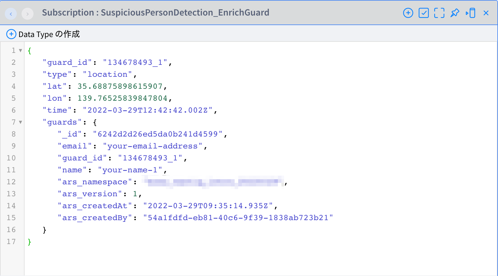

1. `TransformGuard` transforms the output data from the previous step. Now you can see that the data used for processing has been organized and cleaned up.  
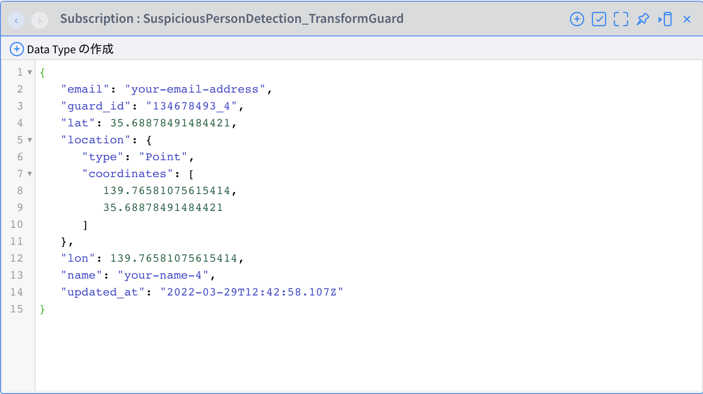

1. Select a task and [Click to Edit] to see how it is implemented in each step.  
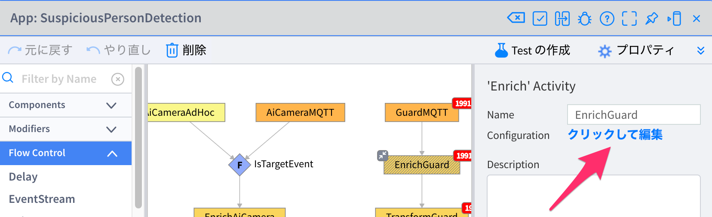

### 4. Input data to Type

1. First, the `AiCameraMQTT` task needs to be able to receive data. The `AiCameraMQTT` task receives data from a Source called `AICameraMqttBroker`. Select `AiCameraMqttBroker` from Source in [Project Contents].     
   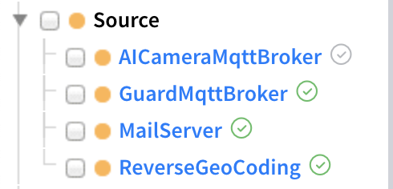

1. The [Toggle Keep Active On] checkbox in the upper right corner of the `AiCameraMqttBroker` pane is unchecked (Inactive), check it and save.   
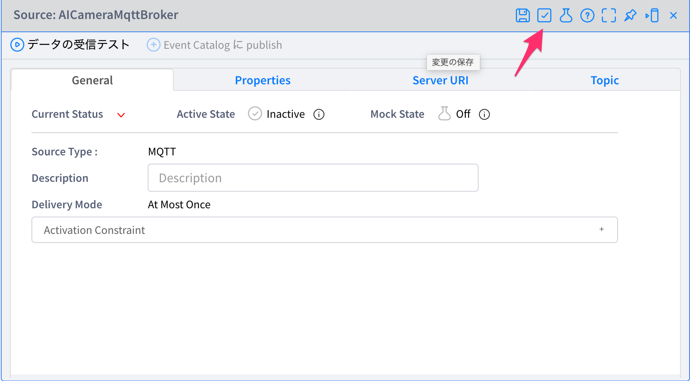

1. Once the Source becomes Active, data will flow to `AiCameraMQTT` (wait for a while until it receives data, since it receives data once a minute).  
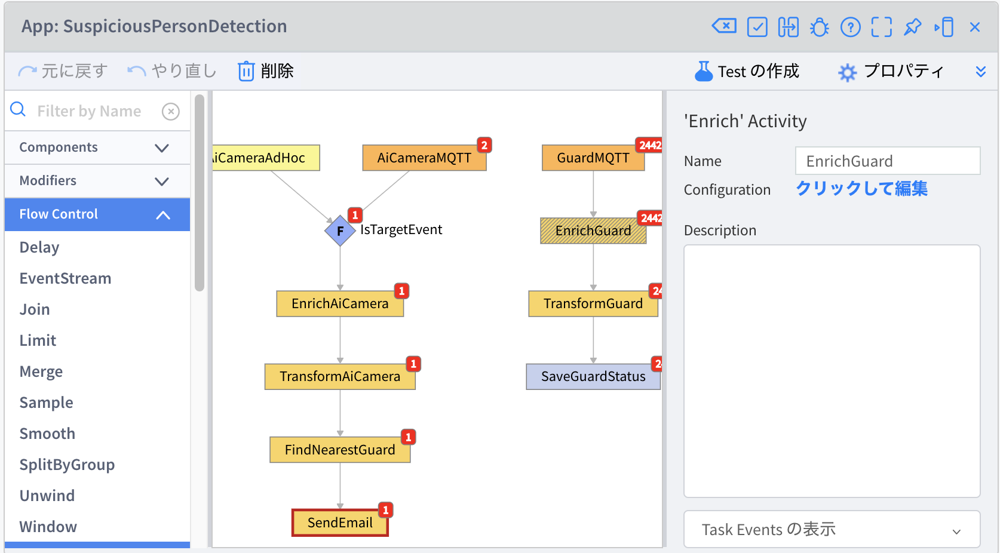

1. Although the data flowed, the `SendEmail` is red. This indicates that an error occurred at that step. The cause is that the `email` appended by `FindNearestGuard` is not valid, so sending the email failed.    
   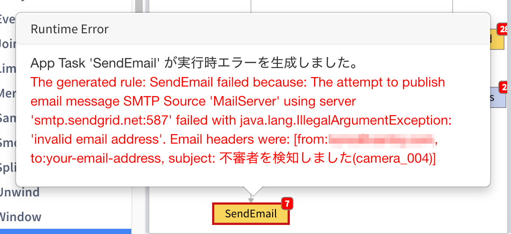

1. Modify the Type of the security guard master that is the origin of the `email` data.  It is possible to edit the Type directly, but for this exercise, modify it from the dedicated Client. Select `MonitorClient` from the Client in [Project Contents].   
   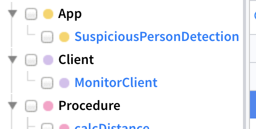

1. Go to [Launch] >> [Run currently saved Client in Client Launcher(RTC)].  
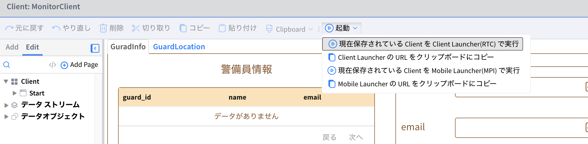

1. Go to the Edit Guard Master screen and update the `email` and `name` for the 5 security guards.  
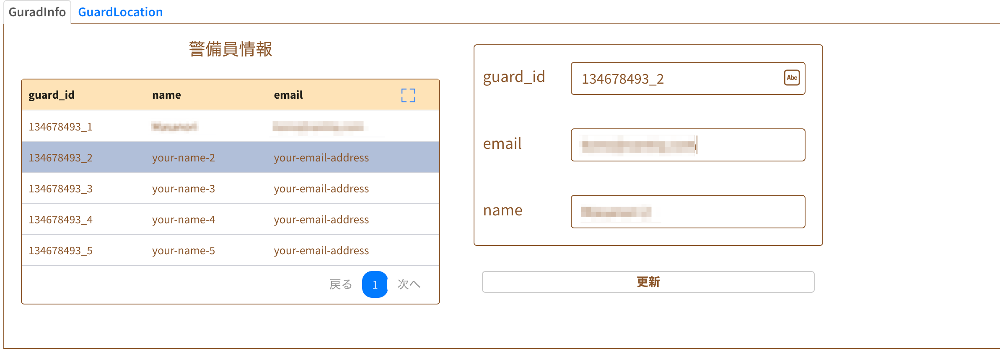

1. Return to the App Builder and click on the [Clear Runtime Status] icon (left pointing arrow) in the upper right corner of the pane. This will reset the error status and badge (number of events) display from earlier.  
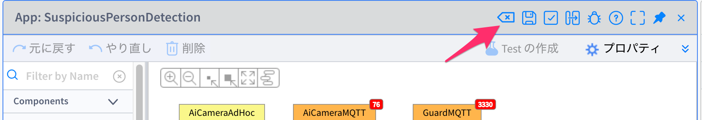

1. After a while, you should receive a suspicious person detection email.    
   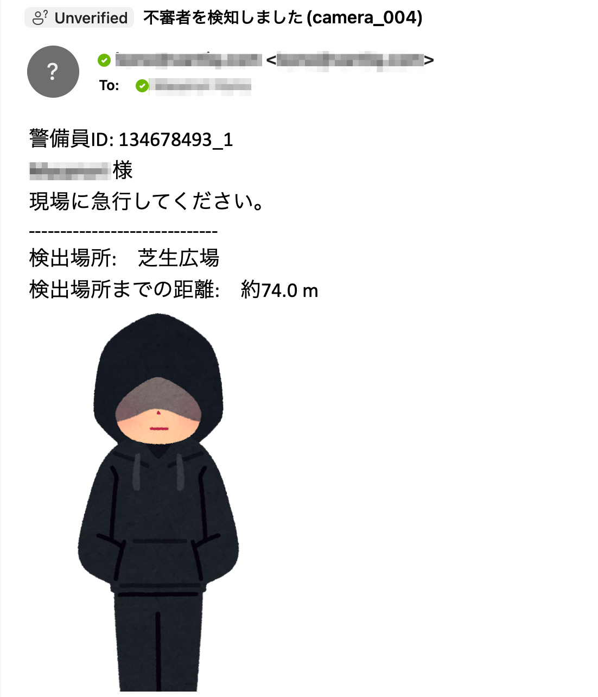

1. Now that the operation is confirmed, turn off (Inactive) the `AiCameraMqttBroker` Source in order to temporarily stop sending mail.  

### 5. Generate simulated events (Procedure, Topic)

1. Click `AiCameraAdhoc` in the App Builder and check Configuration. Here is the configuration: `InputResource`: `topics`, `inboundResourced`: `/cameras/suspicous_person`. It is possible to take data from internal events with the configured topic name.  
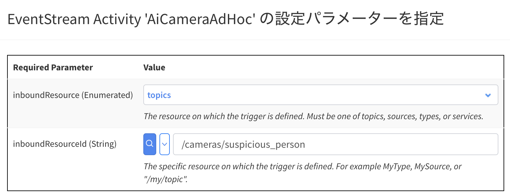

1. Select `generateAdhocEvent` from Procedure in [Project Contents].  This procedure will create a simulated event (JSON data) and PUBLISH it to the Topic `/cameras/suspicious_person`. Execute the Procedure using the blue arrow button in the upper left corner.  
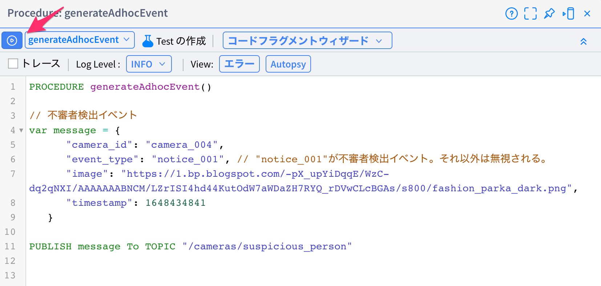

1. Once the Procedure is executed, `AiCameraAdhoc` will receive the event and process it.  
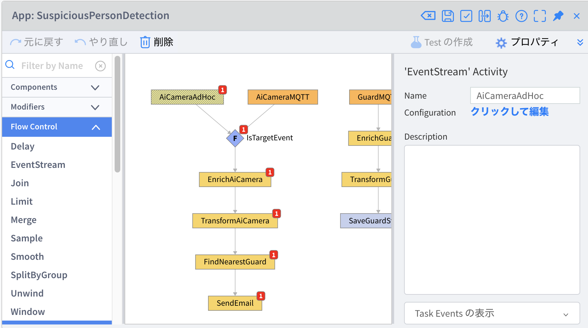

### 6. Add collaboration with an external service (reverse geocoding)
Reverse geocoding is a service that converts latitude and longitude into addresses.Collaborate with an external reverse geocoding service.  

1. The Procedure `reverseGeoCoding` calls an external service and returns the latitude and longitude as an address. Note that it takes latitude and longitude as arguments and returns a string (address).  
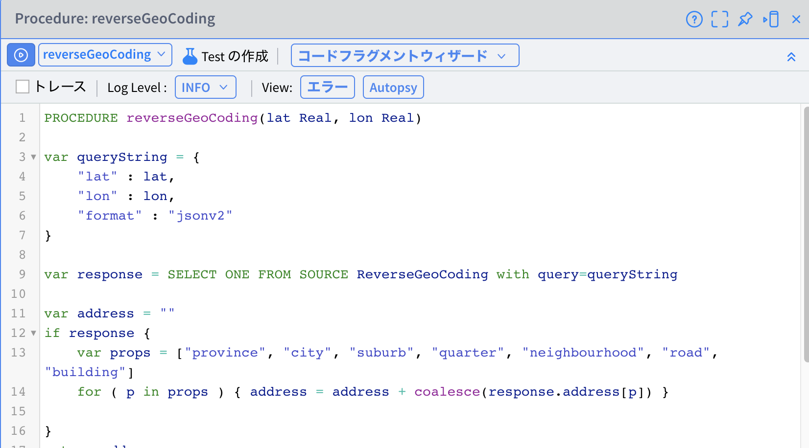

1. In the App Builder, drag and drop `Transformation` from the list of activities on the left side of the pane to the line between `TransformAiCamera` and `FindNearestGuard`.  
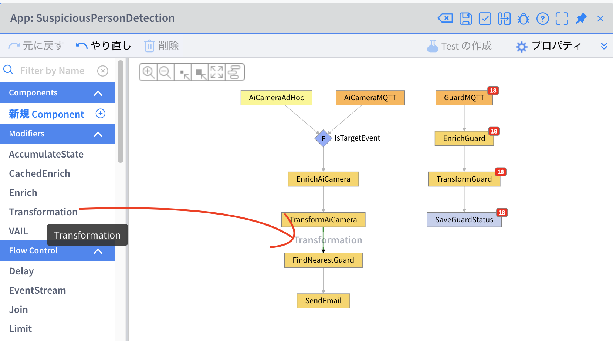

1. Click on the added Transformation task and [Click to Edit]. Click `<null>` in transformation(Union) to add the transformation process. In Edit Transformation, add Transformation and enter `address`, `reverseGeoCoding(event.lat, event.lon)`.      
   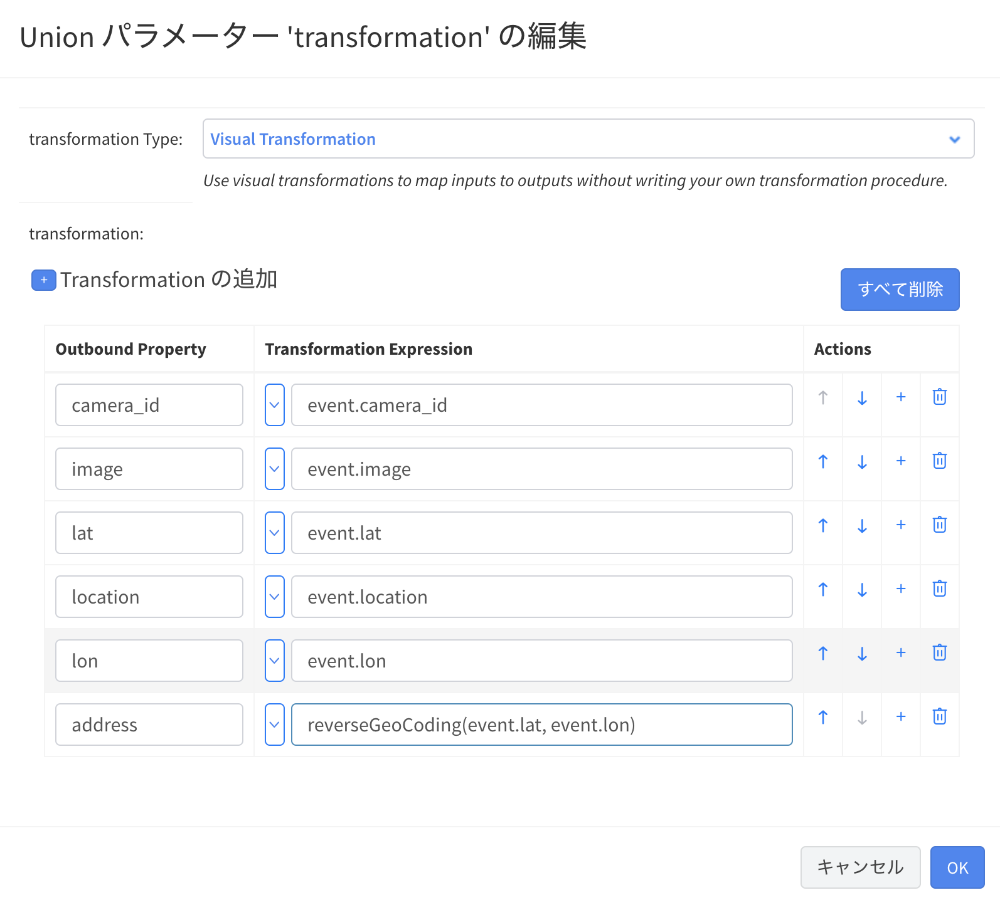

1. Click on `<null>` in imports, edit imports and add `Procedure`, `reverseGeoCoding`.     
    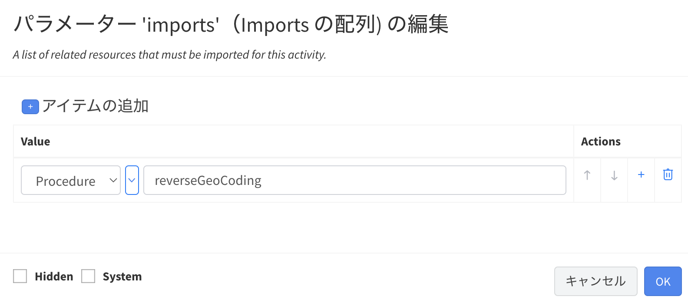

1. Save the changes using the [Save Changes] icon in the upper right corner of the App Builder's pane. Right-click on the added Transformation and select [View Task Events].  
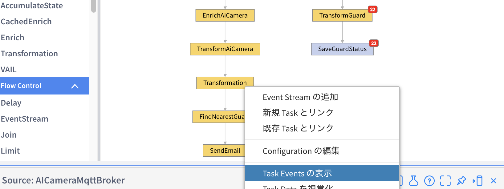  

1. Run `generateAdhocEvent` (or make `AiCameraMqttBroker` Active). Observing the event as it passes through Transformation, notice the addition of the `address` retrieved from the reverse geocoding service.  
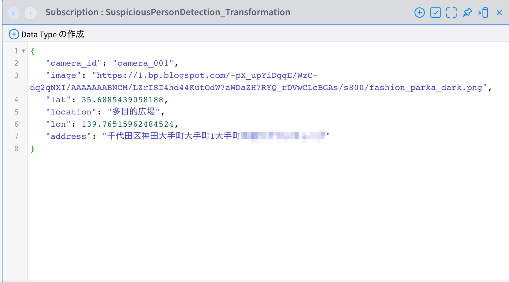
