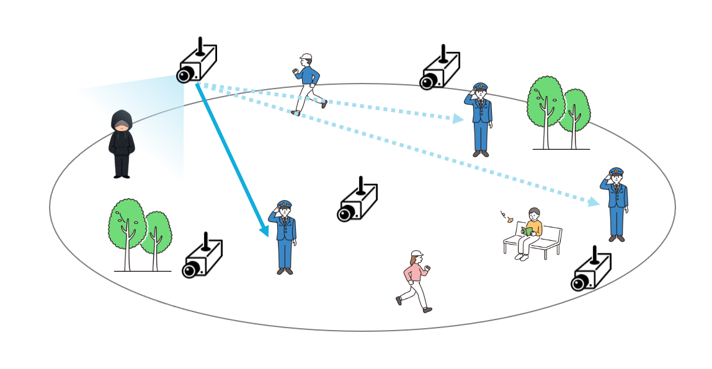
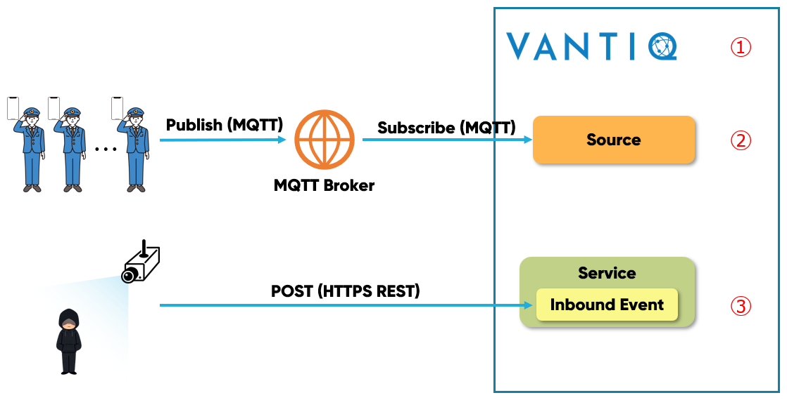
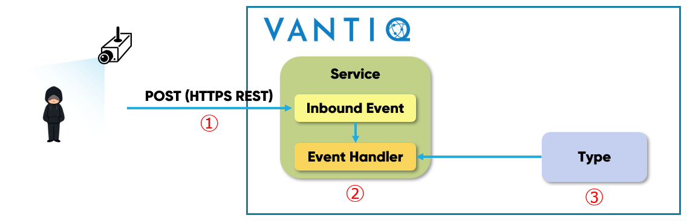
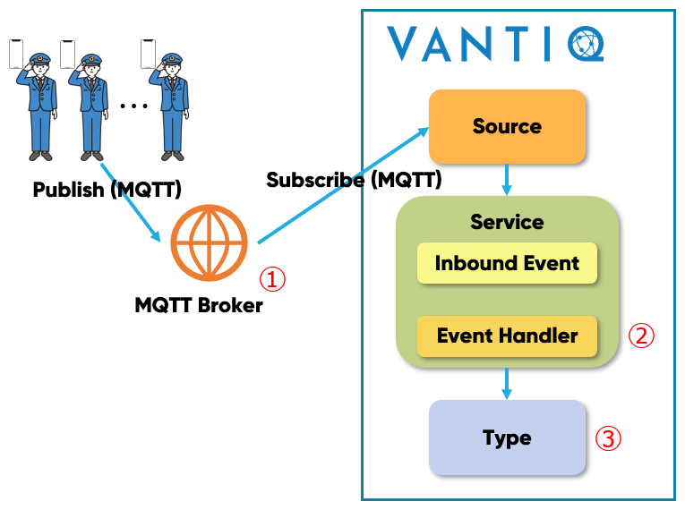
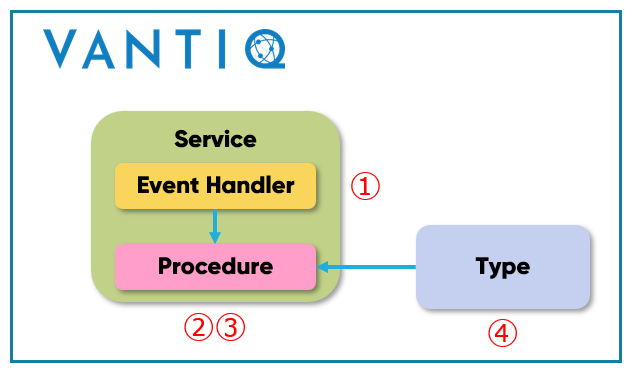
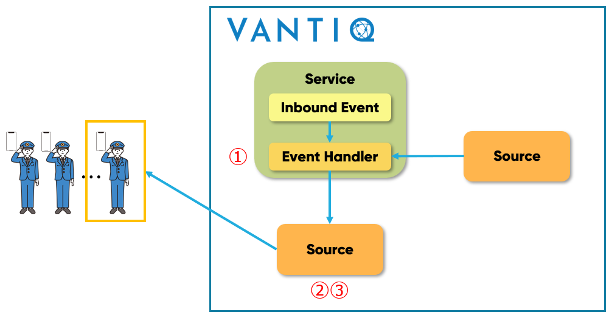
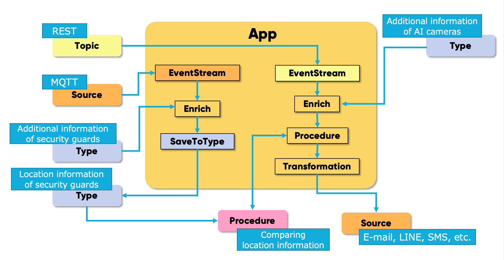
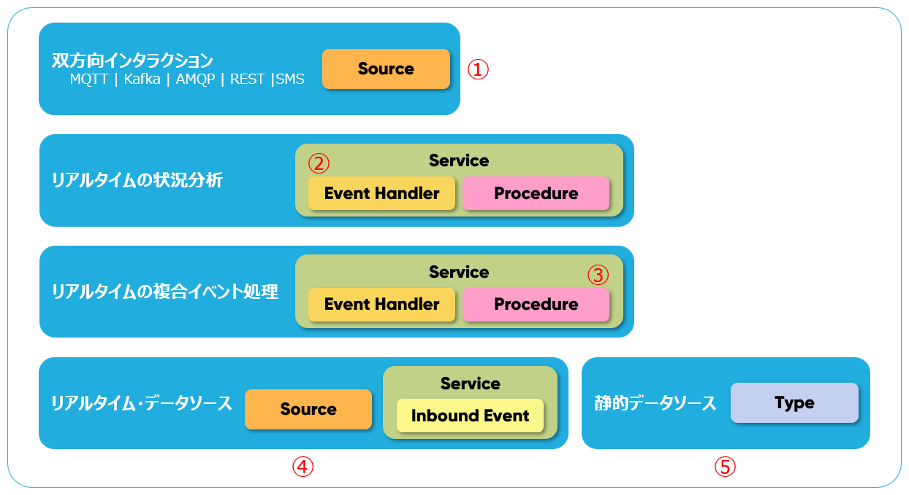

# 実例を通して Vantiq のリソースを理解する

##  AI カメラを使った警備員への通知システム  

広い公園において、AI カメラを使って不審者を検出し、一番近い警備員に通知を行う  

➡️ 不審者を検出した  **AI カメラの位置情報** と **全警備員の位置情報** を比較して最も距離が近い警備員に通知する  

<!--
この記事で説明しているサンプルアプリは [**こちら**](../../conf/ai-camera-demo) から取得できます。以下は直リンク。

  - [App](https://github.com/fujitake/vantiq-related/raw/main/vantiq-apps-development/vantiq-resources-introduction/conf/ai-camera-demo/suspicious_person_detection.zip)
  - [データジェネレーター](https://github.com/fujitake/vantiq-related/raw/main/vantiq-apps-development/vantiq-resources-introduction/conf/ai-camera-demo/event_generator.zip)
-->



# 前提条件

## AI カメラの仕様

- 不審者の特徴を学習済み  
- 画角内に不審者が映った場合、以下のデータを _HTTPS REST_ で送信する

```sh
{
"camera_id": "camera_001",    # AI カメラの ID
"event_type": "notice_001",
"image": "data:image/jpeg;base64,/9j/4AAQSkZJRgABAQAAAQABAAD/2wBDAAMC...."    # Base64 エンコードした画像
}
```

> 補足  
> 一般的に AI カメラは位置情報を持たない  
> また、持たせる場合は交換の際に工事業者のほかに AI カメラのエンジニアが必要になる

## 警備員の位置情報取得方法  

- 警備員はスマートフォンを持ち、位置情報取得アプリをインストールしている  
- アプリは 30秒毎など任意の頻度で以下のデータを MQTT ブローカーに送信する

```sh
{
"guard_id": "134678493_1",    # 警備員ごとの ID
"type": "location",
"lat": 35.6864604,             # 緯度
"lon": 139.7635769,            # 経度
"time": 1631083251
}
```

## Vantiqで実装する処理内容

1. AI カメラや位置情報取得アプリからのデータを受信する
   * デバイスの仕様変更（データフォーマットなど）は将来変わる想定で設計しておく

1. AI カメラから送信されるデータに対して必要な情報を付加する  
   * AI カメラが位置情報を持たないため Vantiq 側で保持しておき付加する  

1. 警備員の最新の位置情報を保存・更新する  
   * 通知へのタイムラグを減らすため、不審者検出時に警備員の位置情報を取得するのではなく予め Vantiq 側で保持しておく  

1. 不審者を検出したAI カメラの位置と警備員の位置の比較  
   * 最も近い警備員を特定する  

1. 最も近い警備員への通知  
   * E-mail、SMS、LINE、Slack など任意の方法で通知を行う  

# 実装方法

## 1. Vantiq へのデータ入力



① Vantiq は受信するデータのスキーマが定まっていなくても処理することができる  
② Source は様々なプロトコルでデータを受信する  
③ Service Interface の Inbound Event は REST API のエンドポイント経由でデータを受信する  

## 2. AI カメラからのデータへ情報付加



① 送信されるデータ

```sh
{
👉"camera_id": "camera_001",
"event_type": "notice_001",
"image": "data:image/jpe...."
}
```

② パラメーター変更・削除など必要なデータ整形は随時行う (Transformation)  
　 Service Implement の Event Handler は Type の情報を取得して AI カメラからのストリームデータに付加する (Enrich)  

```sh
{
👉"camera_id": "camera_001",
👉"lan": 35.6864604,
👉"lon": 139.7635769,
"event_type": "notice001",
"image": "data:image/jpe...."
}
```  

③ AI カメラの位置情報など追加したい情報は、予め Type で保持されている。

``` sh
{
👉"camera_id": "camera_001",
"lan": 35.6864604,
"lon": 139.7635769
}
```

## 3. 警備員の最新の位置情報保存・更新



① 送信されるデータ

```sh
{
"guard_id": "134678493_1",
"type": "location",
"lat": 35.6864604,
"lon": 139.7635769,
"time": 1631083251
}
```

② 通知時にメールアドレス、電話番号などが必要な情報を、`Enrich` を使って追加する  
③ Event Handler で `SaveToType` を `Upsert` 設定で使用することで最新の一件のみを *Type* に保存する

## 4. AI カメラと警備員の位置を比較



① Procedure へ渡すデータ

```sh
{
"camera_id": "camera_001",
👉"lan": 35.6864604,
👉"lon": 139.7635769,
"event_type": "notice_001",
"image": "data:image/jpe...."
}
```

② 位置を比較するロジックを実装した処理を Event Handler から呼び出し  
③ _ストリーム処理中の AI カメラのデータ_ に含まれる位置情報と、_Type で保存されている警備員のデータ_ の位置情報を比較して最も近い警備員を特定する  
④ 警備員の最新の位置情報が保存された Type

## 5. 特定した警備員へ通知




① 通知時に必要な形式に合わせてデータ整形を行う (Transformation)  
② Source は受信だけでなく、送信にも使用する  
③ E-mail、SMS、Slack、LINE、Teams など  

## Vantiq アプリケーション全体図



# 基本リソースの紹介

|Reource|説明|
|:-----|:---|
|Source|データの送受信を行うクライアント。<br />送受信：MQTT、AMQP、Kafka<br />送信のみ：HTTP(S) REST、E-mail、SMS|
|Type|データを保存する。<br />Vantiq で データベースのテーブルに相当するリソース。|
|Service<br />Inbound Event|Vantiq 内の Service 間などでイベントの受け渡しをするイベントバス。<br />REST API のエンドポイント経由でデータを受信することもできる。|
|Service<br />Event Handler|用意されたパターンや Procedure を組み合わせながら GUI 上で開発することができるアプリケーション本体。|
|Procedure|任意のロジックを実装することができるリソース。<br />Service や他の Procedure から呼び出すことができる。|



① 外部とデータを送受信したり、外部サービスの API をコールする  
② 用意されたパターンを組み合わせて処理を実装  
③ パターンが用意されていない処理は独自に実装  
④ デバイスから送信されるストリームデータ  
⑤ ストリームデータに付加したい情報や、リアルタイムのステータスなどを保存
