##　Hands-On開始の前提条件
### インストラクター
- トレーニング参加者をVantiqに招待済みであること
- `event_generator`がインストラクターの環境で稼働していること
- 現状の構成については[こちら](https://vantiq.sharepoint.com/:f:/s/jp-tech/EvUXuLjTXnNKqCaJ0e5QapIBrkWoLn-rR1cj2jO-kruZaw?e=h5IUQP)を参照

### トレーニング参加者
- Vantiqのユーザー登録が完了していること
- Vantiqの開発用Namespaceが作成済みであること

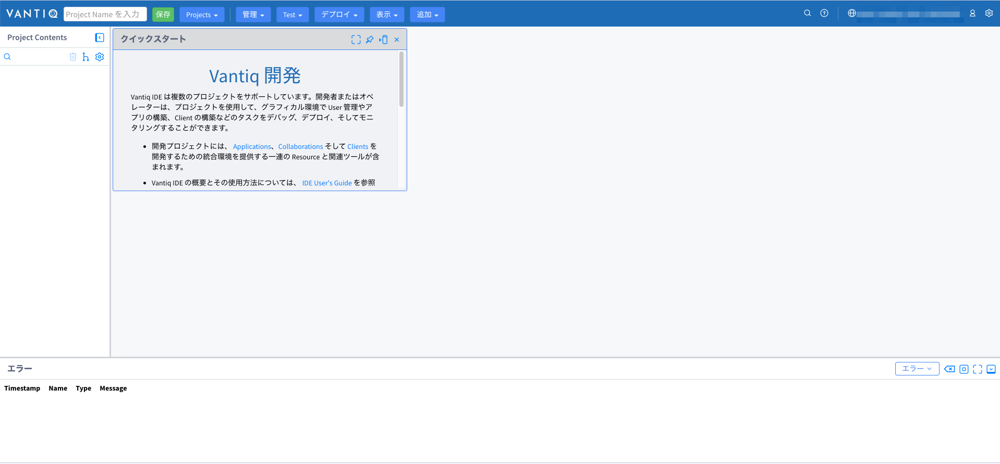

## Hands-on作業 (30分)

1. [namespaceにプロジェクトをインポートする](#01_project_import)
2. [Sourceの受信データを確認する](#02_source)
3. [ステップごとのデータ加工の様子を確認する](#03_view_task_events)
4. [Typeにデータを投入する](#04_types)
5. [疑似イベントを発生させる（Procedure, Topic)](#05_adhoc_events)
6. [外部サービスとの連携（逆ジオコーディング）を追加する](#06_external_service)

### 1. namespaceにプロジェクトをインポートする
今回ハンズオンで使用するプロジェクトをダウンロードします。([リンク](https://github.com/fujitake/vantiq-related/raw/main/vantiq-apps-development/vantiq-resources-introduction/conf/hands-on/suspicious_person_detection.zip))

メニュー >> Projects >> インポート を開きます。

projectのzipファイルをドラッグ&ドロップします。インポートを行い、画面をリロードします。

プロジェクトがインポートされました。
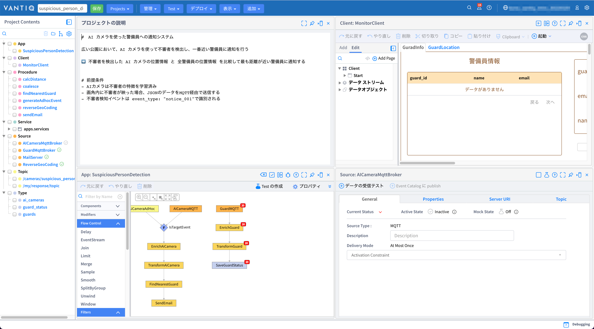

### 2. Sourceの受信データを確認する
App Builderを見ると、すでに3つの入力が定義されています。
1. `GuardMQTT` - `GuardMqttBroker` Sourceからのデータ入力
2. `AiCameraMQTT` - `AiCameraMqttBroker` Sourceからのデータ入力
3. `AiCameraAdhoc`- 不審者検知の疑似イベントを入力
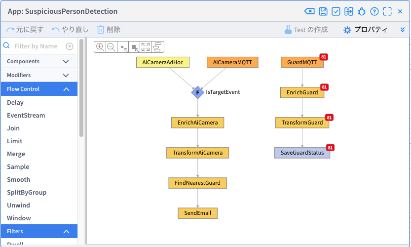

そのうち、`GuardMQTT`から流れるデータを追っていきます。GuardMQTTはGuardの位置情報の更新データがJSON形式で5秒に1回届きます。
1. `GuardMQTT`を右クリックし、「Task Eventsの表示」をします。
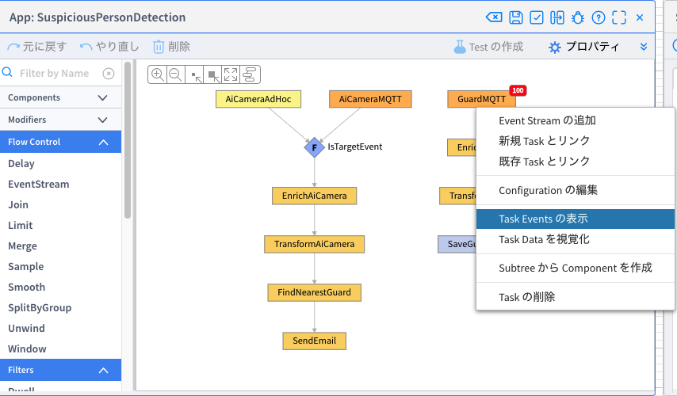
1. `GuadMQTT`を流れるデータを観察できます。

1. そのうち1つをクリックすると、詳細が表示され、JSON形式のデータであることがわかります。警備員の位置情報を表します。

### 3. ステップごとのデータ加工の様子を確認する
`EnrichGuard`, `TransformGuard`について、前項と同様に「Task Eventsの表示」を行います。

1. `EnrichGuard`は、警備員マスタ(`guards` Type)に照会し、guard_idが一致する警備員情報を付加(Enrich)しています。前ステップと比べて、`guards`プロパティが追加されているのがわかります。
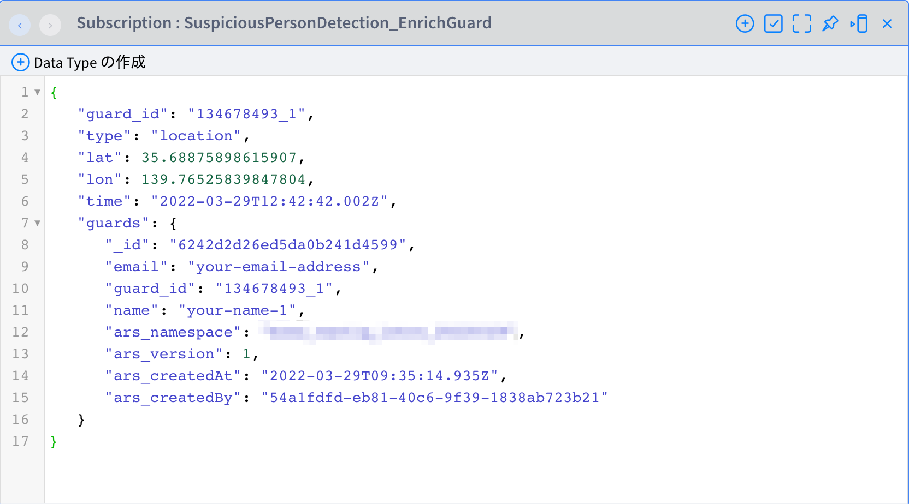

1. `TransformGuard`は、前ステップの出力データを整形(Transform)しています。処理に使うデータが整理され、スッキリしているのがわかります。

1. それぞれのステップでどのような実装しているか、タスクを選択し、「クリックして編集」から実装を確認してみてください。

### 4. Typeにデータを投入する

1. まず、`AiCameraMQTT`がデータを受け取れるようにします。 Project ContentsのSourceから`AiCameraMqttBroker`を選択します。
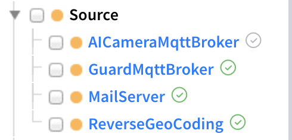

1. `AiCameraMQTT`のペインの右上のチェックボックスがオフ(Inactive)になっているので、チェックをオンにし、保存します。
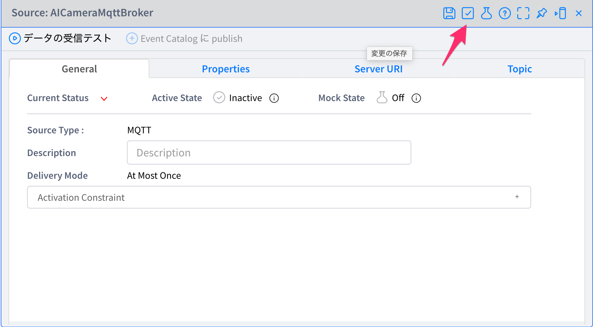
   AiCameraMQTTは AICameraMqttBrokerというSourceからデータを取っています。

1. SourceがActiveになると、`AiCameraMQTT`にデータが流れてきます。（1分に1回のデータ受信なので、それまでしばらく待ちます。）
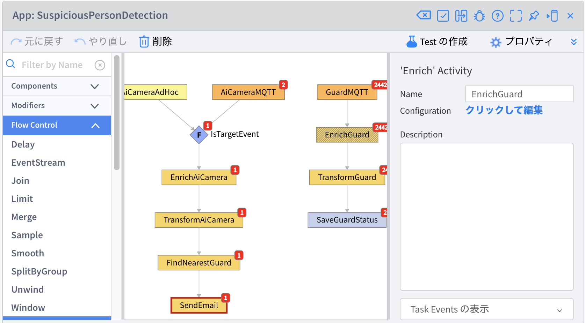

1. データは流れましたが、`SendMail`が赤くなっています。そのステップでエラーが発生したことを示しています。原因は、`FindNearestGuard`で付加されている`email`が有効でないためにメール送信が失敗しています。
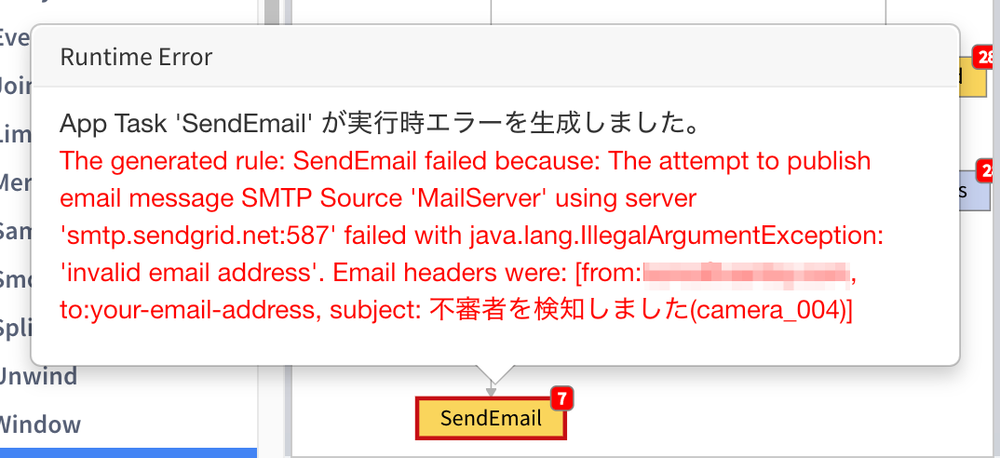

1. `email`のデータ元である、警備員マスタのTypeを修正します。 Typeを直接編集することもできますが、今回の演習では専用のClientから修正します。Project ContentsのClientから、`MonitorClient`を選択します。
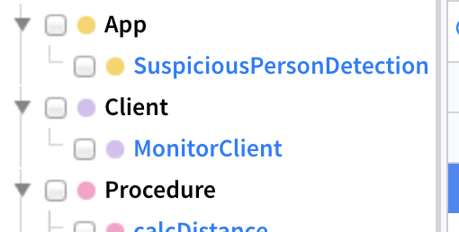

1. 起動 >> 現在保存されているClientをClient Launcher(RTC)で実行 します。
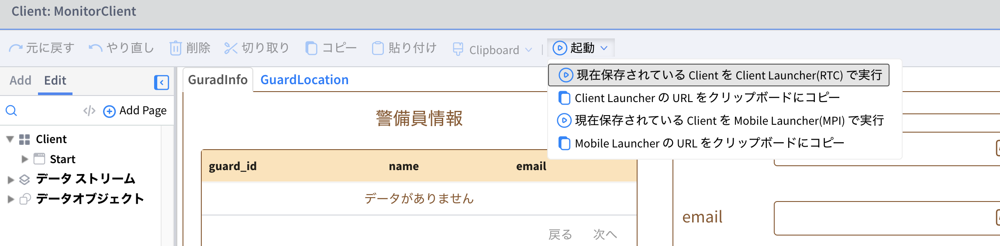

1. 警備員マスタを編集する画面から、5人分の`email`, `name`を更新してください。

1. App Builderに戻り、ペインの右上の左向きの矢印アイコンをクリックしましょう。先程のエラーステータスとバッジ（イベントの件数）の表示がリセットされます。
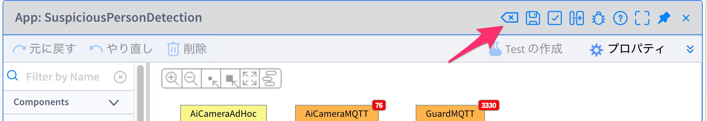

1. しばらくすると、不審者検知メールが届くはずです。

1. 動作が確認できたので、メール送信を一旦止めるため、`AiCameraMqttBroker` Sourceをオフ（Inactive）にします。

### 5. 疑似イベントを発生させる（Procedure, Topic)

1. App Builderの`AiCameraAdhoc`をクリックし、Configurationを確認します。 `InputResource`: `topics`, `inboundResourced`: `/cameras/suspicous_person`となっています。設定されたtopic名で内部イベントからデータを取れるようになっています。

1. Project ContentsのProcedureから、`generateAdhocEvent`を選択します。このProcedureは疑似イベント（JSONデータ）を作り、Topic `/cameras/suspicious_person` にPUBLISHをします。
左上の青の矢印ボタンでProcedureを実行しましょう。
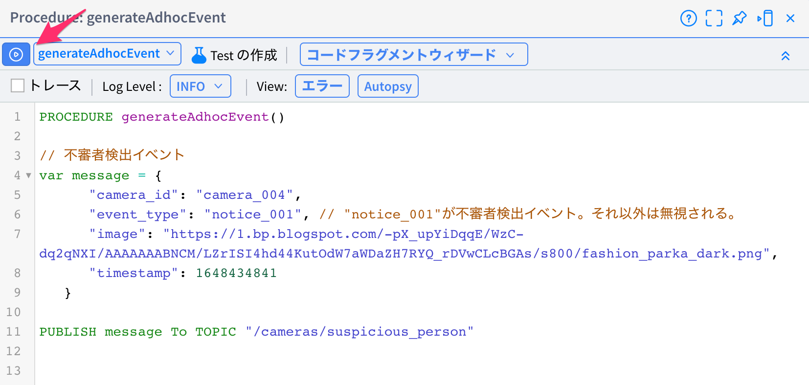

1. Procedureを実行すると、`AiCameraAdhoc`はイベントを受け取り、処理が行われます。

### 6. 外部サービスとの連携（逆ジオコーディング）を追加する
逆ジオコーディングは緯度・経度を住所に変換するサービスです。外部の逆ジオコーディングサービスと連携してみましょう。

1. `reverseGeoCoding`というProcedureは、外部のサービスを呼び出し、緯度・軽度を住所を返します。引数として緯度、経度を受け取り、文字列（住所）を返すことに注目してください。
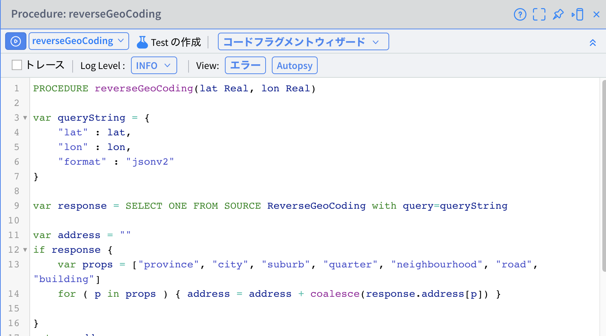

1. App Builderで ペインの左のアクティビティ一覧から、 `Transformation`を `TransformAiCamera` と `FindNearestGuard`の間の線までドラッグ&ドロップします。

1. 追加されたTransformationタスクをクリックし、「クリックして編集」します。Transformation(Union)の`<null>`をクリックし、変換処理を追加します。Transformationの編集で、Trasnformationを追加し、`address`, `reverseGeoCoding(event.lat, event.lon)`と入力します。

1. importsの`<null>`をクリックし、import編集で、`Procedure`, `reverseGeoCoding`と追加します。
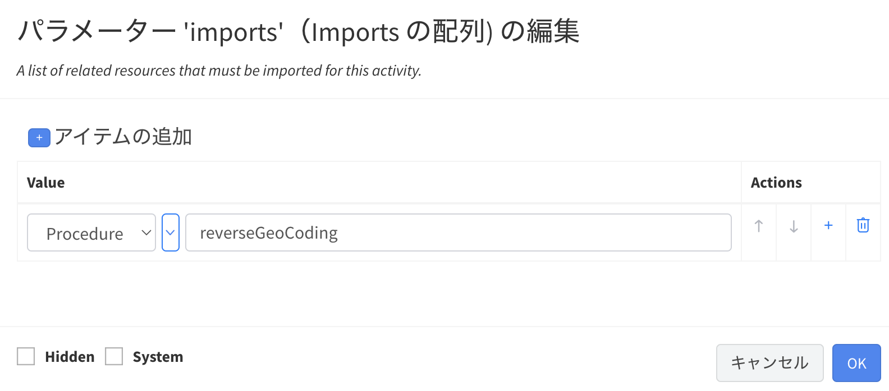
1. App Builderのペインの右上の「保存」ボタンで保存します。追加されたTransformationを右クリックし、「Task Eventsの表示」をします。

1. `generateAdhocEvent`を実行（もしくは`AiCameraMqttBroker`をActiveにする）します。Transformationを通過したイベントを観察すると、逆ジオコーディングサービスから取得された`address`が追加されているのがわかります。
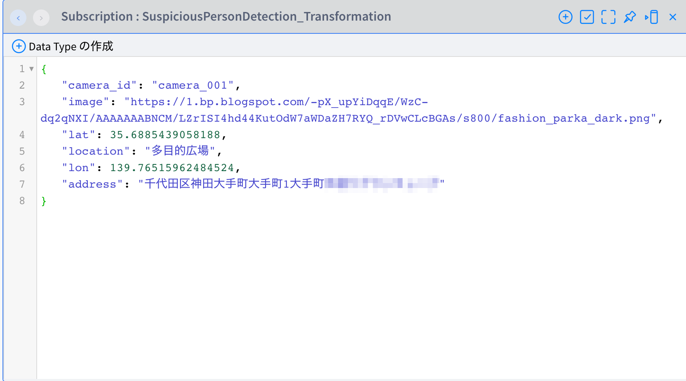
