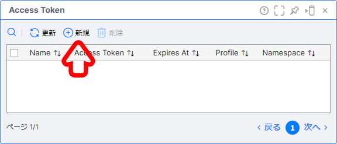
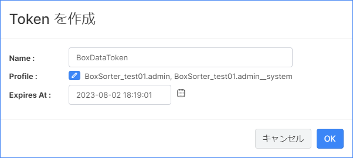
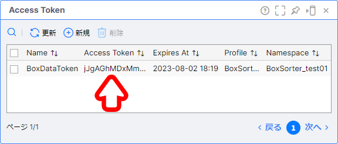

# Vantiq Access Token の発行方法

REST API や Vantiq CLI で利用する Access Token の発行方法を解説します。  

> [!CAUTION]
> Access Token は Namespace ごとに発行する必要があります。

## 目次

- [Vantiq Access Token の発行方法](#vantiq-access-token-の発行方法)
  - [目次](#目次)
  - [Access Token の発行方法](#access-token-の発行方法)
  - [Access Token の確認方法](#access-token-の確認方法)

## Access Token の発行方法

Access Token を発行するには下記の手順を実施します。  

1. メニューバーの `管理` -> `Advanced` -> `Access Tokens` -> `+ 新規` をクリックし、 Token の新規作成画面を開きます。

   

1. `Name` に任意の名前を入力し、 `OK` をクリックします。

   

## Access Token の確認方法

発行した Access Token を確認するには下記の手順を実施します。  

1. メニューバーの `管理` -> `Advanced` -> `Access Tokens` をクリックし、 Access Token の画面を開きます。

   

   > **補足**  
   > ※発行された `Access Token` をクリックすると、クリップボードにコピーされます。  
