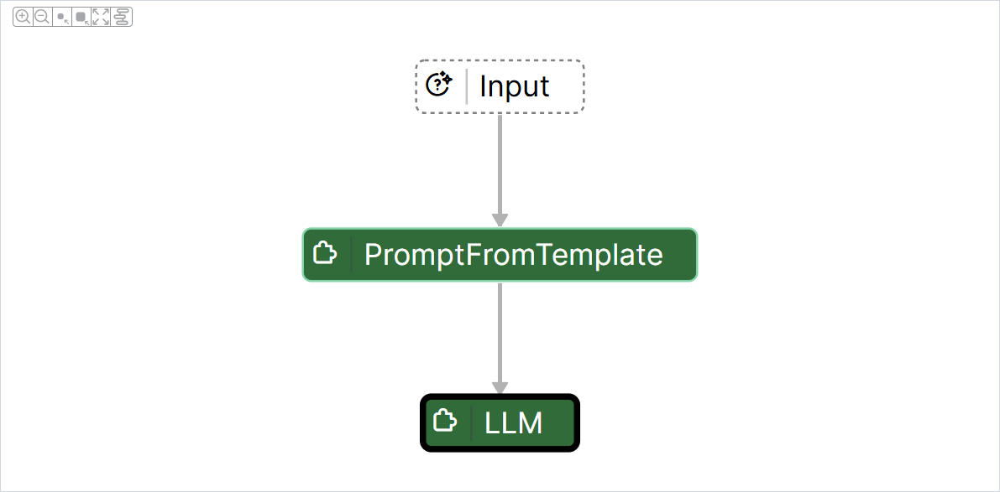
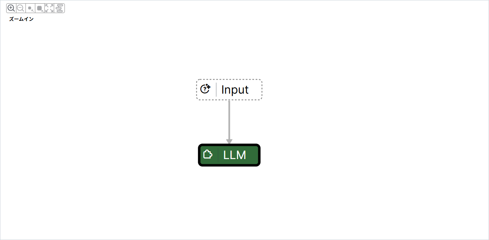
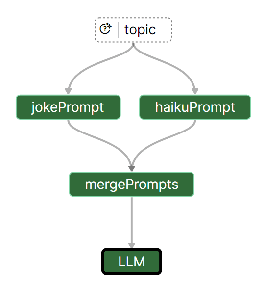
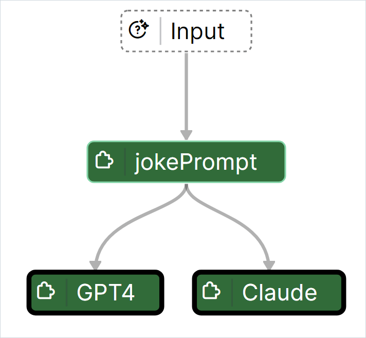
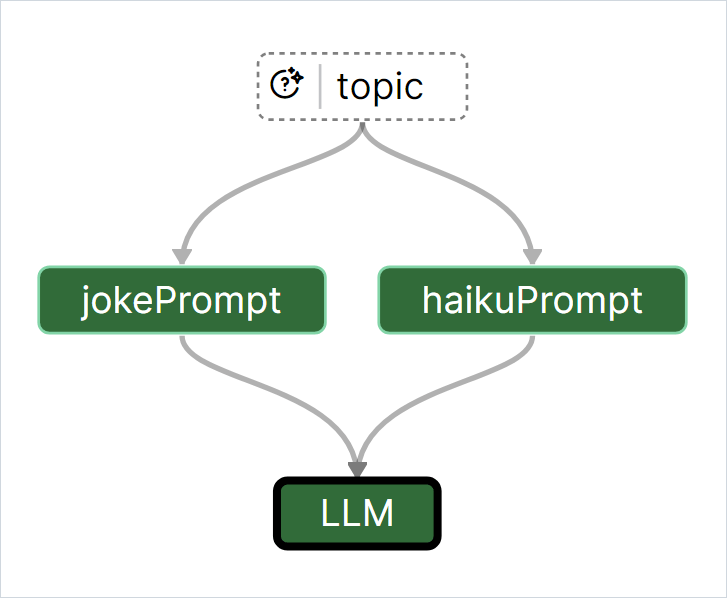
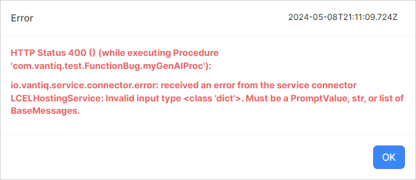
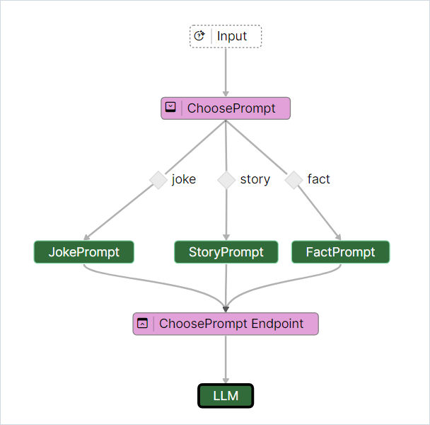
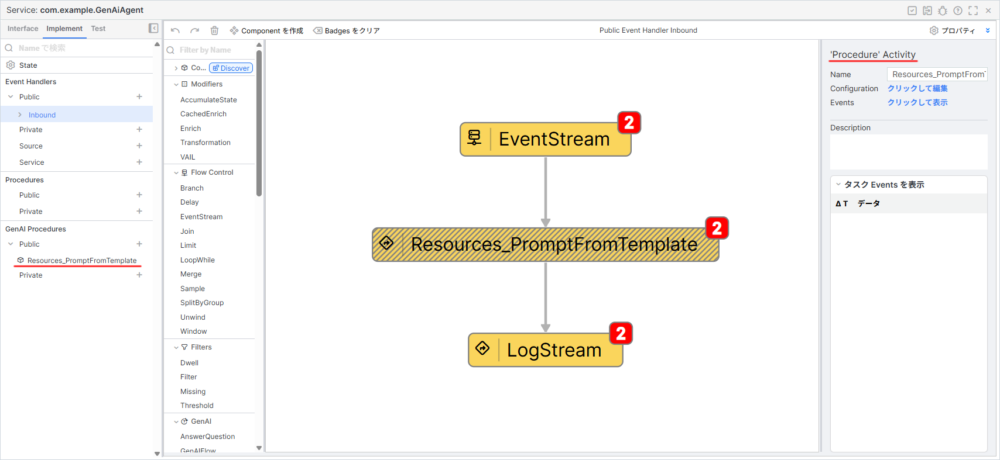
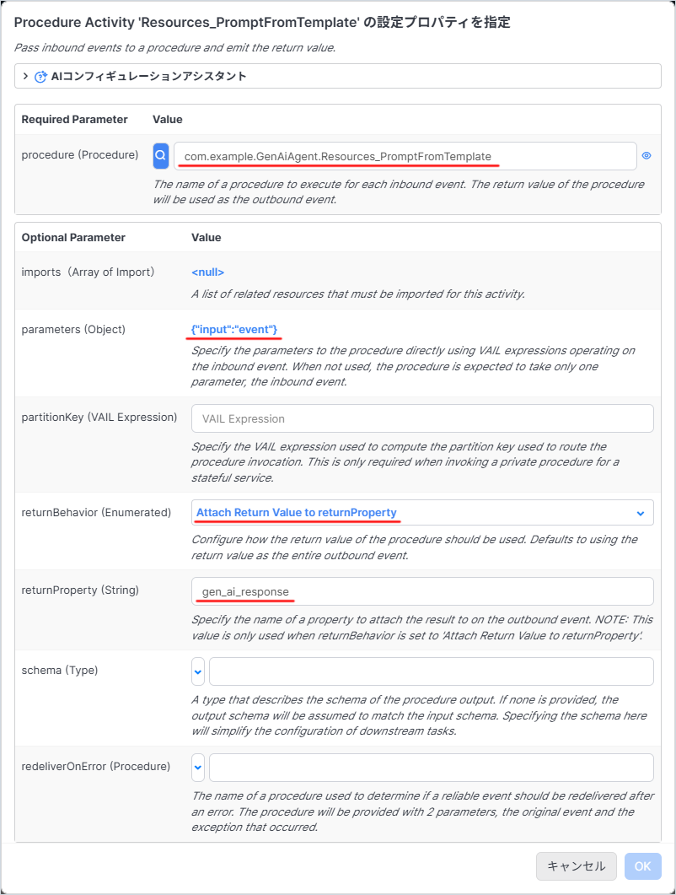
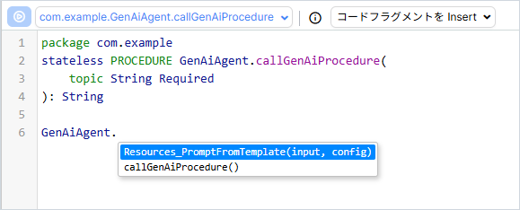

# GenAI Builder について

ここでは GenAI Builder について概要を解説します。  
（※記事作成時の Vantiq バージョン： r1.40.13）

- [GenAI Builder について](#genai-builder-について)
  - [GenAI ビルダーとは？](#genai-ビルダーとは)
  - [タスクの出力のデータフォーマットについて](#タスクの出力のデータフォーマットについて)
    - [PromptFromTemplate](#promptfromtemplate)
    - [LLM](#llm)
  - [注意すべき事前知識](#注意すべき事前知識)
    - [タスク出力のマージ](#タスク出力のマージ)
    - [ターミナルタスクのマージ](#ターミナルタスクのマージ)
    - [App Builder との違い](#app-builder-との違い)
    - [サブフロー](#サブフロー)
  - [GenAI Procedures の呼び出し方](#genai-procedures-の呼び出し方)
    - [Visual Event Handler の場合](#visual-event-handler-の場合)
    - [Procedure の場合](#procedure-の場合)

## GenAI ビルダーとは？

App Builder のように GUI ベースで GenAI を構築できる機能になります。

App Builder では SubmitPrompt Activity や AnswerQuestion Activity を利用して、アプリケーションに GenAI を迅速に追加できるように設計されています。  
しかしその一方で、これらの Activity Pattern の動作は比較的固定されています。  
これは、これらの Activity Pattern が最も広範なユースケースに対応することを目的としているためです。  

アプリケーションによっては、より特殊な GenAI 機能が必要な場合や最新の GenAI アルゴリズムを活用する必要がある場合もあります。  
これらの要件に対応することが GenAI Builder の目的です。  

## タスクの出力のデータフォーマットについて

GenAI コンポーネントは Activity Pattern とは異なり、出力されるデータフォーマットが JSON オブジェクト形式とは限りません。  

ここでは `PromptFromTemplate` と `LLM` を利用した GenAI を例に、各タスクに流れるデータを見ていきます。

### PromptFromTemplate

指定されたテンプレートを使用して、プロンプトをフォーマットします。  
Transformation Activity に似ています。  

:globe_with_meridians: [PromptFromTemplate](https://dev.vantiq.com/docs/system/genaibuilder/#promptfromtemplate)



```yaml
# Configuration の例
Required Parameter:
    promptTemplate Type: "Template"
    promptTemplate: "小説のセリフを考えています。 ${topic} についてブラックジョークを考えてください。レスポンスは作成したブラックジョークのみ返してください。"
Optional Parameter:
    defaultValues（Array of Labeled Expression）: <null>
    isSystemPrompt (Boolean): false
```

#### Input Type

テンプレートは `String`, `Vantiqドキュメント`, `URL` から指定します。  

Input Type は `String`, `Object`, `langchain_core.documents.Document` のいずれかになります。  
入力値は、Vantiqテンプレート構文または Python f文字列構文を使用します。  

```yaml
# input の例
"input":
    "topic": "上司"
"config": {}
```

#### Output Type

Output Type は `langchain_core.prompt_values.PromptValue` になります。  
LLM Component が `langchain_core.prompt_values.PromptValue` に対応しているため、そのまま受け渡すことができます。  

```yaml
# return の例
「うちの上司、仕事ができるって言うけど、実際にはただのプロのメール転送屋だよ。」
```


### LLM

大規模言語モデル（LLM）にリクエストを送信します。  
SubmitPrompt Activity に似ています。  
またレスポンスを解析／フォーマットすることもできます。  
別途 LLM リソースが必要になります。  

:globe_with_meridians: [LLM](https://dev.vantiq.com/docs/system/genaibuilder/#llm)



```yaml
# Configuration の例
Required Parameter:
    llm (LLM): "Choose Your LLM Resources"
Optional Parameter:
    outputType (Enumerated): "String"
    outputTypeSchema (Type):
```

#### Input Type

Input Type は `String`, `langchain_core.prompt_values.PromptValue`, `io.vantiq.ai.ChatMessage[]` のいずれかになります。  
単体での利用もできますが、 PromptFromTemplate Component と組み合わせて利用する場合が多いです。  
`langchain_core.prompt_values.PromptValue` での入力が可能なため、 PromptFromTemplate Component からデータフォーマットの変換等をせずに直接受け取ることができます。   

```yaml
# input の例
input: "こんにちは"
config: {}
```

#### Output Type

デフォルトの Output Type は `String` になります。  
LLM からのレスポンスを解析して JSON などの形式にフォーマットすることもできます。

```yaml
# return の例
こんにちは！今日はどんなお手伝いができますか？
```

## 注意すべき事前知識

GenAI Builder は細かい点で App Builder と異なります。  
ここでは影響が大きいもののみを解説します。  

### タスク出力のマージ

App Builder との違いとして最も大きいのが **タスク出力がマージされる** という点です。  

よくある要件の一つとして、1つのタスクの出力を複数の子タスクに送り、それらの子タスクの結果を1つの結果にマージするフローがあります。  
下記のフローは選択したトピックについて、ジョークと俳句の両方を作成するものです。  



このフローでは、最初の入力を jokePrompt タスクと haikuPrompt タスクの両方に送信しています。  
**両方のタスクが完了すると、結果はマージされた後に mergePrompts タスクに送信されます。**  
タスク出力をマージすると、各タスクごとに1つのプロパティを持つオブジェクトが生成されます。  
マージされたタスクの出力は、各タスクごとに1つのプロパティを持つ `Object` になります。  
具体的には以下のようになります。  

```json
{
    "jokePrompt": <result of jokePrompt task>
    , "haikuPrompt": <result of haikuPrompt task>
}
```

なお、この mergePrompts タスクで使用されるプロンプトは  
`Please respond to both of the following requests:\n${jokePrompt}\n\n${haikuPrompt}`  
です。  
これにより、両方のリクエストが1つのプロンプトにまとめられ、 LLM へ送信されます。  

### ターミナルタスクのマージ

ターミナルタスクとは、フローの中で最終的な出力に関わるタスクのことです。  
フローの中で、どのタスクが最終的な出力に関わっているかは、太い黒枠で囲まれていることで見分けることができます。  

複数のターミナルタスクを含むフローは、完了時にこれらのタスクを暗黙的にマージします。  
これにより、フローはターミナルタスクごとに1つのプロパティを持つオブジェクトを返します。  
例えば、次のフローがあるとします。  



このフローの実行結果は、以下のような `GPT4` と `Claude` というプロパティを持つ `Object` になります。  

```json
{
    "GPT4": <response from GPT4>
    , "Claude": <response from Claude>
}
```

### App Builder との違い

App Builder に精通しているエンジニアであれば、以下のようなフローを考えるかもしれません。



ただし、このフローを実行すると、次のエラーが発生します。



これは、 GenAI フローは App Builder の場合と違い、イベントが個別に発生する非同期処理ではなく、足並みをそろえて処理する同期的なデータの流れだからです。  

そのため、**複数の親タスクから出力された結果は、まず一つにマージされ、その後に子タスクへ渡されます。**  
マージされたデータを受け取った子タスクは、一度だけ実行されます。  

マージされたデータは先程と同様です。  

```json
{
    "jokePrompt": <result of jokePrompt task>
    , "haikuPrompt": <result of haikuPrompt task>
}
```

LLM Component で受け取ることができるデータ型は `String`, `langchain_core.prompt_values.PromptValue`, `io.vantiq.ai.ChatMessage[]` のいずれかになります。  
そのため、型が異なるというエラーが発生したのです。  

この仕組みは、意味合いとしては App Builder の Join Activity と同様です。  
ただし、 GenAI フローでは結果をまとめる方法が一つしかないため、わざわざ join タスクを明示的に用意する必要がない、というわけです。  

### サブフロー

GenAI Component の中には、サブフローを持つものがあります。  
サブフローは紫色のタスクで表され、「開始」と「終了」が示されます。  



## GenAI Procedures の呼び出し方

GenAI Builder で作成した GenAI Procedures は通常のプロシージャと同様に呼び出すことが出来ます。  

### Visual Event Handler の場合

通常の Procedure を呼び出すときと同じように Procedure Activity を利用します。





### Procedure の場合

通常の Procedure を呼び出すときと同じように VAIL を記述します。

```JavaScript
package com.example
stateless PROCEDURE GenAiAgent.callGenAiProcedure(
    topic String Required
): String

var input = {
    topic: topic
}

var response = GenAiAgent.Resources_PromptFromTemplate(input)

return response
```

また、通常の Procedure と同様に入力補完が利用できます。


