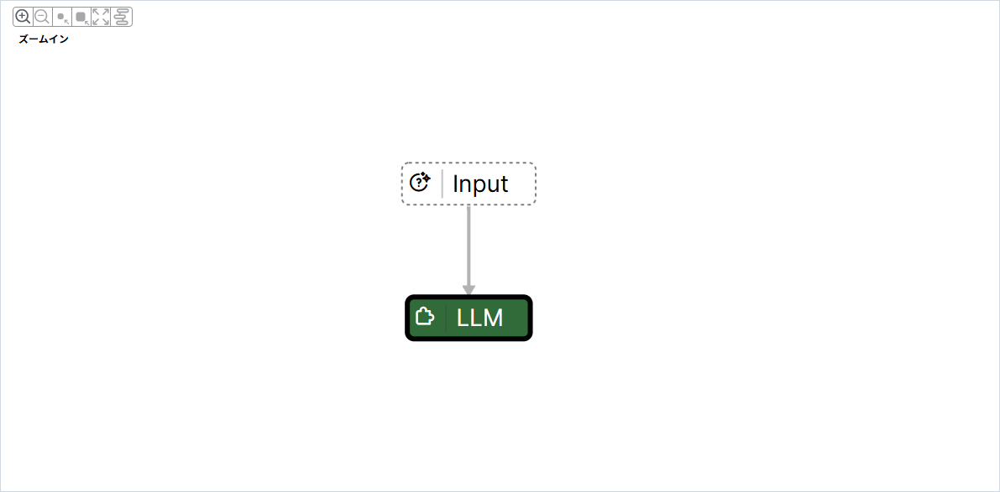

# GenAI コンポーネントについて

ここでは GenAI コンポーネントについて解説します。  
App Builder に似ていますが異なる点が多々あります。  
（※記事作成時の Vantiq バージョン： r1.40.13）

- [GenAI コンポーネントについて](#genai-コンポーネントについて)
  - [Resources](#resources)
    - [Conversation](#conversation)
    - [LLM](#llm)
    - [Procedure](#procedure)
    - [PromptFromMessages](#promptfrommessages)
    - [PromptFromTemplate](#promptfromtemplate)
    - [SemanticIndex](#semanticindex)
    - [SemanticIndexStore](#semanticindexstore)
    - [Tool](#tool)
  - [Primitives](#primitives)
    - [Assign](#assign)
    - [Branch](#branch)
    - [CodeBlock](#codeblock)
    - [Fallback](#fallback)
    - [Loop](#loop)
    - [Map](#map)
    - [NativeLCEL](#nativelcel)
    - [Transform](#transform)
  - [AI Patterns](#ai-patterns)
    - [Categorize](#categorize)
    - [Consensus](#consensus)
    - [RAG](#rag)
    - [ReduceDocuments](#reducedocuments)
  - [Document Loaders](#document-loaders)
    - [ConversationMemory](#conversationmemory)
    - [UnstructuredContent](#unstructuredcontent)
    - [UnstructuredURL](#unstructuredurl)
  - [Document Transformers](#document-transformers)
    - [CodeSplitter](#codesplitter)
    - [HTMLSplitter](#htmlsplitter)
    - [MarkdownSplitter](#markdownsplitter)
    - [ParagraphSplitter](#paragraphsplitter)
  - [Document Compressors](#document-compressors)
    - [CohereRerank](#coherererank)
    - [ExtractRelevantContent](#extractrelevantcontent)
    - [FilterForRelevance](#filterforrelevance)
    - [ListwiseRerank](#listwisererank)
  - [Guardrails](#guardrails)
    - [GuardrailsAI](#guardrailsai)
    - [NeMoGuardrails](#nemoguardrails)
  - [Configuration Processors](#configuration-processors)
    - [Optional](#optional)
    - [Repeat](#repeat)
  - [Components](#components)

## Resources

Resources は、フローの基本機能を担い、 Vantiq の関連リソースを使って設定します。  

### Conversation

maintains a conversation for the specified sub-flow. The conversation is managed via the Vantiq ConversationMemory service.

---

### LLM

大規模言語モデル（LLM）にリクエストを送信します。  
SubmitPrompt Activity に似ています。  
またレスポンスを解析／フォーマットすることもできます。  
別途 LLM リソースが必要になります。  

:globe_with_meridians: [LLM](https://dev.vantiq.com/docs/system/genaibuilder/#llm)



```yaml
# Configuration の例
Required Parameter:
    llm (LLM): "Choose Your LLM Resources"
Optional Parameter:
    outputType (Enumerated): "String"
    outputTypeSchema (Type):
```

#### Input Type

Input Type は `String`, `langchain_core.prompt_values.PromptValue`, `io.vantiq.ai.ChatMessage[]` のいずれかになります。  
単体での利用もできますが、 PromptFromTemplate Component と組み合わせて利用する場合が多いです。  

```yaml
# input の例
input: "こんにちは"
config: {}
```

#### Output Type

デフォルトの Output Type は `String` になります。  
LLM からのレスポンスを解析して JSON などの形式にフォーマットすることもできます。

```yaml
# return の例
こんにちは！今日はどんなお手伝いができますか？
```

---

### Procedure

execute the specified procedure, emitting its result.

---

### PromptFromMessages

formats a prompt using a specified list of chat messages.

---

### PromptFromTemplate

指定されたテンプレートを使用して、プロンプトをフォーマットします。  
Transformation Activity に似ています。  

:globe_with_meridians: [PromptFromTemplate](https://dev.vantiq.com/docs/system/genaibuilder/#promptfromtemplate)


```yaml
# Configuration の例
Required Parameter:
    promptTemplate Type: "Template"
    promptTemplate: "小説のセリフを考えています。 ${topic} についてブラックジョークを考えてください。レスポンスは作成したブラックジョークのみ返してください。"
Optional Parameter:
    defaultValues（Array of Labeled Expression）: <null>
    isSystemPrompt (Boolean): false
```

#### Input Type

テンプレートは `String`, `Vantiqドキュメント`, `URL` から指定します。  

Input Type は `String`, `Object`, `langchain_core.documents.Document` のいずれかになります。  
入力値は、Vantiqテンプレート構文または Python f文字列構文を使用します。  

```yaml
# input の例
"input":
    "topic": "上司"
"config": {}
```

#### Output Type

Output Type は `langchain_core.prompt_values.PromptValue` になります。  
LLM Component が `langchain_core.prompt_values.PromptValue` に対応しているため、そのまま受け渡すことができます。  

```yaml
# return の例
「うちの上司、仕事ができるって言うけど、実際にはただのプロのメール転送屋だよ。」
```

---

### SemanticIndex

used to retrieve information from a SemanticIndex resource based on semantic similarity.

---

### SemanticIndexStore

used to store information in a SemanticIndex resource.
SemanticIndexWithCompression – Queries the specified semantic index and returns an Array of similar documents after processing by the specified document compressors.

---

### Tool

used to send requests to a Large Language Model (LLM) configured for tool calling and parse/format any response. Configured via an LLM resource.

---

## Primitives

Primitives は、意思決定やカスタムコードの呼び出しといった、各種のユーティリティ機能や制御機能を持つコンポーネントです。

### Assign

adds additional properties to an initial Object input value.

---

### Branch

chooses a sub-flow to execute based on an associated condition.

---

### CodeBlock

executes the given block of code.

---

### Fallback

Supports execution of a ‘fallback’ sub-flow, if the primary flow fails.

---

### Loop

executes a sub-flow until the defined condition returns false or the specified loop limit is reached.

---

### Map

concurrently executes the contained sub-flow once for each item in the input array. Returns an array containing each of the resulting values.

---

### NativeLCEL

executes a Python code block which must return an instance of a LangChain component.

---

### Transform

transforms the event passing through the component based on the provided code.

---

## AI Patterns

AI Patterns は、 Vantiq が用意したよく使われる GenAI のアルゴリズム（パターン）集です。  
これらのコンポーネントは、そのまま使うだけでなく、独自の GenAI フローを開発する際の土台として、さらにカスタマイズすることも可能です。  

### Categorize

analyzes the given input and places it in one of the categories that are part of its configuration.

---

### Consensus

uses multiple LLMs to arrive at a consensus response to the supplied input prompt.

---

### RAG

an implementation of Retrieval Augmented Generation (RAG). This implementation matches the one provided by the AnswerQuestion activity pattern.

---

### ReduceDocuments

uses a given prompt and LLM to reduce an array of documents to a single result.

---

## Document Loaders

Document Loaders の役割は、データソースからコンテンツを読み取り、 LangChain ドキュメントの配列を作成することです。  
（※これは Vantiq が標準で持つ Documents リソースとは別物なのでご注意ください。）  
どのローダーを使うかによって、読み込むデータの種類や、そこから情報を取り出す方法が異なります。  

### ConversationMemory

reads the current state of a specified conversation.

---

### UnstructuredContent

### UnstructuredURL

reads from a URL (or an array of URLs) and uses the unstructured library to extract content from whatever the URL references.

---

## Document Transformers

Document Transformers の役割は、入力コンテンツ（主に LangChain ドキュメントの配列）に指定の変換処理を行い、その結果を再び LangChain ドキュメントの配列として出力することです。  
主な用途は、取り込み済みのコンテンツに対して、セマンティックインデックスへ格納するための前処理を施すことです。  

### CodeSplitter

analyzes a document containing a specified programming language and sub-divides it based on that language’s keywords.

---

### HTMLSplitter

analyzes an HTML document and sub-divides it based on the formatting tags.

---

### MarkdownSplitter

analyzes a Markdown document and divides it first into sections (based on the presence of headers). For any sections that are “too large” it further subdivides them into code blocks, horizontal lines, paragraphs, sentences, and words.

---

### ParagraphSplitter

analyzes text (ignoring any formatting) and divides it into paragraphs based on the placement of newlines. If any given paragraph is “too large” (based on configuration) then it may be further subdivided, first into sentences, then into words, and then arbitrarily.

---

## Document Compressors

Document Compressors は、検索の精度や速度を上げることを目的として、コンテンツを文脈に応じて圧縮（コンテキスト圧縮）する機能です。  
これは、単体の部品として使うこともできますし、 SemanticIndexWithCompression というタスクと組み合わせて、より高度な検索機能である Contextual Compression Retriever を作ることもできます。  
この圧縮処理の際、コンプレッサーはインプットとして LangChain ドキュメントの配列と、検索に使われているクエリを受け取ります。  

### CohereRerank

Uses the specified Cohere re-ranking model to order the documents based on their relevance to the query.

---

### ExtractRelevantContent

Extracts any content from the documents based on its relevance to the query.

---

### FilterForRelevance

Filters the documents to remove any that lack content relevant to the query.

---

### ListwiseRerank

Uses an LLM to perform a “listwise” re-ranking of the documents based on their relevance to the query.

---

## Guardrails

### GuardrailsAI

An implementation of the Guardrails-AI toolkit with a limited set of Validators. Used to protect against invalid or improper prompts and responses.

---

### NeMoGuardrails

An implementation of Nvidia’s NeMo Guardrails toolkit. Used to protect against invalid or improper prompts and responses, and to tailor LLM prompts or responses for certain topics. Intended for more complex or comprehensive use-cases, compared to the Guardrails-AI toolkits.

---

## Configuration Processors

Configuration Processors は、ユーザーが独自の GenAI コンポーネントを作成するのを手助けするための機能です。  
このプロセッサが定義する動作内容は、ユーザー定義コンポーネントからタスクを作る際に最初に指定した設定値によって決まります。  

### Optional

defines a sub-flow which will be conditionally executed based on the supplied initial configuration.

---

### Repeat

defines a sub-flow that will be executed multiple times, based on how many initial configuration values are specified.

---

## Components

Components は、ユーザーが作成した GenAI コンポーネントが表示される場所です。

---
