# Webサイトの情報をLLMで利用する方法

本記事では、Webサイトの情報をLLMに渡して利用する方法を解説します。  
（※記事作成時の Vantiq バージョン： r1.40.13）

## 目次

- [Webサイトの情報をLLMで利用する方法](#webサイトの情報をllmで利用する方法)
  - [目次](#目次)
  - [概要](#概要)
  - [事前準備](#事前準備)
    - [参考例](#参考例)
  - [実装方法](#実装方法)
    - [1. Public GenAI Procedure の作成](#1-public-genai-procedure-の作成)
    - [2. Public GenAI Procedure の実装](#2-public-genai-procedure-の実装)
    - [Public GenAI Procedure の実行](#public-genai-procedure-の実行)
  - [Public GenAI Procedure の呼び出し方](#public-genai-procedure-の呼び出し方)
    - [Event Handler の場合](#event-handler-の場合)
    - [VAIL Procedure の場合](#vail-procedure-の場合)
  - [サンプルプロジェクト](#サンプルプロジェクト)

## 概要

Webサイトの情報をLLMで利用するには GenAI の `UnstructuredURL` コンポーネントを利用します。  

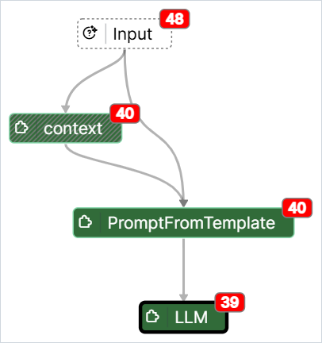

## 事前準備

事前に下記のリソースを用意します。  

- LLM リソース
- Service リソース

### 参考例

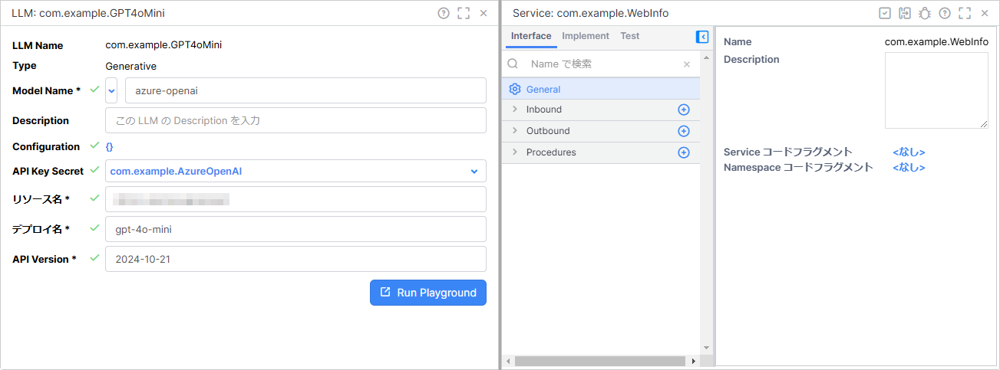

> **補足**  
> リソース名やLLMのモデルは任意のもので大丈夫です。

## 実装方法

### 1. Public GenAI Procedure の作成

1. `com.example.WebInfo` を開き、 `Implement` タブを開きます。

1. `GenAI Procedures` の `Public` の `＋` ボタンをクリックし、 `Public GenAI Procedure を追加` をクリックします。

   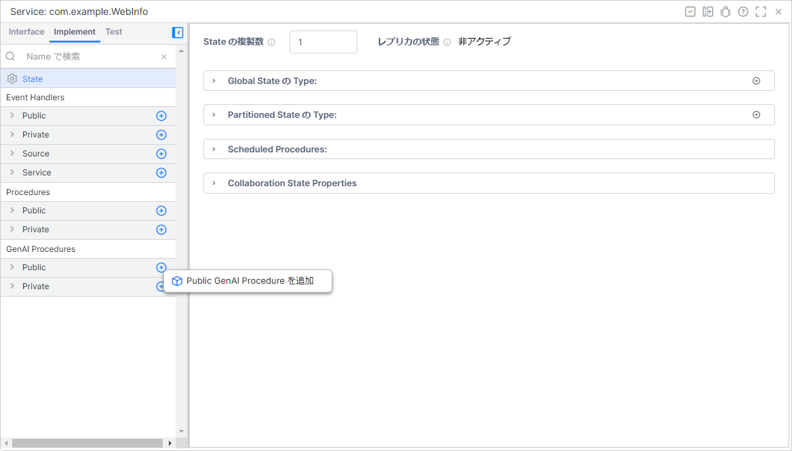

1. `Name` に `SummarizeWebsite` を入力し、 `作成` をクリックします。

   

### 2. Public GenAI Procedure の実装

1. `Document Loaders` から `UnstructuredURL` を選択し、 `Input` タスクにドロップします。

   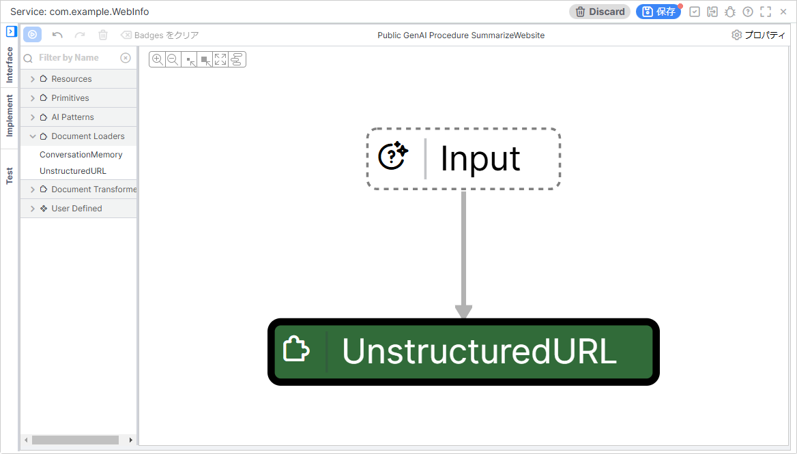

1. `name` を `context` に変更します。

   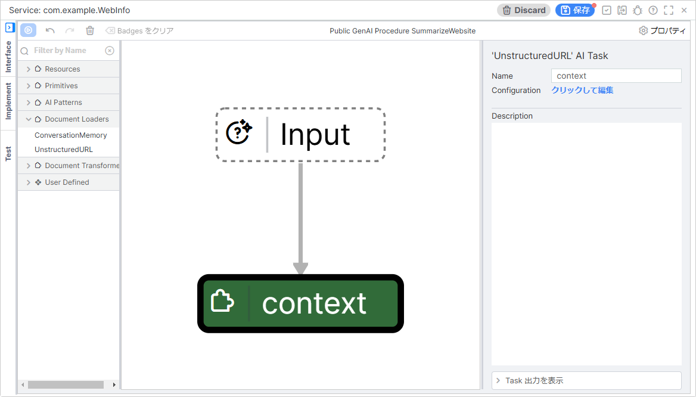

1. `Resources` から `PromptFromTemplate` を選択し、 `Input` タスクと `context` タスクにドロップします。

   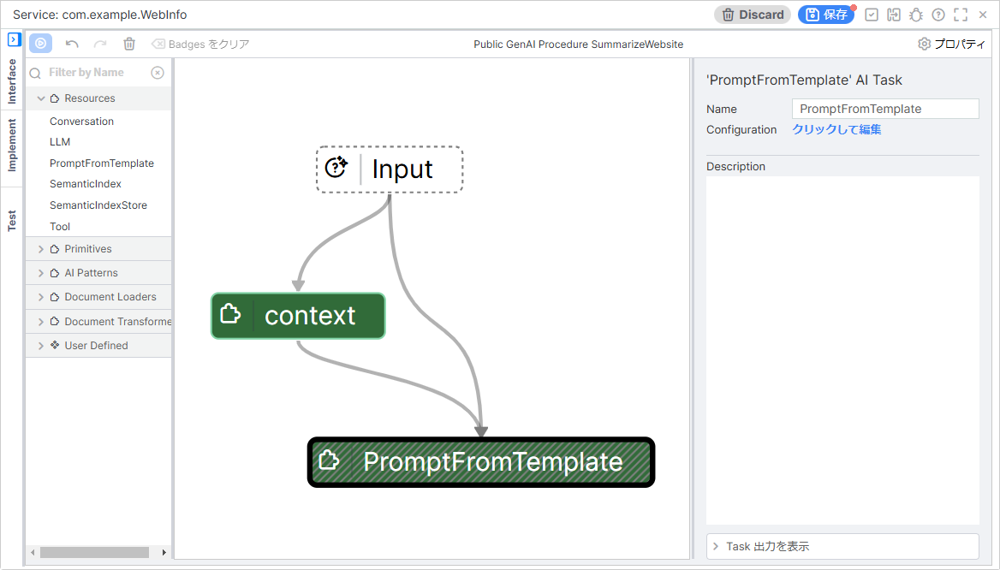

1. `PromptFromTemplate` タスクの `Configuration` の `クリックして編集` をクリックします。

1. `promptTemplate` の `<null>` をクリックします。

1. `promptTemplate:` の `︙` をクリックします。

   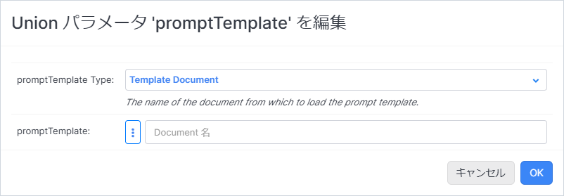

1. `新規 Document を追加` をクリックします。

   

1. 下記のプロンプト文を入力し、 `名前をつけて保存...` をクリックします。

   ```text
   contextを分析して、3行程度に日本語で要約してくだださい。

   ${context}
   ```

   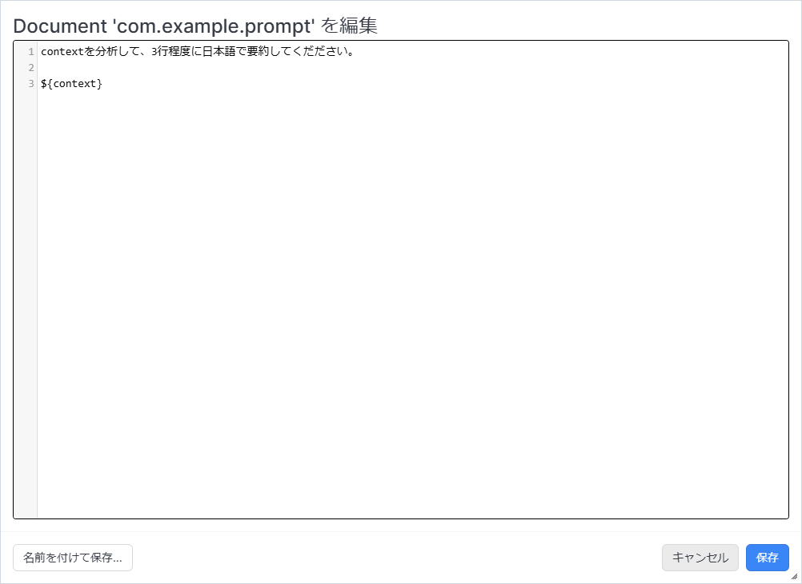

1. `Document 名` に `com.example.prompt` と入力し、 `OK` をクリックします。

   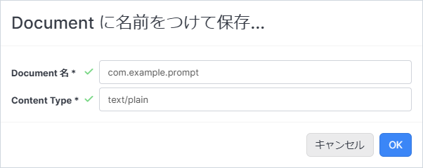

1. `com.example.prompt` を選択します。

   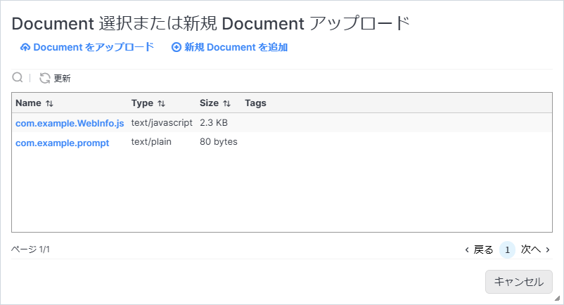

1. `OK` を2回ほどクリックして、ポップアップウィンドウを閉じます。

1. `Resources` から `LLM` を選択し、 `PromptFromTemplate` タスクにドロップします。

   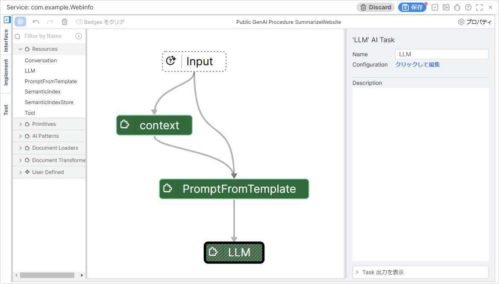

1. `LLM` タスクの `Configuration` の `クリックして編集` をクリックします。

1. `llm (LLM)` に事前に準備した LLM リソースを設定し、 `OK` をクリックします。

   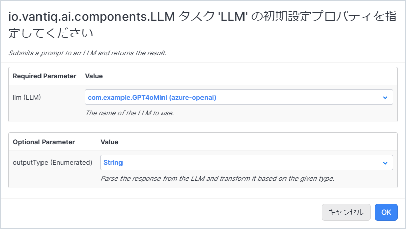

1. 画面右上の `保存` をクリックして Service を保存します。

> **補足**  
> プロンプト内で指定している変数 `${context}` はその直前の AI Task のタスク名と一致している必要があります。  
> そのため、この実装手順では `UnstructuredURL` タスク名を `context` に変更しています。  

### Public GenAI Procedure の実行

1. 画面左上の `実行ボタン` をクリックします。

   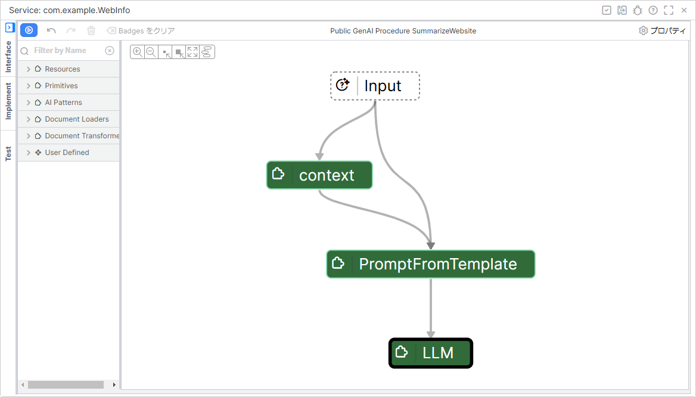

1. `input` に任意の URL を入力して、 `実行` をクリックします。

   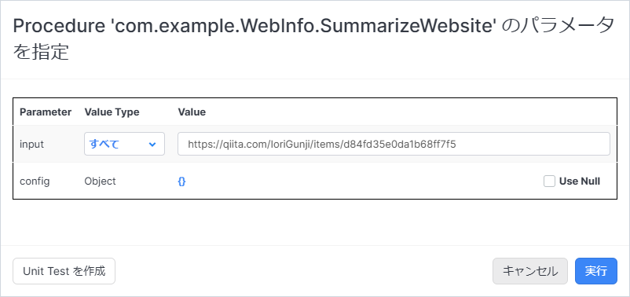

1. 実行結果を確認します。

   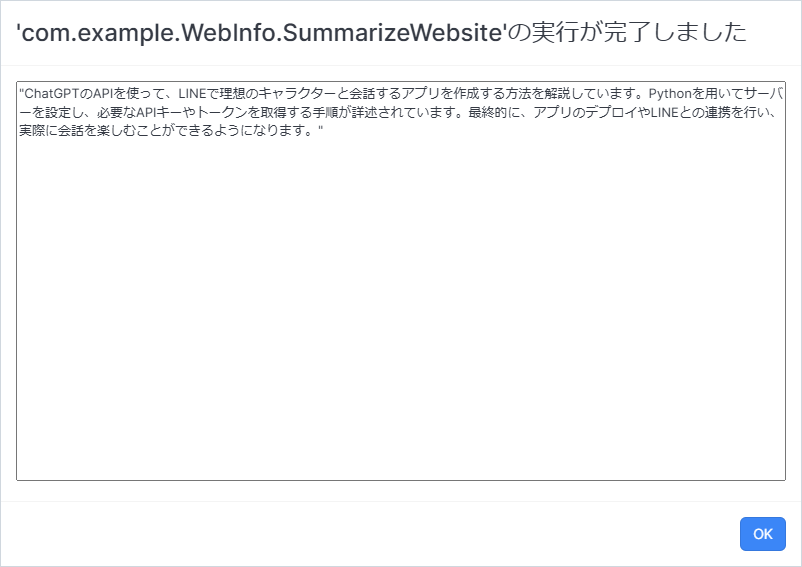

## Public GenAI Procedure の呼び出し方

作成した Public GenAI Procedure は任意の Event Handler や Procedure から呼び出せます。

### Event Handler の場合

VAIL Procedure と同様に Procedure Activity から呼び出します。

#### Event Handler の設定例

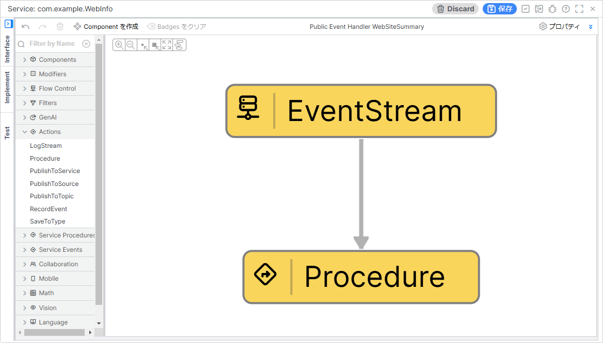

#### Procedure Activity の設定例

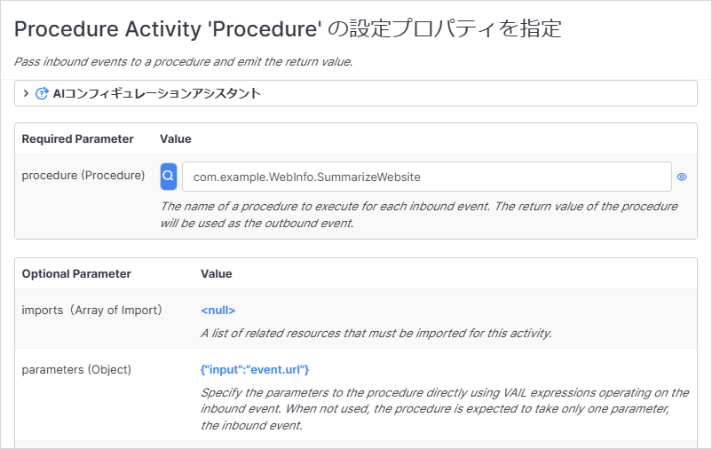

#### Event の実行例

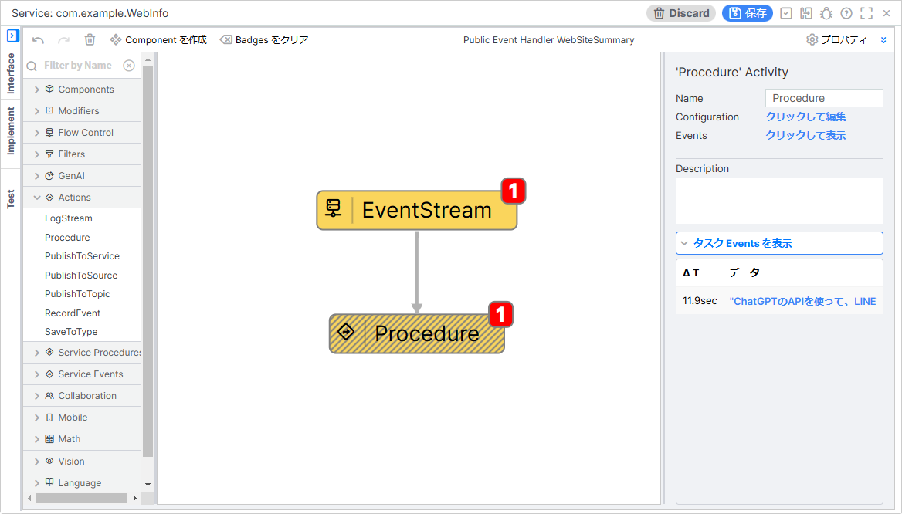

### VAIL Procedure の場合

Procedure を呼び出す場合と同様に呼び出します。

#### Procedure の例

```JavaScript
/* 引数に与えられたURLのWebサイトを要約して文字列で返します。 */
package com.example
stateless PROCEDURE WebInfo.getWebSiteSummary(
    url String Required Description "要約したいWebサイトのURL"
): String

var summary = WebInfo.SummarizeWebsite(url)

return summary
```

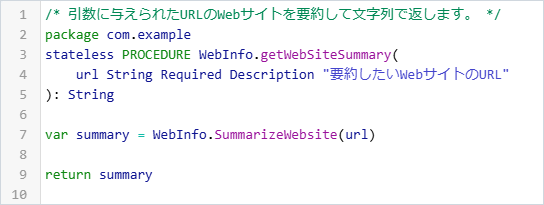

#### Procedure の実行例

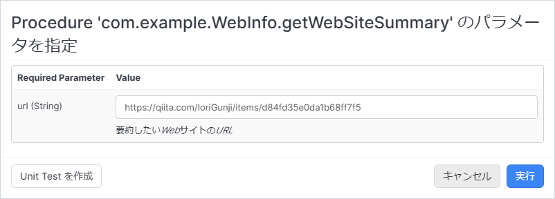

#### Procedure の実行結果

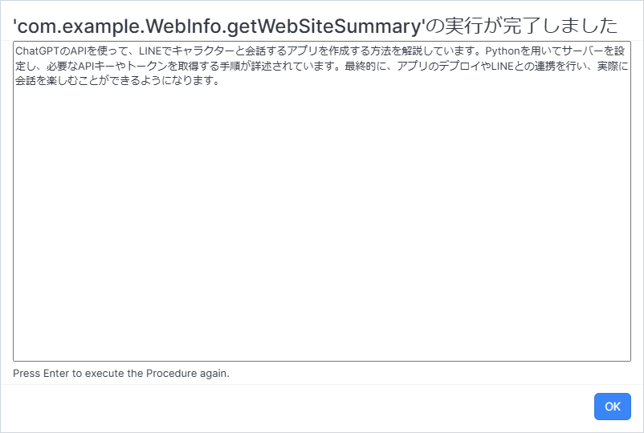

## サンプルプロジェクト

下記のプロジェクトファイルを利用する場合は、 LLM リソースの設定を再設定してください。  

- [using_website_information_in_llm_1.40.13.zip](./data/using_website_information_in_llm_1.40.13.zip)
