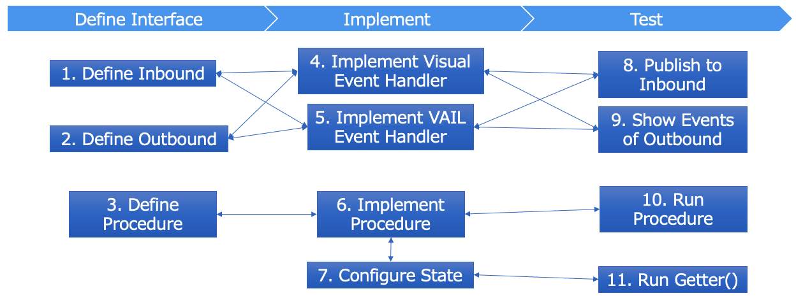

# Vantiq Service の実装とベストプラクティス

Vantiq Service の実装とベストプラクティスについて解説します。  

## 目次

- [Vantiq Service の実装とベストプラクティス](#vantiq-service-の実装とベストプラクティス)
  - [目次](#目次)
  - [Vantiq Service の実装](#vantiq-service-の実装)
    - [Service Builder](#service-builder)
    - [他のモジュール、外部サービスとの統合](#他のモジュール外部サービスとの統合)
    - [Concurrent Service](#concurrent-service)
  - [Vantiq Service ベストプラクティス](#vantiq-service-ベストプラクティス)

## Vantiq Service の実装

### Service Builder

Service Builder は Service を作成するツールです。  
3つのタブで構成されています。  

- Interface - インタフェースを定義
- Implement - インタフェースを実装
- Test - テストケースを作成

#### Service 作成のフロー

1. [Inbound を定義する](https://dev.vantiq.com/docs/system/services/index.html#event-types)
2. [Outbound を定義する](https://dev.vantiq.com/docs/system/services/index.html#event-types)
3. [Procedure を定義する](https://dev.vantiq.com/docs/system/services/index.html#procedure-signatures)
4. [Visual Event Handler で実装する](https://dev.vantiq.com/docs/system/apps/index.html)
5. [VAIL で実装する](https://dev.vantiq.com/docs/system/rules/index.html#rules)
6. [Procedure を実装する](https://dev.vantiq.com/docs/system/services/index.html#procedures)
7. [State を設定する](https://dev.vantiq.com/docs/system/services/index.html#stateful-services)

### 他のモジュール、外部サービスとの統合

- Serviceの外部から、Service + インタフェース名でイベントを受けたり渡したりできる。

### Concurrent Service

- Stateへのアクセスはスレッドまたがることが不可避である。スレッドセーフに行うため、**Concurrent Service** が提供されている。
  - _Concurrent.Lock()_ – コードブロックの実行を排他的に実行するためのロックを取得する。
    - _synchronize(function)_ – 引数で渡したコード (Lambda) を排他実行する。
- **Map** 型, **Value** 型は State専用の型で、Concurrent Serviceが予め実装されているので、Lockを意識する必要はない。ただし、Lambdaの形でロジックを引数で渡す必要がある。
  - _ConcurrentMap_
    - _compute(key, remappingFunction)_ – キーに対応するvalueを更新する
    - _computeIfAbsent(key, remappingFunction)_ - Mapにキーが存在しない場合にエントリーを作成する
    - _computeIfPresent(key, remappingFunction)_ - キーに対応するvalueを更新する
- [Concurrent Service リファレンス](https://dev.vantiq.com/docs/system/rules/index.html#concurrent)

## Vantiq Service ベストプラクティス

- Replicationを適切に設定する
  - 信頼性とスループットはトレードオフであるので、必要であれば設定する
  - 最大でも2で十分
- メモリにため過ぎない
  - Stateに保持したデータは明示的に消去（Serviceを変更、StateをClearなど）しない限り、永久に残る。貯めすぎるとメモリを圧迫し、サービスがダウンしたりインメモリデータが失われる恐れがある。
  - 古いデータをパージするProcedureを実装し、スケジュール実行する
  - Circular Bufferを実装して、古い要素は順次が消去する
- 接続するシステムもしくはSourceにつき1つのServiceにする。
  - 再利用性が向上する。
  - Source同士の依存性がなくなり、インクレメンタルに機能追加、変更が容易になる。
- Package名をつける
  - 再利用性、移植性が向上する
- カプセル化された個々の要素へはアクセスしない。
  - Serviceとそれを利用するリソース間を疎結合に保つ → 実装工数を削減につながる。
