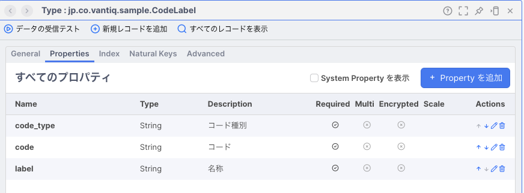
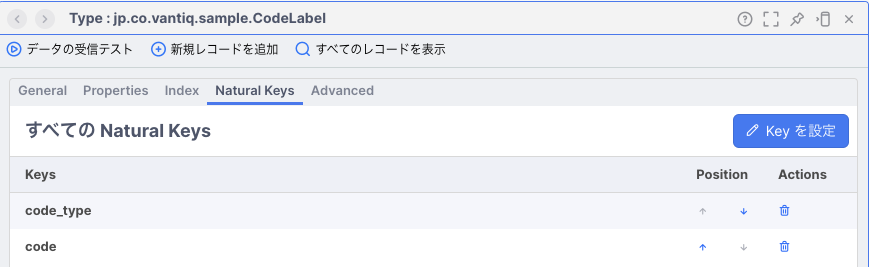
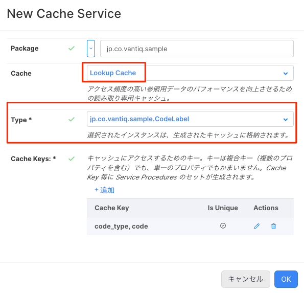
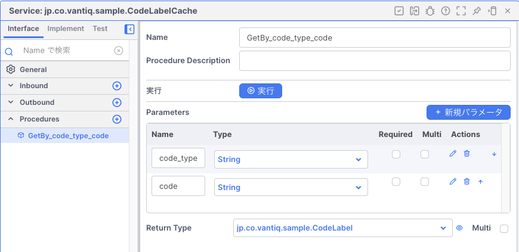
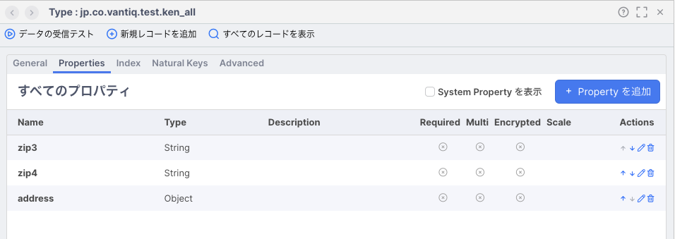
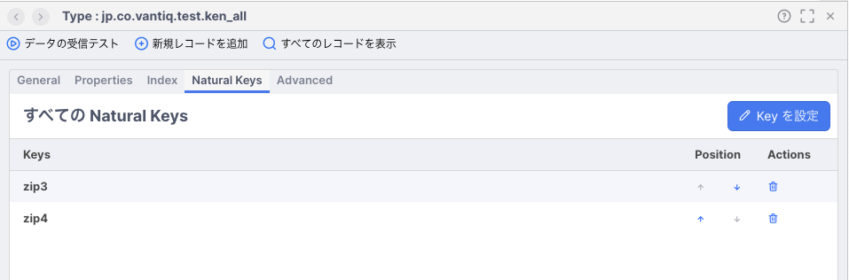
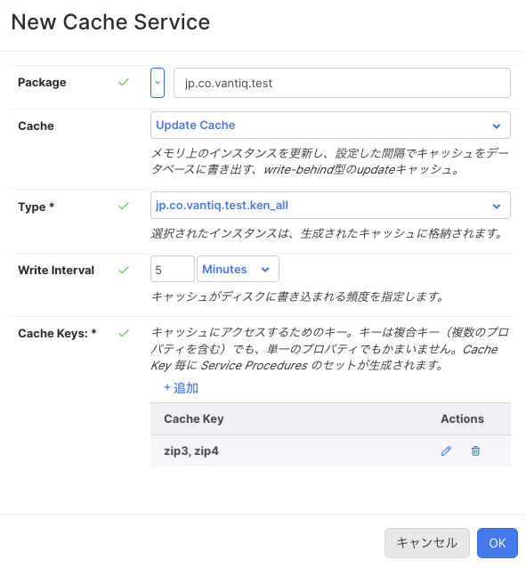
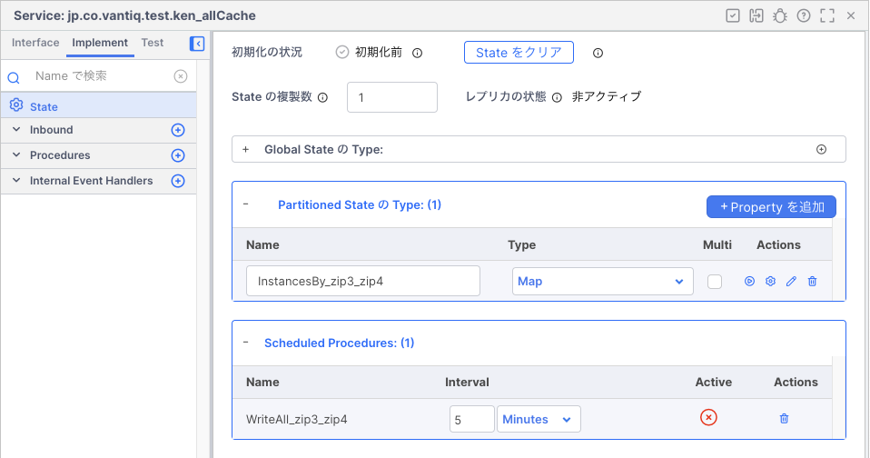
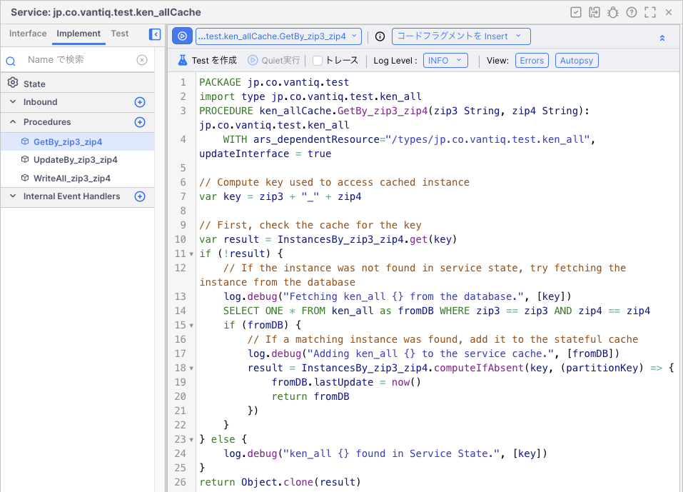

# Cache Service

Cache Serviceは、Typeで扱うデータを一時的にメモリにキャッシュすることで、検索や更新の回数を減らすことができ、パフォーマンスの向上が期待できます。​ Version 1.35で追加されました。

## 用途
- `Lookup Cache`: 同じマスタデータ（定数設定値、ラベルなど）を繰り返し参照する
- `Update Cache` : ストリーム処理から発する非同期の更新において、Typeへの同時書き込みがボトルネックとなるのを回避する 

## 仕組みと作成方法

### Lookup Cache

1. [追加] >> Type を作成します。 Index と Natural Key が設定しておきます。

    
    

2. [追加] >> Service から Service を追加します。 Cache Serviceを選択します。
    

3. Cacheの種類を `Lookup Cache`とし、前のステップで作成したTypeを指定します。
    

4. Cache Service が自動作成されます。

    
    
    
    これ以降、この Service の `GetBy_XXX` Procedure を呼び出すことで、自動的にキャッシュされたデータにアクセスできます。

### Update Chache

1. [追加] >> Type を作成します。 Index と Natural Key が設定しておきます。
    
    

2. [追加] >> Service から Service を追加します。 Cache Serviceを選択します。

    

3. Cacheの種類を `Update Cache`とし、前のステップで作成したTypeを指定します。キャッシュを定期的に Typeに書き込む時間を分単位で指定します。

    

4. Cache Service が自動作成されます。

    
    
    

    これ以降、この Service の `UpdateBy_xxx` Procedureを呼び出すことで、メモリ上のデータを更新できます。設定した時間ごとに更新処理 (`WriteAll_xxx` Procedure) が起動し、一括で更新を行います。一括更新が終わると、メモリ上のキャッシュは削除されます。

## 使用する際の注意事項

- Cache Service内部では、配列を用いています。Vantiqの配列のサイズは仕様上上限があるため、上限を超える量の書き込みを一度に行おうとするとエラーになってしまいます。10,000件に留めるように配慮する必要があります。
- Updateモードにおいては、Typeへの書き込み実行後、メモリ上のデータは破棄されます。Typeへの書き込み実行から反映までごく短時間ですが、時間差があり、再度の読み込み時に更新前の古い値を参照することがあります。つまり、UpdateモードのCache ServiceをLookup用途として使用することは避けた方が良いでしょう。
- 生成されたProcedureに手を加えることもできますが、意図しない動作結果になる可能性もあるため、行うべきではありません。参照するのは問題ありません。
- Typeに変更があった場合（Natural Keyの構成、名前など）、Cache Service再作成が必要となります。

