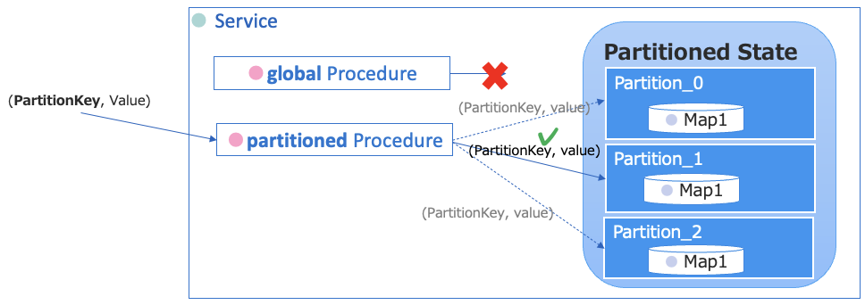
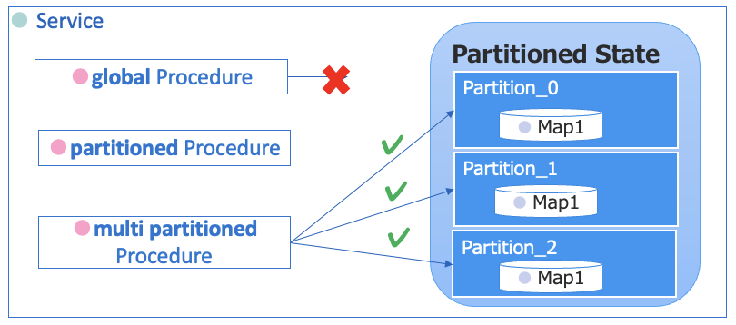

# Stateful Service とは

高度なアプリケーションを開発するうえで欠かせない Stateful Service について解説します。  

## 目次

- [Stateful Service とは](#stateful-service-とは)
  - [目次](#目次)
  - [Stateful Service とは](#stateful-service-とは-1)
    - [Global State](#global-state)
    - [Partioned State + Partitioned Procedure](#partioned-state--partitioned-procedure)
    - [Partioned State + Multi-Partitioned Procedure](#partioned-state--multi-partitioned-procedure)
    - [Stateful なアクティビティパターン](#stateful-なアクティビティパターン)
    - [Replication Factor](#replication-factor)
    - [Initializer](#initializer)

## Stateful Service とは

- 本来イベント処理は状態を保持しない（Stateless）が、Stateful Serviceは複数のProcedure、Ruleの実行にまたがり、__「状態(State)」をメモリ上で保持する__ 仕組みを提供します。
- Stateful Serviceは DBに依存しないため、__軽量でスケールアウト__ でき、かつ大量処理を行いやすい。
- 分散の方式2種類あり、それぞれ異なるスコープを持ちます。
  - __Global__ – Serviceごとに１つの状態インスタンスをもつ
  - __Partitioned__ – VantiqクラスタメンバーごとにPartition化した状態インスタンスをもつ
- Stateを参照・更新できるのは、Serviceに実装したProcedureのみ。
- [Stateful Serviceのリファレンス](https://dev.vantiq.com/docs/system/services/index.html#stateful-services)

### Global State
- Serviceごとに１つの状態インスタンスを持つ
- `global`修飾子の Procedure からアクセス可能である。Procedure 内に暗黙の変数となる。
- [Global Stateのリファレンス](https://dev.vantiq.com/docs/system/services/index.html#global-state)

### Partioned State + Partitioned Procedure
- Vantiqクラスタメンバーごとに、Partition化した状態インスタンスを持つ
- `partitioned`修飾子の Procedure からアクセス可能である。Procedure 内に暗黙の変数となる。
- Paritioned Procedureは第1引数の __PartitionKey__ (String) が必須である。
- ParitionKey から算出されたいずれか1つの Partition 上で Procedure が実行される。
- [Partitioned Stateのリファレンス](https://dev.vantiq.com/docs/system/services/index.html#partitioned-state)

### Partioned State + Multi-Partitioned Procedure
- multi partitonedのProcedureは、すべてのPartitioned Stateインスタンスに対して、並行に処理を実行する
- Partition Keyの指定は不要
- 用途としては、初期化、永続化処理など
- [Multi-Partitioned Procedureのリファレンス](https://dev.vantiq.com/docs/system/services/index.html#partitioned-state)

### Stateful なアクティビティパターン
- いくつかのアクティビティパターンは、Stateに状態を保持する。そのため、Serviceは保存時に自動的に State変数や 関連する補助 Procedure を作成する。
- アクティビティパターンの例
  - **_AccumulateState_**
  - _**CachedEnrich**_
  - _**ComputeStatistics**_
- [Stateful Activity Pattern のリファレンス](https://dev.vantiq.com/docs/system/apps/index.html#app-service)

### Replication Factor
- Replication Factorを2以上に設定すると、クラスタメンバー間でデータを冗長化する。
  - クラスタメンバーに障害があってもデータが失われず、信頼性を向上できる。
- **Map** 型または **Value** 型の State プロパティのみが複製される。
- [Service Replication のリファレンス](https://dev.vantiq.com/docs/system/services/index.html#service-replication)

### Initializer
- 定義しておくと、Partitionが変更されたり、再起動したときにSystemに呼び出される。以下のシグニチャで作成する。
  - Global: _globalStateInitializer_
  - Partitioned:  _partitionedStateInitializer_
  - 修飾子はprivate, parameterはなし
  - アクセス修飾子(global, muti partitoned等）なし
- State変数は初期化済みなので、Initializerで初期化する必要はない。
- [Service Initializer のリファレンス](https://dev.vantiq.com/docs/system/services/index.html#state-initialization)
