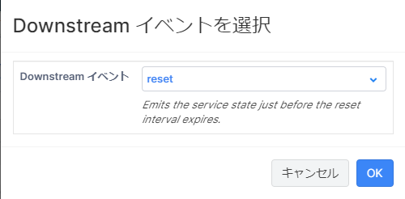

- [ハンズオン概要](#ハンズオン概要)
- [資材説明](#資材説明)
- [事前準備](#事前準備)
  - [Vantiq環境](#vantiq環境)
  - [Python実行環境準備](#python実行環境準備)
  - [Live Reporterのインストール](#live-reporterのインストール)
- [Visual Event Handler - 物体検知情報集計処理の作成](#visual-event-handler---物体検知情報集計処理の作成)
  - [概要](#概要)
  - [Service画面の表示](#service画面の表示)
  - [Step1：イベントのグループ化](#step1イベントのグループ化)
  - [Step2：検知したオブジェクトのカウント](#step2検知したオブジェクトのカウント)
  - [Step3：データを加工](#step3データを加工)
  - [Step4：集計後データをTypeに保存](#step4集計後データをtypeに保存)
- [実行手順](#実行手順)
  - [Python実行環境・LiveReporterを用意できている場合](#python実行環境livereporterを用意できている場合)
    - [設定ファイルの編集](#設定ファイルの編集)
    - [映像データの送信](#映像データの送信)
    - [実行状況・結果の確認](#実行状況結果の確認)
  - [Python実行環境・LiveReporterを用意できていない場合](#python実行環境livereporterを用意できていない場合)

<br>

# ハンズオン概要

Vantiqを用いて、映像処理を行うサンプルロジックを構築します。

処理の流れは以下の通りです。

1.  ネットワークカメラ (iPhone + Live Stream) から映像ストリーム RTSP
    で配信

1.  Connector (Python スクリプト)で 映像ストリームを取得

1.  映像の解析 (Yolo)を実施

1.  映像を解析した結果を Vantiq に連携

1.  Vantiq でストリームを整形、結合、サマリを実施


# 資材説明
「conf」ディレクトリ配下の資材については以下の通りです。
<br>

| 名称 | 種別 | 概要  |
| ---- | ---- | ---- |
| opencv-rtsp.py | ファイル | 下記処理を行うPythonスクリプトファイル <br>・ RTSPによる映像ストリームの取得<br>・ 物体検出アルゴリズムYOLOによる画像解析<br>・ Vantiqへの画像およびJSONデータの送信    |
| requirements.txt | ファイル | Pythonスクリプトファイルの実行に必要なパッケージを記載した設定ファイル  |
| setting.py     | ファイル  | 「opencv-rtsp.py」で参照するパラメータを記載した設定ファイル  |
| video_stream_ws.zip     | ファイル  | 本ハンズオンで使用するVantiqプロジェクトファイル<br>※後述のVantiq環境準備にてzipファイル形式のままインポートを行うため、zip展開は不要  |
| files          | フォルダ | Pythonスクリプトで画像を一時保存するための作業用フォルダ  |
| models         | フォルダ | YOLOの学習モデルや設定ファイルを配置  |
<br><br>

# 事前準備

Vantiqへ映像解析後のデータを送信するため、以下の準備を行います。
<br>
万が一Python実行環境等の準備が難しい場合、Vantiq上でダミーデータをテスト送信する方法（後述）を利用することも可能ですので、Vantiq環境の準備のみ実施してください。
<br><br>
## Vantiq環境

-   初期登録・設定

    参加者には事前に招待メールを送信いたしますので、下記手順に従ってユーザーアカウントの作成～開発用Namespaceの作成を行ってください。

    <https://github.com/fujitake/vantiq-related/blob/main/vantiq-apps-development/1-day-workshop/docs/jp/0-01_Prep_for_Account.md>

    Namespace名はシステム全体でユニークである必要がありますので、下記の通り設定します。

    ・開発用Namespace名：video_stream_ws\_{氏名が判別できる英文字列}
    
    ⇒（例）田中太郎さんの場合：video_stream_ws_trtanaka

-   ハンズオン用プロジェクトのインポート

    作成したNamespaceにて、ハンズオン用プロジェクト「video_stream_ws.zip」をインポートします。

1.  上部メニューより「Projects \> インポート」を選択

    

1.  表示されるダイアログの指示に従い、画面に「video_stream_ws.zip」をドラッグ＆ドロップしてインポート

1.  リロードを促されるためリロードし、画面左側の「Project \> Contents」に下記のように各リソースが追加されていることを確認。
    >
<br><br>
## Python実行環境準備

-   実行環境OSに合わせ、一般的な方法でPythonをインストール（※）

-   ターミナル/コマンドプロンプトにて、下記コマンドでPythonパッケージを一括インストール

```console
$ cd {"requirements.txt"の配置ディレクトリ}                       
$ pip install -r requirements.txt                                  
```

>>※VSCode等Pythonファイルを実行しやすい開発環境を用意することを推奨
<br><br>
## Live Reporterのインストール

スマートフォンやタブレットなど、カメラ付きのiOS/Android端末（※）にて下記アプリをインストール

※Pythonスクリプトを実行するPCと同じネットワークに接続できる必要あり

- iOS：[iOSアプリダウンロード](https://apps.apple.com/jp/app/live-reporter-%E3%82%B9%E3%83%9E%E3%83%BC%E3%83%88%E3%83%95%E3%82%A9%E3%83%B3%E3%82%92%E3%83%A9%E3%82%A4%E3%83%96%E3%82%AB%E3%83%A1%E3%83%A9%E3%81%AB/id996017825)
- Android：[Androidアプリダウンロード](https://apkpure.com/jp/live-reporter-security-camera/net.kzkysdjpn.live_reporter/versions)
<br><br>
# Visual Event Handler - 物体検知情報集計処理の作成

## 概要

Visual Event Handlerを利用して、物体検知された情報をリアルタイムに集計するアプリケーションを作成します。

<br><br>
## Service画面の表示
<br>
ハンズオン用プロジェクトに作成途中のService「Object Analyzer」を用意していますので、以降の各Stepは当該画面で実施します。

-   Vantiq画面左側の「Project Contents」より、Service配下の「Object
    Analyzer」を選択

-   表示されたService「Object
    Analyzer」の画面左側メニューにて「Implement」タブを選択し、「Internal
    Event Handlers」内の「DetectedObjectEH」を選択


## Step1：イベントのグループ化

SplitByGroupを使用してイベントをオブジェクト名ごとにグルーピングします。

1.  Activity Pattern のリストにある「Flow
    Control」から「SplitByGroup」を「Initiate」タスクに重なるようにドラッグ＆ドロップします。

1.  「SplitByGroup」をダブルクリックし、パラメータを以下の通り設定します。

    -   groupBy：event.object_name

    <br>

1. 「OK」をクリックし、「ObjectAnalyzer」の画面右上の保存ボタンをクリック（下記画像赤枠参照、Windowsの場合Ctrl + Sでも可）してアプリを保存します。


<br><br>

## Step2：検知したオブジェクトのカウント

AccumulateStateを使用して同一オブジェクトの検知回数をカウントします。

1.  Activity Patternのリストにある「Modifiers」から「AccumulateState」を「SplitByGroup」タスクに重なるようにドラッグ＆ドロップします。

2.  「AccumulateState」をダブルクリックし、パラメータを以下の通り設定します。

    - Procedure：下記コードをコピー＆ペースト

    ```js
    if (!state) {                                                         
                                                                           
     // if this is the first time, initialize it.                          
                                                                           
     state = { object_name:event.object_name , count:0, timestamp: now()}  
                                                                           
     }                                                                     
                                                                           
     // Update the value of state using event.                             
                                                                           
     state.count = state.count + 1                                         
    ```

    -   outboundBehavior：Replace outbound event with state value
    -   resetFrequency ：1 minute
<br><br>
1.  「OK」をクリックし、アプリを保存します。

    
<br><br>
## Step3：データを加工

Transformationを使用し、カウント後のデータを加工して値を取得します。

1.  Activity Patternのリストにある「Modifier」から「Transformation」を「AccumulateState」タスクに重なるようにドラッグ＆ドロップします。

1.  「Downstreamイベントを選択」が表示されるため、「reset」を選択してOKをクリックします。

    

1.  「SaveToType」をダブルクリックし、パラメータを以下の通り設定します。

    -   transformation Type：Transformation Procedure

    -   transformation：jp.co.vantiq.ws.ObjectAnalyzer.GetPropertyValue

1.  「OK」をクリックし、アプリを保存します。

    

## Step4：集計後データをTypeに保存

SaveToTypeを使用して集計後のデータをTypeに保存します。

1.  Activity Pattern
    のリストにある「Actions」から「SaveToType」を「Transformation」タスクに重なるようにドラッグ＆ドロップします。

1.  「SaveToType」をダブルクリックし、パラメータを以下の通り設定します。

    -   type：jp.co.vantiq.ws.DetectedObjectStats
    <br><br>

1.  「OK」をクリックし、アプリを保存します。

    
<br><br>

# 実行手順

Python実行環境やLiveReporterを用意できている場合、用意できていない場合に分けて以下記載します。
<br><br>

## Python実行環境・LiveReporterを用意できている場合
<br>

### 設定ファイルの編集

1.  Vantiqのメニュー上部「管理 \> Advanced \>
    AccessTokens」を選択します。

    

1.  「新規」をクリックします。\
    

1.  任意のトークン名を設定し、OKをクリックします。

1.  新規作成されたトークンが表示されるので、コピーしてテキストエディタ等に控えておきます。

1.  LiveReporterを起動します。

1.  表示された画面下部（下記画像赤枠）のURLを控えておきます。

     

1.  「setting.py」を開き、下記パラメータを変更して保存します。

    ```py
     # LiveStream
     rtsp_url = "{LiveReporterに表示されているURL}"                      
     camera_id = "{LiveReporterを使用する端末名_氏名}"                   
    ```
    ```py
     # VANTIQ Configurations
     ACCESS_TOKEN = "{作成したアクセストークン}"                          
    ```
    - 設定例

    

    
<br><br>
### 映像データの送信
<br>

1.  opencv-rtsp.pyを実行します。
    ※コマンドプロンプト/ターミナルで実行する場合
    
    ```console
    python opencv-rtsp.py
    ```

1.  LiveReporterを起動した端末カメラを近くの物体に向けると撮影された物体が認識され、認識後の画像データ・JSONデータがVantiqに送信されます。

    **Warning**
    LiveReporterはバックグラウンドで起動しないためご注意ください。
    <br>
    コンソールに\'Error reading frame\'のメッセージが表示され続ける場合、Pythonファイルを再実行してください。

<br>

### 実行状況・結果の確認
<br>

-   処理実行中にService「ObjectAnalyzer」を表示すると、受信したイベントの数が赤いバッジで表示されます。
    <br>
    **Info**
    バッジが表示されていない場合はアプリ側でイベントを正常に受信できていないため、設定等の前述の手順を見直してください。\
    

-   実行から一分以上経過すると、「AccumulateState」にてカウントされたデータがTypeに保存されます。
    <br>
    「Project Contents」よりType「DetectedObjectStats」を選択し、画面上部の「すべてのレコードを表示」を選択すると、保存されたレコードが確認できます。
    

-   画像ファイルはDocumentに格納されています。
    <br>
    Project ContentsのDocument配下の「jp.co.vantiq.ws.ObjectAnalyzer.js」をクリックすると、受信した画像ファイルを確認できます。\
    

-   実行中に「Project
    Contents」からClient配下のImageBrowserを表示し、右上の実行ボタンを押下すると、最新の画像および解析後のデータが動的に表示されます。\
    
    

<br>

## Python実行環境・LiveReporterを用意できていない場合
<br>
Vantiq内でテストデータを生成して送信します。

Project ContentsよりEvent
Generator配下のTestEventGeneratorを選択し、「Generatorを実行」をクリックします。

実行状況・結果の確認については、前述の「[実行状況・結果の確認](#実行状況結果の確認)」の項をご参照ください。

**Warning**
<br>
Generatorを使用した場合、ImageBrowserでの最新画像・データの確認はできないためご注意ください。
<br>
Generatorでは約20秒間テストデータが送信されるため、必要に応じて繰り返し実行してください。

