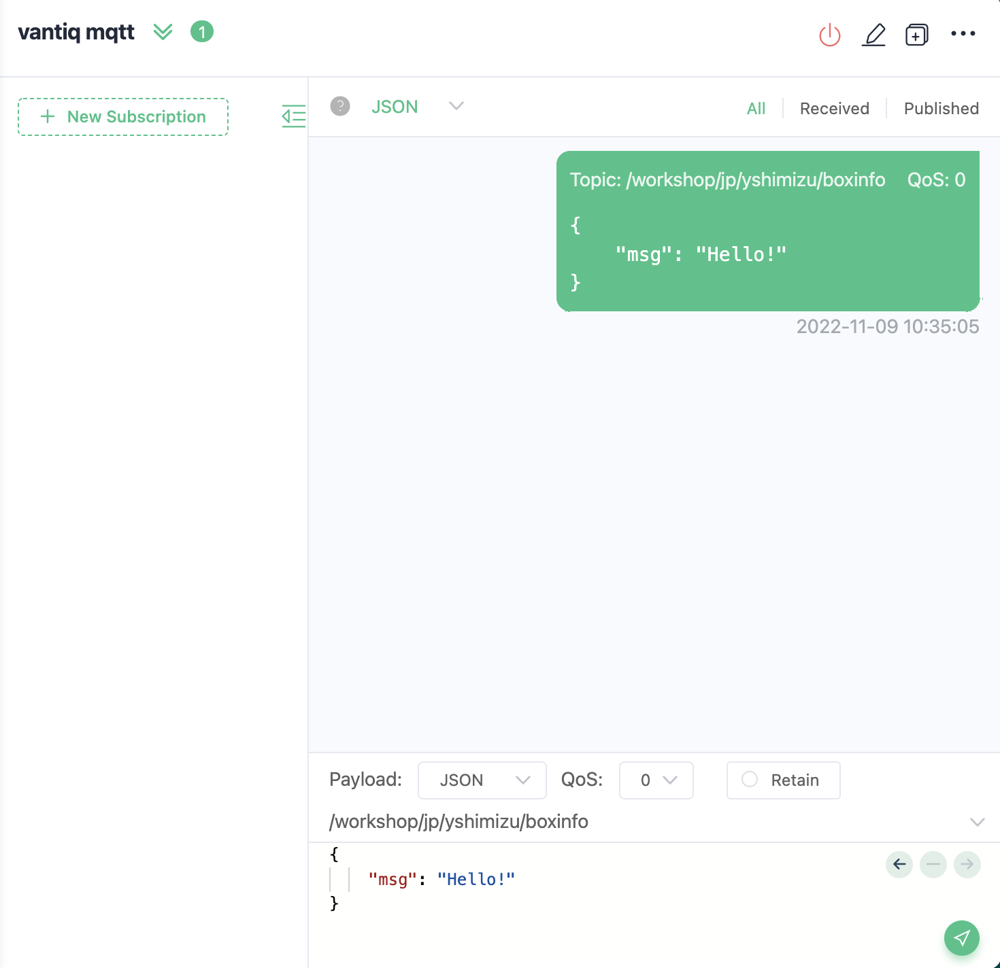
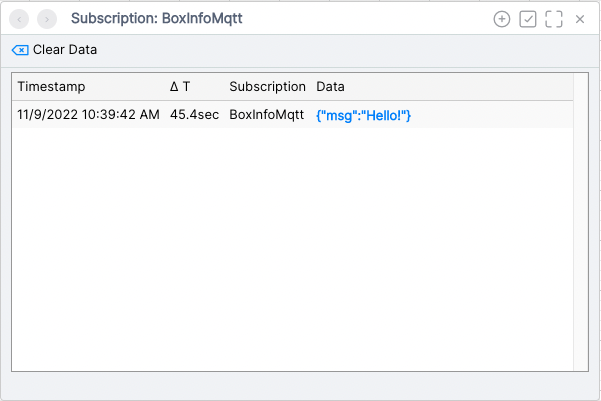
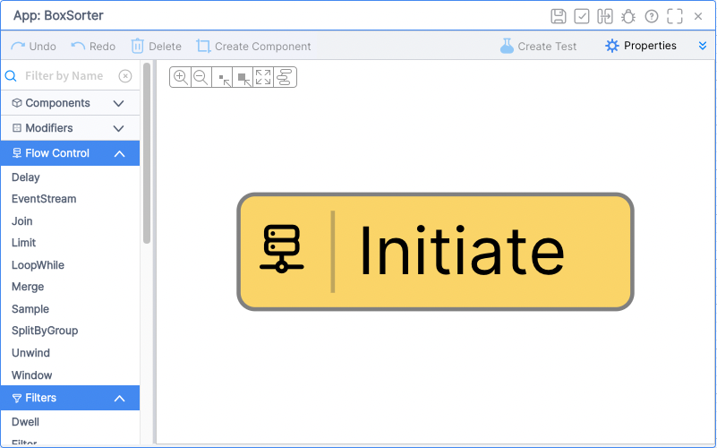
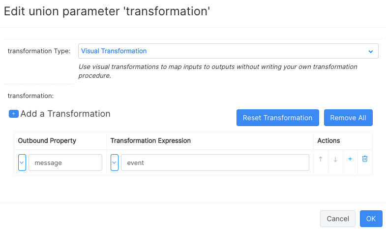
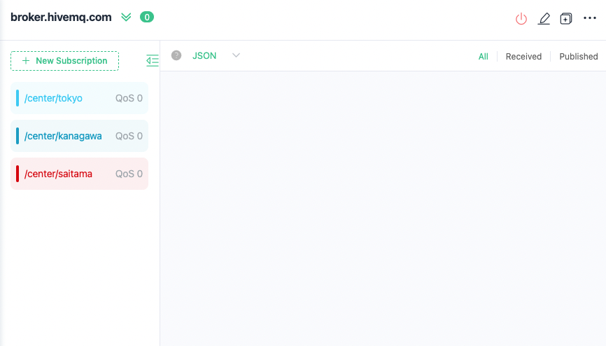
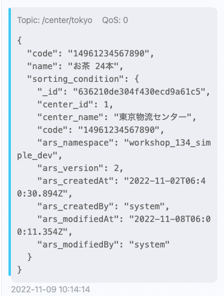

# 荷物仕分けアプリケーション開発

## 実装の流れ
1. 【Source】Vantiqで入力用のMQTTブローカーのデータをサブスクライブする
2. 【App Builder】荷物仕分けアプリ開発
3. 【動作確認】送信結果が正しく仕分けされているか確認する

## 実装詳細

### アプリケーションが前提とする受信内容

```json
{
    "code": "14961234567890",
    "name": "お茶 24本"
}
```

|項目|データ型|
|-|-|
|code|String|
|name|String|

### 実装するリソース
#### Sources

|種別|リソース名|役割|
|-|-|-|
|MQTT Source|BoxInfoMqtt|荷物の仕分け情報の受信用MQTTクライアント|
|MQTT Source|SortingResultMqtt|仕分け結果の送信用MQTTクライアント|

#### Applications

|リソース名|役割|
|-|-|
|BoxSorter|荷物の仕分け|

##### BoxSorter 詳細
|Activity Pattern|タスク名|役割|
|-|-|-|
|EventStream|ReceiveBoxInfo|Sourceでサブスクライブした内容をアプリで受け取る|
|SplitByGroup|SplitByCode|イベントの処理ノードを荷物の送り先コード単位で振り分ける|
|Cached Enrich|AttachCondition|仕分け条件をイベントに追加する<br/><span style="color:blue;">※本ワークショップでは荷物を物流センター単位で仕分けます<span>|
|Transformation|TransformForMqtt|必要なフォーマットにイベントを変換する|
|Filter|ExtractToTokyo<br/>ExtractToKanagawa<br/>ExtractToSaitama|条件に合致したイベントだけを通過させ、仕分けする|
|PublishToSource|PublishToTokyo<br/>PublishToKanagawa<br/>PublishToSaitama|仕分け結果をSource経由でMQTTブローカーに送信する|

> リソース名やタスク名は任意のものに変更しても構いません

#### Types
|種別|リソース名|役割|
|-|-|-|
|Standard|sorting_condition|仕分けに必要な情報を保持|

##### sorting_condition 詳細
|プロパティ名|データ型|論理名|
|-|-|-|
|code|String|送り先コード|
|center_id|Integer|物流センターのID|
|center_name|String|物流センター名|


## 【準備】入力用MQTTブローカー疎通確認

入力には以下のMQTTブローカーを使用します。
|項目|設定値|備考|
|-|-|-|
|Server URI|mqtt://public.vantiq.com:1883|-|
|Topic|/workshop/jp/yourname/boxinfo|`yourname`の箇所に任意の値を入力する ※英数字のみ|
>このMQTTブローカーはワークショップ用のパブリックなブローカーです。認証は不要です。

1. ご自身のMQTTクライアントから上記のワークショップ用ブローカーに接続し、以下のようなJSON系式のメッセージを送信できることを確認してください
```json
{
    "msg": "Hello!"
}
```



> 今後の手順では、テスト用のメッセージをこの方法でMQTTブローカーに送信して開発を進めます。

## 1. 【Source】VantiqでMQTTブローカーのデータをサブスクライブする
MQTTブローカーと接続したい場合、MQTTクライアントが必要です。これはVantiqでも同じです。VantiqのSourceはMQTTに対応しており、これがクライアントになります。

1. MQTT Sourceを作成する
    1. メニューバーの`追加` -> `Source...` -> `+ New Source` をクリックしSourceの新規作成画面を開く
    2. 以下の内容を設定し、保存する

    |設定順|項目|設定値|設定箇所|
    |-|-|-|-|
    |1|Source Name|BoxInfoMqtt|-|
    |2|Source Type|MQTT|-|
    |3|Server URI|mqtt://public.vantiq.com:1883|`Server URI`タブ -> `+ Add Server URI`|
    |4|Topic|/workshop/jp/yourname/boxinfo <br> ※`yourname`の箇所には疎通確認時と同じ値を使用する|`Topic`タブ -> `+ Add Topic`
    > 上記以外にも設定できる項目はありますが本ワークショップでは使用しません。

    3. メッセージをサブスクライブできることを確認する
        1. `BoxInfoMqtt` Sourceのペインを開き`テストデータの受信`(Test Data Receipt)をクリックする
        > `Subscription:BoxInfoMqtt`というペインが新たに開かれます。メッセージをサブスクライブするとここに取得した内容が表示されます。
        2. ご自身のMQTTクライアント（MQTT Xなど）から疎通確認時と同じようにメッセージを送信する
        3. `Subscription:BoxInfoMqtt`にご自身のMQTTクライアントから送信した内容が表示されることを確認する

            

## 2. 【App Builder】荷物仕分けアプリ開発
この手順からアプリケーション開発を開始します。MQTTブローカーから取得したメッセージをイベントとして、処理を実装していきます。

### 1. アプリケーションを作成する
1. メニューバーの`追加` -> `Advanced` -> `App...` -> `+ New App` をクリックしアプリケーションの新規作成画面を開く

2. `Name`に「BoxSorter」と入力し`OK`をクリックする

> `BoxSorter`のペインが開かれますのでここから開発作業を進めていきます。デフォルトで`Initiate`タスクが作成されます。

> アプリケーションのルートとなるタスクに設定されるActivity Patternは常に`EventStream` Activityになります。



### 2.【EventStream】Sourceでサブスクライブした内容をアプリで受け取る

`EventStream`を使って外部から取得したメッセージをイベントとしてアプリケーションに渡します。

1. `Initiate`タスクをクリックし、`Name`に`ReceiveBoxInfo`と入力する
2. `Configuration`の`Click to Edit`から以下の内容を設定し、アプリケーションを保存する

    |項目|設定値|
    |-|-|
    |inboundResource|sources|
    |inboundResourceId|BoxInfoMqtt|

3. `ReceiveBoxInfo`タスクを右クリックし、`View Task Events`をクリックする
    > `Subscription:BoxSorter_ReceiveBoxInfo`が開かれます。ここにはReceiveBoxInfoタスクの処理結果が表示されます。

4. ご自身のMQTTクライアントから疎通確認時と同じようにメッセージを送信し、その内容が`Subscription:BoxSorter_ReceiveBoxInfo`に表示されることを確認する
    > この手順で、アプリケーションがMQTT Source(BoxInfoMqtt)経由で受信した内容を扱える状態まで実装できています。

### 3. 【SplitByGroup】イベントの処理ノードを荷物のコード単位で振り分ける

`SplitByGroup`は任意のキー単位でイベントをグルーピングし、そのグループごとに処理が実行されるノードを振り分けます。この次の手順でメモリ上にデータを保存する処理を実装しますが、SplitByGroupの次にその処理を入れることで使用するメモリを分散させることができます。

1. `ReceiveBoxInfo`タスクを右クリックし、`Link New Task`から新しいタスクを後続に追加する

    1. Link New Taskダイアログが表示されるので以下の内容を入力し`OK`をクリックする

        |項目|設定値|
        |-|-|
        |Activity Pattern|SplitByGroup|
        |Task Name|SplitByCode|

    2. `Configuration`から以下の設定を行いアプリケーションを保存する

        |項目|設定値|
        |-|-|
        |groupBy|event.code|

### 4. 【Cached Enrich】仕分け条件をイベントに追加する

このアプリケーションが受け取る元の内容は以下のように`code`と`name`だけが含まれているデータです。
```json
{
    "code": "14961234567890",
    "name": "お茶 24本"
}
```
仕分けをして行くにあたり、その判断材料となる情報を追加する必要があります。
Vantiqでは`Enrich`というActivity Patternが用意されており、イベントに対してTypeに保存されたレコードの内容を追加することができます。`Cached Enrich`はそのキャッシュ対応版です。

|項目|設定値|詳細|
|-|-|-|
|Enrich|イベントにTypeのレコードを追加する|毎回MongoDBに対してクエリを発行する|
|Cached Enrich|イベントにTypeのレコードを追加する|初回のみMongoDBに対してクエリを発行する。MongoDBから取得した内容をStateに保存し、以降そこからデータを取得する|

あらかじめ仕分けの判断材料となる情報を保持したTypeを作成しておき、これらのActivityでそのTypeの情報を取得してイベントに追加します。一旦アプリケーションから離れ、Typeの作成とレコード追加を行います。

1. `sorting_condition` Typeを作成する
    1. メニューバーの`追加` -> `Type...` -> `+ New Type` をクリックしてTypeの新規作成画面を開き、以下の内容を入力して`OK`をクリックする

        |項目|設定値|
        |-|-|
        |Name|sorting_condition|
        |Role|standard|
    2. `sort_condition`のペインが表示されるので、タブごとに以下の設定を行い保存する

        **Propertiesタブ**
        |プロパティ名|データ型|Required|
        |-|-|-|
        |code|String|✅|
        |center_id|Integer|✅|
        |center_name|String|✅|

        **Indexesタブ**
        |項目|設定値|Is Unigue|
        |-|-|-|
        |Key|code|✅|

        **Natural Keysタブ**
        |項目|設定値|
        |-|-|
        |Key|code|

    3. `sort_condition` Typeにデータをインポートする
        1. メニューバーの`Projects` -> `Import...` を開き、`Select Import Type:`を`Data`に設定する
        2. `Drop CSV or JSON file for import here`の箇所に[sorting_condition.csv](./sorting_condition.csv)をドロップし`Import`をクリックする

        > Typeにレコードをインポートする際は`Data`を選択する必要があります。デフォルトは`Projects`になっているので注意してください。

これでTypeとレコードが用意できたのでアプリケーションの開発に戻ります。今回は`Cached Enrich`を使用します。事前に`SplitByGroup`を使用しているため、使用するメモリは分散されます。

2. `SplitByCode`タスクを追加した際と同じ手順で、`SplitByCode`の次に以下のタスクを追加する
    |項目|設定値|
    |-|-|
    |Activity Pattern|Cached Enrich|
    |Task Name|AttachCondition|

3. `AttachCondition`に以下の設定を行いアプリケーションを保存する

    |項目|設定値|備考|
    |-|-|-|
    |associatedType|sorting_condition|-|
    |foreignKeys|["code"]|この項目に設定したプロパティがクエリの条件になる|

    > VAILで書くとすると`SELECT ONE FROM sorting_condition WHERE code == code`ということになります。

4. MQTTクライアントからメッセージを送信し、Cached Enrichの動作を確認する
    1. `AttachCondition`タスクを右クリックし、`View Task Events`をクリックしてSubscriptionを表示する
    2. MQTTクライアントから以下のメッセージを送信する
    > 送信先のMQTTブローカー、Topicはこれまでと同じです。
    ```json
    {
        "code": "14961234567890",
        "name": "お茶 24本"
    }
    ```
    3. Vantiqの開発画面に戻り、表示しておいたSubscriptionに以下のようなイベントが表示されていることを確認する
    ```json
    {
        "code": "14961234567890",
        "name": "お茶 24本",
        "sorting_condition": {
            "_id": "636210de304f430ecd9a61c5",
            "center_id": 1,
            "center_name": "東京物流センター",
            "code": "14961234567890",
            "ars_namespace": "workshop_134",
            "ars_version": 2,
            "ars_createdAt": "2022-11-02T06:40:30.894Z",
            "ars_createdBy": "yshimizu",
            "ars_modifiedAt": "2022-11-08T06:00:11.354Z",
            "ars_modifiedBy": "yshimizu"
        }
    }
    ```
    > `_id`や`ars_***`はシステム側で自動生成されるプロパティのため、この例と同じにはなりません。

    `sort_condition`というプロパティが追加されており、物流センターに関する情報を追加することができました。

### 5. 【Transformation】必要なフォーマットにイベントを変換する

本ワークショップでは最終的に仕分けした結果をMQTTブローカーに送信します。そこで注意が必要なのが各Sourceごとに送信時に必要なフォーマットが異なることです。

例えばREMOTE Sourceの場合は、
```json
{
    "body": <送信したい内容>
}
```
という形式で`body`プロパティに送信内容を含めた形式にすることが必要です。

MQTT Sourceの場合は以下のフォーマットです。`message`プロパティのvalueとして実際に送信したい内容を含める必要があります。
```json
{
    "message": <送信したい内容>
}
```
**詳細はこちら**
[各Source別実装サンプル](https://github.com/fujitake/vantiq-related/blob/main/vantiq-apps-development/docs/jp/data_sending.md#samples)

`Transformation` Activityを使って、このフォーマットにイベントを変換します。
```json
{
   "message": {
      "code": "14961234567890",
      "name": "お茶 24本",
      "sorting_condition": {
         "_id": "636210de304f430ecd9a61c5",
         "center_id": 1,
         "center_name": "東京物流センター",
         "code": "14961234567890",
         "ars_namespace": "workshop_134",
         "ars_version": 2,
         "ars_createdAt": "2022-11-02T06:40:30.894Z",
         "ars_createdBy": "yshimizu",
         "ars_modifiedAt": "2022-11-08T06:00:11.354Z",
         "ars_modifiedBy": "yshimizu"
      }
   }
}
```

1. `AttachCondition`タスクの次に以下のタスクを追加する
    |項目|設定値|
    |-|-|
    |Activity Pattern|Transformation|
    |Task Name|TransformForMqtt|

2. `TransformForMqtt`に以下の設定を行いアプリケーションを保存する
    <table>
    <tr>
        <th>大項目</th>
        <th>小項目</th>
        <th>設定値</th>
    </tr>
    <tr>
        <td rowspan="2">transformation</td>
        <td>Outbound Property</td>
        <td>message</td>
    </tr>
    <tr>
        <td>Transformation Expression</td>
        <td>event</td>
    </tr>
    </table>

    

3. `View Task Events`でSubscriptionを開き、MQTTクライアントからメッセージを送信する
```json
{
   "message": {
      "code": "14961234567890",
      "name": "お茶 24本",
      "sorting_condition": {
         "_id": "636210de304f430ecd9a61c5",
         "center_id": 1,
         "center_name": "東京物流センター",
         "code": "14961234567890",
         "ars_namespace": "workshop_134",
         "ars_version": 2,
         "ars_createdAt": "2022-11-02T06:40:30.894Z",
         "ars_createdBy": "yshimizu",
         "ars_modifiedAt": "2022-11-08T06:00:11.354Z",
         "ars_modifiedBy": "yshimizu"
      }
   }
}
```
上記のように`message`のvalueにTransformation前のイベントが入ったことを確認してください。

### 6. 【Filter】条件に合致したイベントだけを通過させ、仕分けする

特定の物流センターのイベントのみが通過できるフローを実装することで仕分けを行います。
今回は「東京」「神奈川」「埼玉」の3つの物流センター単位で仕分けをしますので`Filter` Activityを設定したタスクを3つ実装します。

物流センターとそのIDは以下の関係になっています。
|物流センター|物流センターID|
|-|-|
|東京|1|
|神奈川|2|
|埼玉|3|

この物流センターID`center_id`で仕分けをします。

1. `TransformForMqtt`タスクの次に以下のタスクを追加する
    1. 東京物流センター用

        |項目|設定値|
        |-|-|
        |Activity Pattern|Filter|
        |Task Name|ExtractToTokyo|

        #### ExtractToTokyoの設定
        |項目|設定値|備考|
        |-|-|-|
        |condition|event.message.sorting_condition.center_id == 1|東京物流センターのIDは`1`|


    2. 神奈川物流センター用

        |項目|設定値|
        |-|-|
        |Activity Pattern|Filter|
        |Task Name|ExtractToKanagawa|

        #### ExtractToKanagawaの設定
        |項目|設定値|備考|
        |-|-|-|
        |condition|event.message.sorting_condition.center_id == 1|神奈川物流センターのIDは`2`|


    3. 埼玉物流センター用

        |項目|設定値|
        |-|-|
        |Activity Pattern|Filter|
        |Task Name|ExtractToSaitama|

        #### ExtractToSaitamaの設定
        |項目|設定値|備考|
        |-|-|-|
        |condition|event.message.sorting_condition.center_id == 3|埼玉物流センターのIDは`3`|

2. 3つの`Extract**`タスクで`View Task Events`を行い、それぞれ適切なイベントのみ通過しているか確認する
    1. MQTTクライアントから以下のメッセージを送信する
        #### 東京物流センター用
        ```json
        {
            "code": "14961234567890",
            "name": "お茶 24本"
        }
        ```

        #### 神奈川物流センター用
        ```json
        {
            "code": "14961234567892",
            "name": "化粧水 36本"
        }
        ```

        #### 埼玉物流センター用
        ```json
        {
            "code": "14961234567893",
            "name": "ワイン 12本"
        }
        ```

    2. 各Subscriptionでイベントを適切なイベントだけ通過しているか確認する
    - `ExtractToTokyo`のSubscriptionに以下のイベント**のみ**が表示されていること
        ```json
        {
            "message": {
                "code": "14961234567890",
                "name": "お茶 24本",
                "sorting_condition": {
                    "_id": "636210de304f430ecd9a61c5",
                    "center_id": 1,
                    "center_name": "東京物流センター",
                    "code": "14961234567890",
                    "ars_namespace": "workshop_134",
                    "ars_version": 2,
                    "ars_createdAt": "2022-11-02T06:40:30.894Z",
                    "ars_createdBy": "yshimizu",
                    "ars_modifiedAt": "2022-11-08T06:00:11.354Z",
                    "ars_modifiedBy": "yshimizu"
                }
            }
        }
        ```

    - `ExtractToKanagawa`のSubscriptionに以下のイベント**のみ**が表示されていること
        ```json
        {
            "message": {
                "code": "14961234567892",
                "name": "化粧水 36本",
                "sorting_condition": {
                    "_id": "636210de304f430ecd9a61c6",
                    "center_id": 2,
                    "center_name": "神奈川物流センター",
                    "code": "14961234567892",
                    "ars_namespace": "workshop_134",
                    "ars_version": 2,
                    "ars_createdAt": "2022-11-02T06:40:30.984Z",
                    "ars_createdBy": "yshimizu",
                    "ars_modifiedAt": "2022-11-08T06:00:11.637Z",
                    "ars_modifiedBy": "yshimizu"
                }
            }
        }
        ```

    - `ExtractToSaitama`のSubscriptionに以下のイベント**のみ**が表示されていること
        ```json
        {
            "message": {
                "code": "14961234567893",
                "name": "ワイン 12本",
                "sorting_condition": {
                    "_id": "636210de304f430ecd9a61c7",
                    "center_id": 3,
                    "center_name": "埼玉物流センター",
                    "code": "14961234567893",
                    "ars_namespace": "workshop_134",
                    "ars_version": 2,
                    "ars_createdAt": "2022-11-02T06:40:30.989Z",
                    "ars_createdBy": "yshimizu",
                    "ars_modifiedAt": "2022-11-08T06:00:11.644Z",
                    "ars_modifiedBy": "yshimizu"
                }
            }
        }
        ```

### 7. 【PublishToSource】仕分け結果をSource経由でMQTTブローカーに送信する

ここまでの実装で仕分けができるようになりましたので、その結果をMQTTブローカーに送信します。それぞれ異なったTopicに送信します。

まずは、送信先のMQTTブローカー用にSourceを作成します。受信用のMQTTブローカーには`public.vantiq.com`を使用しましたが、今回はご自身で事前に準備いただいたものを使用します。

1. 以下の内容でMQTT Sourceを作成する
    |項目|設定値|備考|
    |-|-|-|
    |Source Name|SortingResultMqtt|-|
    |Source Type|MQTT|-|
    |Server URI|<ご自身のブローカー>|プロトコルとポートが必要<br/> **例:** `mqtts://your-broker.com:8883`|
    > 送信のみに使用しますのでTopicの設定は必要ありません。送信実行時にTopicを指定します。

アプリケーションに戻り、送信処理を実装します。

2. 各`Extract***`タスクの次に、それぞれ以下のタスクを追加してからアプリケーションを保存する
    1. `ExtractToTokyo`タスクの次:

        |項目|設定値|
        |-|-|
        |Activity Pattern|PublishToSource|
        |Task Name|PublishToTokyo|

        #### PublishToTokyoの設定
        |項目|設定値|備考|
        |-|-|-|
        |source|SortingResultMqtt|-|
        |sourceConfig|{"topic": "/center/tokyo"}|MQTTブローカーの/center/tokyo Topicに送信|

    2. `ExtractToKanagawa`タスクの次:

        |項目|設定値|
        |-|-|
        |Activity Pattern|PublishToSource|
        |Task Name|PublishToKanagawa|

        #### PublishToKanagawaの設定
        |項目|設定値|備考|
        |-|-|-|
        |source|SortingResultMqtt|-|
        |sourceConfig|{"topic": "/center/kanagawa"}|MQTTブローカーの/center/kanagawa Topicに送信|

    3. `ExtractToSaitama`タスクの次:

        |項目|設定値|
        |-|-|
        |Activity Pattern|PublishToSource|
        |Task Name|PublishToSaitama|

        #### PublishToSaitamaの設定
        |項目|設定値|備考|
        |-|-|-|
        |source|SortingResultMqtt|-|
        |sourceConfig|{"topic": "/center/saitama"}|MQTTブローカーの/center/saitama Topicに送信|

## 【動作確認】送信結果が正しく仕分けされているか確認する

MQTTクライアントで送信先のTopicをサブスクライブしておき、正しく仕分けされるか確認します。

1. MQTTクライアントで仕分け結果の送信先のMQTTブローカーに接続し、`/center/tokyo`,`/center/kanagawwa`,`/center/saitama`をサブスクライブする

    

2. 前の手順の接続は維持したまま、別途入力用のMQTTブローカー`public.vantiq.com`と接続し以下のメッセージを送信する
    #### 東京物流センター用
    ```json
    {
        "code": "14961234567890",
        "name": "お茶 24本"
    }
    ```

    #### 神奈川物流センター用
    ```json
    {
        "code": "14961234567892",
        "name": "化粧水 36本"
    }
    ```

    #### 埼玉物流センター用
    ```json
    {
        "code": "14961234567893",
        "name": "ワイン 12本"
    }
    ```

3. 各物流センターのTopicに正しく仕分け結果が届いていることを確認する

    **例: /center/tokyo Topicに"お茶 24本"の仕分け結果が届いている**

    


## 参考情報

[実装サンプル](./box_sorter)

以上

