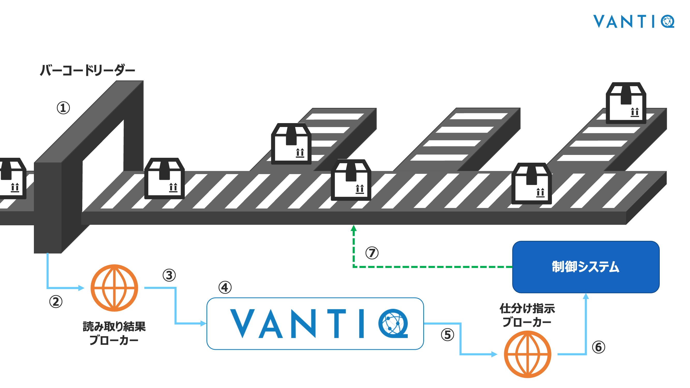
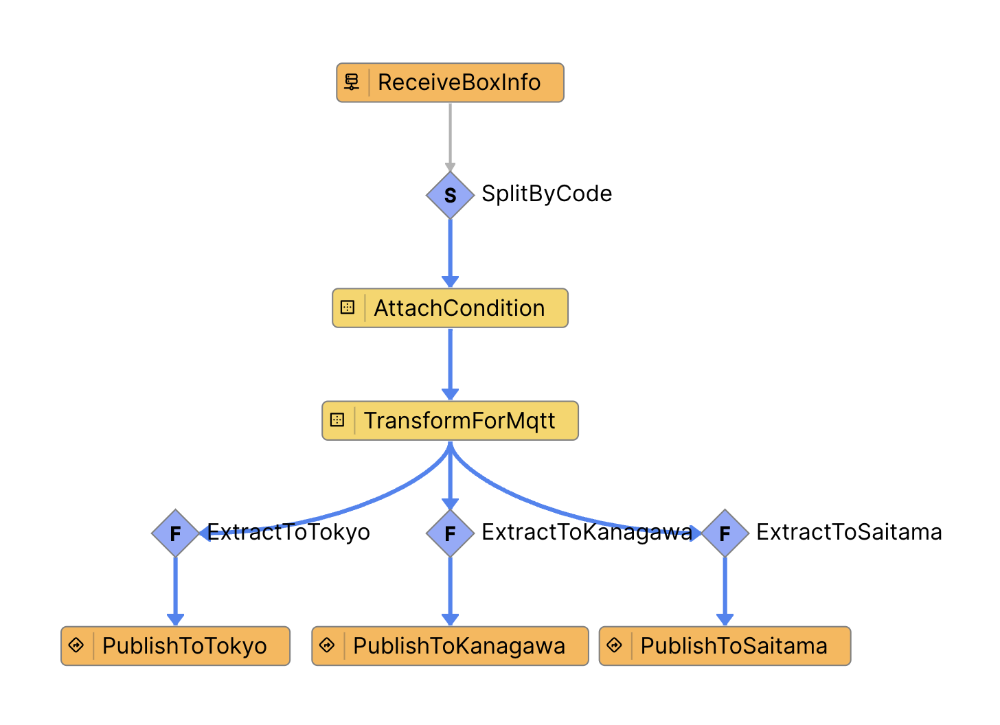

# Vantiq ワークショップ 概要

## 荷物仕分け (Box Sorter) アプリケーション 

読み取った送り先コードで荷物を仕分けするアプリケーションの実装を通じてVantiqの基本機能を学びます。

## 仕分けシステムのイメージ

1. バーコードリーダーで荷物のバーコードを読み取る
2. 読み取った結果をブローカーに送信する
3. Vantiqはブローカーから読み取り結果を取得する
4. Vantiqはその結果を元に仕分けを行う
5. Vantiqは仕分け指示をブローカーに送信する
6. 制御システムは仕分け指示をブローカーから取得する
7. 制御システムは仕分け指示に従ってコンベアを制御する

[実物のイメージはこちら](https://vimeo.com/301251460?embedded=true&source=vimeo_logo&owner=9547854)

ワークショップではVantiqの担当部分であるNo.3〜5を実装します。
>No.1と2は、MQTTクライアントから直接MQTTブローカーに読み取り結果のサンプル情報を送信することで代用します

### Vantiqで実装する仕分けアプリケーション

このアプリケーションを実装していきます。詳細は次のステップで説明しますが、`MQTTブローカーから情報を取得`、`仕分け`、`仕分け結果をMQTTブローカーに送信`という処理を行います。

## 各自で準備するVantiq以外の要素(事前にご準備ください)
- MQTTブローカー
    - Vantiqから仕分け結果を送信する先として使用します
    - お好きなブローカーをご利用ください。AmazonMQなどマネージドなものを使っても、ActiveMQやMosquittoをご自身でインストールして準備しても構いません
    -  [The Free Public MQTT Broker by HiveMQ](https://www.hivemq.com/public-mqtt-broker/)のように無料で使用できるブローカーもございます
    - Vantiqやご自身のクライアントからアクセスできる必要がありますのでインターネット接続できる必要があります
- MQTTクライアント
    - ご自身の環境からMQTTブローカーに接続し、メッセージをパブリッシュしたりサブスクライブするのに使用します
    - お好きなクライアントをご利用ください（[MQTT X](https://mqttx.app/)など）

## ドキュメント

- [手順](./instruction.md)