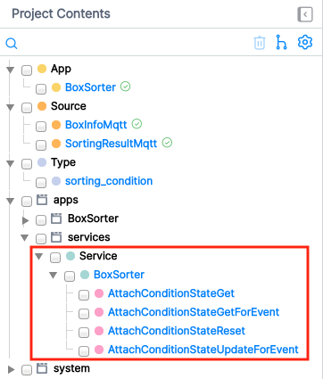
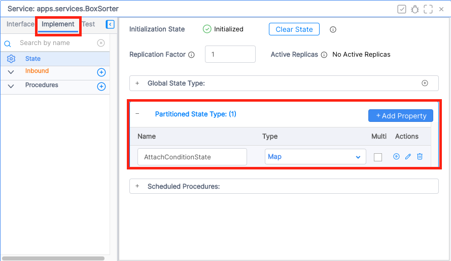
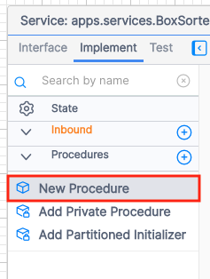
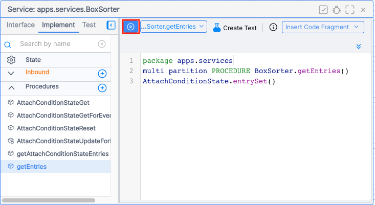

# 荷物仕分けアプリケーション開発 追加コンテンツ

## Stateの中身を確認してみる

Vantiqでは`State`と呼ばれるリソースにてメモリ上にデータを保持することができます。Typeと異なり、MongoDBにアクセスする必要がないため処理の高速化を図る際には基本的に使用することになります。

今回、`State`を作る手順はありませんでしたが、`Cached Enrich`を使いTypeのレコードをメモリ上に保存し、処理の高速化を図るという実装を行いました。この際に自動で`State`が作成されています。

Cached EnrichはTypeから該当レコードを取得しStateに格納する、という処理を行なっています。Stateに格納されたTypeのレコードを確認していきます。


### 1. 自動生成されたリソースを確認する

まずアプリケーションを作成すると自動で「apps.services.<アプリケーション名>」の`Service`が作成されます。Serviceとは、任意の機能単位でVantiqのリソースをカプセル化する機能です。※ここではServiceの詳細は割愛します。

> 例えば今回であれば荷物仕分けアプリケーション機能単位でリソースをグルーピングするようなイメージです。

StateはこのService単位で管理されます。

開発画面左の`Project Contents`を確認してみます。



以下が作成されていることがわかります。

|種別|リソース名|
|-|-|
|Service|apps.services.BoxSorter|
|Procedure|apps.services.BoxSorter.AttachConditionStateGet|
|Procedure|apps.services.BoxSorter.AttachConditionStateGetForEvent|
|Procedure|apps.services.BoxSorter.AttachConditionStateReset|
|Procedure|apps.services.BoxSorter.AttachConditionStateUpdateForEvent|

Serviceと、Procedureが自動生成されていることがわかります。
Cached Enrich関連のProcedureは`apps.services.<アプリケーション名>.<Cached Enrichを設定したTask名>State***`という名前で生成されます。

これらのProcedureは`State`を操作するためのProcedureです。
|Procedure|内容|
|-|-|
|***StateGet|Stateから値を取得する|
|***StateGetForEvent|Cached Enrichの設定で指定されたキーをもとにStateから値を取得し、Eventに追加する|
|***StateReset|Stateをリセットする|
|***StateUpdateForEvent|Typeのレコードを取得しStateをその内容で更新する|

自動生成されたStateも確認してみます。StateはServiceの中に作成されます。

1. `apps.services.BoxSorter`->`Implement`タブ->`State`->`Partitioned State Type`を開く


`<Cached Enrichを設定したTask名>State`である`AttachConditionState`が作成されていることが確認できます。

このStateにProcedureでアクセスすることで格納されている内容を確認することができます。

### 2. Procedureを使ってStateの中身を確認してみる

`***StateGet`のProcedureはCached Enrichの設定で指定したキーを引数にして、それに該当する値を返します。

`sorting_condition` Typeには以下のレコードが保存されていました。
|center_id|center_name|code|
|-|-|-|
|1|東京物流センター|14961234567890|
|2|神奈川物流センター|14961234567892|
|3|埼玉物流センター|14961234567893|

そして`code`をキーとしてイベントに対してレコードを追加していました。

つまり`apps.services.BoxSorter.AttachConditionStateGet`を実行し、引数に`code`の値を設定するとそれに該当するStateの要素を取得できます。

1. `apps.services.BoxSorter.AttachConditionStateGet`を開き、以下の内容で実行する

    |パラメータ名|center_name|
    |-|-|
    |partitionKey|14961234567890|

2. 以下のような結果が返ることを確認する
    ```json
    {
    "expiresAt": "2022-11-10T05:31:32.701Z",
    "value": {
        "_id": "636210de304f430ecd9a61c5",
        "center_id": 1,
        "center_name": "東京物流センター",
        "code": "14961234567890",
        "ars_namespace": "workshop_134",
        "ars_version": 2,
        "ars_createdAt": "2022-11-02T06:40:30.894Z",
        "ars_createdBy": "yshimizu",
        "ars_modifiedAt": "2022-11-08T06:00:11.354Z",
        "ars_modifiedBy": "yshimizu"
    }
    }
    ```
> Cached Enrichが`code`の値が`14961234567890`であるイベントを処理する際に追加する内容がStateに格納されていることがわかります。

### 3. Procedureを作ってStateに含まれる全ての要素を確認してみる

次に、キー単位ではなくStateに含まれる全ての要素を確認してみます。これにはProcedureの実装が必要です。

1. `apps.services.BoxSorter`->`Implement`タブを開き`Procedures`の`+`をクリックし、`New Procedure`をクリックする


2. 新規のProcedureが表示されるので以下の内容をペーストし保存する
```js
package apps.services
multi partition PROCEDURE BoxSorter.getEntries()
AttachConditionState.entrySet()
```
このProcedureは`AttachConditionState` Stateに含まれる全てのようをそ取得します。今回Cached Enrichの前に`SplitByGroup`を使って処理ノードを分散させていました。`multi partition`という修飾子をつけることで分散した全ノードから要素を取得できます。

> 保存するとインターフェースの修復をするかの確認ダイアログが表示されますが`インターフェースの修復`をクリックするようにしてください。

> `Service Builder`の詳細についてはここでは割愛します。

3. 実行し、結果を確認する


```json
[
   [
      {
         "14961234567892": {
            "expiresAt": "2022-11-17T01:33:08.201Z",
            "value": {
               "_id": "636210de304f430ecd9a61c6",
               "center_id": 2,
               "center_name": "神奈川物流センター",
               "code": "14961234567892",
               "ars_namespace": "workshop_134",
               "ars_version": 2,
               "ars_createdAt": "2022-11-02T06:40:30.984Z",
               "ars_createdBy": "yshimizu",
               "ars_modifiedAt": "2022-11-08T06:00:11.637Z",
               "ars_modifiedBy": "yshimizu"
            }
         }
      },
      {
         "14961234567893": {
            "expiresAt": "2022-11-17T01:33:13.198Z",
            "value": {
               "_id": "636210de304f430ecd9a61c7",
               "center_id": 3,
               "center_name": "埼玉物流センター",
               "code": "14961234567893",
               "ars_namespace": "workshop_134",
               "ars_version": 2,
               "ars_createdAt": "2022-11-02T06:40:30.989Z",
               "ars_createdBy": "yshimizu",
               "ars_modifiedAt": "2022-11-08T06:00:11.644Z",
               "ars_modifiedBy": "yshimizu"
            }
         }
      },
      {
         "14961234567890": {
            "expiresAt": "2022-11-10T05:31:32.701Z",
            "value": {
               "_id": "636210de304f430ecd9a61c5",
               "center_id": 1,
               "center_name": "東京物流センター",
               "code": "14961234567890",
               "ars_namespace": "workshop_134",
               "ars_version": 2,
               "ars_createdAt": "2022-11-02T06:40:30.894Z",
               "ars_createdBy": "yshimizu",
               "ars_modifiedAt": "2022-11-08T06:00:11.354Z",
               "ars_modifiedBy": "yshimizu"
            }
         }
      }
   ]
]
```
codeが`14961234567890`、`14961234567892`、`14961234567893`の要素がStateに格納されていることがわかります。

以上