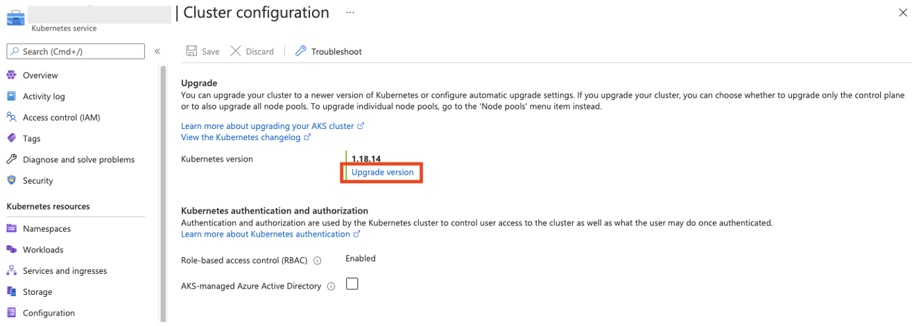
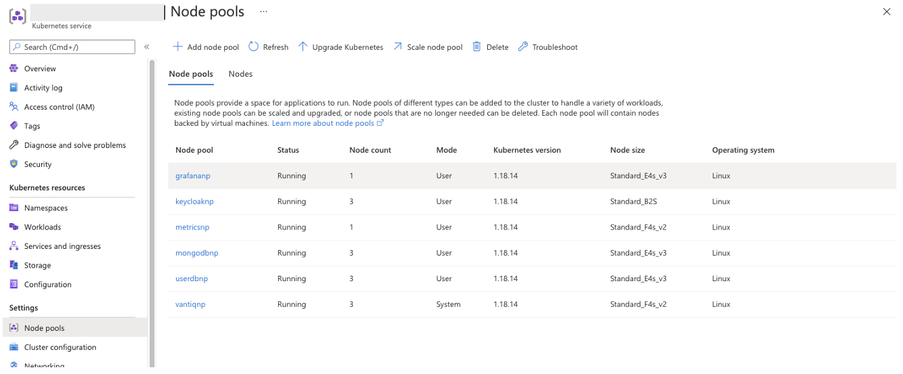
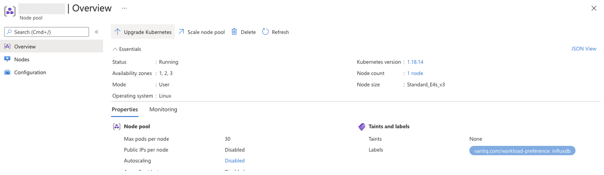
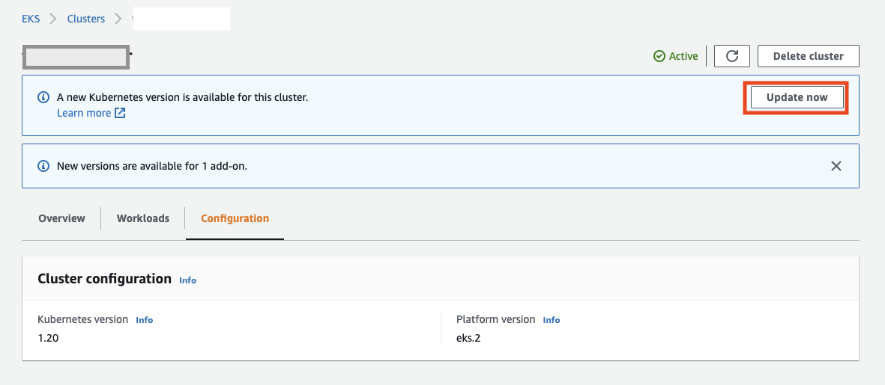
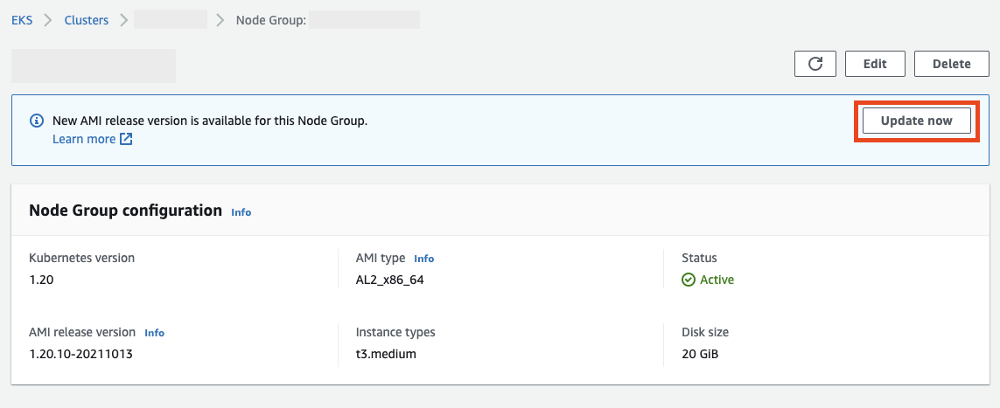

# Kubernetes upgrade
 This article describes instructions and points to keep in mind for an infrastructure administrator to upgrade a Kubernetes cluster running Vantiq Private Cloud.  

## AKS upgrade<a id="aks_upgrade"></a>

There are two ways to upgrade AKS.  
Method | Content | Requirements
--|---|--
Upgrade with Azure Portal  | Upgrade manually via Azure Portal in the order of Control Plane, Node Pools. | <ul><li>The execute user must have the necessary update permissions for the subscription.</li></ul>
Upgrade with Terraform  | Update the version within the Terraform configuration file and apply it to Azure.  |<ul><li>The user of the Terraform execution environment must have the necessary update permissions for the subscription.</li><li>There must be no deviation in the configuration of Terraform before the update is applied (No configuration changes have been made outside of Terraform after configuring with Terraform).</li></ul>

#### Upgrade with Azure Portal  
1. Upgrade Control Plane    
   There are two options **to upgrade only the Control Plane** or **to also upgrade all node pools**, **do the former**. For Nodepool, the dependencies of the Vantiq pod group should be considered and executed in order.  

   

1. Upgrade Nodepool   
   Select the target Nodepools from the Node pools and upgrade them respectively. Keep in mind the following points;  

    - Nodepools running Vantiq pod and Mongodb pod should be upgraded at different times from other Nodepools. It is acceptable to upgrade them at the same time if the criteria are met.  
    - When upgrading Nodepool running Vantiq pod, confirm that both Mongodb pod and Keycloak pod are running normally (status=Running) before upgrading.  

      

    Select Nodepool, execute **Update Kubernetes**.  

      


#### Upgrade with Terraform

The following is the procedure assuming that it was installed using the template ["Azure AKS for Vantiq with Terraform"](../../../vantiq-cloud-infra-operations/terraform_azure/readme_en.md). If it used a different template, make the necessary changes accordingly.  

1. Change the value of `kubernetes_version` in `main.tf` to the version of the target.  

```terraform
###
###  AKS
###
module "aks" {
  # fixed parameter. Do not change.
  source = "../modules/aks"
  aks_cluster_name = "aks-${var.vantiq_cluster_name}-${var.env_name}"
  location = var.location
  resource_group_name = "rg-${var.vantiq_cluster_name}-${var.env_name}-aks"
  tags = {
     environment = var.env_name
     app = var.vantiq_cluster_name
  }
  depends_on = [module.vpc]

  # kubernetes version
  kubernetes_version = "1.21.2"  // 1.20.9 -> 1.21.2
```

2. Execute the `terraform plan` and verify that the changes are correct. If any unexpected changes are detected at this point, resolve them first.   

```sh
An execution plan has been generated and is shown below.
Resource actions are indicated with the following symbols:
  ~ update in-place

Terraform will perform the following actions:

  # module.aks.azurerm_kubernetes_cluster.aks-vantiq will be updated in-place
  ~ resource "azurerm_kubernetes_cluster" "aks-vantiq" {
        id                              = "/subscriptions/925b78f6-1bdc-41a2-95c7-a912eab56f8d/resourcegroups/rg-vantiqjpinternal-prod-aks/providers/Microsoft.ContainerService/managedClusters/aks-vantiqjpinternal-prod"
      ~ kubernetes_version              = "1.20.9" -> "1.21.2"
        name                            = "aks-vantiqjpinternal-prod"
        tags                            = {
            "app"         = "vantiqjpinternal"
            "environment" = "prod"
        }
        # (14 unchanged attributes hidden)


      ~ default_node_pool {
            name                         = "vantiqnp"
          ~ orchestrator_version         = "1.20.9" -> "1.21.2"
            tags                         = {}
            # (16 unchanged attributes hidden)
        }
...

  # module.aks.azurerm_kubernetes_cluster_node_pool.mongodbnp[0] will be updated in-place
  ~ resource "azurerm_kubernetes_cluster_node_pool" "mongodbnp" {
        id                     = "/subscriptions/925b78f6-1bdc-41a2-95c7-a912eab56f8d/resourcegroups/rg-vantiqjpinternal-prod-aks/providers/Microsoft.ContainerService/managedClusters/aks-vantiqjpinternal-prod/agentPools/mongodbnp"
        name                   = "mongodbnp"
      ~ orchestrator_version   = "1.20.9" -> "1.21.2"
        tags                   = {
            "app"         = "vantiqjpinternal"
            "environment" = "prod"
        }
        # (19 unchanged attributes hidden)
    }

Plan: 0 to add, 5 to change, 0 to destroy.
```  

3. Execute `terraform apply`.


## EKS Upgrade<a id="eks_upgrade"></a>

There are two ways to upgrade EKS.  
Method | Content  | Requirements
--|---|--
Upgrade with AWS Management Console | Upgrade manually via AWS Management Console in the order of Control Plane, Node Pools. | <ul><li>The execute user must have the necessary IAM update permissions.</li></ul>
Upgrade with Terraform | Update the version within the Terraform configuration file and apply it to AWS.  |<ul><li>The user of the Terraform execution environment must have the necessary IAM update permissions.</li><li>There must be no deviation in the configuration of Terraform before the update is applied (No configuration changes have been made outside of Terraform after configuring with Terraform).</li></ul>


#### Upgrade with AWS Management Console

1. Specify the cluster in Amazon EKS and execute the Control Plane upgrade with **Update Now**.  


1. Once the Control Plane upgrade is complete, select the Nodepool from the Node Group and execute the Node Pool upgrade with **Update Now**. Repeat for as many Node Group as necessary and upgrade the versions of each.  



#### Upgrade with Terraform

The following is the procedure assuming that it was installed using the template ["AWS EKS for Vantiq with Terraform"](../../../vantiq-cloud-infra-operations/terraform_aws/readme_en.md). If it used a different template, make the necessary changes accordingly.  

1. Change the value of `cluster_version` in `main.tf` to the version of the target.  

```terraform
module "eks" {
  source             = "../modules/eks"
  cluster_name       = local.cluster_name
  env_name           = local.env_name
  vpc_id             = module.vpc.vpc_id
  public_subnet_ids  = module.vpc.public_subnet_ids
  private_subnet_ids = module.vpc.private_subnet_ids

  worker_access_ssh_key_name = local.worker_access_ssh_key_name
  basion_ec2_sg_ids          = [aws_security_group.basion-ssh-allow.id]

  keycloak_db_expose_port = local.keycloak_db_expose_port
  keycloak_db_sg_id       = module.keycloak-db.keycloak_db_sg_id

  # The following is custom setting
  cluster_version = "1.21"  # 1.20 -> 1.21　
```

2. Execute the `terraform plan` and verify that the changes are correct. If any unexpected changes are detected at this point, resolve them first.  

3. Execute `terraform apply`.  


## Known risks and considerations for upgrading Kubernetes
- Make sure that Vantiq supports the new version of kubernetes before upgrading. Please contact Vantiq Support in advance.  
- When upgrading the Vantiq Node pool (nodegroup) and the mongodb Node pool (nodegroup) at the same time, there will be a timing when the vantiq pod will not start, which may cause a suspension of the vantiq service. Do NOT do each at the same time.  
- Effective from AKS 1.19, **containerd** is used instead of docker. There are two issues regarding the metrics collection done by Vantiq. One is that in System Admin Grafana, Influxdb's Measurements for CPU for Vantiq Resources and MongoDB Monitoring Dashboard have been changed, so the dashboard's query parameters need to be updated (attached separately). Another is that the connection to "docker.sock" on "ds/telegraf-ds" is continuously failing. This has not been resolved as of the update of this document, and is an operational workaround.  
- There is a possibility that the pod moves to an unintended node when the Worker node is restarted. Confirm the placement of the pod and relocate it if necessary (preliminary rocedure).  


## Information about upgrading Vantiq
This section describes the points to keep in mind from the infrastructure administrator's point of view. (For the actual operation procedure, please refer to ["Vantiq version upgrade"](../../../vantiq-platform-operations/docs/jp/vantiq-install-maintenance.md#minor_version_upgrade). &emsp;Sorry, Japanese only)  

#### Vantiq Minor Upgrade
Minor Upgrade is an upgrade that involves metadata schema changes. Therefore, it is required to set the service outage time.  
1. Change the parameters of the Vantiq Deployment Tool. Review it on the repository.  
2. Stop the Vantiq service (set Vantiq Statefulset scale to `0`).
3. Do a Mongodb backup.  
4. Apply the changes with the Vantiq Deploy tool.&emsp;→&emsp;The new container image of the Vantiq is retrieved and the pod is replaced. In this process, the schema changes to the DB are applied.  
5. Confirm that the Vantiq service is working, and then restore the scale value.  

The Fallback procedure;  
&nbsp; 6. Stop the Vantiq service.  
&nbsp; 7. Restore data from Mongodb backup.  
&nbsp; 8. Apply the version downgrade changes with the Vantiq deployment tool.  
&nbsp; 9. Restore the scale value of the Vantiq service.  


#### Vantiq Patch Upgrade
Patch Upgrade is an upgrade that does not involve metadata schema changes.  
1. Change the parameters of the Vantiq Deployment Tool. Review it on the repository.  
2. Do a Mongodb backup.  
3. Apply the changes with the Vantiq Deploy tool.&emsp;→&emsp;The new container image of the Vantiq is retrieved and the pod is replaced.  
4. Confirm that the Vantiq service is working, and then restore the scale value.  

The Fallback procedure;  
&nbsp; 5. Apply the version downgrade changes with the Vantiq deployment tool.  
&nbsp; 6. Restore the scale value of the Vantiq service.  

#### Known risks and considerations
- It is required that access to the required Public repository is allowed. When a Whitelist is configured in the Firewall, the mirror server of the Public container repository has no public information, and permissions to access unknown mirror servers need to be added each time.  
- This may take longer than expected in a non-direct ssh work environment.  


## Items to be verified after upgrading

#### Items to be verified with CLI
- The STATUS of the Worker node should be `Ready` with Kubectl command.  
- All Pods should be `Running` with Kubectl command. However, mongobackup is not included because it is a job.  


#### Items to be verified with Vantiq IDE
- System Admin can access the IDE and System Admin/Grafana, and various items should display the same information as before the upgrade.  
- Confirm whether errors are occurring in System Namespace, and isolate the problem if an error is occurring.  
- Confirm whether errors are occurring in Organization root, and isolate the problem if an error is occurring.  
- In the Application Namespace, confirm whether the data which existed before the upgrade is missing.  
- Confirm whether errors are occurring in Application Namespace, and isolate the problem if an error is occurring.  
