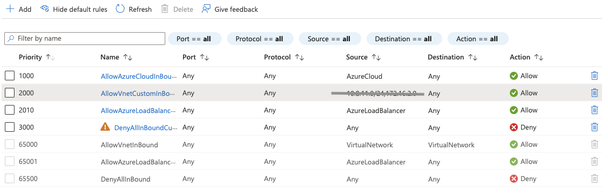
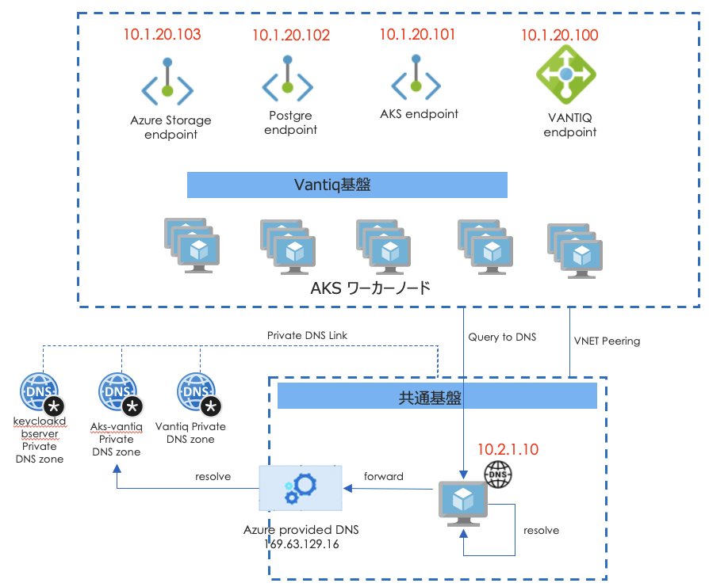
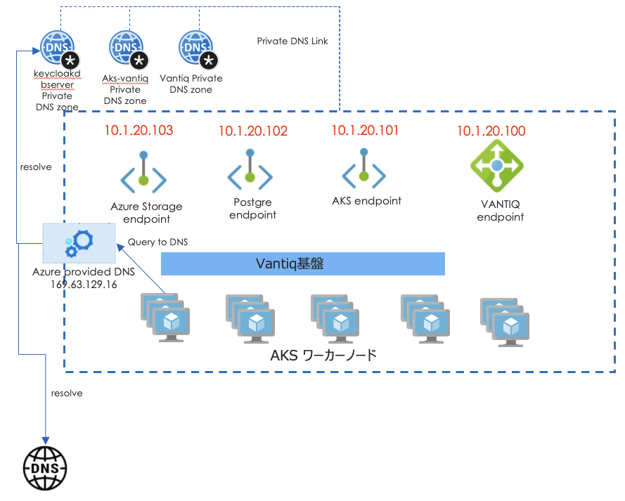
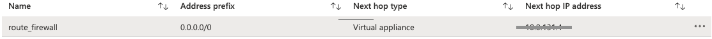

# Considerations for Closed Network Configuration (Azure)

## Internal Load Balancer

When creating a Load Balancer in a Closed Network, it is necessary to consider the followings.

- The Load Balancer must be configured as an internal Load Balancer and not have a Public IP.  
- The Load Balancer must be connected to the intended subnet and can be managed by the NSG.  

For AKS, add the annotations to `nginx.controller.service` property in the `deploy.yaml`. If necessary, it is possible to specify Subnet and IP with the annotation. [Use an internal load balancer with Azure Kubernetes Service (AKS)](https://docs.microsoft.com/en-us/azure/aks/internal-lb). The following is an example of placing a Load Balancer on a subnet of the specified name.  

```yaml
nginx:
  controller:
    tls:
      cert: xxx.xxx.full.crt
      key: xxx.xxx.key
    service:
      annotations:
        service.beta.kubernetes.io/azure-load-balancer-internal: "true"
        service.beta.kubernetes.io/azure-load-balancer-internal-subnet: "<target_subnet_name>"
```

### Configure Security Group
Configure it to restrict access from the Internet. Also, since the LoadBalancer does not perform SNAT, it is necessary to set the same permission rules on the AKS worker nodes as that set on the LoadBalancer. This means that if the Load Balancer and the AKS worker nodes are on different Subnets, the same settings should be done on each Subnet.



## Configure Private Endpoint
AKS, Storage and Azure Database for PostgreSQL are configured as public services by default, so they will not be able to be accessed from the Closed Network. Therefore, it is necessary to explicitly configure each service as Private. The followings need to be considered.  
- When configured as private, [the IP is assigned from the ranges of the specified subnet](https://docs.microsoft.com/en-us/azure/private-link/private-endpoint-overview#private-endpoint-properties). As this IP is indefinite each time it is configured, DNS registration is required to ensure that the application can resolve IP by name.
- Create a Private DNS Zone and register the FQDN. In Azure Portal, Setting it to Private will automatically configure the whole set of required resources, whereas in terraform, it is necessary to create each resource individually. The followings are samples of terraform scripts.

#### AKS
In AKS, by specifying `private_cluster_enabled` when creating, AKS Endpoint will be automatically configured as Private. A Private DNS Zone will be automatically configured with a name like `xxxxxxxx-xxxx-xxxx-xxxx-xxxxxxxxxx.privatelink.japaneast.azmk8s.io`, and will be attached to the VNET.

```tf
resource "azurerm_kubernetes_cluster" "aks-vantiq" {
  name                = var.aks_cluster_name
  location            = var.location
  resource_group_name = azurerm_resource_group.rg-aks.name
  dns_prefix          = var.aks_cluster_name
  private_cluster_enabled = var.private_cluster_enabled
...
```

Cautions:
- After creating AKS, it is not possible to change `private_cluster_enabled`.
Changing it will mean that the cluster will need to be rebuilt (thus changing everything, e.g., private endpoint).  
- In the case of AKS, it is not possible to enable the Private endpoint and the Public endpoint at the same time.

#### Storage Account
Storage Private Endpoint is created automatically when created from Azure Portal, whereas it needs to be defined separately in Terraform.  


- Create a Storage Account
```tf
# storage account
resource "azurerm_storage_account" "vantiq" {
  name                     = var.storage_account_name
  resource_group_name      = azurerm_resource_group.rg-storage.name
  location                 = var.location
  account_kind             = "StorageV2"
  account_tier             = "Standard"
  account_replication_type = "ZRS"
  access_tier              = "Hot"
  # security
  enable_https_traffic_only = true
  allow_blob_public_access  = false
  blob_properties {
    delete_retention_policy {
      days                   = 30
    }
  }
  tags = var.tags
}
```

- Create the Private Endpoint
```tf
## private link
resource "azurerm_private_endpoint" "pe-vantiq-storage-account" {
  name                 = "pe-vantiq-storage-account"
  location             = var.location
  resource_group_name  = azurerm_resource_group.rg-storage.name
  subnet_id            = var.storage_account_subnet_id
  private_service_connection {
    name                           = "connection-vantiq-storage-account"
    is_manual_connection           = false
    private_connection_resource_id = azurerm_storage_account.vantiq.id
    subresource_names              = ["blob"]
  }
}
```

- Create the Private DNS Zone `privatelink.blob.core.windows.net`
```tf
## Private DNS zone
resource "azurerm_private_dns_zone" "pdns-vantiq-storage-account" {
  ## split "xxxxxxx.blob.core.windows.net" into
  ##  "xxxxxxx" and "blob.core.windows.net" and use the second
  ## portion as DNS zone name.
  name                =  format("%s.%s", "privatelink", join(".", slice(split(".", "${azurerm_private_endpoint.pe-vantiq-storage-account.custom_dns_configs[0].fqdn}"), 1, length(split(".", "${azurerm_private_endpoint.pe-vantiq-storage-account.custom_dns_configs[0].fqdn}")))))  #
  resource_group_name = azurerm_resource_group.rg-storage.name
}
```

- Add DNS Record to the Private DNS Zone
```tf
# add DNS record - add to DNS zone
resource "azurerm_private_dns_a_record" "pdns-vantiq-storage-account" {
  name                = split(".", "${azurerm_private_endpoint.pe-vantiq-storage-account.custom_dns_configs[0].fqdn}")[0]
  zone_name           = azurerm_private_dns_zone.pdns-vantiq-storage-account.name
  resource_group_name = azurerm_resource_group.rg-storage.name
  ttl                 = 300
  records             = [azurerm_private_endpoint.pe-vantiq-storage-account.private_service_connection[0].private_ip_address]
}
```
- Attach the Private DNS Zone to VNET
```tf
# Private DNS Zone association with VNET
resource "azurerm_private_dns_zone_virtual_network_link" "pdns-vantiq-storage-account" {
  count = length(var.private_endpoint_vnet_ids)
  name                  = format("pdns-vantiq-storage-account-%d", count.index)
  resource_group_name   = azurerm_resource_group.rg-storage.name
  private_dns_zone_name = azurerm_private_dns_zone.pdns-vantiq-storage-account.name
  virtual_network_id    = var.private_endpoint_vnet_ids[count.index]
}
```

#### Azure Database for PostgreSQL

 Private Endpoint of the Azure Database for PostgreSQL is created automatically when created from Azure Portal, whereas it needs to be defined separately in Terraform.

- Create a Postgres Account
```tf
resource "azurerm_postgresql_server" "keycloak-dbserver" {
  name                = var.db_server_name  # change name
  resource_group_name = azurerm_resource_group.rg-rdb.name
  location            = var.location
  sku_name = "GP_Gen5_2"
  storage_mb                   = 102400
  backup_retention_days        = 7
  geo_redundant_backup_enabled = var.geo_redundant_backup_enabled
  auto_grow_enabled            = false
  administrator_login          = "keycloak"
  administrator_login_password = random_string.postgres_password.result
  version                      = "10"
  ssl_enforcement_enabled      = false
  public_network_access_enabled = var.public_network_access_enabled
  tags = var.tags
}
resource "azurerm_postgresql_database" "keycloak-db" {
  name                = "keycloak"
  ...
}
```

- Create the Private Endpoint
```tf
## private link
resource "azurerm_private_endpoint" "pe-keycloak-db-server" {
  name                 = "pe-keycloak-db-server"
  location             = var.location
  resource_group_name  = azurerm_resource_group.rg-rdb.name
  subnet_id            = var.private_subnet_id
  private_service_connection {
    name                           = "tfex-postgresql-connection"
    is_manual_connection           = false
    private_connection_resource_id = azurerm_postgresql_server.keycloak-dbserver.id
    subresource_names              = ["postgresqlServer"]
  }
}
```

- Create the Private DNS Zone `privatelink.postgres.database.azure.com`
```tf
## Private DNS zone
resource "azurerm_private_dns_zone" "pdns-postgres" {
  ## split "keycloakdbserver.privatelink.postgres.database.azure.com" into
  ##  "keycloakdbserver" and "privatelink.postgres.database.azure.com" and use the second
  ## portion as DNS zone name.
  name                =  format("%s.%s", "privatelink", join(".", slice(split(".", "${azurerm_postgresql_server.keycloak-dbserver.fqdn}"), 1, length(split(".", "${azurerm_postgresql_server.keycloak-dbserver.fqdn}")))))  #
  resource_group_name = var.resource_group_name
}
```
- Add DNS Record to the Private DNS Zone
```tf
# add DNS record - add to DNS zone
resource "azurerm_private_dns_a_record" "pdns-a-postgres" {
  name                = split(".", "${azurerm_postgresql_server.keycloak-dbserver.fqdn}")[0]  # keycloakdbserver
  zone_name           = azurerm_private_dns_zone.pdns-postgres.name
  resource_group_name = var.resource_group_name
  ttl                 = 300
  records             = [azurerm_private_endpoint.pe-keycloak-db-server.private_service_connection[0].private_ip_address]
}
```
- Attach the Private DNS Zone to VNET
```tf
# Private DNS Zone association with VNET
resource "azurerm_private_dns_zone_virtual_network_link" "pdnslk-a-postgres" {
  count = length(var.private_endpoint_vnet_ids)
  name                  = format("pdnslk-a-postgres-%d", count.index)
  resource_group_name   = azurerm_resource_group.rg-rdb.name
  private_dns_zone_name = azurerm_private_dns_zone.pdns-postgres.name
  virtual_network_id    = var.private_endpoint_vnet_ids[count.index]
}
```

## Information about Custom DNS server

Depending on customer requirements, Customer DNS server could be selected. It should be considered that the names resolving in the Private DNS Zone can also be resolved in the Custom DNS server configuration.
An important thing to note, Azure Provided DNS (196.63.129.16) refers to the Private DNS Zone attached to its VNET, and if unable to resolve then queries the higher (Public) DNS.

#### Option 1: Use a DNS Forwarder with a Custom DNS Server

1. Attach the Private DNS Zone to the VNET where the Custom DNS server is located.    
1. Configure the Custom DNS server to refer to the Azure provided DNS (196.63.129.16) using DNS Forward.  
1. Specify the DNS server of the VNET where the AKS Worker Nodes are located as the IP of the custom DNS server.



#### Option 2: Configure a Public DNS Zone

1. Attach the Private DNS Zone to the VNET where the AKS Worker Nodes are hosted.
1. Specify the default DNS server (Azure Provided DNS) of the VNET where the AKS Worker Nodes are located.  
1. Register the DNS that is required for cross-referencing with other than the Vantiq infrastructure, in the Public DNS Zone.  



#### References:
- [Name resolution that uses your own DNS server](https://docs.microsoft.com/en-us/azure/virtual-network/virtual-networks-name-resolution-for-vms-and-role-instances#name-resolution-that-uses-your-own-dns-server)
- [Azure Private Endpoint DNS configuration](https://docs.microsoft.com/en-us/azure/private-link/private-endpoint-dns)
- [Network concepts for applications in Azure Kubernetes Service (AKS)](https://docs.microsoft.com/en-us/azure/aks/concepts-network)


## Internet Gateway
For a Closed Networks, it is necessary to consider restricting Outbound connections to the Internet.  

#### In case the outbound is not to be restricted
Configure a NAT Gateway and attach it to the subnet where the AKS Worker Nodes are located.

#### In case the outbound is to be restricted
Consider using a service such as Azure Firewall, where it is possible to restrict traffic on the destination FQDN basis.
Configure the route table so that Outbound traffic routes to the Azure Firewall, and attach it to the subnet where the AKS Worker Nodes are located.


