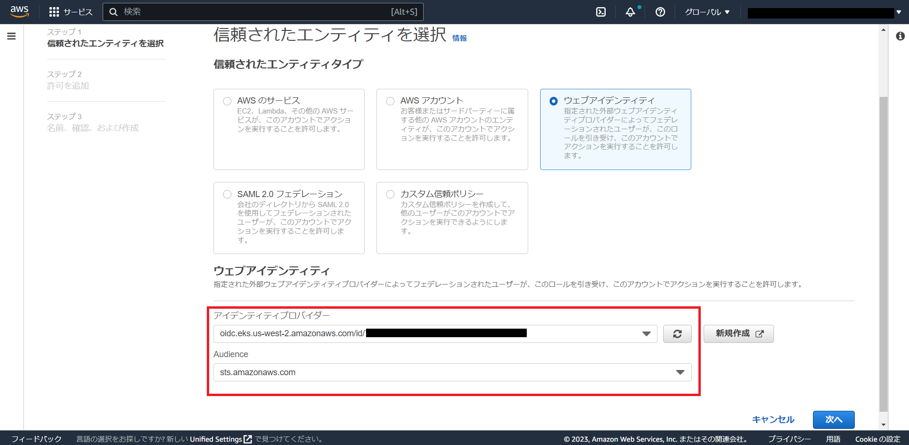
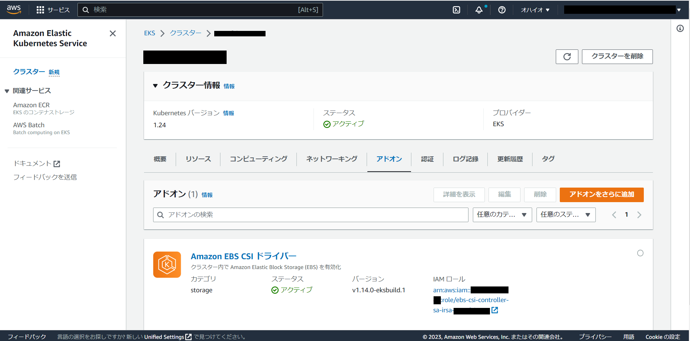

# EKS 更新時の必要作業
EKSのバージョン更新に伴い対応が必要な作業について説明します。  
なお、実施前に公式の以下のドキュメントを必ず参照してください。  
[Amazon EKS Kubernetes versions - Amazon EKS](https://docs.aws.amazon.com/eks/latest/userguide/kubernetes-versions.html)


# v1.23(v1.22 -> v1.23へ更新する場合)
MasterをUpdateする前にEBS CSI DriverをEKSクラスタに追加する必要があります。すでに追加されている場合は対応の必要はありません。  

## CSI Pluginの有効化  
以下の手順でAWS EBS CSI DriverアドオンをEKSに追加する必要が有ります。  
1. AWS EBS CSI Driver用のIRSA(IAM Roles for Service Accounts, kubernetesのService Accountに適用するIAM Role)の作成  
   [Creating the Amazon EBS CSI driver IAM role for service accounts - Amazon EKS](https://docs.aws.amazon.com/eks/latest/userguide/csi-iam-role.html)
2. EKS Managed アドオンとしてAWS EBS CSI Driverをデプロイ  
   [Managing the Amazon EBS CSI driver as an Amazon EKS add-on - Amazon EKS](https://docs.aws.amazon.com/eks/latest/userguide/managing-ebs-csi.html#adding-ebs-csi-eks-add-on)

以下の2パターンについて説明します。
- a. AWS Management Consoleから行う場合
- b. Terraformで行う場合

### a. AWS Management Consoleから行う場合
詳細な手順は公式ドキュメントを参照してください。本ドキュメントではスクリーンショットを用いて手順の概要について説明しています。  
1. AWS EBS CSI Driver用のIRSA(IAM Roles for Service Accounts, kubernetesのService Accountに適用するIAM Role)の作成  
ドキュメントにある通り、まずはIAM OIDC プロバイダの作成を行います。
参照: [Creating an IAM OIDC provider for your cluster - Amazon EKS](https://docs.aws.amazon.com/eks/latest/userguide/enable-iam-roles-for-service-accounts.html)
対象のクラスタを選択し、`OpenID Connect プロバイダー URL`をコピーしておきます。  
  
IAM > IDプロバイダからプロバイダを以下のように追加します。  
  

続いてIAM Roleを作成します。以下のように作成したIDプロバイダを指定します。    


1. EKS Managed アドオンとしてAWS EBS CSI Driverをデプロイ  
EKS > クラスター > 対象のクラスタ > アドオン から EBS CSI Driver をクラスタに追加します。  
追加する際のIAMロールの選択では1で作成したRoleを選択してください。  
追加が完了すると以下のようにManagement Consoleから確認できます。  


また、以下のようにkubectl コマンドでアドオンがデプロイされたことを確認します。  
```bash
$ kubectl get deployment,daemonset,pod -n kube-system -l app.kubernetes.io/component=csi-driver
NAME                                 READY   UP-TO-DATE   AVAILABLE   AGE
deployment.apps/ebs-csi-controller   2/2     2            2           23h

NAME                                  DESIRED   CURRENT   READY   UP-TO-DATE   AVAILABLE   NODE SELECTOR              AGE
daemonset.apps/ebs-csi-node           4         4         4       4            4           kubernetes.io/os=linux     23h
daemonset.apps/ebs-csi-node-windows   0         0         0       0            0           kubernetes.io/os=windows   23h

NAME                                      READY   STATUS    RESTARTS   AGE
pod/ebs-csi-controller-776884c99b-qpc4d   6/6     Running   0          23h
pod/ebs-csi-controller-776884c99b-rrrg6   6/6     Running   0          23h
pod/ebs-csi-node-2d9tk                    3/3     Running   0          23h
pod/ebs-csi-node-6bc6t                    3/3     Running   0          23h
pod/ebs-csi-node-96wj5                    3/3     Running   0          23h
pod/ebs-csi-node-lwkj4                    3/3     Running   0          23h
```

### b. Terraformで行う場合
本リポジトリのサンプルTerraformコードを参考にしてください。  
[ebs_csi_driver Module](../../terraform_aws/new/modules/eks_addon/ebs_csi_driver/csi_driver.tf)がEBS CSI Driverのモジュールです。  
[20_main > main.tf](../../terraform_aws/new/env-prod/20_main/main.tf)で上記モジュールを呼び出しています。  


# v1.24(v1.23 -> v1.24へ更新する場合)
MasterをUpdateする前にWorker Nodeのコンテナランタイムをdocker から containerd に変更する必要があります。すでに変更されている場合は対応の必要はありません。 

## Container Runtimeの変更
Dockershimが廃止になったため、v1.24へ更新する前にNodeのコンテナランタイムをcontainerdに変更する必要が有ります。    
v1.23のAMIではデフォルトがdockerのためAMIを置き換える必要があります。  
[Amazon EKS optimized Amazon Linux AMIs - Amazon EKS](https://docs.aws.amazon.com/eks/latest/userguide/eks-optimized-ami.html#containerd-bootstrap)


変更にあたって以下の2パターンの方法について説明します。  
- a. AWS Management Consoleから行う場合
- b. eksctlで行う場合
 
**※注意**  
クラスタ名に`大文字小文字アルファベット、数字、ハイフン以外の文字`が入っていると、eksctlでエラー発生が発生するためbの方法はとれないため注意してください。  
=> Cloudformationが裏で動いているが、そのStack名の命名規則に違反するため  
    => [Cloudformation stack validation error because of underscore in EKS cluster name · Issue #2943 · weaveworks/eksctl](https://github.com/weaveworks/eksctl/issues/2943)

### a. AWS Management Consoleから行う場合  
主に以下のような流れになります。  
1. kubeletの--container-runtime引数を変更した起動テンプレートの作成
2. 1で作成した起動テンプレートを指定した一時NodeGroupの作成  
3. 既存(コンテナランタイムがdocker)Nodeから2で作成したNode(コンテナランタイムがcontainerd)へPodを移動
4. 既存NodeのScaleを0に変更
5. 1~4をすべてのNodeGroupの種類(Vantiq,MongoDB,Keycloak,Grafana,Metrics)分繰り返す
6. Masterを1.24にUpdate
7. 既存Nodeを1.24にUpdateしScaleを戻す
8. 一時NodeGroupからPodを戻す
9. 一時NodeGroupを削除
10. terraform apply でtfstateを更新

#### 1.kubeletの--container-runtime引数を変更した起動テンプレートの作成
起動テンプレートを作成します。設定の際に以下がポイントとなります。  
ソーステンプレートに各NodeGroupに指定してある起動テンプレートを設定します。  

- ソーステンプレート > 起動テンプレート名  
  既存NodeGroupで利用されているテンプレート名  
  テンプレート名は`EKS > クラスタ > 対象のクラスタ > コンピューティング > 対象のNodeGroup > Auto Scaling グループ名 > 起動テンプレート`から確認できます。  
- 高度な詳細 > IAM インスタンスプロフィール  
  起動テンプレートの設定に含めない
- 高度な詳細 > ユーザーデータ  
  最終行の/etc/eks/bootstrap.shに指定しているオプションを2点編集します。  
  1. --kubelet-extra-args の eks.amazonaws.com/nodegroupで指定しているNodeGroup名の変更  
  次の2で作成する一時NodeGroup名を指定します。
  2. 最後に`--container-runtime containerd`を追加  
  作成した起動テンプレートのユーザーデータは以下のようになります。  
  

#### 2. 1で作成した起動テンプレートを指定した一時NodeGroupの作成 
EKS > クラスタ > 対象のクラスタ > コンピューティング から一時NodeGroupを追加します。  
起動テンプレートに1で作成したテンプレートを指定してください。その他設定は既存NodeGroupに合わせます。 
Node起動後、kubectl get node -o wideコマンドでNodeのコンテナランタイムがcontainerdであることを確認します。   

#### 3. 既存(コンテナランタイムがdocker)Nodeから2で作成したNode(コンテナランタイムがcontainerd)へPodを移動 / 4. 既存NodeのScaleを0に変更
一時NodeGroupが起動したらPodをkubectl drainなどを利用し移動させます。  
移動完了後既存NodeGroupのインスタンス数をAWS Management Consoleから0に変更します。


### 6. Masterを1.24にUpdate
Terraformで行う場合、Node Groupの変更をいったん以下のようにignore_changesで無視するようにします。
```tf
###
### Maneged Node Group
###
resource "aws_eks_node_group" "vantiq-nodegroup" {
・・・
  lifecycle {
    ignore_changes = [scaling_config]
  }
・・・
}
```

constants.tfの`locals.common_config.cluster_version`の値を1.24に変更しterraform applyを実行します。  

#### 7. 既存Nodeを1.24にUpdateしScaleを戻す
EKS > クラスタ > 対象のクラスタ > コンピューティング から既存NodeGroup(コンテナランタイムがdocker)を更新します。  
更新完了後、コンソールからインスタンス数を元の数に戻します。  

#### 8. 一時NodeGroupからPodを戻す
既存NodeGroupのNodeが起動したらPodをkubectl drainなどを利用し移動させます。  
移動完了後一時NodeGroupのインスタンス数をAWS Management Consoleから0に変更します。  
7と8もすべてのNodeGroupに対して行います。

#### 9. 一時NodeGroupを削除
Nodeが削除されたらコンソールから一時NodeGroupを削除します。

#### 10. terraform apply でtfstateを更新
6で一時的に追加したignore_changesを削除し、terraform applyを実行します。  
手動で変更した内容がterraform.tfstateに反映されます。  


## b. eksctlを利用した対応の場合  


```bash
$ eksctl create nodegroup -f tmp-np.yaml
2022-12-28 06:25:35 [ℹ]  will use version 1.23 for new nodegroup(s) based on control plane version
2022-12-28 06:25:35 [!]  no eksctl-managed CloudFormation stacks found for "watanabe_vantiq_cluster-prod", will attempt to create nodegroup(s) on non eksctl-managed cluster
2022-12-28 06:25:35 [ℹ]  nodegroup "VANTIQ-nodegroup-containerd" will use "ami-043ae9e91af48f40a" [AmazonLinux2/1.23]
2022-12-28 06:25:35 [ℹ]  using EC2 key pair "watanabe_vantiq_cluster-prod-eks-worker-20221226053622594200000001"
2022-12-28 06:25:35 [ℹ]  6 existing nodegroup(s) (MongoDB-nodegroup,VANTIQ-nodegroup,grafana-nodegroup,keycloak-nodegroup,mertics-nodegroup,test-containerd) will be excluded
2022-12-28 06:25:35 [ℹ]  1 nodegroup (VANTIQ-nodegroup-containerd) was included (based on the include/exclude rules)
2022-12-28 06:25:35 [ℹ]  will create a CloudFormation stack for each of 1 managed nodegroups in cluster "watanabe_vantiq_cluster-prod"
2022-12-28 06:25:35 [ℹ]  1 task: { 1 task: { 1 task: { create managed nodegroup "VANTIQ-nodegroup-containerd" } } }
2022-12-28 06:25:35 [ℹ]  building managed nodegroup stack "eksctl-watanabe_vantiq_cluster-prod-nodegroup-VANTIQ-nodegroup-containerd"
2022-12-28 06:25:35 [ℹ]  1 error(s) occurred and nodegroups haven't been created properly, you may wish to check CloudFormation console
2022-12-28 06:25:35 [ℹ]  to cleanup resources, run 'eksctl delete nodegroup --region=us-west-2 --cluster=watanabe_vantiq_cluster-prod --name=<name>' for each of the failed nodegroup
2022-12-28 06:25:35 [✖]  creating CloudFormation stack "eksctl-watanabe_vantiq_cluster-prod-nodegroup-VANTIQ-nodegroup-containerd": operation error CloudFormation: CreateStack, https response error StatusCode: 400, RequestID: 3d721d54-29a5-4dd1-8ba7-cf212d4f35ee, api error ValidationError: 1 validation error detected: Value 'eksctl-watanabe_vantiq_cluster-prod-nodegroup-VANTIQ-nodegroup-containerd' at 'stackName' failed to satisfy constraint: Member must satisfy regular expression pattern: [a-zA-Z][-a-zA-Z0-9]*

```


