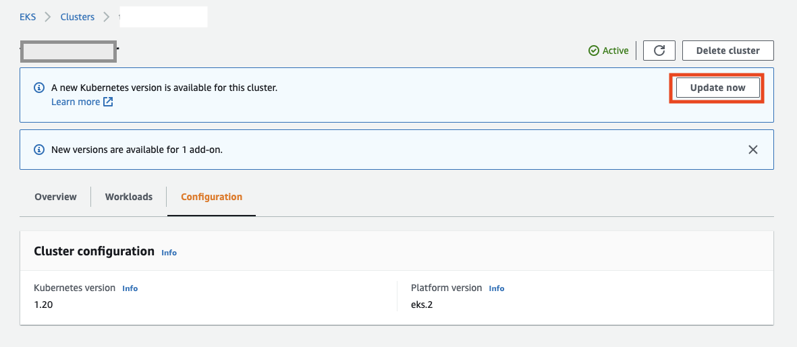

# Kubernetesアップグレード
この記事は、Vantiq Private Cloud構成において、インフラ管理者によりVantiqが稼働中のKubernetesクラスタのアップグレードの方法、留意点について説明します。

## AKSのアップグレード <a id="aks_upgrade"></a>

AKSのアップグレードは以下の２通りがあります。
方法 | 内容  | 条件
--|---|--
Azure Portalからアップグレードする  | Azure Portalから手動で、Control Plane, Node Poolsの順番でアップグレードを行う。  | <ul><li>実施するユーザーがサブスクリプションに必要な更新権限を持っていること</li></ul>
Terraformでアップグレードする  | Terraformの構成ファイル上でバージョンを更新し、Azureにapplyする。  |<ul><li>Terraformの実行環境のユーザーがサブスクリプションに必要な更新権限を持っていること</li><li>更新適用前のTerraformの構成状態に乖離がないこと。（Terraformで構築後、Terraform外で構成変更を行なっていないこと）</li></ul>

#### Azure Portalからアップグレードする
1. Control Planeの更新
   **Control Planeのみ更新**、もしくは**Control PlaneとすべてのNodepoolを更新するオプション**があるが、**前者で行います**。Nodepoolについては、Vantiq pod群の依存関係を考慮し、順番に実施する必要があります。

   

1. Nodepoolの更新
Node Poolsから対象のNodepoolを選択し、それぞれ更新を行います。以下の点を留意します。

    - Vantiq podおよびMongodb podが動作しているNodepoolはそれぞれ、他のNodepoolの更新とはタイミングをずらして更新すること。条件を満たせば同時に更新しても問題ありません。
    - Vantiq podが動作しているNodepoolの更新の際は、事前にMongodb podとKeycloak podがいずれも正常起動(status=Running)であることを確認の上、更新を行うこと。

    

    Nodepoolを選択し、**Update Kubernetes** を実行します。

    


#### Terraformからアップグレードする

「[Terraform を使って Azure AKS を作成](../../../vantiq-cloud-infra-operations/terraform_azure/readme.md)」のテンプレートを使用してインストールした想定の手順です。異なるテンプレートの場合、それに合わせ変更を行います。

1. `main.tf`の`kubernetes_version`の値をターゲットのバージョンに変更します。
```terraform
###
###  AKS
###
module "aks" {
  # fixed parameter. Do not change.
  source = "../modules/aks"
  aks_cluster_name = "aks-${var.vantiq_cluster_name}-${var.env_name}"
  location = var.location
  resource_group_name = "rg-${var.vantiq_cluster_name}-${var.env_name}-aks"
  tags = {
     environment = var.env_name
     app = var.vantiq_cluster_name
  }
  depends_on = [module.vpc]

  # kubernetes version
  kubernetes_version = "1.21.2"  // 1.20.9 -> 1.21.2
```

2. `terraform plan`を実行し、変更内容が正しいことを確認します。この時点で想定以外の変更が検知された場合、まずその変更を解消してください。
```sh
An execution plan has been generated and is shown below.
Resource actions are indicated with the following symbols:
  ~ update in-place

Terraform will perform the following actions:

  # module.aks.azurerm_kubernetes_cluster.aks-vantiq will be updated in-place
  ~ resource "azurerm_kubernetes_cluster" "aks-vantiq" {
        id                              = "/subscriptions/925b78f6-1bdc-41a2-95c7-a912eab56f8d/resourcegroups/rg-vantiqjpinternal-prod-aks/providers/Microsoft.ContainerService/managedClusters/aks-vantiqjpinternal-prod"
      ~ kubernetes_version              = "1.20.9" -> "1.21.2"
        name                            = "aks-vantiqjpinternal-prod"
        tags                            = {
            "app"         = "vantiqjpinternal"
            "environment" = "prod"
        }
        # (14 unchanged attributes hidden)


      ~ default_node_pool {
            name                         = "vantiqnp"
          ~ orchestrator_version         = "1.20.9" -> "1.21.2"
            tags                         = {}
            # (16 unchanged attributes hidden)
        }
...

  # module.aks.azurerm_kubernetes_cluster_node_pool.mongodbnp[0] will be updated in-place
  ~ resource "azurerm_kubernetes_cluster_node_pool" "mongodbnp" {
        id                     = "/subscriptions/925b78f6-1bdc-41a2-95c7-a912eab56f8d/resourcegroups/rg-vantiqjpinternal-prod-aks/providers/Microsoft.ContainerService/managedClusters/aks-vantiqjpinternal-prod/agentPools/mongodbnp"
        name                   = "mongodbnp"
      ~ orchestrator_version   = "1.20.9" -> "1.21.2"
        tags                   = {
            "app"         = "vantiqjpinternal"
            "environment" = "prod"
        }
        # (19 unchanged attributes hidden)
    }

Plan: 0 to add, 5 to change, 0 to destroy.
```

3. `terraform apply`を実行します。


## EKSのアップグレード <a id="eks_upgrade"></a>

EKSのアップグレードは以下の２通りがあります。
方法 | 内容  | 条件
--|---|--
AWS Management Consoleからアップグレードする  | AWS Management Consoleから手動で、Control Plane, Node Poolsの順番でアップグレードを行う。  | <ul><li>実施するユーザーが必要なIAM更新権限を持っていること</li></ul>
Terraformでアップグレードする  | Terraformの構成ファイル上でバージョンを更新し、AWSにapplyする。  |<ul><li>Terraformの実行環境のユーザーが実施するユーザーが必要なIAM更新権限を持っていること</li><li>更新適用前のTerraformの構成状態に乖離がないこと。（Terraformで構築後、Terraform外で構成変更を行なっていないこと）</li></ul>


#### AWS Management Consoleからアップグレードする

1. Amazon EKSから、クラスタを指定し、**Update Now**でControl Planeの更新を実行します。


1. Control Planeの更新が完了したら、Node GroupsからNodepoolを選択し、**Update Now**でNode Poolの更新を実行します。Nodegroupの数だけ、繰り返し、それぞれのバージョンを更新します。


#### Terraformからアップグレードする

「[Terraform を使って AWS EKS を作成](../../../vantiq-cloud-infra-operations/terraform_aws/readme.md)」のテンプレートを使用してインストールした想定の手順です。異なるテンプレートの場合、それに合わせ変更を行います。

1. `main.tf`の`cluster_version`の値をターゲットのバージョンに変更します。
```terraform
module "eks" {
  source             = "../modules/eks"
  cluster_name       = local.cluster_name
  env_name           = local.env_name
  vpc_id             = module.vpc.vpc_id
  public_subnet_ids  = module.vpc.public_subnet_ids
  private_subnet_ids = module.vpc.private_subnet_ids

  worker_access_ssh_key_name = local.worker_access_ssh_key_name
  basion_ec2_sg_ids          = [aws_security_group.basion-ssh-allow.id]

  keycloak_db_expose_port = local.keycloak_db_expose_port
  keycloak_db_sg_id       = module.keycloak-db.keycloak_db_sg_id

  # The following is custom setting
  cluster_version = "1.21"  # 1.20 -> 1.21　
```

2. `terraform plan`を実行し、変更内容が正しいことを確認します。この時点で想定以外の変更が検知された場合、まずその変更を解消してください。

3. `terraform apply`を実行します。


## Kubernetesアップグレードに伴う既知のリスク、留意事項
- kubernetesの新しいバージョンにVantiqが対応していることを確認の上、アップグレードをすること。事前にVantiq Supportへ問い合わせください。
- Vantiqのノードプール(nodegroup)とmongodbのノードプール(nodegroup)を同時にアップグレードすると、vantiq podが起動しないタイミングができてしまい、vantiqサービスの一時停止が起きうる。それぞれ同時に行わないこと。
- AKS 1.19からdockerではなくcontainerdが採用されている。Vantiqが行っているメトリクス収集に関し、2点の課題がある。1点は、System Admin GrafanaのVantiq ResourcesとMongoDB Monitoring DashboardのCPUに関するInfluxdbのMeasurementsが変更されているため、ダッシュボードのクエリパラメータを更新(別途添付)する必要がある。もう1点は、ds/telegraf-dsのdocker.sockへの接続がエラーとなる事象が継続的に発生している。本書更新時点で未解決であり運用回避となる。
- ワーカーノードの再起動に伴い、podが意図しないノードに移動する可能性がある。Podの配置の確認と必要に応じて再配置を行う (暫定対応手順書)。


# Vantiqのアップグレードについて
インフラ管理者視点での留意事項について説明します。（実際のオペレーション手順については、「[Vantiqバージョンアップ](../../../vantiq-platform-operations/docs/jp/vantiq-install-maintenance.md#minor_version_upgrade)」に記載）

#### Vantiqマイナーアップグレード
マイナーアップグレードはメタデータのスキーマ変更を伴うアップグレードである。そのため、サービスアウテージ時間を設定する必要がある。
1)	Vantiqデプロイツールのパラメータを変更する。レポジトリ上でレビューをする。
2)	Vantiqサービスを停止する（Vantiq Statefulsetスケールを0にする）
3)	Mongodbのバックアップを行う。
4)	Vantiqデプロイツールで変更を適用する。　→  Vantiqの新しいコンテナイメージが取得され、podが入れ替わる。その過程で、DBへのスキーマ変更が適用される。
5)	Vantiqサービスが動作することを確認し、スケールを元に戻す。
切り戻し手順
6)	Vantiqサービスを停止する。
7)	Mongodbのバックアップからデータを復旧する。
8)	Vantiqデプロイツールでバージョンダウングレードの変更を適用する。
9)	Vantiqサービスのスケールを元に戻す。


#### Vantiqパッチアップグレード
パッチアップグレードはメタデータのスキーマ変更を伴わないアップグレードである。
1)	Vantiqデプロイツールのパラメータを変更する。レポジトリ上でレビューをする。
2)	Mongodbのバックアップを行う。
3)	Vantiqデプロイツールで変更を適用する。　→  Vantiqの新しいコンテナイメージが取得され、podが入れ替わる。
4)	Vantiqサービスが動作することを確認し、スケールを元に戻す。
切り戻し手順
5)	Vantiqデプロイツールでバージョンダウングレードの変更を適用する。
6)	Vantiqサービスのスケールを元に戻す。

#### 既知のリスク、留意事項
- 必要とするPublicリポジトリへのアクセスが許可されている必要がある。Firewallでホワイトリストを設定している場合、Publicコンテナリポジトリのミラーサーバーは公開情報がなく、未知のミラーサーバーへのアクセス許可を都度追加する必要がある。
- 直接のsshでない作業環境においては、想定以上に時間がかかる可能性がある。


## アップグレード作業者後の確認項目

#### CLIによる確認項目
- Kubectl コマンドにてworker nodeのSTATUSがReadyとなっていること。
- KubectlコマンドにてRunningとなっていないPodがないこと。ただし、mongobackupはjobのため、左記の対象外。


#### Vantiq IDEによる確認項目
- System AdminによるIDEアクセスおよびSystem Admin/Grafanaへのアクセス及び各種項目がアップグレード作業前と同じように情報が表示されること。
- System Namespaceにて、エラー発生状況の確認及びエラーが発生している場合は、問題の切り分け。
- Organization rootにて、エラー発生状況の確認及びエラーが発生している場合は、問題の切り分け。
- Application Namespaceにて、アップグレード作業前のデータが欠損していたりしないこと。
- Application Namespaceにて、エラー発生状況の確認及びエラーが発生している場合は、問題の切り分け。
