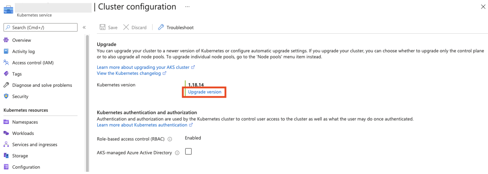
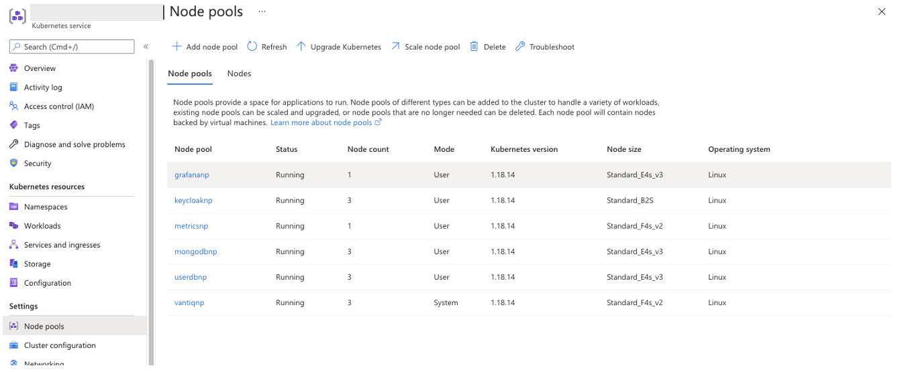
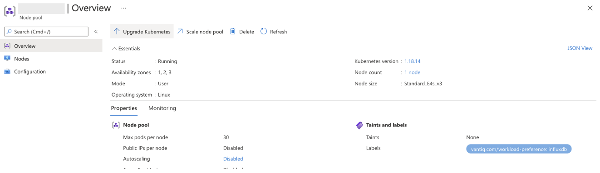
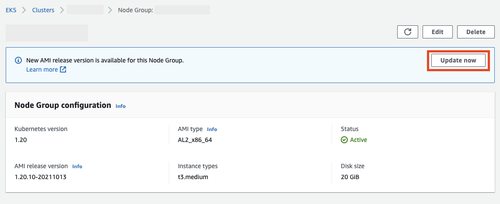

# はじめに
この記事は、Vantiq Private Cloud構成において、インフラ管理者によりVantiqが稼働中のKubernetesクラスタのアップグレードの方法、留意点について説明します。

# 目次
- [バージョンアップグレードにあたって](#on_version_upgrade)
  - [公式ドキュメントの確認](#check_official_documents)
  - [Kubernetesアップグレードに伴う既知のリスク、留意事項](#risks_and_considerations_for_k8s_upgrade)
- [AKSのアップグレード](#aks_upgrade)
  - [Azure Portalからアップグレードする](#aks_upgrade_on_portal)
  - [Terraformからアップグレードする](#aks_upgrade_on_terraform)
- [EKSのアップグレード](#eks_upgrade)
  - [AWS Management Consoleからアップグレードする](#eks_upgrade_on_console)
  - [Terraformからアップグレードする](#eks_upgrade_on_terraform)
- [バージョンごとの対応必要作業(過去バージョン履歴)](#required_operation_for_each_old_version)
  - [EKS](#required-operation-before-eks-upgrade)

# バージョンアップグレードにあたって<a id="on_version_upgrade"></a>
## 公式ドキュメントの確認<a id="check_official_documents"></a>
**AKS/EKSのバージョン更新に伴い対応が必要な作業がバージョンごとに異なります。**  
**実施前に以下のような公式ドキュメントなどを必ず参照し、確認してください。**  
[Amazon EKS Kubernetes versions - Amazon EKS](https://docs.aws.amazon.com/eks/latest/userguide/kubernetes-versions.html)  
[Azure Kubernetes Service (AKS) クラスターのアップグレード](https://learn.microsoft.com/ja-jp/azure/aks/upgrade-cluster?tabs=azure-cli)  


## Kubernetesアップグレードに伴う既知のリスク、留意事項<a id="risks_and_considerations_for_k8s_upgrade"></a>
### Vantiqバージョン/deploytoolsバージョンの確認
- Vantiqバージョン  
  kubernetesの新しいバージョンにVantiqが対応していることを確認の上、アップグレードを行って下さい。
- k8sdeploytoolsのsystem versionの確認
稼動中のVantiqクラスタの system version がバージョンアップ先のk8sのバージョンに対応していることを確認してください。  
system versionがバージョンアップ先のk8sバージョンに対応していない場合はk8sのバージョンアップの前にsystem versionを上げてください。

バージョンの対応表は[Release Map Reference](https://github.com/Vantiq/k8sdeploy/blob/master/ReleaseMap.md)(_要権限_)を確認してください。  

### telegraf-prom Podについて
Workerノードのバージョンアップ前に以下のコマンドでtelegraf-promを一時停止させておく必要が有ります。
```sh
kubectl scale deployment -n shared telegraf-prom --replicas 0
```
バージョンアップ完了後、以下のコマンドでtelegraf-promを起動します。  
```sh
kubectl scale deployment -n shared telegraf-prom --replicas 1
```

停止させずにWorkerノードのバージョンアップを行うとtelegraf-prom Podが稼動しているノードのバージョンアップが失敗します。  
telegraf-promには`PodDistruptionBudgets(pdb)`で`minAvailable`が1に設定してあり、レプリカ数を1に設定しているため、Workerノードのバージョンアップの際にPodのdrainが失敗するためです。  


### その他
- Vantiqのノード(nodegroup/nodepool)とmongodbのノード(nodegroup/nodepool)を同時にアップグレードすると、Vantiq podが起動しないタイミングができてしまい、Vantiqサービスの一時停止が発生する可能性があります。
- ワーカーノードの再起動に伴い、Podが意図しないノードに移動する可能性があります。Podの配置の確認と必要に応じて再配置を行ってください。
- AKS 1.19からdockerではなくcontainerdが採用されている。Vantiqが行っているメトリクス収集に関し、2点の課題がある。1点は、System Admin GrafanaのVantiq ResourcesとMongoDB Monitoring DashboardのCPUに関するInfluxdbのMeasurementsが変更されているため、ダッシュボードのクエリパラメータを更新(別途添付)する必要がある。もう1点は、ds/telegraf-dsのdocker.sockへの接続がエラーとなる事象が継続的に発生している。本書更新時点で未解決であり運用回避となる。


# AKSのアップグレード <a id="aks_upgrade"></a>

AKSのアップグレードは以下の２通りがあります。
方法 | 内容  | 条件
--|---|--
Azure Portalからアップグレードする  | Azure Portalから手動で、Control Plane, Node Poolsの順番でアップグレードを行う。  | <ul><li>実施するユーザーがサブスクリプションに必要な更新権限を持っていること</li></ul>
Terraformでアップグレードする  | Terraformの構成ファイル上でバージョンを更新し、Azureにapplyする。  |<ul><li>Terraformの実行環境のユーザーがサブスクリプションに必要な更新権限を持っていること</li><li>更新適用前のTerraformの構成状態に乖離がないこと。（Terraformで構築後、Terraform外で構成変更を行なっていないこと）</li></ul>

## Azure Portalからアップグレードする<a id="aks_upgrade_on_portal"></a>
1. Control Planeの更新
   **Control Planeのみ更新**、もしくは**Control PlaneとすべてのNodepoolを更新するオプション**があるが、**前者で行います**。Nodepoolについては、Vantiq pod群の依存関係を考慮し、順番に実施する必要があります。

  

2. Nodepoolの更新
  更新を行う前にtelegraf-promを停止しておきます。  
  ```sh
  kubectl scale deployment -n shared telegraf-prom --replicas 0
  ```

  Node Poolsから対象のNodepoolを選択し、それぞれ更新を行います。  

  

  Nodepoolを選択し、**Update Kubernetes** を実行します。

  

  Nodepoolの更新が完了したら以下のコマンドでtelegraf-promを起動します。  
  ```sh
  kubectl scale deployment -n shared telegraf-prom --replicas 1
  ```

## Terraformからアップグレードする<a id="aks_upgrade_on_terraform"></a>

「[Terraform を使って Azure AKS を作成](../../../vantiq-cloud-infra-operations/terraform_azure/new/readme.md)」のテンプレートを使用してインストールした想定の手順です。異なるテンプレートの場合、それに合わせ変更を行います。

1. `constants.tf`の`locals.common_config.cluster_version`の値をターゲットのバージョンに変更します。
```terraform
###
###  AKS
###
locals {
  common_config = {
    vantiq_cluster_name      = "vantiq"
    env_name                 = "prod"
    location                 = "japaneast"
    cluster_version          = "1.22.15" # 1.21.2 -> 1.22.15
    opnode_kubectl_version   = "1.22.15"
    ssh_private_key_aks_node = "aks_node_id_rsa"
    ssh_public_key_aks_node  = "aks_node_id_rsa.pub"
    ssh_public_key_opnode    = "opnode_id_rsa.pub"
  }
}
```

2. `terraform plan`を実行し、変更内容が正しいことを確認します。この時点で想定以外の変更が検知された場合、まずその変更を解消してください。
```sh
An execution plan has been generated and is shown below.
Resource actions are indicated with the following symbols:
  ~ update in-place

Terraform will perform the following actions:

  # module.aks.azurerm_kubernetes_cluster.aks-vantiq will be updated in-place
  ~ resource "azurerm_kubernetes_cluster" "aks-vantiq" {
        id                              = "/subscriptions/925b78f6-1bdc-41a2-95c7-a912eab56f8d/resourcegroups/rg-vantiqjpinternal-prod-aks/providers/Microsoft.ContainerService/managedClusters/aks-vantiqjpinternal-prod"
      ~ kubernetes_version              = "1.20.9" -> "1.21.2"
        name                            = "aks-vantiqjpinternal-prod"
        tags                            = {
            "app"         = "vantiqjpinternal"
            "environment" = "prod"
        }
        # (14 unchanged attributes hidden)


      ~ default_node_pool {
            name                         = "vantiqnp"
          ~ orchestrator_version         = "1.20.9" -> "1.21.2"
            tags                         = {}
            # (16 unchanged attributes hidden)
        }
...

  # module.aks.azurerm_kubernetes_cluster_node_pool.mongodbnp[0] will be updated in-place
  ~ resource "azurerm_kubernetes_cluster_node_pool" "mongodbnp" {
        id                     = "/subscriptions/925b78f6-1bdc-41a2-95c7-a912eab56f8d/resourcegroups/rg-vantiqjpinternal-prod-aks/providers/Microsoft.ContainerService/managedClusters/aks-vantiqjpinternal-prod/agentPools/mongodbnp"
        name                   = "mongodbnp"
      ~ orchestrator_version   = "1.20.9" -> "1.21.2"
        tags                   = {
            "app"         = "vantiqjpinternal"
            "environment" = "prod"
        }
        # (19 unchanged attributes hidden)
    }

Plan: 0 to add, 5 to change, 0 to destroy.
```

3. telegraf-prom Podを停止します。  
   更新を行う前にtelegraf-promを停止しておきます。  
  ```sh
  kubectl scale deployment -n shared telegraf-prom --replicas 0
  ```

4. `terraform apply`を実行します。

5. telegraf-prom Podを起動します。
  更新が完了したらtelegraf-promを起動します。  
  ```sh
  kubectl scale deployment -n shared telegraf-prom --replicas 1
  ```

# EKSのアップグレード <a id="eks_upgrade"></a>

EKSのアップグレードは以下の２通りがあります。
方法 | 内容  | 条件
--|---|--
AWS Management Consoleからアップグレードする  | AWS Management Consoleから手動で、Control Plane, Node Poolsの順番でアップグレードを行う。  | <ul><li>実施するユーザーが必要なIAM更新権限を持っていること</li></ul>
Terraformでアップグレードする  | Terraformの構成ファイル上でバージョンを更新し、AWSにapplyする。  |<ul><li>Terraformの実行環境のユーザーが実施するユーザーが必要なIAM更新権限を持っていること</li><li>更新適用前のTerraformの構成状態に乖離がないこと。（Terraformで構築後、Terraform外で構成変更を行なっていないこと）</li></ul>


## AWS Management Consoleからアップグレードする<a id="eks_upgrade_on_console"></a>

1. Controle Planeの更新
  Amazon EKSから、クラスタを指定し、**Update Now**でControl Planeの更新を実行します。
  

2. Node Groupの更新
  更新を行う前にtelegraf-promを停止しておきます。  
  ```sh
  kubectl scale deployment -n shared telegraf-prom --replicas 0
  ```

  Node GroupsからNodepoolを選択し、**Update Now**でNode Poolの更新を実行します。Nodegroupの数だけ、繰り返し、それぞれのバージョンを更新します。
  

  更新が完了したらtelegraf-promを起動します。  
  ```sh
  kubectl scale deployment -n shared telegraf-prom --replicas 1
  ```

## Terraformからアップグレードする<a id="eks_upgrade_on_terraform"></a>

「[Terraform を使って AWS EKS を作成](../../../vantiq-cloud-infra-operations/terraform_aws/new/readme.md)」のテンプレートを使用してインストールした想定の手順です。異なるテンプレートの場合、それに合わせ変更を行います。

1. Control Planeの更新を行うため、`constants.tf`の`locals.common_config.cluster_version`の値をターゲットのバージョンに変更します。
```terraform
locals {
  common_config = {
    cluster_name                   = "<INPUT-YOUR-CLUSTER-NAME>"
    cluster_version                = "1.24"    # 1.23 -> 1.24　
    bastion_kubectl_version        = "1.24.7"
    env_name                       = "prod"
    region                         = "<INPUT-YOUR-REGION>"
    worker_access_private_key      = "<INPUT-YOUR-SSH-PRIVATE-KEY-FILE-NAME>"
    worker_access_public_key_name  = "<INPUT-YOUR-SSH-PUBLIC-KEY-FILE-NAME>"
    bastion_access_public_key_name = "<INPUT-YOUR-SSH-PUBLIC-KEY-FILE-NAME>"
    bastion_enabled                = true
    bastion_instance_type          = "t2.micro"
  }
}
```

2. `terraform plan`を実行し、変更内容が正しいことを確認します。  
この時点で想定以外の変更が検知された場合、まずその変更を解消してください。  
また、Worker NodeのAMIのバージョンがリリースされたことにより変更が検知された場合は、以下のように`lifecycleのignore_changes`を一時的にeks Moduleの`aws_eks_node_group`に追加しWorker Nodeへの変更を回避します。  
```terraform
resource "aws_eks_node_group" "vantiq-nodegroup" {
  for_each        = var.managed_node_group_config
  cluster_name    = aws_eks_cluster.vantiq-eks.name
  node_group_name = "${each.key}-nodegroup"
  node_role_arn   = aws_iam_role.eks-worker-node-role.arn

  ami_type       = each.value.ami_type
  version         = each.value.kubernetes_version
  release_version = nonsensitive(data.aws_ssm_parameter.eks_ami_release_version[each.key].value)
  instance_types = each.value.instance_types
  disk_size      = each.value.disk_size
  subnet_ids     = var.private_subnet_ids

  remote_access {
    ec2_ssh_key               = aws_key_pair.worker.key_name
    source_security_group_ids = var.sg_ids_allowed_ssh_to_worker
  }

  scaling_config {
    desired_size = each.value.scaling_config.desired_size
    max_size     = each.value.scaling_config.max_size
    min_size     = each.value.scaling_config.min_size
  }

  labels = {
    "vantiq.com/workload-preference" = each.value.node_workload_label
  }

  depends_on = [
    aws_iam_role_policy_attachment.eks-worker-node,
    aws_iam_role_policy_attachment.ecr-ro,
    aws_iam_role_policy_attachment.eks-cni
  ]

  # 一時的に追加
  lifecycle {
    ignore_changes = [release_version]
  }

}
```

3. `terraform apply`を実行し、Control Planeを更新します。

4. Worker Nodeの更新を行うため、`constants.tf`の`locals.eks_config.managed_node_group_config.kubernetes_version`の値をターゲットのバージョンに変更します。
```terraform
locals {
  eks_config = {
    managed_node_group_config = {
      "VANTIQ" = {
        ami_type       = "AL2_x86_64"
        kubernetes_version  = "1.24" # 1.23 -> 1.24
        instance_types = ["c5.xlarge"] # c5.xlarge x 3
        disk_size      = 40
        scaling_config = {
          desired_size = 3
          max_size     = 6
          min_size     = 0
        }
        node_workload_label = "compute"
      },
      ・・・
```

5. `terraform plan`を実行し、変更内容が正しいことを確認します。この時点で想定以外の変更が検知された場合、まずその変更を解消してください。  
手順2でlifecycleのignore_changesを追加していた場合は削除しておきます。  

6. telegraf-prom Podを停止します。  
  Worker Nodeの更新を行う前にtelegraf-promを停止しておきます。  
  ```sh
  kubectl scale deployment -n shared telegraf-prom --replicas 0
  ```

7. `terraform apply`を実行し、Worker Nodeを更新します。

8. telegraf-prom Podを起動します。
  更新が完了したらtelegraf-promを起動します。  
  ```sh
  kubectl scale deployment -n shared telegraf-prom --replicas 1
  ```

# Vantiqのアップグレードについて
インフラ管理者視点での留意事項について説明します。（実際のオペレーション手順については、「[Vantiqバージョンアップ](../../../vantiq-platform-operations/docs/jp/vantiq-install-maintenance.md#minor_version_upgrade)」に記載）

#### Vantiqマイナーアップグレード
マイナーアップグレードはメタデータのスキーマ変更を伴うアップグレードである。そのため、サービスアウテージ時間を設定する必要がある。
1)	Vantiqデプロイツールのパラメータを変更する。レポジトリ上でレビューをする。
2)	Vantiqサービスを停止する（Vantiq Statefulsetスケールを0にする）
3)	Mongodbのバックアップを行う。
4)	Vantiqデプロイツールで変更を適用する。　→  Vantiqの新しいコンテナイメージが取得され、podが入れ替わる。その過程で、DBへのスキーマ変更が適用される。
5)	Vantiqサービスが動作することを確認し、スケールを元に戻す。
切り戻し手順
6)	Vantiqサービスを停止する。
7)	Mongodbのバックアップからデータを復旧する。
8)	Vantiqデプロイツールでバージョンダウングレードの変更を適用する。
9)	Vantiqサービスのスケールを元に戻す。


#### Vantiqパッチアップグレード
パッチアップグレードはメタデータのスキーマ変更を伴わないアップグレードである。
1)	Vantiqデプロイツールのパラメータを変更する。レポジトリ上でレビューをする。
2)	Mongodbのバックアップを行う。
3)	Vantiqデプロイツールで変更を適用する。　→  Vantiqの新しいコンテナイメージが取得され、podが入れ替わる。
4)	Vantiqサービスが動作することを確認し、スケールを元に戻す。
切り戻し手順
5)	Vantiqデプロイツールでバージョンダウングレードの変更を適用する。
6)	Vantiqサービスのスケールを元に戻す。

#### 既知のリスク、留意事項
- 必要とするPublicリポジトリへのアクセスが許可されている必要がある。Firewallでホワイトリストを設定している場合、Publicコンテナリポジトリのミラーサーバーは公開情報がなく、未知のミラーサーバーへのアクセス許可を都度追加する必要がある。
- 直接のsshでない作業環境においては、想定以上に時間がかかる可能性がある。


## アップグレード作業者後の確認項目

#### CLIによる確認項目
- Kubectl コマンドにてworker nodeのSTATUSがReadyとなっていること。
- KubectlコマンドにてRunningとなっていないPodがないこと。ただし、mongobackupはjobのため、左記の対象外。


#### Vantiq IDEによる確認項目
- System AdminによるIDEアクセスおよびSystem Admin/Grafanaへのアクセス及び各種項目がアップグレード作業前と同じように情報が表示されること。
- System Namespaceにて、エラー発生状況の確認及びエラーが発生している場合は、問題の切り分け。
- Organization rootにて、エラー発生状況の確認及びエラーが発生している場合は、問題の切り分け。
- Application Namespaceにて、アップグレード作業前のデータが欠損していたりしないこと。
- Application Namespaceにて、エラー発生状況の確認及びエラーが発生している場合は、問題の切り分け。


# バージョンごとの対応必要作業(過去バージョン履歴)<a id="required_operation_for_each_old_version"></a>

## EKS <a id="required-operation-before-eks-upgrade"></a>
EKSのバージョン更新に伴い対応が必要な作業について説明します。  
なお、実施前に公式の以下のドキュメントを必ず参照してください。  
[Amazon EKS Kubernetes versions - Amazon EKS](https://docs.aws.amazon.com/eks/latest/userguide/kubernetes-versions.html)

### v1.23(v1.22 -> v1.23へ更新する場合) <a id="required-operation-before-eks-upgrade_v1-22_to_v1-23"></a>
MasterをUpdateする前に`EBS CSI Driver`をEKSクラスタに追加する必要があります。  
**すでに追加されている場合は対応の必要はありません。**  

以下の手順でAWS EBS CSI DriverアドオンをEKSに追加します。  
1. AWS EBS CSI Driver用のIRSA(IAM Roles for Service Accounts, kubernetesのService Accountに適用するIAM Role)の作成  
   [Creating the Amazon EBS CSI driver IAM role for service accounts - Amazon EKS](https://docs.aws.amazon.com/eks/latest/userguide/csi-iam-role.html)
2. EKS Managed アドオンとしてAWS EBS CSI Driverをデプロイ  
   [Managing the Amazon EBS CSI driver as an Amazon EKS add-on - Amazon EKS](https://docs.aws.amazon.com/eks/latest/userguide/managing-ebs-csi.html#adding-ebs-csi-eks-add-on)

上記手順実施にあたって以下の2パターンについて説明します。
- a. AWS Management Consoleから行う場合
- b. Terraformで行う場合

#### a. AWS Management Consoleから行う場合
詳細な手順は公式ドキュメントを参照してください。本ドキュメントではスクリーンショットを用いて手順の概要について説明しています。  
1. AWS EBS CSI Driver用のIRSA(IAM Roles for Service Accounts, kubernetesのService Accountに適用するIAM Role)の作成  
ドキュメントにある通り、まずはIAM OIDC プロバイダの作成を行います。  
参照: [Creating an IAM OIDC provider for your cluster - Amazon EKS](https://docs.aws.amazon.com/eks/latest/userguide/enable-iam-roles-for-service-accounts.html)  
対象のクラスタを選択し、`OpenID Connect プロバイダー URL`をコピーしておきます。  
  
IAM > IDプロバイダからプロバイダを以下のように追加します。  
  

続いてIAM Roleを作成します。以下のように作成したIDプロバイダを指定します。    


1. EKS Managed アドオンとしてAWS EBS CSI Driverをデプロイ  
EKS > クラスター > 対象のクラスタ > アドオン から EBS CSI Driver をクラスタに追加します。  
追加する際のIAMロールの選択では1で作成したRoleを選択してください。  
追加が完了すると以下のようにManagement Consoleから確認できます。  


また、以下のようにkubectl コマンドでアドオンがデプロイされたことを確認します。  
```bash
$ kubectl get deployment,daemonset,pod -n kube-system -l app.kubernetes.io/component=csi-driver
NAME                                 READY   UP-TO-DATE   AVAILABLE   AGE
deployment.apps/ebs-csi-controller   2/2     2            2           23h

NAME                                  DESIRED   CURRENT   READY   UP-TO-DATE   AVAILABLE   NODE SELECTOR              AGE
daemonset.apps/ebs-csi-node           4         4         4       4            4           kubernetes.io/os=linux     23h
daemonset.apps/ebs-csi-node-windows   0         0         0       0            0           kubernetes.io/os=windows   23h

NAME                                      READY   STATUS    RESTARTS   AGE
pod/ebs-csi-controller-776884c99b-qpc4d   6/6     Running   0          23h
pod/ebs-csi-controller-776884c99b-rrrg6   6/6     Running   0          23h
pod/ebs-csi-node-2d9tk                    3/3     Running   0          23h
pod/ebs-csi-node-6bc6t                    3/3     Running   0          23h
pod/ebs-csi-node-96wj5                    3/3     Running   0          23h
pod/ebs-csi-node-lwkj4                    3/3     Running   0          23h
```

#### b. Terraformで行う場合
本リポジトリのサンプルTerraformコードを参考にしてください。  
[ebs_csi_driver Module](../../../vantiq-cloud-infra-operations/terraform_aws/new/modules/eks_addon/ebs_csi_driver/csi_driver.tf)がEBS CSI Driverのモジュールです。  
[20_main > main.tf](../../../vantiq-cloud-infra-operations/terraform_aws/new/env-prod/20_main/main.tf)で上記モジュールを呼び出しています。  


### v1.24(v1.23 -> v1.24へ更新する場合) <a id="required-operation-before-eks-upgrade_v1-23_to_v1-24"></a>
MasterをUpdateする前にWorker Nodeのコンテナランタイムをdocker から containerd に変更する必要があります。すでに変更されている場合は対応の必要はありません。 

#### Container Runtimeの変更
Dockershimが廃止になったため、v1.24へ更新する前にNodeのコンテナランタイムをcontainerdに変更する必要が有ります。    
v1.23のAMIではデフォルトがdockerのためAMIを置き換える必要があります。  
[Amazon EKS optimized Amazon Linux AMIs - Amazon EKS](https://docs.aws.amazon.com/eks/latest/userguide/eks-optimized-ami.html#containerd-bootstrap)


変更にあたって以下の2パターンがありますが、本ドキュメントではaパターンの方法について説明します。  
- a. AWS Management Consoleから行う場合
- b. eksctlで行う場合
 
**※注意**  
bパターンで行う場合、クラスタ名に`大文字小文字アルファベット、数字、ハイフン以外の文字`が入っていると、eksctlでエラー発生が発生するためbの方法はとれないため注意してください。  
=> Cloudformationが裏で動いているが、そのStack名の命名規則に違反するため  
    => [Cloudformation stack validation error because of underscore in EKS cluster name · Issue #2943 · weaveworks/eksctl](https://github.com/weaveworks/eksctl/issues/2943)

#### a. AWS Management Consoleから行う場合  
主に以下のような流れになります。  
1. kubeletの--container-runtime引数を変更した起動テンプレートの作成
2. 1で作成した起動テンプレートを指定した一時NodeGroupの作成  
3. 既存(コンテナランタイムがdocker)Nodeから2で作成したNode(コンテナランタイムがcontainerd)へPodを移動
4. 既存NodeのScaleを0に変更
5. 1~4をすべてのNodeGroupの種類(Vantiq,MongoDB,Keycloak,Grafana,Metrics)分繰り返す
6. Masterを1.24にUpdate
7. 既存Nodeを1.24にUpdateしScaleを戻す
8. 一時NodeGroupからPodを戻す
9. 一時NodeGroupを削除
10. terraform apply でtfstateを更新

##### 1.kubeletの--container-runtime引数を変更した起動テンプレートの作成
起動テンプレートを作成します。設定の際に以下がポイントとなります。  
ソーステンプレートに各NodeGroupに指定してある起動テンプレートを設定します。  

- ソーステンプレート > 起動テンプレート名  
  既存NodeGroupで利用されているテンプレート名  
  テンプレート名は`EKS > クラスタ > 対象のクラスタ > コンピューティング > 対象のNodeGroup > Auto Scaling グループ名 > 起動テンプレート`から確認できます。  
- 高度な詳細 > IAM インスタンスプロフィール  
  起動テンプレートの設定に含めない
- 高度な詳細 > ユーザーデータ  
  最終行の/etc/eks/bootstrap.shに指定しているオプションを2点編集します。  
  1. --kubelet-extra-args の eks.amazonaws.com/nodegroupで指定しているNodeGroup名の変更  
  次の2で作成する一時NodeGroup名を指定します。
  2. 最後に`--container-runtime containerd`を追加  
  作成した起動テンプレートのユーザーデータは以下のようになります。  
  

##### 2. 1で作成した起動テンプレートを指定した一時NodeGroupの作成 
EKS > クラスタ > 対象のクラスタ > コンピューティング から一時NodeGroupを追加します。  
起動テンプレートに1で作成したテンプレートを指定してください。その他設定は既存NodeGroupに合わせます。 
Node起動後、kubectl get node -o wideコマンドでNodeのコンテナランタイムがcontainerdであることを確認します。   

##### 3 ~ 5. 既存(コンテナランタイムがdocker)Nodeから2で作成したNode(コンテナランタイムがcontainerd)へPodを移動 / 4. 既存NodeのScaleを0に変更
一時NodeGroupが起動したらPodをkubectl drainなどを利用し移動させます。  
移動完了後既存NodeGroupのインスタンス数をAWS Management Consoleから0に変更します。


##### 6. Masterを1.24にUpdate
Terraformで行う場合、Node Groupの変更をいったん以下のようにignore_changesで無視するようにします。
```tf
###
### Maneged Node Group
###
resource "aws_eks_node_group" "vantiq-nodegroup" {
・・・
  lifecycle {
    ignore_changes = [scaling_config]
  }
・・・
}
```

constants.tfの`locals.common_config.cluster_version`の値を1.24に変更しterraform applyを実行します。  

##### 7. 既存Nodeを1.24にUpdateしScaleを戻す
EKS > クラスタ > 対象のクラスタ > コンピューティング から既存NodeGroup(コンテナランタイムがdocker)を更新します。  
更新完了後、コンソールからインスタンス数を元の数に戻します。  

##### 8. 一時NodeGroupからPodを戻す
既存NodeGroupのNodeが起動したらPodをkubectl drainなどを利用し移動させます。  
移動完了後一時NodeGroupのインスタンス数をAWS Management Consoleから0に変更します。  
7と8もすべてのNodeGroupに対して行います。

##### 9. 一時NodeGroupを削除
Nodeが削除されたらコンソールから一時NodeGroupを削除します。

##### 10. terraform apply でtfstateを更新
6で一時的に追加したignore_changesを削除し、terraform applyを実行します。  
手動で変更した内容がterraform.tfstateに反映されます。  
