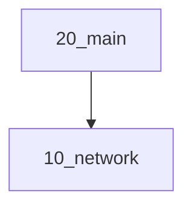

# VANTIQ on EKS with Terraform

Vantiq Public Cloudを構成するためのAWS Infrastructureの最もシンプルな構成。

## 構成


```
├── bastion-setup-sample.sh
├── env-xxx
│   ├── 10_network
│   │   ├── backend.tf
│   │   ├── main.tf
│   │   ├── output.tf
│   │   ├── provider.tf
│   ├── 20_main
│   │   ├── backend.tf
│   │   ├── main.tf
│   │   ├── output.tf
│   │   ├── provider.tf
│   ├── constants.tf
│   └── output.tf
├── modules
│   ├── eks
│   │   ├── eks.tf
│   │   ├── output.tf
│   │   └── variables.tf
│   ├── eks_addon
│   |   └── ebs_csi_driver
│   │       ├── csi_driver.tf
│   │       ├── output.tf
│   │       └── variables.tf
│   ├── opnode
│   │   ├── bastion-instance.tf
│   │   ├── bastion-userdata.sh.tpl
│   │   ├── output.tf
│   │   └── variables.tf
│   ├── rds-postgres
│   │   ├── output.tf
│   │   ├── postgresql.tf
│   │   └── variables.tf
│   └── vpc
│       ├── output.tf
│       ├── variables.tf
│       └── vpc.tf
└── bastion-setup-sample.sh
```

各環境(`env-prod`,`env-dev`,`env-template`)では、terraformのstateが以下の3つに分割されている。  
backendの設定以外はすべて各環境のルートディレクトリに存在する`constants.tf`に定義されている変数でパラメータをカスタマイズする。

- **10_network**  
  デプロイするネットワーク(vpc等)を作成  
- **20_main**  
  EKS,RDS,デプロイ作業などを行う踏み台サーバ(オプション)を作成

stateの依存関係は以下のようになっている。  



また、各モジュールでは以下のリソースを作成する。

### vpc

- **VPC**
- **Subnet** (Private x 3AZ, Public x 3AZ)
- **Internet Gateway**
- **NAT Gateway** (各Public Subnetへアタッチ)
- **Route Table** (Private x 3AZ, Public x 3AZ)

### eks

- **EKS**
- **Managed Node Group**
- **IAM Role & Policy**  

### eks_addon

#### ebs_csi_driver

- **EKS Addon(DaemonSet)**
- **IAM Role**
- **IAM IDプロバイダ**

### rds-postgres  

- **DB Subnet Group**
- **RDS Instance**
- **Security Group**  
Note: シングル構成のため、RDSの構成は考慮が必要

### opnode

作業用の踏み台サーバを作成する。  
後述の事前準備事項で作成したSSHキーを利用したアクセスを許可する。  
EKSのマネージドノードグループのWorker Nodeは踏み台サーバからのSSHのみ許可される。  

- **EC2**  
- **Key Pair**  
  EC2へSSHアクセスするために、ローカルのPublic Keyファイルを登録する  
- **Security Group**  
  SSHアクセスを許可する  
- **Elastic IP**  
  EC2にアタッチする

## 構築手順

### terraformのバージョンについて

各moduleでfor_eachを利用しているためv0.12.6以降であること  
確認済みバージョンはv1.1.8

### クラスタ構築の設定値について

各ディレクトリ(`env-prod`,`env-dev`,`env-template`)で環境ごとの設定値を設定し、クラスタ構築を行う。  
重要な設定値は`パラメータの設定`を参照

### 事前準備事項(terraform init前までに)

- AWSアカウントの用意する
- aws cliをインストール
- kubectlをインストール
- aws cliの初期設定,Credential(access key と secret key の取得)
- S3 Bucketの作成する(tfstateをS3で管理する場合)

  ```sh
  # S3 Bucketを作成
  aws s3 mb s3://<Bucket名> --region <リージョン名>

  #　S3 Bucketのバージョニングを有効化
  aws s3api put-bucket-versioning \
      --bucket <Bucket名> \
      --versioning-configuration Status=Enabled

  # S3 Bucketのバージョニング設定確認
  aws s3api get-bucket-versioning --bucket <Bucket名>
  ```

- インスタンスアクセス/EKSのWorker Node用のSSHキーの作成・登録する
- [このサイト](https://aws.amazon.com/jp/blogs/news/vcpu-based-on-demand-instance-limits-are-now-available-in-amazon-ec2/
)を参考にアカウントで使用できるVCPUのクオータを緩和申請する。2020/06時点では、c5,r5,t3,m5といったインスタンスは「Running On-Demand Standard (A, C, D, H, I, M, R, T, Z) instances」といった形でまとめられているため、必要数に応じて適用されている値からvcpuのクォータを挙げる。

- 使用するVPCのIPを確保する。/22以上のサブネットが望ましい。Production構成だと1 nodeあたり30のIPをとるため、11 nodeの構成だと/24では足りない、またサブネットをPrivate, Public, azごと、と分けるため、ギリギリではない方が望ましい

### パラメータの設定

ルートディレクトリの`constants.tf`ファイルにて、環境に応じてパラメータを設定する。  
**backendにremote(S3)を利用する場合**、各ディレクトリ配下の`main.tf`の一部も編集する。

#### constants.tf  

localsで定義している以下のconfigを設定

- locals.common_config  
  - `cluster_name`: EKSのクラスタ名のプレフィックス(クラスタ名は\<cluster-name\>-\<env_name\>となる)
  - `cluster_version`: EKSのバージョンを指定(x.xxのようにマイナバージョンまで指定)  
  - `bastion_kubectl_version`: 踏み台サーバへインストールするkubectlのバージョンを指定(x.xx.xxのようにパッチバージョンまで指定)
  - `env_name`: リソースのタグや命名に利用、任意の文字列を指定  
  - `region`: 作成するリージョン  
  - `worker_access_private_key`: 事前準備事項で作成したSSHキー(秘密鍵)のファイル名(Worker Nodeアクセス用に踏み台サーバへアップロード)
  - `worker_access_public_key_name`: 事前準備事項で作成したSSHキー(公開鍵)のファイル名を指定(Worker Nodeアクセス用)
  - `bastion_access_public_key_name`: 事前準備事項で作成したSSHキー(公開鍵)のファイル名を指定(踏み台サーバアクセス用)
  - `bastion_enabled`: 踏み台サーバを作成するかのフラグ(true: 作成する, false: 作成しない)
  - `bastion_instance_type`: 踏み台サーバのインスタンスサイズを指定
  - `bastion_jdk_version`: 踏み台サーバへインストールするJDKのバージョンを指定(デフォルト11)  
    Vantiq r1.34以下をインストールする場合は"8"を指定、r1.35以降はデフォルトの"11"を指定

- locals.network_config
  - `vpc_cidr_block`: 作成するVPCのcidr  
  - `public_subnet_config`: 作成するPublic Subnetのconfigで、各キーのオブジェクト(az-0など)が1つのSubnet  
  - `private_subnet_config`: public_subnet_configと同様、Private Subnet用config  
    ※ availability_zoneのサフィックス(a,b,c,dなど)は利用するリージョンに合わせて適宜変更をしてください。

- locals.rds_config  
  PrivateエンドポイントのDBインスタンスを作成(network_config内のPrivate Subnet内のいずれかのAZへシングル構成で作成)  
  - `db_name`: DBの名前
  - `db_username`: DBのユーザ名
  - `db_password`: 上記DBユーザのパスワード(デフォルトはnullに設定されており、その場合ランダムでパスワードを生成)  
  - `db_instance_class`: DBインスタンスのインスタンスサイズ  
  - `db_storage_size`: DBインスタンスのディスクサイズ  
  - `db_storage_type`: DBインスタンスのディスク種類  
  - `postgres_engine_version`: PostgreSQLのバージョン  
  - `keycloak_db_expose_port`: DBインスタンスがExposeするポート

- locals.eks_config  
  PublicアクセスポイントのEKSを作成  
  - `managed_node_group_config`: マネージドノードグループの設定で、各キーのオブジェクト(VANTIQなど)が1つのマネージドノードグループ  
    - `kubernetes_version`: Worker Nodeのkubernetesバージョンでマイナーバージョンまでを指定
  - `single_az_node_list`: Worker Nodeのうち作成されるAZを1つに絞るNode Group名(managed_node_group_configのキー名)をリストで指定  
    env-prodのデフォルトではシングル構成でPVを利用するInfluxDBがデプロイされうるgrafana Node Groupを指定
  - `sg_ids_allowed_ssh_to_worker`: Worker Nodeへのsshアクセスを許可するために指定する接続元のセキュリティグループID(bastionを本terraform以外で作成してある場合にlist(string)でIDを指定)  
    ※ 作成したbastionとWorker Nodeへの疎通が必要なため別途適切な設定を行うこと

- locals.eks_addon_config  
  - `ebs_csi_driver_enabled`: EKSのアドオンにEBS CSI Driverを追加するかのフラグ(true: 追加する, false: 追加しない)  
    falseにした場合はEKS構築後、別途アドオンを追加する必要有

- locals.tf_remote_backend  
  tfstateの管理をS3で行う場合に設定、事前準備で作成したBucketを設定  
  詳細は次の`tfstateの管理をS3で行う場合`を参照  
  ※ localの場合は デフォルトのままで設定不要

#### tfstateの管理をS3で行う場合

以下の2点の設定を行う必要が有る。

1. `constants.tf`のlocals.tf_remote_backendのパラメータ設定
   `bucket_name`: 事前準備で作成したBucket名を指定
   `key_prefix`: 保存するstateファイルのキーのプレフィックス
   `region`: 事前準備で作成したBucketのリージョンを指定
   stateファイルは<key_prefix>/network.tfstateのように保存される。
   => ex: key_prefix = "tfstate/prod"と指定した場合、S3のバケットにtfstate/prod/network.tfstateのように保存される。

2. `各ディレクトリのmain.tf`に宣言されているbackendとterraform_remote_state dataの変更
   - 「`### Case by use local for terraform backend - start ###`」から「`### Case by use local for terraform backend - end ###`」の間の行をコメントアウト
   - 「`### Case by use S3 Bucket for terraform backend - start ###`」から「`### Case by use S3 Bucket for terraform backend - end ###`」の間の行をアンコメント
   - アンコメントした「backend "s3"」のパラメータを設定
     `bucket`: 1で設定したbucket_nameと同じ値を指定
     `key`: 「\<INPUT-YOUR-KEY-PREFIX\>」を1で設定したkey_prefixと同じ値に置換
     `region`: 1で設定したregionと同じ値を指定

### 構築/削除の実行

各environmentの10_network,20_mainディレクトリに移動し、コマンドを実行する。
**※ 必ず以下の順に行ってください。**
   構築: 10_network -> 20_main
   削除: 20_main -> 10_network

**注意！ `env-prod`は本番向けで11台のサーバーで構成するため、多額（月額20万以上）の費用が発生します。お試しであれば、`env-dev`開発向け4台構成をお勧めします。**

```bash
# 10_network, 20_mainのディレクトリで実行する必要が有ります。

# 初期化
$ terraform init

# tfstateの差分算出
$ terraform plan

# tfstateとの差分を適用(クラウドリソースの作成)
$ terraform apply

# 構成を削除(クラウドリソースの削除)
$ terraform destroy
```

### 構築後作業(terraformで踏み台サーバを構築しなかった場合)

「bastion-setup-sample.sh」: Vantiqのインストールに必要なツールをインストールする際のサンプルスクリプト  
実行する場合は対象の端末にスクリプトを転送し以下を実行。(SSHアクセスなどは適宜設定)  

```sh
chmod +x ./bastion-setup-sample.sh
sudo ./bastion-setup-sample.sh
```

トラブルシューティング用にWorker Nodeに登録したSSHキーを端末に転送し、適切なディレクトリに配置・パーミッションの設定を行う。  

### Vantiqプラットフォームインストール作業への引き継ぎ

以下の設定を実施、および情報を後続の作業に引き継ぐ。

- EKSクラスタ名
- [EKSクラスタへのアクセス権の設定](../../docs/jp/aws_op_priviliges.md#EKSへのアクセス権の設定)（terraformの実行したIAMユーザー以外がVantiqプラットフォーム インストール作業を行う場合のみ）
- S3 Storageのエンドポイント(MongoDBのバックアップを設定する場合)
- keycloak DBのエンドポイント、および資格情報
- 踏み台サーバのIPアドレス
- 踏み台サーバへアクセスするためのユーザー名、ssh秘密鍵

```bash
# 構成情報の出力
$ terraform output
```

- Terraform 0.15以降を使用する場合、password項目をoutputするためには明示的にsensitive属性が必要です。

```tf
"keycloak-db-admin-password" {
...
  sensitive = true
}
```

```bash
# 構成情報のうち、sensitiveな情報の出力
terraform output -json | jq '"postgres_admin_password:" + .postgres_admin_password.value'
# もしくは以下のように対象のoutput名を指定
terraform output postgres_admin_password
```

## Reference

- [eks_configuration_for_VANTIQ_20200622.pptx](https://vantiq.sharepoint.com/:p:/s/jp-tech/ETzg5rfj5D9Hrjc71v5d5DYB3YS23pcvzh_9fy0lnQYMww?e=FKiAhG)
