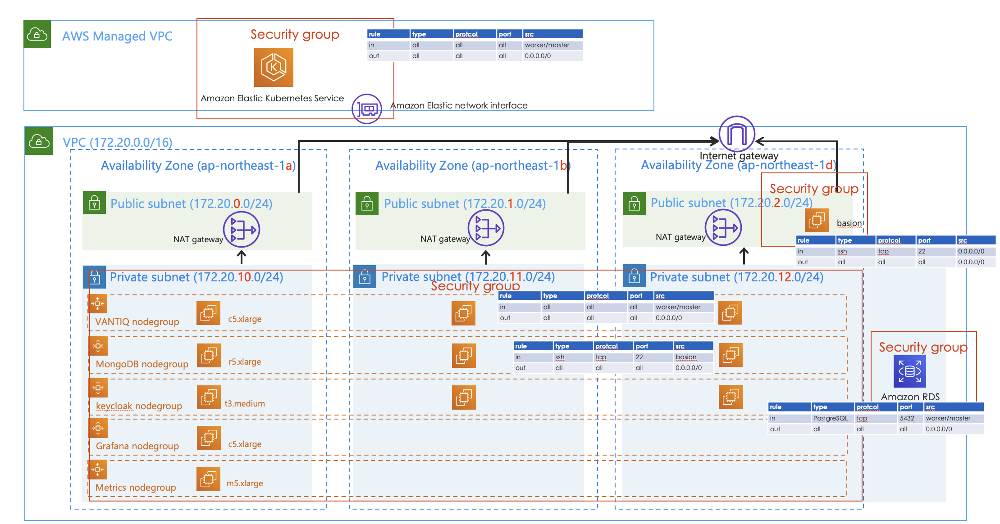

[Japanese Version here](readme.md)

# VANTIQ on EKS with Terraform
The simplest configuration of AWS Infrastructure to configure Public facing Private Cloud.

## Configuration



```
├── env-dev
│   ├── main.tf
│   ├── basion-instance.tf
│   ├── output.tf
│   └── variables.tf
├── env-prod
│   ├── main.tf
│   ├── basion-instance.tf
│   ├── output.tf
│   └── variables.tf
├── env-template
│   ├── main.tf
│   ├── basion-instance.tf
│   ├── output.tf
│   └── variables.tf
└── modules
    ├── eks
    ├── rds-postgres
    └── vpc
```


Each module will create the following resources.

### vpc
- **VPC**
- **Subnet** (Private x 3AZ, Public x 3AZ)
- **Internet Gateway**
- **NAT Gateway** (Attached to each Public Subnet)
- **Route Table** (Private x 3AZ, Public x 3AZ)

### eks
- **EKS**
- **Managed Node Group**
- **IAM Role & Policy**  
- **Security Group** - Note that the default Security Group is used for Managed Node Groups, because it is not possible to assign separate Security Groups to Master and Worker. In the default configuration, it is commented out.

### rds-postgres  
- **DB Subnet Group**
- **RDS Instance**
- **Security Group**  
Note: Since thsis is a single server option, further consideration is needed for production RDS configuration.

## Building procedure

### Terraform version
Each module uses _for_each_, so it must be v0.12.6 or later.  
Verified Version: v1.1.8

### Configuration values for cluster building
Go to the desired environment directory (`env-prod`,`env-dev`,`env-template`) and set the configuration values and build the cluster.   
The important configuration paramters are as follows.

### Preparation (before terraform init)
- Create an AWS account if not already
- Install aws cli
- Install kubectl
- Initialize Credential in aws cli (obtaining access key and secret key)
- Create an S3 bucket (if managing tfstate in S3)
  ```sh
  # Create an S3 Bucket
  aws s3 mb s3://<Bucket name> --region <region name>

  #　Enable an S3 Bucket versioning
  aws s3api put-bucket-versioning \
      --bucket <Bucket name> \
      --versioning-configuration Status=Enabled

  # Get the vesioning information of an S3 Bucket
  aws s3api get-bucket-versioning --bucket <Bucket name>
  ```
- Create and register an SSH key for instance access.
- Refer to [this page written in Japanese](https://aws.amazon.com/jp/blogs/news/vcpu-based-on-demand-instance-limits-are-now-available-in-amazon-ec2/) to apply for increasing of the VCPU quota available for your account. As of June, 2020, instances such as c5, r5, t3, and m5 are grouped together as "Running On-Demand Standard (A, C, D, H, I, M, R, T, Z) instances", so increase the vcpu quota from the value applied according to the required number.  
\* For English, please refer to [this page.](https://docs.amazonaws.cn/en_us/AWSEC2/latest/WindowsGuide/ec2-on-demand-instances.html)

- Secure VPC IP range. The range of subnets should be greater than /22.  In case of Production configuration, the cluster will have to occupy 30 IPs per node so 11 nodes cannot be accommodated in /24. Considering that subdivided public subnets, private subnets for each AZ are needed, securing ample IP ranges are crucial.


### Setting parameters
In each _tf_ file, set the parameters according to the environment.

#### main.tf  
This calls three modules to create VPC, EKS, and RDS resources.  

- locals  
  - `region`: Region to create  
  - `worker_access_ssh_key_name`: Specify the name of the SSH key created in the Preparation (for accessing the worker node).
  - `basion_access_ssh_key_name`: Specify the name of the SSH key created in the Preparation (for Bastion server access).


- terraform  
  - `backend`: If _tfstate_ is managed by S3, set the Bucket name created in the Preparation.  
  ※ For local, leave `backend` "local"


- module `vpc`  
  - `vpc_cidr_block`: cidr of the VPC to create  
  - `public_subnet_config`: The config of the Public Subnet to creat. Each key object (such as az-0) is a Subnet.  
  - `private_subnet_config`: Similar to public_subnet_config, config for Private Subnet


- module `eks`  
  - Create an EKS for Public access point  
  - `cluster_version`: The version of the EKS  
  - `managed_node_group_config`: The config of a Managed Node Group. One Managed Node Group for each key object (e.g. VNATIQ).  


- module `keycloak-db`  
  - Create a DB instance for the Private endpoint (created in a single node configuration in one of the AZs in the Private Subnet).  
  - `db_instance_class`: Instance size of the DB instance  
  - `db_storage_size`: Desk size of the DB instance  
  - `db_storage_type`: Disk type of the DB instance  
  - `postgres_engine_version`: The version of PostgreSQL  

  **The DB password is created as "Passw0rd", so change it after creation.**


#### basion-instance.tf  
Create an EC2 instance for the Bastion host.
Set up permissions for access using the SSH key created in the Preparation.
The Worker Node of the Managed Node Group is only allowed to use SSH from the Bastion host.

- data `aws_ami` `ubuntu`  
Obtain an AMI to be used on the Bastion host.


- resource `aws_instance` `basion`  
  - `instance_type`: Instance type of the Bastion host


### Post Creataion Tasks
- Change the password of the keycloak DB (PostgreSQL) instance.
- Transfer the registered SSH key to the Bastion host using SCP, etc., place it in an appropriate directory, and set the permissions.

The sample script "basion-setup-sample.sh" is used to install the tools that are necessary to install Vantiq on a Bastion server.
To run the script, transfer it to the Bastion server and execute the followings. 

```sh
$ chmod +x ./basion-setup-sample.sh
$ sudo ./basion-setup-sample.sh
```

### Execute Build/Delete
Go to the directory of each environment and execute the command.

**Caution！ `env-prod` will cost a lot of money (more than $1800/month) because it consists of 11 servers for production. If you want to try it out, we recommend you to use `env-dev`, which consists of only  4 servers for development.**

```bash
# Initialization
$ terraform init  \
  -var 'access_key=<YOUR-AWS-ACCESS_KEY>' \
  -var 'secret_key=<YOUR-AWS-SECRET_KEY>'

# Detect the changes from tfstate
$ terraform plan \
  -var 'access_key=<YOUR-AWS-ACCESS_KEY>' \
  -var 'secret_key=<YOUR-AWS-SECRET_KEY>'

# Apply the changes from tfstate (create Cloud resources)
$ terraform apply \
  -var 'access_key=<YOUR-AWS-ACCESS_KEY>' \
  -var 'secret_key=<YOUR-AWS-SECRET_KEY>'

# Delete the configuration (delete Could resources)
$ terraform destroy \
  -var 'access_key=<YOUR-AWS-ACCESS_KEY>' \
  -var 'secret_key=<YOUR-AWS-SECRET_KEY>'
```

## Notes
- If you are using Terraform 0.15 or later, `sensitive` attribute is required to output sensitive field such as password.
```
"keycloak-db-admin-password" {
...
  sensitive = true
}

## Reference
- [eks_configuration_for_VANTIQ_20200622.pptx](https://vantiq.sharepoint.com/:p:/s/jp-tech/ETzg5rfj5D9Hrjc71v5d5DYB3YS23pcvzh_9fy0lnQYMww?e=FKiAhG)
