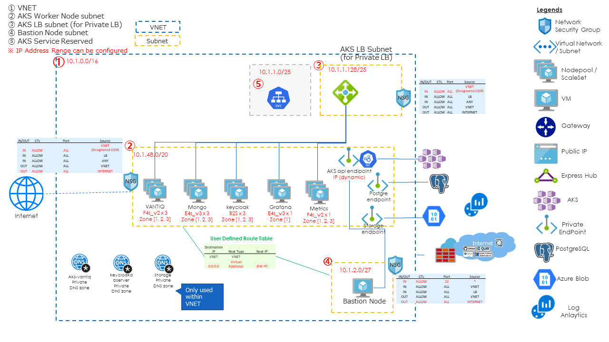
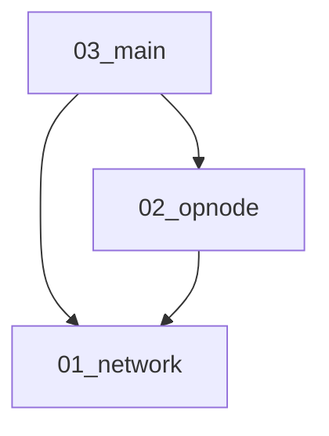
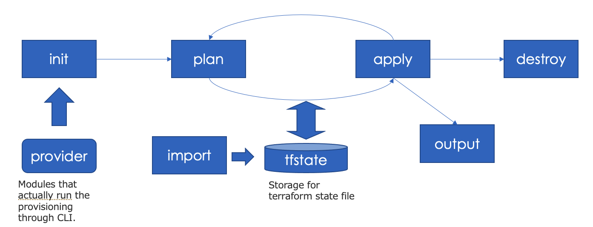

# VANTIQ on AKS with Terraform
Vantiq Public Cloudを構成するためのAzure Infrastructure構成。

## 構成



```
├── env-dev
│   ├── 01_network
│   │   ├── backend.tf
│   │   ├── main.tf
│   │   ├── output.tf
│   │   └── provider.tf
│   ├── 02_opnode
│   │   ├── backend.tf
│   │   ├── main.tf
│   │   ├── output.tf
│   │   └── provider.tf
│   ├── 03_main
│   │   ├── backend.tf
│   │   ├── main.tf
│   │   ├── output.tf
│   │   └── provider.tf
│   ├── constants.tf
│   └── output.tf
├── env-prod
│   ├── 01_network
│   │   ├── backend.tf
│   │   ├── main.tf
│   │   ├── output.tf
│   │   └── provider.tf
│   ├── 02_opnode
│   │   ├── backend.tf
│   │   ├── main.tf
│   │   ├── output.tf
│   │   └── provider.tf
│   ├── 03_main
│   │   ├── backend.tf
│   │   ├── main.tf
│   │   ├── output.tf
│   │   └── provider.tf
│   ├── constants.tf
│   └── output.tf
├── env-template
│   ├── 01_network
│   │   ├── backend.tf
│   │   ├── main.tf
│   │   ├── output.tf
│   │   └── provider.tf
│   ├── 02_opnode
│   │   ├── backend.tf
│   │   ├── main.tf
│   │   ├── output.tf
│   │   └── provider.tf
│   ├── 03_main
│   │   ├── backend.tf
│   │   ├── main.tf
│   │   ├── output.tf
│   │   └── provider.tf
│   ├── constants.tf
│   └── output.tf
├── imgs
│   ├── Terraform_workflow.png
│   └── terraform_azure_vantiq_config.png
├── modules
│   ├── aks
│   │   ├── README.md
│   │   ├── aks.tf
│   │   ├── loganalytics.tf
│   │   ├── output.tf
│   │   ├── service_principal.tf
│   │   └── variables.tf
│   ├── opnode
│   │   ├── README.md
│   │   ├── backup.tf
│   │   ├── init-script.sh
│   │   ├── opnode.tf
│   │   ├── output.tf
│   │   └── variables.tf
│   ├── rdb
│   │   ├── README.md
│   │   ├── output.tf
│   │   ├── rdb.tf
│   │   └── variables.tf
│   ├── storage
│   │   ├── README.md
│   │   ├── output.tf
│   │   ├── storage.tf
│   │   └── variables.tf
│   └── vpc
│       ├── README.md
│       ├── natgw.tf
│       ├── nsg.tf
│       ├── output.tf
│       ├── routetable.tf
│       ├── snet.tf
│       ├── variables.tf
│       ├── vnet-peering.tf
│       └── vnet.tf
└── readme.md
```

各環境(`env-prod`,`env-dev`,`env-template`)では、terraformのstateが以下の3つに分割されている。  
backendの設定以外はすべて各環境のルートディレクトリに存在する`constants.tf`に定義されている変数でパラメータをカスタマイズする。  

- **01_network**  
  デプロイするネットワーク(vnet等)を作成  
  利用モジュールは`vpc`
- **02_opnode**  
  デプロイ作業などを行う踏み台サーバを作成  
  利用モジュールは`opnode`
- **03_main**  
  AKS,RDB,MongoDBバックアップ用のblob storageを作成  
  利用モジュールは`rdb`, `aks`, `storage`

stateの依存関係は以下のようになっている。  


各モジュールでは以下のリソースを作成する。

### vpc
- **VNET**
- **Subnet** (Worker Node, LB, Bastion)
- **NAT Gateway** - NAT GWを設定し、Private Subnetにアタッチ
- **Route Table** - ユーザー定義Route Tableを作成し、private subnetにアタッチ
- **Network Security Group**

### aks
- **AKS**
- **Node Group** - vantiq, mongodb, keycloak, grafana, metrics, userdb
- **LogAnalysis** - LogAnalysis用のワークスペースを作成し、AKSにアタッチ
- **Service Prinicial** - Private LoadBalancerを作成する場合に使用する。
- **Private Endpoint** - AKS ServiceのPrivate Endpoint (Privateで構成する場合)

### rdb  
- **Azure Database for PostgreSQL**
- **Private Endpoint** - Database ServiceのPrivate Endpoint

### storage
- **Storage Account** - mongodbバックアップ用の領域
- **Private Endpoint** - Storage ServiceのPrivate Endpoint

### opnode
- **Virtual Machine** - Vantiq管理用のBastion


## 構築手順

### terraformのバージョンについて
- 0.13以上が必要
- 確認済みバージョン: v1.1.8

### クラスタ構築の設定値について
各ディレクトリ(`env-prod`,`env-dev`,`env-template`)で環境ごとの設定値を設定し、クラスタ構築を行う。  
**注意！ `env-prod`は本番向けで11台のサーバーで構成するため、多額（月額20万以上）の費用が発生します。お試しであれば、`env-dev`開発向け4台構成をお勧めします。**

重要な設定値は主に以下の通り

### 事前準備事項(terraform init前までに)
- Azureアカウントの用意する
- azure cliをインストール
  ```sh
  curl -sL https://aka.ms/InstallAzureCLIDeb | sudo bash
  ```

- kubectlをインストール
  ```sh
  sudo snap install kubectl --classic
  ```

- account管理者としてログインする
  ```sh
  az login -u <アカウントID> -p <パスワード>
  ```

- subscriptionを設定する
  ```sh
  az account set --subscription <replace with subscription_id>
  ```
- ログイン中のアカウントのサブスクリプションを調べる  (設定したsubscriptionが確認できればOK)
  ```sh
  az account show
  ```

- Terraformのtfstateデータをblobに保存する場合、Storage Accountを作成する。 (ローカルマシンで管理するのではあれば不要だが、共同作業ができなくなる。)
  ```sh
  # リソースグループを作成
  az group create --name ”<リソースグループ名>" --location "japaneast”

  #　ストレージアカウントを作成　(ストレージアカウントはURL endopointとなるため、グローバルで一意になる必要がある。）
  az storage account create \
    --name <storage_account> \
    --resource-group <resource_group_name> \
    --location japaneast \
    --sku Standard_ZRS \
    --encryption-services blob

  # storage containerを作成
  az storage container create \
    --account-name <storage_account> \
    --name "tfstate" \
    --auth-mode login
  ```

- インスタンスアクセス用のキーペアの作成する。
  - Bastionノードアクセス用
  - AKSワーカーノードアクセス用


- [クォータの引き揚げ](https://docs.microsoft.com/ja-jp/azure/azure-resource-manager/templates/error-resource-quota)を申請する。必要となるインスタンスのファミリー名を調べる。申請すると数分で引き揚げ完了のメールが来る。
  ```sh
  az vm list-usage --location "japaneast" -o table
  ```
  - Bsファミリー、ESv3ファミリー、FSv2ファミリーあたりを使用するので、デフォルト値の10から増やす。 (30~50くらいあれば十分）


- VNETのIPを確保する。/22以上のサブネットが望ましい。Production構成だと1 nodeあたり30のIPをとるため、11 nodeの構成だと/24では足りない、ギリギリではない方が望ましい。

- インストールに必要な情報をダウンロードするために、構築する環境からInternetへ通信できるようにしておく。特にファイアウォールにより閉域網を構成する場合。
  - [Azure Globalに必要なFQDNとアプリケーションの規則](https://docs.microsoft.com/ja-jp/azure/aks/limit-egress-traffic#azure-global-required-fqdn--application-rules) - コンテナリポジトリ等に通信できないと、AKS構築が失敗する。
  - Vantiq bastionノードがVantiqインストールに必要なソフトウェアのリポジトリへの通信が必要。すべてをホワイトリストすることは困難なので、一律許可しておくのが望ましい。

### パラメータの設定

#### constants.tf
localsで定義してある各configを設定する。  
sshのキーファイルはconstants.tfファイルと同じディレクトリに配置し、以下のパラメータにはファイル名を指定すること。

- locals.common_config  
  - `vantiq_cluster_name`: クラスタの名前  
  - `env_name`: 環境の名前（Prod, Devなど）  
    `vantiq_cluster_name` + `env_name`をさまざまなリソースのIDのsuffixとしているため、クラスタごとに一意になるようにつける。  
  - `location`: Region名 (japaneastなど)  
  - `cluster_version`: AKSのバージョンを指定(x.xx.xxのようにパッチバージョンまで指定)  
    サポートされるバージョンは以下でチェックできる。
    ```sh
    az aks get-versions --location japaneast
    ```
  - `ssh_private_key_aks_node`: 事前準備事項で作成したSSHキー(秘密鍵)のファイル名ワーカーノードアクセス用にbastionノードへアップロード)
  - `ssh_public_key_aks_node`: 事前準備事項で作成したSSHキー(公開鍵)のファイル名を指定(ワーカーノードアクセス用)
  - `ssh_public_key_opnode`: 事前準備事項で作成したSSHキー(公開鍵)のファイル名を指定(bastionノードアクセス用)
  - `opnode_kubectl_version`: 踏み台サーバへインストールするkubectlのバージョンを指定(x.xx.xxのようにパッチバージョンまで指定)  
  - `opnode_jdk_version`: 踏み台サーバへインストールするJDKのバージョンを指定(デフォルト11)  
    Vantiq r1.34以下をインストールする場合は"8"を指定、r1.35以降はデフォルトの"11"を指定

- locals.network_config  
  - `vnet_address_cidr` - 作成するVNETのcidr  
  - `snet_aks_node_address_cidr`, `snet_aks_lb_address_cidr`, `snet_op_address_cidr`: Subnetのcidr  

- locals.opnode_config  
  - `opnode_host_name`: bastionノードのホスト名
  - `opnode_user_name`: bastionノードのユーザー名
  - `ssh_access_enabled`: sshキーによるログインを行うか
  - `ssh_public_key` : bastionノードに接続するためのpublic keyのファイル名  
  - `public_ip_enabled`: bastionノードにpublic IPを付与するか
  - `ssh_private_key_aks_node`: AKSワーカーノードアクセス用のprivate keyのファイル名  

- locals.aks_config  
  - `kubernetes_version`: AKSのバージョン
  - `private_cluster_enabled` - AKSのサービスエンドポイントをPrivateとするか。**注: 一度構築するとこの設定は変更できない。**
  - `service_cidr` - Service用に確保するcidr
  - `admin_username` - AKSワーカーノードのユーザー名
  - `ssh_key` - AKSワーカーノードアクセス用のpublic keyのファイル名
  - `availability_zones` - 各Nodepool共通のワーカーノードを作成するzoneのリストでenv-devの場合nodepoolのVMが１台のみのため、特定のzoneにデプロイするために指定する
  - `xxx_node_pool_vm_size`: `vantiq`, `mongo`, `userdb`, `grafana`, `keycloak`, `metrics`の各nodepoolのVMサイズを指定する
  - `xxx_node_pool_node_count`: `vantiq`, `mongo`, `userdb`, `grafana`, `keycloak`, `metrics`の各nodepoolのVM数を指定する

- locals.tf_remote_backend  
  tfstateの管理をblobで行う場合に設定、事前準備で作成したストレージアカウントを設定  
  詳細は次の`tfstateの管理をblobで行う場合`を参照
  ※ localの場合は backend "local" のままで

#### tfstateの管理をblobで行う場合
以下の2点の設定を行う必要が有る。
1. `constants.tf`のlocals.tf_remote_backendのパラメータ設定  
   `resource_group_name`: 事前準備で作成したストレージアカウントのリソースグループ名を指定  
   `storage_account_name`: 事前準備で作成したストレージアカウント名を指定  
   `container_name`: 事前準備で作成したblobのコンテナ名を指定  
   stateファイルは`network.tfstate`, `opnode.tfstate`, `main.tfstate`のように保存される。  

2. `各ディレクトリのmain.tf`に宣言されているbackendとterraform_remote_state dataの変更
   - 「`### Case by use local for terraform backend - start ###`」から「`### Case by use local for terraform backend - end ###`」の間の行をコメントアウト
   - 「`### Case by use Azure Storage for terraform backend - start ###`」から「`### Case by use Azure Storage for terraform backend - end ###`」の間の行をアンコメント
   - アンコメントした「backend "azurerm"」のパラメータを設定  
     `resource_group_name`: 1で設定したresource_group_nameと同じ値を指定  
     `storage_account_name`: 1で設定したstorage_account_nameと同じ値を指定
     `container_name`: 1で設定したcontainer_nameと同じ値を指定    


### 構築/削除の実行
各environmentの01_network,02_basion,03_mainディレクトリに移動し、コマンドを実行する。  
**※ 必ず以下の順に行ってください。**  
   構築: 01_network -> 02_basion -> 03_main  
   削除: 03_main -> 02_basion -> 01_network

**注意！ `env-prod`は本番向けで11台のサーバーで構成するため、多額（月額20万以上）の費用が発生します。お試しであれば、`env-dev`開発向け4台構成をお勧めします。**



- `terraform init` – 初期化する.  tfstateのbackend設定、providerのダウンロードを行う
- `terraform plan` -  tfstateと.tfの差分を算出する
- `terraform apply` – tfstateと.tfの差分を適用し、構成する
- `terraform destroy` – 構成を破棄する
- `terraform output` – 構成の結果を再出力する
- `terraform import` – terraform外で構成済みのリソースをtfstate管理下に入れる


[Movie](https://vantiq.sharepoint.com/:v:/s/jp-tech/EYrDXmQthmJAgQnGKx7qVksBRZUTynaXEF0o0IR5uWNdlw?e=pxRIYH)

1 ~ 3 は 01_network, 02_basion, 03_mainの各ディレクトリで実行する必要が有ります。 
削除の際の`terraform destroy`も各ディレクトリで行う必要が有ります。  

1. terraform初期化（必要なプログラムのダウンロードなど）
  ```sh
  $ terraform init
  ```
2. terraformの変更を確認
  ```sh
  $ terraform plan
  ```
3. terraformの変更を適用
  ```sh
  $ terraform apply

  Do you want to perform these actions?
  Terraform will perform the actions described above.
  Only 'yes' will be accepted to approve.

  Enter a value: yes
  ```

4. 必要に応じてリカバリする。
  - 10分以上止まってしまうタスクがあったら、Ctrl + Cで止め、再度 3.を行う。
  - エラーが出る（tfstateファイルの状態と実際のリソースの状態の不整合）の場合、azure portalからエラーに該当するモジュールを削除し、再度3.を行う。

  - 新規のサブスクリプションの作業の場合、以下のようなエラーとなる場合がある。

  ```
  Error: creating Cluster: (Managed Cluster Name "<k8s cluster name>" / Resource Group "<resource group name>"): containerservice.ManagedClustersClient#CreateOrUpdate: Failure sending request: StatusCode=409 -- Original Error: Code="MissingSubscriptionRegistration" Message="The subscription is not registered to use namespace 'Microsoft.ContainerService'. See https://aka.ms/rps-not-found for how to register subscriptions." Details=[{"code":"MissingSubscriptionRegistration","message":"The subscription is not registered to use namespace 'Microsoft.ContainerService'. See https://aka.ms/rps-not-found for how to register subscriptions.","target":"Microsoft.ContainerService"}]
  ```

  原因は、サブスクリプションに対してリソースプロバイダーが登録されていない。以下のリンクを参考に、`Microsoft.ContainerService`のプロバイダーを登録すること。
  https://docs.microsoft.com/en-us/azure/azure-resource-manager/troubleshooting/error-register-resource-provider?tabs=azure-cli


5. kubeconfigを取得する
  ```sh
  az aks get-credentials --resource-group {resouce group} --name {aks cluster name}
  ```

6. `terraform output`ではsensitive項目は表示されない。以下のようにjsonを出力することで、sensitive項目値も取り出すことができる。
```sh
terraform output -json | jq '"rdb_postgres_admin_password:" + .rdb_postgres_admin_password.value'
# もしくは以下のように対象のoutput名を指定
terraform output rdb_postgres_admin_password
```
### Vantiqプラットフォームインストール作業への引き継ぎ
以下の設定を実施、および情報を後続の作業に引き継ぐ。

- AKSクラスタ名
- [AKSクラスタへのアクセス権の設定](#)（terraformの実行したazユーザー以外がVantiqプラットフォーム インストール作業を行う場合のみ）
- Azure Storage Serviceへのエンドポイントおよびコンテナ名
- keycloak DBのエンドポイント、および資格情報
- 踏み台サーバのIPアドレス
- 踏み台サーバへアクセスするためのユーザー名、ssh秘密鍵

## Reference
- [Terraform_Vantiq_Azure_20201119.pptx](https://vantiq.sharepoint.com/:p:/s/jp-tech/ERVU5CRzSXZKvu-p-8XVC6MBPPl12cY0ymasQ0UdsJy8mw?e=n72iQZ)
