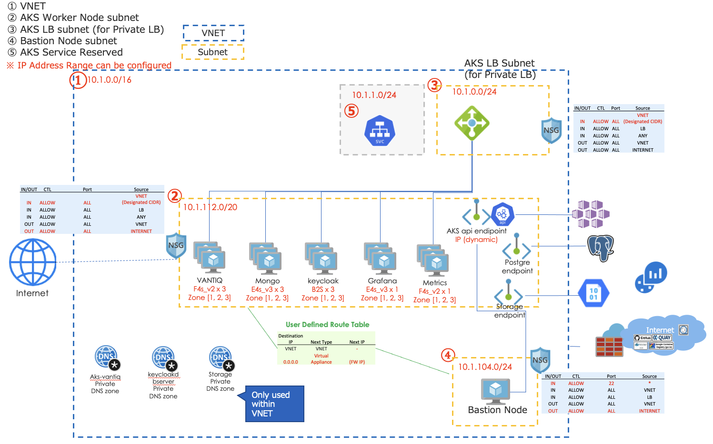
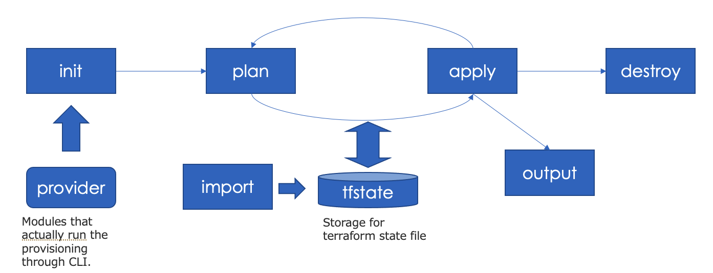

[English Version here](readme_en.md)

# VANTIQ on AKS with Terraform
Vantiq Public Cloudを構成するためのAzure Infrastructure構成。

## 構成



```
├── env-dev
│   ├── main.tf
│   ├── output.tf
│   └── variables.tf
├── env-prod
│   ├── main.tf
│   ├── output.tf
│   └── variables.tf
├── env-template
│   ├── main.tf
│   ├── output.tf
│   └── variables.tf
└── modules
    ├── aks
    ├── opnode
    ├── rdb
    ├── storage
    └── vpc

```


各モジュールでは以下のリソースを作成する。

### vpc
- **VNET**
- **Subnet** (Worker Node, LB, Bastion)
- **NAT Gateway** - NAT GWを設定し、Private Subnetにアタッチ
- **Route Table** - ユーザー定義Route Tableを作成し、private subnetにアタッチ
- **Netowrk Security Group**

### aks
- **AKS**
- **Node Group** - vantiq, mongodb, keycloak, grafana, metrics, userdb
- **LogAnalysis** - LogAnalysis用のワークスペースを作成し、AKSにアタッチ
- **Service Prinicial** - Private LoadBalancerを作成する場合に使用する。
- **Private Endpoint** - AKS ServiceのPrivate Endpoint (Privateで構成する場合)

### rdb  
- **Azure Database for PostgreSQL**
- **Private Endpoint** - Database ServiceのPrivate Endpoint

### storage
- **Storage Account** - mongodbバックアップ用の領域
- **Private Endpoint** - Storage ServiceのPrivate Endpoint

### opnode
- **Virtual Machine** - Vantiq管理用のBastion


## 構築手順

### terraformのバージョンについて
- 0.13以上が必要
- 確認済みバージョン: v0.14.9

### クラスタ構築の設定値について
各ディレクトリ(`env-prod`,`env-dev`,`env-template`)で環境ごとの設定値を設定し、クラスタ構築を行う。  
**注意！ `env-prod`は本番向けで11台のサーバーで構成するため、多額（月額20万以上）の費用が発生します。お試しであれば、`env-dev`開発向け4台構成をお勧めします。**

重要な設定値は主に以下の通り

### 事前準備事項(terraform init前までに)
- Azureアカウントの用意する
- azure cliをインストール
  ```sh
  curl -sL https://aka.ms/InstallAzureCLIDeb | sudo bash
  ```

- kubectlをインストール
  ```sh
  sudo snap install kubectl –classic
  ```

- account管理者としてログインする
  ```sh
  az login -u <アカウントID> -p <パスワード>
  ```

- subscriptionを設定する
  ```sh
  az account set --subscription <replace with subscription_id>
  ```
- ログイン中のアカウントのサブスクリプションを調べる  (設定したsubscriptionが確認できればOK)
  ```sh
  az account show
  ```

- kubectlをインストール
- Terraformのtfstateデータをblobに保存する場合、Storage Accountを作成する。 (ローカルマシンで管理するのではあれば不要だが、共同作業ができなくなる。)
  ```sh
  # リソースグループを作成
  az group create --name ”<リソースグループ名>" --location "japaneast”

  #　ストレージアカウントを作成　(ストレージアカウントはURL endopointとなるため、グローバルで一意になる必要がある。）
  az storage account create \
    --name <storage_account> \
    --resource-group <resource_group_name> \
    --location japaneast \
    --sku Standard_ZRS \
    --encryption-services blob

  # storage containerを作成
  az storage container create \
    --account-name <storage_account> \
    --name "tfstate" \
    --auth-mode login
  ```

- インスタンスアクセス用のキーペアの作成する。
  - Bastionノードアクセス用
  - AKSワーカーノードアクセス用


- [クォータの引き揚げ](https://docs.microsoft.com/ja-jp/azure/azure-resource-manager/templates/error-resource-quota)を申請する。必要となるインスタンスのファミリー名を調べる。申請すると数分で引き揚げ完了のメールが来る。
  ```sh
  az vm list-usage --location "japaneast" -o table
  ```
  - Bsファミリー、ESv3ファミリー、FSv2ファミリーあたりを使用するので、デフォルト値の10から増やす。 (30~50くらいあれば十分）


- VNETのIPを確保する。/22以上のサブネットが望ましい。Production構成だと1 nodeあたり30のIPをとるため、11 nodeの構成だと/24では足りない、ギリギリではない方が望ましい。


### パラメータの設定
各tfファイルにて、環境に応じてパラメータを設定する。

#### variables.tf
- `vantiq_cluster_name` - クラスタの名前
- `env_name` - 環境の名前（Prod, Devなど）
- `location` - Region名 (japaneastなど)

`vantiq_cluster_name` + `env_name`をさまざまなリソースのIDのsuffixとしているため、クラスタごとに一意になるようにつける。

#### main.tf  
5つのmoduleを呼び出し、VPC, AKS, RDB, Storage, OpNodeのリソースを作成する。

- terraform  
  - `backend`: tfstateの管理をS3で行う場合は、事前準備で作成したBucket名を設定  
  ※ localの場合は backend `local` のままで

- vpc
  - `vnet_address_cidr` - 作成するVNETのcidr
  - `snet_aks_node_address_cidr`, `snet_aks_lb_address_cidr`, `snet_op_address_cidr`: Subnetのcidr

- module `storage`  

- module `rdb`  

- module `opnode`  
  - `opnode_host_name`: bastionノードのホスト名
  - `opnode_user_name`: bastionノードのユーザー名
  - `ssh_access_enabled`: sshキーによるログインを行うか
  - `ssh_public_key` : bastionノードに接続するためのpublic keyのパス
  - `public_ip_enabled`: bastionノードにpublic IPを付与するか
  - `ssh_private_key_aks_node`: AKSワーカーノードアクセス用のprivate keyのパス

- module `aks`
  - `kubernetes_version`: AKSバージョン。サポートされるバージョンは以下でチェックできる。
  ```sh
  az aks get-versions --location japaneast
  ```
  - `private_cluster_enabled` - AKSのサービスエンドポイントをPrivateとするか。**注: 一度構築するとこの設定は変更できない。**
  - `service_cidr` - Service用に確保するcidr
  - `admin_username` - AKSワーカーノードのユーザー名
  - `ssh_key` - AKSワーカーノードアクセス用のpublic keyのパス
  - `xxx_node_pool_vm_size`: `vantiq`, `mongo`, `userdb`, `grafana`, `keycloak`, `metrics`の各nodepoolのVMサイズを指定する
  - `xxx_node_pool_node_count`: `vantiq`, `mongo`, `userdb`, `grafana`, `keycloak`, `metrics`の各nodepoolのVM数を指定する


### 構築/削除の実行
各environmentのディレクトリに移動し、コマンドを実行する。

**注意！ `env-prod`は本番向けで11台のサーバーで構成するため、多額（月額20万以上）の費用が発生します。お試しであれば、`env-dev`開発向け4台構成をお勧めします。**



- `terraform init` – 初期化する.  tfstateのbackend設定、providerのダウンロードを行う
- `terraform plan` -  tfstateと.tfの差分を算出する
- `terraform apply` – tfstateと.tfの差分を適用し、構成する
- `terraform destroy` – 構成を破棄する
- `terraform output` – 構成の結果を再出力する
- `terraform import` – terraform外で構成済みのリソースをtfstate管理下に入れる


[Movie](https://vantiq.sharepoint.com/:v:/s/jp-tech/EYrDXmQthmJAgQnGKx7qVksBRZUTynaXEF0o0IR5uWNdlw?e=pxRIYH)

1. terraform初期化（必要なプログラムのダウンロードなど）
  ```sh
  $ terraform init
  ```
2. terraformの変更を確認
  ```sh
  $ terraform plan
  ```
3. terraformの変更を適用
  ```sh
  $ terraform apply

  Do you want to perform these actions?
  Terraform will perform the actions described above.
  Only 'yes' will be accepted to approve.

  Enter a value: yes
  ```

4. 必要に応じてリカバリする。
  - 10分以上止まってしまうタスクがあったら、Ctrl + Cで止め、再度 3.を行う。
  - エラーが出る（tfstateファイルの状態と実際のリソースの状態の不整合）の場合、azure portalからエラーに該当するモジュールを削除し、再度3.を行う。


5. kubeconfigを取得する
  ```sh
  az aks get-credentials --resource-group {resouce group} --name {aks cluster name}
  ```

## Reference
- [Terraform_Vantiq_Azure_20201119.pptx](https://vantiq.sharepoint.com/:p:/s/jp-tech/ERVU5CRzSXZKvu-p-8XVC6MBPPl12cY0ymasQ0UdsJy8mw?e=n72iQZ)
