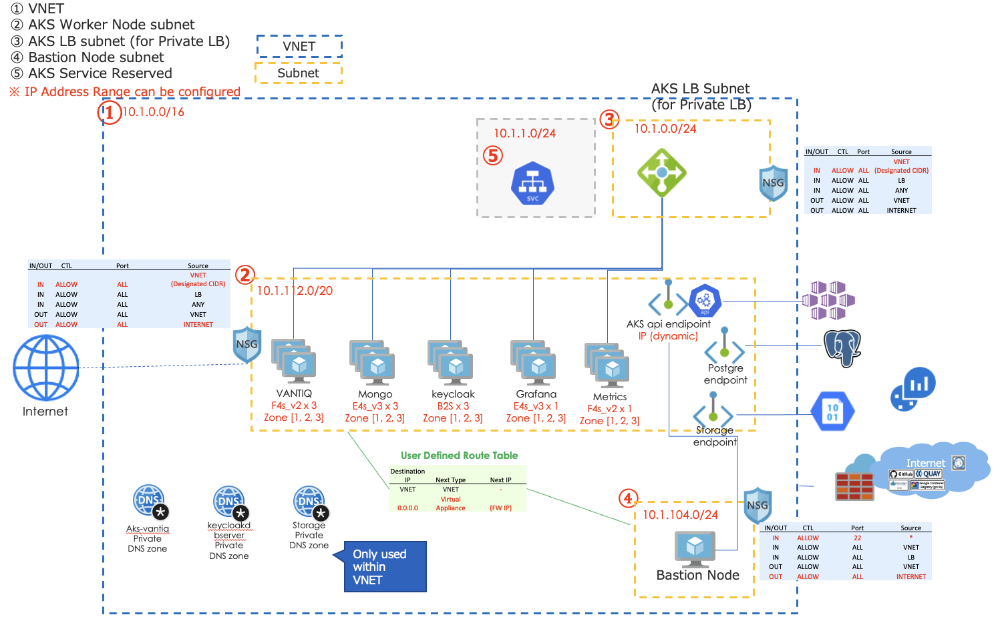

# VANTIQ on AKS with Terraform
The configuration of Azure Infrastructure to configure Vantiq Public facing Rrivate Cloud.

## Configuration



```
├── env-dev
│   ├── main.tf
│   ├── output.tf
│   └── variables.tf
├── env-prod
│   ├── main.tf
│   ├── output.tf
│   └── variables.tf
├── env-template
│   ├── main.tf
│   ├── output.tf
│   └── variables.tf
└── modules
    ├── aks
    ├── opnode
    ├── rdb
    ├── storage
    └── vpc

```


Each module will create the following resources.

### vpc
- **VNET**
- **Subnet** (Worker Node, LB, Bastion)
- **NAT Gateway** - Configure NAT GW and attach it to Private Subnet
- **Route Table** - Create a user-defined Route Table and attach it to a Private Subnet
- **Netowrk Security Group**

### aks
- **AKS**
- **Node Group** - vantiq, mongodb, keycloak, grafana, metrics, userdb
- **LogAnalysis** - Create a workspace for LogAnalysis and attach it to an AKS
- **Service Prinicial** - Used to create a Private LoadBalancer
- **Private Endpoint** - AKS ServiceのPrivate Endpoint (for Private configuration)

### rdb  
- **Azure Database for PostgreSQL**
- **Private Endpoint** - Private Endpoint for Database Service

### storage
- **Storage Account** - Storage for mongodb backup
- **Private Endpoint** - Private Endpoint for Storage Service

### opnode
- **Virtual Machine** - Bastion for Vantiq management


## Building procedure

### Terraform version
- 0.13 or higher is required
- Verified Version: v0.14.9

### Configuration values for cluster building
Go to the directory for desired environment  (env-prod,env-dev,env-template) and set the configuration values to build the cluster.  
**Caution！ `env-prod` will cost a lot of money (more than $1800/month) because it consists of 11 servers for production. If you want to try it out, we recommend you to use `env-dev`, which consists of 4 servers for development.**

The important configuration values are mainly the followings.

### Preparation (before terraform init)
- Create an Azure account if not done already
- Imstall azure cli
  ```sh
  curl -sL https://aka.ms/InstallAzureCLIDeb | sudo bash
  ```

- Install kubectl
  ```sh
  sudo snap install kubectl –classic
  ```

- Log in as an account administrator
  ```sh
  az login -u <Account ID> -p <Password>
  ```

- Set an subscription
  ```sh
  az account set --subscription <replace with subscription_id>
  ```
- Find out the subscription of the account logged into (it should be able to see the subscription you have set)
  ```sh
  az account show
  ```

- Install kubectl
- In case of storing Terraform _tfstate_ data in a blob, create a Storage Account ( This is not necessary in case of managing the data on the local machine, but it will not allow you to collaborate.)
  ```sh
  # Create an Resource group
  az group create --name ”<Resource group name>" --location "japaneast”

  #　Create a Storage account (the Storage account will be the URL endopoint, so it needs to be globally unique.)
  az storage account create \
    --name <storage_account> \
    --resource-group <resource_group_name> \
    --location japaneast \
    --sku Standard_ZRS \
    --encryption-services blob

  # Create a Storage container
  az storage container create \
    --account-name <storage_account> \
    --name "tfstate" \
    --auth-mode login
  ```

- Create a key pair for instance access
  - For Bastion node access
  - For AKS worker node access


- Request [a quota increase](https://docs.microsoft.com/en-us/azure/azure-resource-manager/templates/error-resource-quota). Find out the family name of the instance required. Once submitted, you'll receive the request completed email in a few minutes.
  ```sh
  az vm list-usage --location "japaneast" -o table
  ```
  - Since we will be using Bs family, ESv3 family, and FSv2 family, increase from the default value of 10. (30~50 is enough)

- Secure VNET IP range. The range of subnets should be greater than /22.  In case of Production configuration, the cluster will have to occupy 30 IPs per node so 11 nodes cannot be accommodated in /24.


### Setting parameters
In each _tf_ file, set the parameters according to the environment.

#### variables.tf
- `vantiq_cluster_name` - Cluster name
- `env_name` - Environment name (Prod, Dev, etc.)
- `location` - Region name (e.g. japaneast)

Since `vantiq_cluster_name` + `env_name` make up a suffix for the IDs of various resources, it should be unique for each cluster.

#### main.tf  
Call and create five modules, namely VPC, AKS, RDB, Storage, OpNode resources.

- terraform  
  - `backend`:  If _tfstate_ is managed by S3, set the Bucket name created in the Preparation.  
  ※ For local, leave backend `local`

- vpc
  - `vnet_address_cidr` - cidr of the VNET to create
  - `snet_aks_node_address_cidr`, `snet_aks_lb_address_cidr`, `snet_op_address_cidr`: cidr for Subnet

- module `storage`  

- module `rdb`  

- module `opnode`  
  - `opnode_host_name`: Host name of the Bastion node
  - `opnode_user_name`: User name of the Bastion node
  - `ssh_access_enabled`: Whether to use ssh key login or not
  - `ssh_public_key` : Path of the Public key to connect to the Bastion node
  - `public_ip_enabled`: Whether to give the Public IP to the Bastion node
  - `ssh_private_key_aks_node`: Path to the private key for AKS worker node access

- module `aks`
  - `kubernetes_version`: AKS version. The supported versions can be checked below.  
  ```sh
  az aks get-versions --location japaneast
  ```
  - `private_cluster_enabled` - Whether to set AKS service endpoint as Private or not.**Note: Once built, this setting cannot be changed.**
  - `service_cidr` - cidr to reserve for Service
  - `admin_username` - User name of the AKS worker node
  - `ssh_key` - Path of the Public key for AKS worker node access
  - `xxx_node_pool_vm_size`: Specify the VM size of each nodepool in `vantiq`, `mongo`, `userdb`, `grafana`, `keycloak`, `metrics`
  - `xxx_node_pool_node_count`: Specify the number of VM for each nodepool in `vantiq`, `mongo`, `userdb`, `grafana`, `keycloak`, `metrics`


### Execute Build/Delete
Go to the directory of each environment and execute the command.

**Caution！ `env-prod` will cost a lot of money (more than $1800/month) because it consists of 11 servers for production. If you want to try it out, we recommend you to use `env-dev`, which consists of 4 servers for development.**


- `terraform init` – Initialize. Configure the _tfstate_ backend and download the provider.
- `terraform plan` -  Detect the changes between _tfstate_ and _.tf_
- `terraform apply` – Apply and configure the changes between _tfstate_ and _.tf_
- `terraform destroy` – Delete the configuration
- `terraform output` – Re-output the results of a configuration
- `terraform import` – Bring configured resources outside terraform under _tfstate_ managed


[Movie](https://vantiq.sharepoint.com/:v:/s/jp-tech/EYrDXmQthmJAgQnGKx7qVksBRZUTynaXEF0o0IR5uWNdlw?e=pxRIYH)

1. Initialize terraform（download necessary programs, etc.)  
  ```sh
  $ terraform init
  ```
2. Detect the changes from tfstate
  ```sh
  $ terraform plan
  ```
3.  Apply the changes from tfstate
  ```sh
  $ terraform apply

  Do you want to perform these actions?
  Terraform will perform the actions described above.
  Only 'yes' will be accepted to approve.

  Enter a value: yes
  ```

4. Recover if necessary
  - If a task is stuck for more than 10 minutes, stop it by pressing `Ctrl + C`, and perform step 3 again.
  - If an error occurs (inconsistency between the state of the _tfstate_ file and the actual state of the resource), delete the module that corresponds to the error from the azure portal, and then perform step 3 again.


5. Get kubeconfig
  ```sh
  az aks get-credentials --resource-group {resouce group} --name {aks cluster name}
  ```

## Reference
  - [Terraform_Vantiq_Azure_20201119.pptx](https://vantiq.sharepoint.com/:p:/s/jp-tech/ERVU5CRzSXZKvu-p-8XVC6MBPPl12cY0ymasQ0UdsJy8mw?e=n72iQZ)
