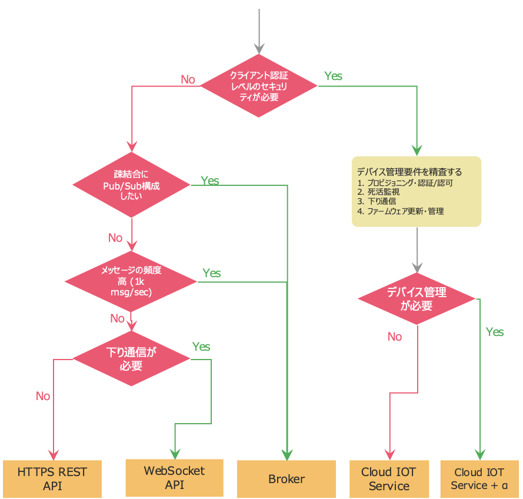

## Purpose
This article describes the data integration patterns from sensors/devices to the Vantiq.

## Edge - Vantiq configuration Data integration Guideline

#### Confirm sensor/device requirements
Consider the route of the connection to the gateway by examining the requirements of the sensor/device.
- Transmission methods, Communication protocols
- Power supply method
- Physical installation location
- Application intended use
- Resolving power, Detection value range, Accuracy
- Data size, Frequency of data generation
- Legal rules
- Cost
- Etc.

#### Consider the Vantiq Edge configuration
Consider to configure the Vantiq Edge in the local network if necessary.
- For data security and privacy reasons, data cannot be taken out to the Cloud side.
- Since the amount of data derived from sensors/devices is large (frequency of data), and want to reduce network bandwidth consumption with the Cloud and Cloud storage costs.
- It is necessary to issue control instructions to a local actuator.
- End-2-End processing latency needs to be kept low.

#### Consider the route from the Gateway to the Vantiq
The route from the Gateway to the Vantiq depends on the data transmission requirements.

 Route  | Pros  | Cons
--|---|--
HTTPS REST API  | <ul><li>Implementation is the easiest.</li><li>Stateless connection and load balancing is easy.</li><li>Vantiq resources can be manipulated directly.</li></ul> |<ul><li>Relatively low throughput due to having to handshake each time.</li><li>Vantiq access token issuance, installation, and management are required.</li></ul>
WebSocket API | <ul><li>Bi-directional communication is possible once a connection is established.</li><li>High throughput due to not having to handshake each time.</li><li>Vantiq resources can be manipulated directly.</li></ul> | <ul><li>Vantiq access token issuance, installation, and management are required.</li></ul>
Broker | <ul><li>Loosely coupled, Pub/Sub model messaging can be implemented.</li><li>Work as a buffer in case of temporary bursts in message volume (able to BackPressure from Vantiq).</li><li>QoS can be controlled.</li></ul> | <ul><li>Client certificate authentication is not supported by Vantiq when it is enabled.</li><li>Availability of the Broker itself and message consistency need to be considered.</li>
Cloud IoT Service | <ul><li>Security is the highest.</li></ul> | <ul><li>Development with sdk is required, which occurs Vendor lock-in.</li><li>Client certificate management is required.</li><li>Integration of another service or introduction of a third party product is required if device management is also required.</li></ul>

  - Both HTTPS REST API and Websocket API directly manipulate the Vantiq resources.
    - Update masters in the Vantiq
    - Execute Procedure, etc
  - Types of Broker
    - MQTT Broker – Simple and fast, and supports QoS=0, 1
    - AMQP Broker – Transmits more reliably

