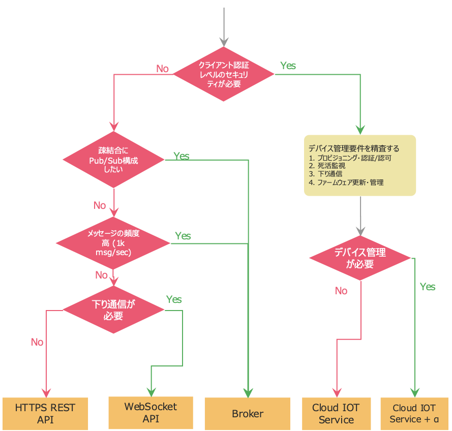

## 目的
この記事では、センサー/デバイスからVantiqまでのデータ連携パターンのガイドラインを説明します。

## Edge~Vantiq構成 データ連携 ガイドライン

#### センサー/デバイスの要件を確認する
センサー/デバイスの要件を精査することで、ゲートウェイまでの接続の経路を検討する。
- 伝送手段、通信プロトコル
- 電源の供給方法
- 物理的な設置場所
- アプリケーション用途
- 分解能、検出値レンジ、精度
- データサイズ、データ発生の頻度
- 法規制
- 費用
- Etc.

#### Vantiq Edge構成の検討をする
必要に応じてローカルネットワークにVantiq Edgeを構成することを検討する。
- データセキュリティやプライバシーを考慮し、Cloud側にデータを持ち出しができない
- センサー/デバイスから得られるデータ量が大きく（データの頻度）、Cloudとのネットワーク帯域の消費や、Cloudストレージコストを抑えたい
- ローカルにあるアクチュエータに対し、制御指示を出す必要がある。
- End-2-Endの処理のレイテンシーを低く抑える必要がある。

#### ゲートウェイからVantiqまでの経路を検討する
ゲートウェイからVantiqまでの経路は、データの送信要件による。

経路  | Pros  | Cons
--|---|--
HTTPS REST API  | <ul><li>もっとも実装が容易である。</li><li>接続がステートレスであり、負荷分散が容易である。</li><li>Vantiqのリソースを直接操作できる</li></ul> |<ul><li>都度ハンドシェイクを行うため、スループットは比較的低い。</li><li>Vantiqアクセストークンの発行、インストール、管理が必要。</li></ul>
WebSocket API | <ul><li>ひとたび接続が確立すると、双方向の通信が可能になる。</li><li>都度ハンドシェイクを行わないので、スループットが高い。</li><li>Vantiqのリソースを直接操作できる</li></ul> | <ul><li>Vantiqアクセストークンの発行、インストール、管理が必要。</li></ul>
Broker | <ul><li>疎結合でPub/Subモデルのメッセージングを実装できる。</li><li>メッセージ量が一時的にバーストした場合、バッファーとなる（VantiqからBack　Pressureできる）</li><li>QoS制御できる。</li></ul> | <ul><li>クライアント証明書認証を有効にする場合、Vantiqは対応していない。</li><li>Broker自体の可用性や、メッセージ一貫性を考慮する必要がある。</li>
Cloud IoT Service | <ul><li>セキュリティが最も高い。</li></ul> | <ul><li>sdkで開発が必要、ベンダーロックインとなる </li><li>クライアント証明書管理が必要になる。</li><li>デバイス管理まで行いたい場合、別のサービスの統合やサードパーティ製品の導入必要になる。</li></ul>

  - HTTPS REST API, Websocket APIはVantiqリソースを直接操作する。
    - Vantiq内のマスタ更新
    - Procedure実行、その他
  - Brokerの種類
    - MQTT Broker – シンプルで高速、QoS=0, 1をサポートする
    - AMQP Broker – より信頼性の高い伝送を行う

