# Fitbit API
Fitbit API を VANTIQ で利用する方法を解説します。  


## サンプルプロジェクト
今回利用するサンプルプロジェクトは下記からダウンロードできます。  

[FitbitAPIサンプルプロジェクト](./conf/fitbit_api/fitbit_api_sample.zip)


## 事前設定
Fitbit APIを利用するためには、事前に下記の手順に従って設定を行う必要があります。

[Getting Started with the Fitbit APIs](https://dev.fitbit.com/build/reference/web-api/developer-guide/getting-started/)

また、Applicationの設定は下記の画像を参考にしてください。  
※ `Redirect URL` については後述します。  


## OAuth 2.0 アプリケーションタイプについて
Fitbit API では、下記の3つのアプリケーションタイプがあります。  
また、アプリケーションタイプごとにアクセスできるデータやユーザーに違いがあります。  

- Server
- Client
- Personal

この内、 `Server` と `Client` のアプリケーションタイプでは、ユーザーごとに個別にデータ連携の同意許可を行うことで、開発者だけではなく、同意許可の得られた複数のユーザーのデータの取得も出来ます。  
この際、得られる測定データは日毎の平均データとなります。  
日中のリアルタイムデータの取得を行いたい場合は、 `Intraday Request form` から利用申請をしなければなりません。  

一方、 `Personal` の場合は、取得できるデータは開発者個人のものに限られます。  
しかし、日毎の平均データだけでなく、日中のリアルタイムデータも取得することができるようになります。  

アプリケーションタイプは、開発の途中で変更することも可能なため、開発段階では `Personal` で設定し、複数ユーザーのテスト時やリリース時に `Server` または `Client` に変更するということも出来ます。  
なお、アプリケーションタイプを変更した場合は、既存のアクセストークンがただちに無効になるため、注意が必要です。  


## OAuth 2.0 PKCE 認証
Fitbit API では許可コードの取得方法として、 OAuth 2.0 PKCE（[RFC7636](https://datatracker.ietf.org/doc/html/rfc7636)）を用いた認証フローが推奨されています。  
（`PKCE` は `ピクシー` と発音します。）  

OAuth 2.0 PKCE 認証フローの一般的な概要は、下記の Qiita記事を参考にしてください。  

[【Qiita】OAuth 2.0 PKCE 認証について簡単にまとめてみました。](https://qiita.com/IoriGunji/items/de9ccbeda4e7682c711b)


### VANTIQ で OAuth2.0 PKCE 認証を利用する方法
VANTIQ Source の OAuth 認証などの機能だけでは、 Fitbit API との連携はできないため、ユーザー認証基盤などを別途構築する必要があります。  
今回は、 JavaScript を利用してログイン画面とコールバックURLリダイレクト画面を作成し、HTMLサーバー代わりに VANTIQ Document を利用する方法を構成しました。  

シーケンス図は下記のとおりです。  

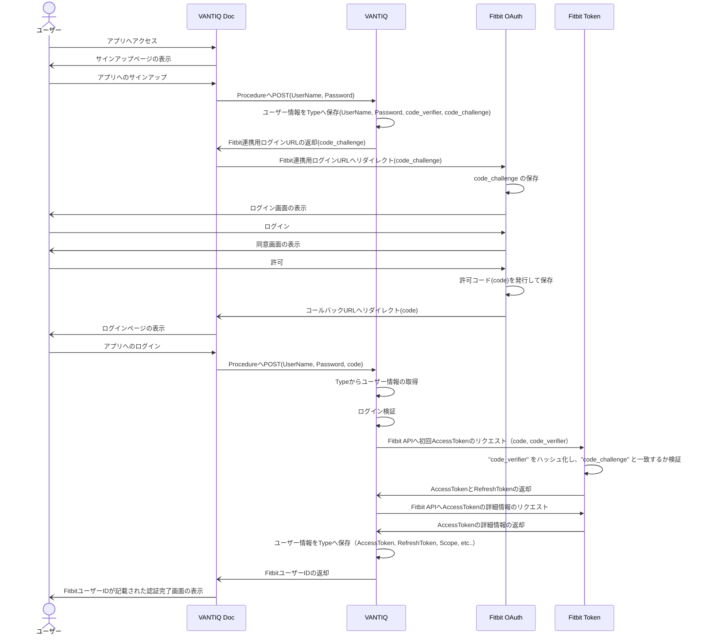


## 環境構築
1. `Projects` → `インポート...` から、プロジェクトのインポートを行います。  
2. `管理` → `Advanced` → `Access Tokens` から、 VANTIQ のアクセストークンを発行します。  
3. 発行したアクセストークンを `jp.co.vantiq.common.fitbit.webapi.FitbitOAuth.Config` プロシージャの `VANTIQ_ACCESS_TOKEN` に代入します。  
4. `jp.co.vantiq.common.fitbit.webapi.FitbitOAuth.HtmlUploader` プロシージャを実行します。  
5. サインアップ用のページ（fitbit_oauth.html）ログイン用ページ（fitbit_oauth_redirect.html）の URL がそれぞれ発行されます。  
   ※Fitbit API の Application設定の `Redirect URL` にログイン用ページ（fitbit_oauth_redirect.html）の URL を設定します。  


## Fitbitとの連携
1. ユーザーの新規登録を行うために、先程発行したサインアップ用のページ（fitbit_oauth.html）にアクセスします。
2. 任意の `User Name` と `Password` を入力し、 `Sign Up` をクリックします。
   |  |
   | ----- |
3. Fitbit のログイン画面が表示されるので、ログインを行います。
   | 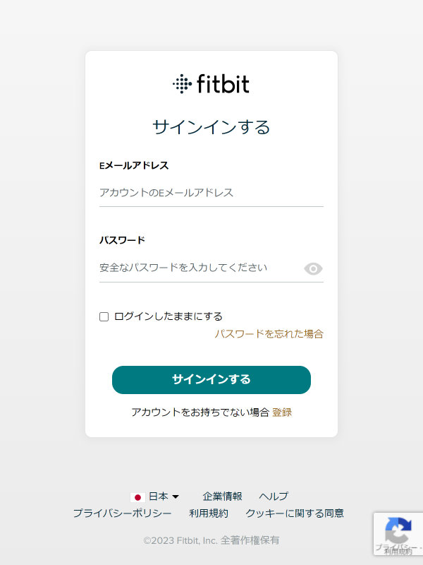 |
   | ----- |
4. 許可する権限を選択して、 `許可` をクリックします。
   |  |
   | ----- |
5. サインアップ時に設定した `User Name` と `Password` を入力して、 `Login` をクリックします。
   |  |
   | ----- |
6. 連携が完了すると、確認のために `Fitbit の ユーザーID` が表示されます。
   | 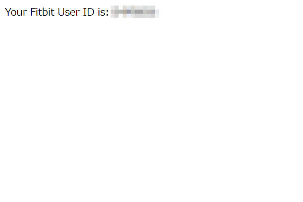 |
   | ----- |


### Fitbit 連携の補足説明
- 複数のユーザーと連携する場合は、上記の手順 1 ～ 6 をユーザーの人数分行います。
- 上記の `ユーザーの新規登録` ～ `Fitbit連携` の画面やユーザー管理のための Type などはデモ用の簡易的なサンプルになります。  
  本番環境には適さないため、別途、ユーザー認証基盤などをご用意ください。


## API アクセス
Fitbit API は `jp.co.vantiq.common.fitbit.webapi.FitbitApi` Service に実装されています。  
（※すべての API の網羅はされていません）


### API アクセスのシーケンス図
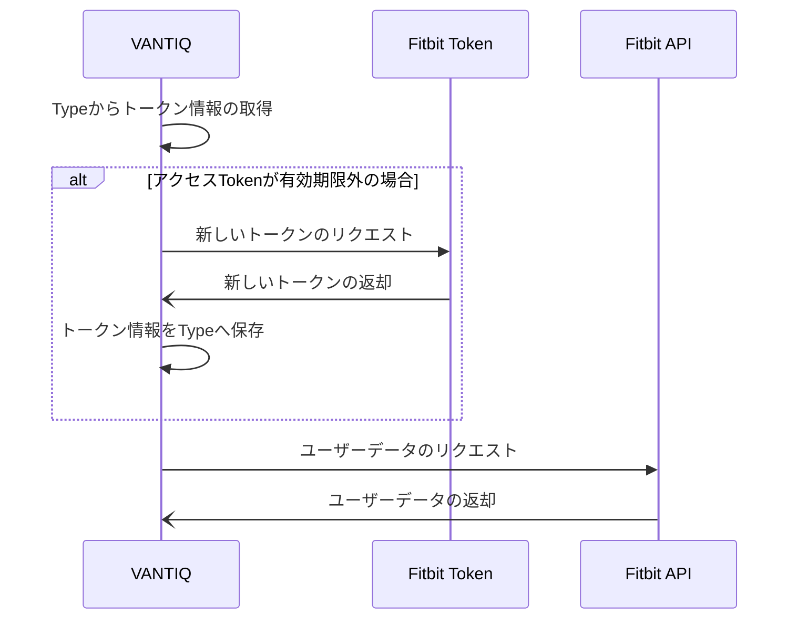


### API の一例
下記に Fitbit API で取れるデータの一例をあげます。  
詳細は下記を参考にしてください。  
※一部のデータは有料会員（Premium）でないと取得出来ない場合や事前にFitbitアプリで設定や同意が必要なものがあります。  

[Fitbit Web API Reference](https://dev.fitbit.com/build/reference/web-api/)

| API名<br>(Procedure) | 製品名 | データの種類 |
| --- | :---: | :---: |
| [Get AZM Intraday by Date<br>(GetAZMIntradayDate)](#get-azm-intraday-by-date) | - | 未検証 |
| [Get AZM Intraday by Interval<br>(GetAZMIntradayInterval)](#get-azm-intraday-by-interval) | - | 未検証 |
| [Get AZM Time Series by Date<br>(GetAZMTimeSeriesDate)](#get-azm-time-series-by-date) | Versa 3 | 自動計測データ |
| [Get AZM Time Series by Interval<br>(GetAZMTimeSeriesInterval)](#get-azm-time-series-by-Interval) | Versa 3 | 自動計測データ |
| [Get Activity Goals<br>(GetActivityGoals)](#get-activity-goals) | Versa 3 | アプリ登録データ |
| [Get Activity Log List<br>(GetActivityLogList)](#get-activity-log-list) | Versa 3 | 自動計測データ |
| [Get Activity Time Series by Date<br>(GetActivityTimeSeriesDate)](#get-activity-time-series-by-date) | Versa 3 | 自動計測データ |
| [Get Activity Time Series by Date Range<br>(GetActivityTimeSeriesDateRange)](#get-activity-time-series-by-date-range) | Versa 3 | 自動計測データ |
| [Get Alarms<br>(GetAlarms)](#get-alarms) | Versa 3 | 取得失敗 |
| [Get Badges<br>(GetBadges)](#get-badges) | Versa 3 | 自動登録データ |
| [Get Body Fat Log<br>(GetBodyFatLog)](#get-body-fat-log) | Versa 3 | アプリ登録データ |
| [Get Body Fat Time Series by Date<br>(GetBodyFatTimeSeriesDate)](#get-body-fat-time-series-by-date) | Versa 3 | アプリ登録データ |
| [Get Body Fat Time Series by Date Range<br>(GetBodyFatTimeSeriesDateRange)](#get-body-fat-time-series-by-date-range) | Versa 3 | アプリ登録データ |
| [Get Body Goals<br>(GetBodyGoals)](#get-body-goals) | Versa 3 | アプリ登録データ |
| [Get Body Time Series by Date<br>(GetBodyTimeSeriesDate)](#get-body-time-series-by-date) | Versa 3 | アプリ登録データ |
| [Get Body Time Series by Date Range<br>(GetBodyTimeSeriesDateRange)](#get-body-time-series-by-date-range) | Versa 3 | アプリ登録データ |
| [Get Breathing Rate Intraday by Date<br>(GetBreathingRateIntradayDate)](#get-breathing-rate-intraday-by-date) | - | 未検証 |
| [Get Breathing Rate Intraday by Interval<br>(GetBreathingRateIntradayInterval)](#get-breathing-rate-intraday-by-interval) | - | 未検証 |
| [Get Breathing Rate Summary by Date<br>(GetBreathingRateSummaryDate)](#get-breathing-rate-summary-by-date) | Versa 3 | 自動計測データ |
| [Get Breathing Rate Summary by Interval<br>(GetBreathingRateSummaryInterval)](#get-breathing-rate-summary-by-interval) | Versa 3 | 自動計測データ |
| [Get Devices<br>(GetDevices)](#get-devices) | Versa 3 | 自動計測データ |
| [Get ECG Log List<br>(GetECGLogList)](#get-ecg-log-list) | Versa 3 | 非対応 |
| [Get Friends<br>(GetFriends)](#get-friends) | Versa 3 | アプリ登録データ |
| [Get Friends Leaderboard<br>(GetFriendsLeaderboard)](#get-friends-leaderboard) | Versa 3 | アプリ登録データ |
| [Get HRV Intraday by Date<br>(GetHRVIntradayDate)](#get-hrv-intraday-by-date) | - | 未検証 |
| [Get HRV Intraday by Interval<br>(GetHRVIntradayInterval)](#get-hrv-intraday-by-interval) | - | 未検証 |
| [Get HRV Summary by Date<br>(GetHRVSummaryDate)](#get-hrv-summary-by-date) | Versa 3 | 自動計測データ |
| [Get HRV Summary by Interval<br>(GetHRVSummaryInterval)](#get-hrv-summary-by-interval) | Versa 3 | 自動計測データ |
| [Get Heart Rate Time Series by Date<br>(GetHeartRateTimeSeriesDate)](#get-heart-rate-time-series-by-date) | Versa 3 | 自動計測データ |
| [Get Heart Rate Time Series by Date Range<br>(GetHeartRateTimeSeriesDateRange)](#get-heart-rate-time-series-by-date-range) | Versa 3 | 自動計測データ |
| [Get Nutrition Time Series by Date<br>(GetNutritionTimeSeriesDate)](#get-nutrition-time-series-by-date) | Versa 3 | アプリ登録データ |
| [Get Nutrition Time Series by Date Range<br>(GetNutritionTimeSeriesDateRange)](#get-nutrition-time-series-by-date-range) | Versa 3 | アプリ登録データ |
| [Get Profile<br>(GetProfile)](#get-profile) | Versa 3 | アプリ登録データ |
| [Get Sleep Goal<br>(GetSleepGoal)](#get-sleep-goal) | Versa 3 | アプリ登録データ |
| [Get Sleep Log by Date<br>(GetSleepLogDate)](#get-sleep-log-by-date) | Versa 3 | 自動計測データ |
| [Get Sleep Log by Date Range<br>(GetSleepLogDateRange)](#get-sleep-log-by-date-range) | Versa 3 | 自動計測データ |
| [Get Sleep Log List<br>(GetSleepLogList)](#get-sleep-log-list) | Versa 3 | 自動計測データ |
| [Get SpO2 Intraday by Date<br>(GetSpO2IntradayDate)](#get-spo2-intraday-by-date) | - | 未検証 |
| [Get SpO2 Intraday by Interval<br>(GetSpO2IntradayInterval)](#get-spo2-intraday-by-interval) | - | 未検証 |
| [Get SpO2 Summary by Date<br>(GetSpO2SummaryDate)](#get-spo2-summary-by-date) | Versa 3 | 自動計測データ |
| [Get SpO2 Summary by Interval<br>(GetSpO2SummaryInterval)](#get-spo2-summary-by-interval) | Versa 3 | 自動計測データ |
| [Get Subscription List<br>(GetSubscriptionList)](#get-subscription-list) | Versa 3 | 不明 |
| [Get Temperature (Core) Summary by Date<br>(GetTemperatureCoreSummaryDate)](#get-temperature-core-summary-by-date) | Versa 3 | Premium のみ対応 |
| [Get Temperature (Core) Summary by Interval<br>(GetTemperatureCoreSummaryInterval)](#get-temperature-core-summary-by-interval) | Versa 3 | Premium のみ対応 |
| [Get Temperature (Skin) Summary by Date<br>(GetTemperatureSkinSummaryDate)](#get-temperature-skin-summary-by-date) | Versa 3 | 自動計測データ |
| [Get Temperature (Skin) Summary by Interval<br>(GetTemperatureSkinSummaryInterval)](#get-temperature-skin-summary-by-interval) | Versa 3 | 自動計測データ |
| [Get VO2 Max Summary by Date<br>(GetVO2MaxSummaryDate)](#get-vo2-max-summary-by-date) | Versa 3 | 自動計測データ |
| [Get VO2 Max Summary by Interval<br>(GetVO2MaxSummaryInterval)](#get-vo2-max-summary-by-interval) | Versa 3 | 自動計測データ |
| [Get Weight Log<br>(GetWeightLog)](#get-weight-log) | Versa 3 | アプリ登録データ |
| [Get Weight Time Series by Date<br>(GetWeightTimeSeriesDate)](#get-weight-time-series-by-date) | Versa 3 | アプリ登録データ |
| [Get Weight Time Series by Date Range<br>(GetWeightTimeSeriesDateRange)](#get-weight-time-series-by-date-range) | Versa 3 | アプリ登録データ |


#### Get AZM Intraday by Date
特定の日付または 24 時間期間のアクティブ ゾーン分 (AZM) の日中時系列データを取得します。  
日中サポートでは、詳細レベルの応答を拡張して、アクティブ ゾーンの時間に 1 分、5 分、15 分を含めることができます。  
- Scope：activity
- Reference：[Get AZM Intraday by Date](https://dev.fitbit.com/build/reference/web-api/intraday/get-azm-intraday-by-date/)
- Procedure：jp.co.vantiq.common.fitbit.webapi.FitbitApi.GetAZMIntradayDate
- Response：
    ```json

    ```
- Note：Intraday のアクセス許可が必要


#### Get AZM Intraday by Interval
このエンドポイントは、特定の日付範囲または 24 時間期間のアクティブ ゾーン分 (AZM) の日中時系列データを取得します。  
日中サポートでは、詳細レベルの応答を拡張して、アクティブ ゾーンの時間に 1 分、5 分、15 分を含めることができます。  
- Scope：activity
- Reference：[Get AZM Intraday by Interval](https://dev.fitbit.com/build/reference/web-api/intraday/get-azm-intraday-by-interval/)
- Procedure：jp.co.vantiq.common.fitbit.webapi.FitbitApi.GetAZMIntradayInterval
- Response：
    ```json

    ```
- Note：Intraday のアクセス許可が必要


#### Get AZM Time Series by Date
日付と期間を指定することにより、一定期間にわたる毎日の概要値を返します。  
- Scope：activity
- Reference：[Get AZM Time Series by Date](https://dev.fitbit.com/build/reference/web-api/active-zone-minutes-timeseries/get-azm-timeseries-by-date/)
- Procedure：jp.co.vantiq.common.fitbit.webapi.FitbitApi.GetAZMTimeSeriesDate
- Response：
    ```json
    {
        "activities-active-zone-minutes": [
            {
                "dateTime": "2023-01-01",
                "value": {
                    "activeZoneMinutes": 9,
                    "fatBurnActiveZoneMinutes": 9
                }
            }
        ]
    }
    ```


#### Get AZM Time Series by Interval
日付範囲を指定することにより、一定期間にわたる毎日の概要値を返します。  
- Scope：activity
- Reference：[Get AZM Time Series by Interval](https://dev.fitbit.com/build/reference/web-api/active-zone-minutes-timeseries/get-azm-timeseries-by-interval/)
- Procedure：jp.co.vantiq.common.fitbit.webapi.FitbitApi.GetAZMTimeSeriesInterval
- Response：
    ```json
    {
        "activities-active-zone-minutes": [
            {
                "dateTime": "2023-01-01",
                "value": {
                    "fatBurnActiveZoneMinutes": 9,
                    "activeZoneMinutes": 9
                }
            },
            {
                "dateTime": "2023-01-03",
                "value": {
                    "fatBurnActiveZoneMinutes": 222,
                    "cardioActiveZoneMinutes": 50,
                    "activeZoneMinutes": 272
                }
            }
        ]
    }
    ```


#### Get Activity Goals
ユーザーの現在の日次または週次のアクティビティ目標を取得します。  
- Scope：activity
- Reference：[Get Activity Goals](https://dev.fitbit.com/build/reference/web-api/activity/get-activity-goals/)
- Procedure：jp.co.vantiq.common.fitbit.webapi.FitbitApi.GetActivityGoals
- Response：
    ```json
    {
        "goals": {
            "activeMinutes": 30,
            "activeZoneMinutes": 22,
            "caloriesOut": 2775,
            "distance": 8.05,
            "floors": 10,
            "steps": 10000
        }
    }
    ```
アプリで設定可能な項目です。  
`Fitbit` → `アカウント` → `アクティビティとウェルネス` → `毎日のアクティビティ`  
| 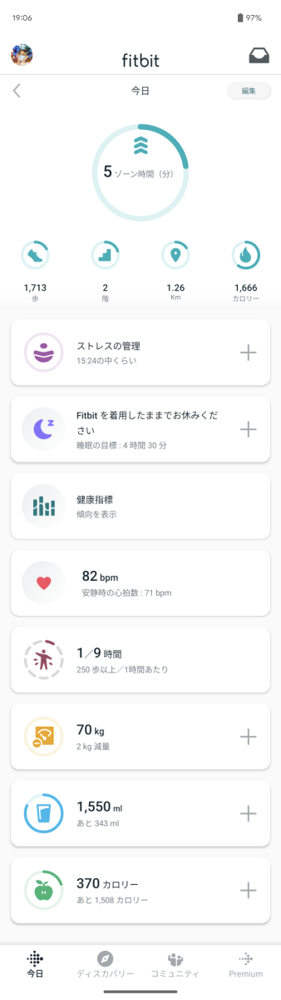 | 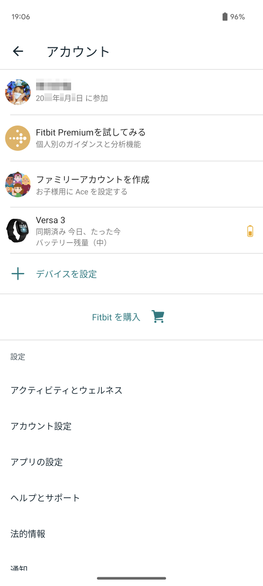 |
| ----- | ----- |

|  | 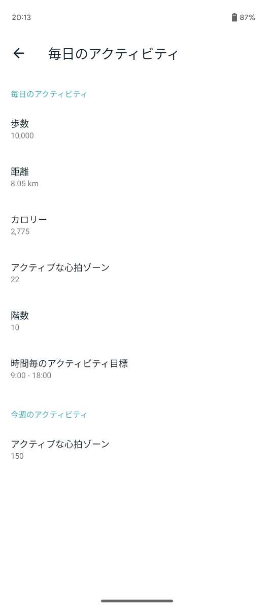 |
| ----- | ----- |


#### Get Activity Log List
指定された日の前後のユーザーのアクティビティログエントリのリストを取得します。  
- Scope：activity
- Reference：[Get Activity Log List](https://dev.fitbit.com/build/reference/web-api/activity/get-activity-log-list/)
- Procedure：jp.co.vantiq.common.fitbit.webapi.FitbitApi.GetActivityLogList
- Response：
    ```json
        {
            "activities": [
                {
                    "activeDuration": 973000,
                    "activeZoneMinutes": {
                        "minutesInHeartRateZones": [
                            {
                                "minuteMultiplier": 0,
                                "minutes": 0,
                                "order": 0,
                                "type": "OUT_OF_ZONE",
                                "zoneName": "Out of Range"
                            },
                            {
                                "minuteMultiplier": 2,
                                "minutes": 0,
                                "order": 2,
                                "type": "CARDIO",
                                "zoneName": "Cardio"
                            },
                            {
                                "minuteMultiplier": 2,
                                "minutes": 0,
                                "order": 3,
                                "type": "PEAK",
                                "zoneName": "Peak"
                            },
                            {
                                "minuteMultiplier": 1,
                                "minutes": 0,
                                "order": 1,
                                "type": "FAT_BURN",
                                "zoneName": "Fat Burn"
                            }
                        ],
                        "totalMinutes": 0
                    },
                    "activityLevel": [
                        {
                            "minutes": 1,
                            "name": "sedentary"
                        },
                        {
                            "minutes": 0,
                            "name": "lightly"
                        },
                        {
                            "minutes": 5,
                            "name": "fairly"
                        },
                        {
                            "minutes": 10,
                            "name": "very"
                        }
                    ],
                    "activityName": "Walk",
                    "activityTypeId": 90013,
                    "averageHeartRate": 95,
                    "calories": 105,
                    "duration": 973000,
                    "elevationGain": 3.048,
                    "hasActiveZoneMinutes": true,
                    "heartRateLink": "https://api.fitbit.com/1/user/-/activities/heart/date/2022-12-31/2022-12-31/1sec/time/22:29:13/22:45:26.json",
                    "heartRateZones": [
                        {
                            "caloriesOut": 104.516,
                            "max": 114,
                            "min": 30,
                            "minutes": 16,
                            "name": "Out of Range"
                        },
                        {
                            "caloriesOut": 0,
                            "max": 139,
                            "min": 114,
                            "minutes": 0,
                            "name": "Fat Burn"
                        },
                        {
                            "caloriesOut": 0,
                            "max": 171,
                            "min": 139,
                            "minutes": 0,
                            "name": "Cardio"
                        },
                        {
                            "caloriesOut": 0,
                            "max": 220,
                            "min": 171,
                            "minutes": 0,
                            "name": "Peak"
                        }
                    ],
                    "lastModified": "2022-12-31T13:57:45.000Z",
                    "logId": 52884850413,
                    "logType": "auto_detected",
                    "manualValuesSpecified": {
                        "calories": false,
                        "distance": false,
                        "steps": false
                    },
                    "originalDuration": 973000,
                    "originalStartTime": "2022-12-31T22:29:13.000+09:00",
                    "startTime": "2022-12-31T22:29:13.000+09:00",
                    "steps": 1463,
                    "tcxLink": "https://api.fitbit.com/1/user/-/activities/52884850413.tcx"
                }
            ],
            "pagination": {
                "beforeDate": "2023-01-01",
                "limit": 1,
                "next": "https://api.fitbit.com/1/user/-/activities/list.json?offset=1&limit=1&sort=desc&beforeDate=2023-01-01",
                "offset": 0,
                "previous": "",
                "sort": "desc"
            }
        }
    ```


#### Get Activity Time Series by Date
日付と期間を指定して、特定のリソースの一定期間のアクティビティ データを取得します。  
応答には、毎日の要約値のみが含まれます。  
- Scope：activity
- Reference：[Get Activity Time Series by Date](https://dev.fitbit.com/build/reference/web-api/activity-timeseries/get-activity-timeseries-by-date/)
- Procedure：jp.co.vantiq.common.fitbit.webapi.FitbitApi.GetActivityTimeSeriesDate
- Response：activityCalories
    ```json
    {
        "activities-activityCalories": [
            {
                "dateTime": "2023-01-01",
                "value": "1344"
            }
        ]
    }
    ```
- Response：calories
    ```json
    {
        "activities-calories": [
            {
                "dateTime": "2023-01-01",
                "value": "2732"
            }
        ]
    }
    ```
- Response：caloriesBMR
    ```json
    {
        "activities-caloriesBMR": [
            {
                "dateTime": "2023-01-01",
                "value": "1651"
            }
        ]
    }
    ```
- Response：distance
    ```json
    {
        "activities-distance": [
            {
                "dateTime": "2023-01-01",
                "value": "6.4281999999999995"
            }
        ]
    }
    ```
- Response：elevation
    ```json
    {
        "activities-elevation": [
            {
                "dateTime": "2023-01-01",
                "value": "12"
            }
        ]
    }
    ```
- Response：floors
    ```json
    {
        "activities-floors": [
            {
                "dateTime": "2023-01-01",
                "value": "4"
            }
        ]
    }
    ```
- Response：minutesSedentary
    ```json
    {
        "activities-minutesSedentary": [
            {
                "dateTime": "2023-01-01",
                "value": "586"
            }
        ]
    }
    ```
- Response：minutesLightlyActive
    ```json
    {
        "activities-minutesLightlyActive": [
            {
                "dateTime": "2023-01-01",
                "value": "220"
            }
        ]
    }
    ```
- Response：minutesFairlyActive
    ```json
    {
        "activities-minutesFairlyActive": [
            {
                "dateTime": "2023-01-01",
                "value": "51"
            }
        ]
    }
    ```
- Response：minutesVeryActive
    ```json
    {
        "activities-minutesVeryActive": [
            {
                "dateTime": "2023-01-01",
                "value": "23"
            }
        ]
    }
    ```
- Response：steps
    ```json
    {
        "activities-steps": [
            {
                "dateTime": "2023-01-01",
                "value": "9210"
            }
        ]
    }
    ```
- Response：tracker/activityCalories
    ```json
    {
        "activities-tracker-activityCalories": [
            {
                "dateTime": "2023-01-01",
                "value": "1344"
            }
        ]
    }
    ```
- Response：tracker/calories
    ```json
    {
        "activities-tracker-calories": [
            {
                "dateTime": "2023-01-01",
                "value": "2732"
            }
        ]
    }
    ```
- Response：tracker/distance
    ```json
    {
        "activities-tracker-distance": [
            {
                "dateTime": "2023-01-01",
                "value": "6.4281999999999995"
            }
        ]
    }
    ```
- Response：tracker/elevation
    ```json
    {
        "activities-tracker-elevation": [
            {
                "dateTime": "2023-01-01",
                "value": "12"
            }
        ]
    }
    ```
- Response：tracker/floors
    ```json
    {
        "activities-tracker-floors": [
            {
                "dateTime": "2023-01-01",
                "value": "4"
            }
        ]
    }
    ```
- Response：tracker/minutesSedentary
    ```json
    {
        "activities-tracker-minutesSedentary": [
            {
                "dateTime": "2023-01-01",
                "value": "586"
            }
        ]
    }
    ```
- Response：tracker/minutesLightlyActive
    ```json
    {
        "activities-tracker-minutesLightlyActive": [
            {
                "dateTime": "2023-01-01",
                "value": "220"
            }
        ]
    }
    ```
- Response：tracker/minutesFairlyActive
    ```json
    {
        "activities-tracker-minutesFairlyActive": [
            {
                "dateTime": "2023-01-01",
                "value": "51"
            }
        ]
    }
    ```
- Response：tracker/minutesVeryActive
    ```json
    {
        "activities-tracker-minutesVeryActive": [
            {
                "dateTime": "2023-01-01",
                "value": "23"
            }
        ]
    }
    ```
- Response：tracker/steps
    ```json
    {
        "activities-tracker-steps": [
            {
                "dateTime": "2023-01-01",
                "value": "9210"
            }
        ]
    }
    ```


#### Get Activity Time Series by Date Range
日付範囲を指定して、特定のリソースの一定期間のアクティビティ データを取得します。  
応答には、毎日の要約値のみが含まれます。  
- Scope：activity
- Reference：[Get Activity Time Series by Date Range](https://dev.fitbit.com/build/reference/web-api/activity-timeseries/get-activity-timeseries-by-date-range/)
- Procedure：jp.co.vantiq.common.fitbit.webapi.FitbitApi.GetActivityTimeSeriesDateRange
- Response：activityCalories
    ```json
    {
        "activities-activityCalories": [
            {
                "dateTime": "2023-01-01",
                "value": "1344"
            },
            {
                "dateTime": "2023-01-02",
                "value": "0"
            },
            {
                "dateTime": "2023-01-03",
                "value": "3178"
            }
        ]
    }
    ```
- Response：calories
    ```json
    {
        "activities-calories": [
            {
                "dateTime": "2023-01-01",
                "value": "2732"
            },
            {
                "dateTime": "2023-01-02",
                "value": "1651"
            },
            {
                "dateTime": "2023-01-03",
                "value": "4315"
            }
        ]
    }
    ```
- Response：caloriesBMR
    ```json
    {
        "activities-caloriesBMR": [
            {
                "dateTime": "2023-01-01",
                "value": "1651"
            },
            {
                "dateTime": "2023-01-02",
                "value": "1651"
            },
            {
                "dateTime": "2023-01-03",
                "value": "1651"
            }
        ]
    }
    ```
- Response：distance
    ```json
    {
        "activities-distance": [
            {
                "dateTime": "2023-01-01",
                "value": "6.4281999999999995"
            },
            {
                "dateTime": "2023-01-02",
                "value": "0.0"
            },
            {
                "dateTime": "2023-01-03",
                "value": "13.0268"
            }
        ]
    }
    ```
- Response：elevation
    ```json
    {
        "activities-elevation": [
            {
                "dateTime": "2023-01-01",
                "value": "12"
            },
            {
                "dateTime": "2023-01-02",
                "value": "0"
            },
            {
                "dateTime": "2023-01-03",
                "value": "67"
            }
        ]
    }
    ```
- Response：floors
    ```json
    {
        "activities-floors": [
            {
                "dateTime": "2023-01-01",
                "value": "4"
            },
            {
                "dateTime": "2023-01-02",
                "value": "0"
            },
            {
                "dateTime": "2023-01-03",
                "value": "22"
            }
        ]
    }
    ```
- Response：minutesSedentary
    ```json
    {
        "activities-minutesSedentary": [
            {
                "dateTime": "2023-01-01",
                "value": "586"
            },
            {
                "dateTime": "2023-01-02",
                "value": "1440"
            },
            {
                "dateTime": "2023-01-03",
                "value": "622"
            }
        ]
    }
    ```
- Response：minutesLightlyActive
    ```json
    {
        "activities-minutesLightlyActive": [
            {
                "dateTime": "2023-01-01",
                "value": "220"
            },
            {
                "dateTime": "2023-01-02",
                "value": "0"
            },
            {
                "dateTime": "2023-01-03",
                "value": "143"
            }
        ]
    }
    ```
- Response：minutesFairlyActive
    ```json
    {
        "activities-minutesFairlyActive": [
            {
                "dateTime": "2023-01-01",
                "value": "51"
            },
            {
                "dateTime": "2023-01-02",
                "value": "0"
            },
            {
                "dateTime": "2023-01-03",
                "value": "146"
            }
        ]
    }
    ```
- Response：minutesVeryActive
    ```json
    {
        "activities-minutesVeryActive": [
            {
                "dateTime": "2023-01-01",
                "value": "23"
            },
            {
                "dateTime": "2023-01-02",
                "value": "0"
            },
            {
                "dateTime": "2023-01-03",
                "value": "212"
            }
        ]
    }
    ```
- Response：steps
    ```json
    {
        "activities-steps": [
            {
                "dateTime": "2023-01-01",
                "value": "9210"
            },
            {
                "dateTime": "2023-01-02",
                "value": "0"
            },
            {
                "dateTime": "2023-01-03",
                "value": "18061"
            }
        ]
    }
    ```
- Response：tracker/activityCalories
    ```json
    {
        "activities-tracker-activityCalories": [
            {
                "dateTime": "2023-01-01",
                "value": "1344"
            },
            {
                "dateTime": "2023-01-02",
                "value": "0"
            },
            {
                "dateTime": "2023-01-03",
                "value": "3178"
            }
        ]
    }
    ```
- Response：tracker/calories
    ```json
    {
        "activities-tracker-calories": [
            {
                "dateTime": "2023-01-01",
                "value": "2732"
            },
            {
                "dateTime": "2023-01-02",
                "value": "1651"
            },
            {
                "dateTime": "2023-01-03",
                "value": "4315"
            }
        ]
    }
    ```
- Response：tracker/distance
    ```json
    {
        "activities-tracker-distance": [
            {
                "dateTime": "2023-01-01",
                "value": "6.4281999999999995"
            },
            {
                "dateTime": "2023-01-02",
                "value": "0.0"
            },
            {
                "dateTime": "2023-01-03",
                "value": "13.0268"
            }
        ]
    }
    ```
- Response：tracker/elevation
    ```json
    {
        "activities-tracker-elevation": [
            {
                "dateTime": "2023-01-01",
                "value": "12"
            },
            {
                "dateTime": "2023-01-02",
                "value": "0"
            },
            {
                "dateTime": "2023-01-03",
                "value": "67"
            }
        ]
    }
    ```
- Response：tracker/floors
    ```json
    {
        "activities-tracker-floors": [
            {
                "dateTime": "2023-01-01",
                "value": "4"
            },
            {
                "dateTime": "2023-01-02",
                "value": "0"
            },
            {
                "dateTime": "2023-01-03",
                "value": "22"
            }
        ]
    }
    ```
- Response：tracker/minutesSedentary
    ```json
    {
        "activities-tracker-minutesSedentary": [
            {
                "dateTime": "2023-01-01",
                "value": "586"
            },
            {
                "dateTime": "2023-01-02",
                "value": "1440"
            },
            {
                "dateTime": "2023-01-03",
                "value": "622"
            }
        ]
    }
    ```
- Response：tracker/minutesLightlyActive
    ```json
    {
        "activities-tracker-minutesLightlyActive": [
            {
                "dateTime": "2023-01-01",
                "value": "220"
            },
            {
                "dateTime": "2023-01-02",
                "value": "0"
            },
            {
                "dateTime": "2023-01-03",
                "value": "143"
            }
        ]
    }
    ```
- Response：tracker/minutesFairlyActive
    ```json
    {
        "activities-tracker-minutesFairlyActive": [
            {
                "dateTime": "2023-01-01",
                "value": "51"
            },
            {
                "dateTime": "2023-01-02",
                "value": "0"
            },
            {
                "dateTime": "2023-01-03",
                "value": "146"
            }
        ]
    }
    ```
- Response：tracker/minutesVeryActive
    ```json
    {
        "activities-tracker-minutesVeryActive": [
            {
                "dateTime": "2023-01-01",
                "value": "23"
            },
            {
                "dateTime": "2023-01-02",
                "value": "0"
            },
            {
                "dateTime": "2023-01-03",
                "value": "212"
            }
        ]
    }
    ```
- Response：tracker/steps
    ```json
    {
        "activities-tracker-steps": [
            {
                "dateTime": "2023-01-01",
                "value": "9210"
            },
            {
                "dateTime": "2023-01-02",
                "value": "0"
            },
            {
                "dateTime": "2023-01-03",
                "value": "18061"
            }
        ]
    }
    ```


#### Get Alarms
特定のデバイスに対して有効になっているアラームを取得します。  
このエンドポイントは、アラームをサポートするトラッカーでサポートされます。  
- Scope：settings
- Reference：[Get Alarms](https://dev.fitbit.com/build/reference/web-api/devices/get-alarms/)
- Procedure：jp.co.vantiq.common.fitbit.webapi.FitbitApi.GetAlarms
- Response：
    ```json

    ```


#### Get Badges
ユーザーのバッジのリストを取得します。  
- Scope：profile
- Reference：[Get Badges](https://dev.fitbit.com/build/reference/web-api/user/get-badges/)
- Procedure：jp.co.vantiq.common.fitbit.webapi.FitbitApi.GetBadges
- Response：
    ```json
    {
        "badges": [
            {
                "badgeGradientEndColor": "B0DF2A",
                "badgeGradientStartColor": "00A550",
                "badgeType": "DAILY_STEPS",
                "category": "Minions Badges",
                "cheers": [],
                "dateTime": "2022-08-13",
                "description": "32,100 steps in a day",
                "earnedMessage": "Congrats on earning your first Minions: Bob badge!",
                "encodedId": "22B653",
                "image100px": "https://www.gstatic.com/fitbit/badge/././imgs/fitbit_apis/badges_new/100px/badge_daily_steps32100.png",
                "image125px": "https://www.gstatic.com/fitbit/badge/././imgs/fitbit_apis/badges_new/125px/badge_daily_steps32100.png",
                "image300px": "https://www.gstatic.com/fitbit/badge/././imgs/fitbit_apis/badges_new/300px/badge_daily_steps32100.png",
                "image50px": "https://www.gstatic.com/fitbit/badge/././imgs/fitbit_apis/badges_new/badge_daily_steps32100.png",
                "image75px": "https://www.gstatic.com/fitbit/badge/././imgs/fitbit_apis/badges_new/75px/badge_daily_steps32100.png",
                "marketingDescription": "Congratulations on your stellar step count. You’ve earned the last banana-loving Minions badge! You’ve earned all 3 Minions badges!",
                "mobileDescription": "Congratulations on your stellar step count. You’ve earned the last banana-loving Minion badge!",
                "name": "Minions: Bob (32,100 steps in a day)",
                "shareImage640px": "https://www.gstatic.com/fitbit/badge/././imgs/fitbit_apis/badges_new/386px/shareLocalized/en_US/badge_daily_steps32100.png",
                "shareText": "I took 32,100 steps in a day",
                "shortDescription": "32,100 steps in a day",
                "shortName": "Minions: Bob",
                "timesAchieved": 1,
                "value": 32100
            },
            {
                "badgeGradientEndColor": "00D3D6",
                "badgeGradientStartColor": "007273",
                "badgeType": "DAILY_STEPS",
                "category": "Daily Steps",
                "cheers": [],
                "dateTime": "2023-03-09",
                "description": "30,000 steps in a day",
                "earnedMessage": "Congrats on earning your first Trail Shoe badge!",
                "encodedId": "228TM5",
                "image100px": "https://www.gstatic.com/fitbit/badge/././imgs/fitbit_apis/badges_new/100px/badge_daily_steps30k.png",
                "image125px": "https://www.gstatic.com/fitbit/badge/././imgs/fitbit_apis/badges_new/125px/badge_daily_steps30k.png",
                "image300px": "https://www.gstatic.com/fitbit/badge/././imgs/fitbit_apis/badges_new/300px/badge_daily_steps30k.png",
                "image50px": "https://www.gstatic.com/fitbit/badge/././imgs/fitbit_apis/badges_new/badge_daily_steps30k.png",
                "image75px": "https://www.gstatic.com/fitbit/badge/././imgs/fitbit_apis/badges_new/75px/badge_daily_steps30k.png",
                "marketingDescription": "You've walked 30,000 steps  And earned the Trail Shoe badge!",
                "mobileDescription": "On the path to fitness, you're gaining some serious ground!",
                "name": "Trail Shoe (30,000 steps in a day)",
                "shareImage640px": "https://www.gstatic.com/fitbit/badge/././imgs/fitbit_apis/badges_new/386px/shareLocalized/en_US/badge_daily_steps30k.png",
                "shareText": "I took 30,000 steps and earned the Trail Shoe badge! #Fitbit",
                "shortDescription": "30,000 steps",
                "shortName": "Trail Shoe",
                "timesAchieved": 2,
                "value": 30000
            },
            {
                "badgeGradientEndColor": "FFDB01",
                "badgeGradientStartColor": "D99123",
                "badgeType": "DAILY_STEPS",
                "category": "Daily Steps",
                "cheers": [],
                "dateTime": "2023-03-09",
                "description": "25,000 steps in a day",
                "earnedMessage": "Congrats on earning your first Classics badge!",
                "encodedId": "228TLX",
                "image100px": "https://www.gstatic.com/fitbit/badge/././imgs/fitbit_apis/badges_new/100px/badge_daily_steps25k.png",
                "image125px": "https://www.gstatic.com/fitbit/badge/././imgs/fitbit_apis/badges_new/125px/badge_daily_steps25k.png",
                "image300px": "https://www.gstatic.com/fitbit/badge/././imgs/fitbit_apis/badges_new/300px/badge_daily_steps25k.png",
                "image50px": "https://www.gstatic.com/fitbit/badge/././imgs/fitbit_apis/badges_new/badge_daily_steps25k.png",
                "image75px": "https://www.gstatic.com/fitbit/badge/././imgs/fitbit_apis/badges_new/75px/badge_daily_steps25k.png",
                "marketingDescription": "You've walked 25,000 steps  And earned the Classics badge!",
                "mobileDescription": "With this impressive fitness feat, you've added a badge to your growing collection. Nice job, you stepping all-star!",
                "name": "Classics (25,000 steps in a day)",
                "shareImage640px": "https://www.gstatic.com/fitbit/badge/././imgs/fitbit_apis/badges_new/386px/shareLocalized/en_US/badge_daily_steps25k.png",
                "shareText": "I took 25,000 steps and earned the Classics badge! #Fitbit",
                "shortDescription": "25,000 steps",
                "shortName": "Classics",
                "timesAchieved": 3,
                "value": 25000
            },
            {
                "badgeGradientEndColor": "B0DF2A",
                "badgeGradientStartColor": "00A550",
                "badgeType": "DAILY_STEPS",
                "category": "Minions Badges",
                "cheers": [],
                "dateTime": "2023-03-09",
                "description": "22,222 steps in a day",
                "earnedMessage": "Congrats on earning your first Minions: Kevin badge!",
                "encodedId": "22B656",
                "image100px": "https://www.gstatic.com/fitbit/badge/././imgs/fitbit_apis/badges_new/100px/badge_daily_steps22222.png",
                "image125px": "https://www.gstatic.com/fitbit/badge/././imgs/fitbit_apis/badges_new/125px/badge_daily_steps22222.png",
                "image300px": "https://www.gstatic.com/fitbit/badge/././imgs/fitbit_apis/badges_new/300px/badge_daily_steps22222.png",
                "image50px": "https://www.gstatic.com/fitbit/badge/././imgs/fitbit_apis/badges_new/badge_daily_steps22222.png",
                "image75px": "https://www.gstatic.com/fitbit/badge/././imgs/fitbit_apis/badges_new/75px/badge_daily_steps22222.png",
                "marketingDescription": "Cheers! Way to make it a mission to move. Next up: Take 32,100 steps in a day to get the Bob Badge.",
                "mobileDescription": "Cheers! Way to make it a mission to move.",
                "name": "Minions: Kevin (22,222 steps in a day)",
                "shareImage640px": "https://www.gstatic.com/fitbit/badge/././imgs/fitbit_apis/badges_new/386px/shareLocalized/en_US/badge_daily_steps22222.png",
                "shareText": "I took 22,222 steps in a day",
                "shortDescription": "22,222 steps in a day",
                "shortName": "Minions: Kevin",
                "timesAchieved": 5,
                "value": 22222
            },
            {
                "badgeGradientEndColor": "A489E8",
                "badgeGradientStartColor": "38216E",
                "badgeType": "DAILY_STEPS",
                "category": "Daily Steps",
                "cheers": [],
                "dateTime": "2023-03-09",
                "description": "20,000 steps in a day",
                "earnedMessage": "Congrats on earning your first High Tops badge!",
                "encodedId": "228TPP",
                "image100px": "https://www.gstatic.com/fitbit/badge/././imgs/fitbit_apis/badges_new/100px/badge_daily_steps20k.png",
                "image125px": "https://www.gstatic.com/fitbit/badge/././imgs/fitbit_apis/badges_new/125px/badge_daily_steps20k.png",
                "image300px": "https://www.gstatic.com/fitbit/badge/././imgs/fitbit_apis/badges_new/300px/badge_daily_steps20k.png",
                "image50px": "https://www.gstatic.com/fitbit/badge/././imgs/fitbit_apis/badges_new/badge_daily_steps20k.png",
                "image75px": "https://www.gstatic.com/fitbit/badge/././imgs/fitbit_apis/badges_new/75px/badge_daily_steps20k.png",
                "marketingDescription": "You've walked 20,000 steps  And earned the High Tops badge!",
                "mobileDescription": "When it comes to steps, it looks like you're not playing around. This achievement was a slam dunk.",
                "name": "High Tops (20,000 steps in a day)",
                "shareImage640px": "https://www.gstatic.com/fitbit/badge/././imgs/fitbit_apis/badges_new/386px/shareLocalized/en_US/badge_daily_steps20k.png",
                "shareText": "I took 20,000 steps and earned the High Tops badge! #Fitbit",
                "shortDescription": "20,000 steps",
                "shortName": "High Tops",
                "timesAchieved": 5,
                "value": 20000
            },
            {
                "badgeGradientEndColor": "00D3D6",
                "badgeGradientStartColor": "007273",
                "badgeType": "DAILY_STEPS",
                "category": "Daily Steps",
                "cheers": [],
                "dateTime": "2023-03-09",
                "description": "15,000 steps in a day",
                "earnedMessage": "Congrats on earning your first Urban Boot badge!",
                "encodedId": "228TMK",
                "image100px": "https://www.gstatic.com/fitbit/badge/././imgs/fitbit_apis/badges_new/100px/badge_daily_steps15k.png",
                "image125px": "https://www.gstatic.com/fitbit/badge/././imgs/fitbit_apis/badges_new/125px/badge_daily_steps15k.png",
                "image300px": "https://www.gstatic.com/fitbit/badge/././imgs/fitbit_apis/badges_new/300px/badge_daily_steps15k.png",
                "image50px": "https://www.gstatic.com/fitbit/badge/././imgs/fitbit_apis/badges_new/badge_daily_steps15k.png",
                "image75px": "https://www.gstatic.com/fitbit/badge/././imgs/fitbit_apis/badges_new/75px/badge_daily_steps15k.png",
                "marketingDescription": "You've walked 15,000 steps  And earned the Urban Boot badge!",
                "mobileDescription": "With a number that's almost three times more than the national average, your step count is really heating up.",
                "name": "Urban Boot (15,000 steps in a day)",
                "shareImage640px": "https://www.gstatic.com/fitbit/badge/././imgs/fitbit_apis/badges_new/386px/shareLocalized/en_US/badge_daily_steps15k.png",
                "shareText": "I took 15,000 steps and earned the Urban Boot badge! #Fitbit",
                "shortDescription": "15,000 steps",
                "shortName": "Urban Boot",
                "timesAchieved": 11,
                "value": 15000
            },
            {
                "badgeGradientEndColor": "B0DF2A",
                "badgeGradientStartColor": "00A550",
                "badgeType": "DAILY_STEPS",
                "category": "Minions Badges",
                "cheers": [],
                "dateTime": "2023-04-16",
                "description": "12,345 steps in a day",
                "earnedMessage": "Congrats on earning your first Minions: Stuart badge!",
                "encodedId": "22B655",
                "image100px": "https://www.gstatic.com/fitbit/badge/././imgs/fitbit_apis/badges_new/100px/badge_daily_steps12345.png",
                "image125px": "https://www.gstatic.com/fitbit/badge/././imgs/fitbit_apis/badges_new/125px/badge_daily_steps12345.png",
                "image300px": "https://www.gstatic.com/fitbit/badge/././imgs/fitbit_apis/badges_new/300px/badge_daily_steps12345.png",
                "image50px": "https://www.gstatic.com/fitbit/badge/././imgs/fitbit_apis/badges_new/badge_daily_steps12345.png",
                "image75px": "https://www.gstatic.com/fitbit/badge/././imgs/fitbit_apis/badges_new/75px/badge_daily_steps12345.png",
                "marketingDescription": "With this achievement, you are well on your way to conquering the world, one step at a time. Next up: Take 22,222 steps in a day to get the Kevin Badge.",
                "mobileDescription": "With this achievement, you are well on your way to conquering the world, one step at a time.",
                "name": "Minions: Stuart (12,345 steps in a day)",
                "shareImage640px": "https://www.gstatic.com/fitbit/badge/././imgs/fitbit_apis/badges_new/386px/shareLocalized/en_US/badge_daily_steps12345.png",
                "shareText": "I took 12,345 steps in a day",
                "shortDescription": "12,345 steps in a day",
                "shortName": "Minions: Stuart",
                "timesAchieved": 20,
                "value": 12345
            },
            {
                "badgeGradientEndColor": "FF677C",
                "badgeGradientStartColor": "D24958",
                "badgeType": "DAILY_STEPS",
                "category": "Daily Steps",
                "cheers": [],
                "dateTime": "2023-05-10",
                "description": "10,000 steps in a day",
                "earnedMessage": "Congrats on earning your first Sneakers badge!",
                "encodedId": "228TQB",
                "image100px": "https://www.gstatic.com/fitbit/badge/././imgs/fitbit_apis/badges_new/100px/badge_daily_steps10k.png",
                "image125px": "https://www.gstatic.com/fitbit/badge/././imgs/fitbit_apis/badges_new/125px/badge_daily_steps10k.png",
                "image300px": "https://www.gstatic.com/fitbit/badge/././imgs/fitbit_apis/badges_new/300px/badge_daily_steps10k.png",
                "image50px": "https://www.gstatic.com/fitbit/badge/././imgs/fitbit_apis/badges_new/badge_daily_steps10k.png",
                "image75px": "https://www.gstatic.com/fitbit/badge/././imgs/fitbit_apis/badges_new/75px/badge_daily_steps10k.png",
                "marketingDescription": "You've walked 10,000 steps  And earned the Sneaker badge!",
                "mobileDescription": "You stepped up your game and just reached the recommended number of steps per day.",
                "name": "Sneakers (10,000 steps in a day)",
                "shareImage640px": "https://www.gstatic.com/fitbit/badge/././imgs/fitbit_apis/badges_new/386px/shareLocalized/en_US/badge_daily_steps10k.png",
                "shareText": "I took 10,000 steps and earned the Sneakers badge! #Fitbit",
                "shortDescription": "10,000 steps",
                "shortName": "Sneakers",
                "timesAchieved": 30,
                "value": 10000
            },
            {
                "badgeGradientEndColor": "B0DF2A",
                "badgeGradientStartColor": "00A550",
                "badgeType": "DAILY_STEPS",
                "category": "Daily Steps",
                "cheers": [],
                "dateTime": "2023-06-02",
                "description": "5,000 steps in a day",
                "earnedMessage": "Congrats on earning your first Boat Shoe badge!",
                "encodedId": "228TQ4",
                "image100px": "https://www.gstatic.com/fitbit/badge/././imgs/fitbit_apis/badges_new/100px/badge_daily_steps5k.png",
                "image125px": "https://www.gstatic.com/fitbit/badge/././imgs/fitbit_apis/badges_new/125px/badge_daily_steps5k.png",
                "image300px": "https://www.gstatic.com/fitbit/badge/././imgs/fitbit_apis/badges_new/300px/badge_daily_steps5k.png",
                "image50px": "https://www.gstatic.com/fitbit/badge/././imgs/fitbit_apis/badges_new/badge_daily_steps5k.png",
                "image75px": "https://www.gstatic.com/fitbit/badge/././imgs/fitbit_apis/badges_new/75px/badge_daily_steps5k.png",
                "marketingDescription": "You've walked 5,000 steps And earned the Boat Shoe badge!",
                "mobileDescription": "Congratulations on cruising your way to the first Fitbit daily step badge.",
                "name": "Boat Shoe (5,000 steps in a day)",
                "shareImage640px": "https://www.gstatic.com/fitbit/badge/././imgs/fitbit_apis/badges_new/386px/shareLocalized/en_US/badge_daily_steps5k.png",
                "shareText": "I took 5,000 steps and earned the Boat Shoe badge! #Fitbit",
                "shortDescription": "5,000 steps",
                "shortName": "Boat Shoe",
                "timesAchieved": 96,
                "value": 5000
            },
            {
                "badgeGradientEndColor": "B0DF2A",
                "badgeGradientStartColor": "00A550",
                "badgeType": "DAILY_FLOORS",
                "category": "Daily Climb",
                "cheers": [],
                "dateTime": "2023-03-09",
                "description": "25 floors in a day",
                "earnedMessage": "Congrats on earning your first Redwood Forest badge!",
                "encodedId": "228TSZ",
                "image100px": "https://www.gstatic.com/fitbit/badge/././imgs/fitbit_apis/badges_new/100px/badge_daily_floors25.png",
                "image125px": "https://www.gstatic.com/fitbit/badge/././imgs/fitbit_apis/badges_new/125px/badge_daily_floors25.png",
                "image300px": "https://www.gstatic.com/fitbit/badge/././imgs/fitbit_apis/badges_new/300px/badge_daily_floors25.png",
                "image50px": "https://www.gstatic.com/fitbit/badge/././imgs/fitbit_apis/badges_new/badge_daily_floors25.png",
                "image75px": "https://www.gstatic.com/fitbit/badge/././imgs/fitbit_apis/badges_new/75px/badge_daily_floors25.png",
                "marketingDescription": "You've climbed 25 floors to earn the Redwood Forest badge!",
                "mobileDescription": "The tallest trees on Earth can't top the heights you've been conquering.",
                "name": "Redwood Forest (25 floors in a day)",
                "shareImage640px": "https://www.gstatic.com/fitbit/badge/././imgs/fitbit_apis/badges_new/386px/shareLocalized/en_US/badge_daily_floors25.png",
                "shareText": "I climbed 25 flights of stairs and earned the Redwood Forest badge! #Fitbit",
                "shortDescription": "25 floors",
                "shortName": "Redwood Forest",
                "timesAchieved": 2,
                "value": 25
            },
            {
                "badgeGradientEndColor": "00D3D6",
                "badgeGradientStartColor": "007273",
                "badgeType": "DAILY_FLOORS",
                "category": "Daily Climb",
                "cheers": [],
                "dateTime": "2023-06-02",
                "description": "10 floors in a day",
                "earnedMessage": "Congrats on earning your first Happy Hill badge!",
                "encodedId": "228TTM",
                "image100px": "https://www.gstatic.com/fitbit/badge/././imgs/fitbit_apis/badges_new/100px/badge_daily_floors10.png",
                "image125px": "https://www.gstatic.com/fitbit/badge/././imgs/fitbit_apis/badges_new/125px/badge_daily_floors10.png",
                "image300px": "https://www.gstatic.com/fitbit/badge/././imgs/fitbit_apis/badges_new/300px/badge_daily_floors10.png",
                "image50px": "https://www.gstatic.com/fitbit/badge/././imgs/fitbit_apis/badges_new/badge_daily_floors10.png",
                "image75px": "https://www.gstatic.com/fitbit/badge/././imgs/fitbit_apis/badges_new/75px/badge_daily_floors10.png",
                "marketingDescription": "You've climbed 10 floors to earn the Happy Hill badge!",
                "mobileDescription": "You're taking yourself to new heights and taking home the first badge!",
                "name": "Happy Hill (10 floors in a day)",
                "shareImage640px": "https://www.gstatic.com/fitbit/badge/././imgs/fitbit_apis/badges_new/386px/shareLocalized/en_US/badge_daily_floors10.png",
                "shareText": "I climbed 10 flights of stairs and earned the Happy Hill badge! #Fitbit",
                "shortDescription": "10 floors",
                "shortName": "Happy Hill",
                "timesAchieved": 40,
                "value": 10
            },
            {
                "badgeGradientEndColor": "42C401",
                "badgeGradientStartColor": "007D3C",
                "badgeType": "LIFETIME_DISTANCE",
                "category": "Lifetime Distance",
                "cheers": [],
                "dateTime": "2023-03-26",
                "description": "804 lifetime kilometers",
                "earnedMessage": "Whoa! You've earned the Serengeti badge!",
                "encodedId": "22B8LS",
                "image100px": "https://www.gstatic.com/fitbit/badge/././imgs/fitbit_apis/badges_new/100px/badge_lifetime_miles500.png",
                "image125px": "https://www.gstatic.com/fitbit/badge/././imgs/fitbit_apis/badges_new/125px/badge_lifetime_miles500.png",
                "image300px": "https://www.gstatic.com/fitbit/badge/././imgs/fitbit_apis/badges_new/300px/badge_lifetime_miles500.png",
                "image50px": "https://www.gstatic.com/fitbit/badge/././imgs/fitbit_apis/badges_new/badge_lifetime_miles500.png",
                "image75px": "https://www.gstatic.com/fitbit/badge/././imgs/fitbit_apis/badges_new/75px/badge_lifetime_miles500.png",
                "marketingDescription": "By reaching 804 lifetime kilometers, you've earned the Serengeti badge!",
                "mobileDescription": "Impressive! You've walked distance of the Serengeti—one of the 7 Natural Wonders of the World.",
                "name": "Serengeti (804 lifetime kilometers)",
                "shareImage640px": "https://www.gstatic.com/fitbit/badge/././imgs/fitbit_apis/badges_new/386px/shareLocalized/en_US/badge_lifetime_miles500_km.png",
                "shareText": "I covered 804 kilometers with my #Fitbit and earned the Serengeti badge.",
                "shortDescription": "804 kilometers",
                "shortName": "Serengeti",
                "timesAchieved": 1,
                "unit": "KILOMETERS",
                "value": 804
            },
            {
                "badgeGradientEndColor": "FF677C",
                "badgeGradientStartColor": "D24958",
                "badgeType": "LIFETIME_DISTANCE",
                "category": "Lifetime Distance",
                "cheers": [],
                "dateTime": "2023-01-03",
                "description": "563 lifetime kilometers",
                "earnedMessage": "Whoa! You've earned the Hawaii badge!",
                "encodedId": "22B8LW",
                "image100px": "https://www.gstatic.com/fitbit/badge/././imgs/fitbit_apis/badges_new/100px/badge_lifetime_miles350.png",
                "image125px": "https://www.gstatic.com/fitbit/badge/././imgs/fitbit_apis/badges_new/125px/badge_lifetime_miles350.png",
                "image300px": "https://www.gstatic.com/fitbit/badge/././imgs/fitbit_apis/badges_new/300px/badge_lifetime_miles350.png",
                "image50px": "https://www.gstatic.com/fitbit/badge/././imgs/fitbit_apis/badges_new/badge_lifetime_miles350.png",
                "image75px": "https://www.gstatic.com/fitbit/badge/././imgs/fitbit_apis/badges_new/75px/badge_lifetime_miles350.png",
                "marketingDescription": "By reaching 563 lifetime kilometers, you've earned the Hawaii badge!",
                "mobileDescription": "You've walked the length of the Hawaii archipelago—including all eight major islands. Way to make a splash!",
                "name": "Hawaii (563 lifetime kilometers)",
                "shareImage640px": "https://www.gstatic.com/fitbit/badge/././imgs/fitbit_apis/badges_new/386px/shareLocalized/en_US/badge_lifetime_miles350_km.png",
                "shareText": "I covered 563 kilometers with my #Fitbit and earned the Hawaii badge.",
                "shortDescription": "563 kilometers",
                "shortName": "Hawaii",
                "timesAchieved": 1,
                "unit": "KILOMETERS",
                "value": 563
            },
            {
                "badgeGradientEndColor": "00A0E5",
                "badgeGradientStartColor": "0056A3",
                "badgeType": "LIFETIME_DISTANCE",
                "category": "Lifetime Distance",
                "cheers": [],
                "dateTime": "2022-11-24",
                "description": "402 lifetime kilometers",
                "earnedMessage": "Whoa! You've earned the London Underground badge!",
                "encodedId": "22B8LV",
                "image100px": "https://www.gstatic.com/fitbit/badge/././imgs/fitbit_apis/badges_new/100px/badge_lifetime_miles250.png",
                "image125px": "https://www.gstatic.com/fitbit/badge/././imgs/fitbit_apis/badges_new/125px/badge_lifetime_miles250.png",
                "image300px": "https://www.gstatic.com/fitbit/badge/././imgs/fitbit_apis/badges_new/300px/badge_lifetime_miles250.png",
                "image50px": "https://www.gstatic.com/fitbit/badge/././imgs/fitbit_apis/badges_new/badge_lifetime_miles250.png",
                "image75px": "https://www.gstatic.com/fitbit/badge/././imgs/fitbit_apis/badges_new/75px/badge_lifetime_miles250.png",
                "marketingDescription": "By reaching 402 lifetime kilometers, you've earned the Tube badge!",
                "mobileDescription": "You've walked the length of the world's first underground railway and are laying the tracks for some big things in the future.",
                "name": "London Underground (402 lifetime kilometers)",
                "shareImage640px": "https://www.gstatic.com/fitbit/badge/././imgs/fitbit_apis/badges_new/386px/shareLocalized/en_US/badge_lifetime_miles250_km.png",
                "shareText": "I covered 402 kilometers with my #Fitbit and earned the London Underground badge.",
                "shortDescription": "402 kilometers",
                "shortName": "London Underground",
                "timesAchieved": 1,
                "unit": "KILOMETERS",
                "value": 402
            },
            {
                "badgeGradientEndColor": "38D7FF",
                "badgeGradientStartColor": "2DB4D7",
                "badgeType": "LIFETIME_DISTANCE",
                "category": "Lifetime Distance",
                "cheers": [],
                "dateTime": "2022-08-26",
                "description": "112 lifetime kilometers",
                "earnedMessage": "Whoa! You've earned the Penguin March badge!",
                "encodedId": "22B8LP",
                "image100px": "https://www.gstatic.com/fitbit/badge/././imgs/fitbit_apis/badges_new/100px/badge_lifetime_miles70.png",
                "image125px": "https://www.gstatic.com/fitbit/badge/././imgs/fitbit_apis/badges_new/125px/badge_lifetime_miles70.png",
                "image300px": "https://www.gstatic.com/fitbit/badge/././imgs/fitbit_apis/badges_new/300px/badge_lifetime_miles70.png",
                "image50px": "https://www.gstatic.com/fitbit/badge/././imgs/fitbit_apis/badges_new/badge_lifetime_miles70.png",
                "image75px": "https://www.gstatic.com/fitbit/badge/././imgs/fitbit_apis/badges_new/75px/badge_lifetime_miles70.png",
                "marketingDescription": "By reaching 112 lifetime kilometers, you've earned the Penguin March badge!",
                "mobileDescription": "You matched the distance of the March of the Penguins—the annual trip emperor penguins make to their breeding grounds.",
                "name": "Penguin March (112 lifetime kilometers)",
                "shareImage640px": "https://www.gstatic.com/fitbit/badge/././imgs/fitbit_apis/badges_new/386px/shareLocalized/en_US/badge_lifetime_miles70_km.png",
                "shareText": "I covered 112 kilometers with my #Fitbit and earned the Penguin March badge.",
                "shortDescription": "112 kilometers",
                "shortName": "Penguin March",
                "timesAchieved": 1,
                "unit": "KILOMETERS",
                "value": 112
            },
            {
                "badgeGradientEndColor": "38D7FF",
                "badgeGradientStartColor": "2DB4D7",
                "badgeType": "LIFETIME_DISTANCE",
                "category": "Lifetime Distance",
                "cheers": [],
                "dateTime": "2022-08-13",
                "description": "42 lifetime kilometers",
                "earnedMessage": "Whoa! You've earned the Marathon badge!",
                "encodedId": "22B8LN",
                "image100px": "https://www.gstatic.com/fitbit/badge/././imgs/fitbit_apis/badges_new/100px/badge_lifetime_miles26_2.png",
                "image125px": "https://www.gstatic.com/fitbit/badge/././imgs/fitbit_apis/badges_new/125px/badge_lifetime_miles26_2.png",
                "image300px": "https://www.gstatic.com/fitbit/badge/././imgs/fitbit_apis/badges_new/300px/badge_lifetime_miles26_2.png",
                "image50px": "https://www.gstatic.com/fitbit/badge/././imgs/fitbit_apis/badges_new/badge_lifetime_miles26_2.png",
                "image75px": "https://www.gstatic.com/fitbit/badge/././imgs/fitbit_apis/badges_new/75px/badge_lifetime_miles26_2.png",
                "marketingDescription": "By reaching 42 lifetime kilometers, you've earned the Marathon badge!",
                "mobileDescription": "You've walked your way to your first lifetime miles badge. If this is just the starting line, we can't wait to see where you finish!",
                "name": "Marathon (42 lifetime kilometers)",
                "shareImage640px": "https://www.gstatic.com/fitbit/badge/././imgs/fitbit_apis/badges_new/386px/shareLocalized/en_US/badge_lifetime_miles26_2_km.png",
                "shareText": "I covered 42 kilometers with my #Fitbit and earned the Marathon badge.",
                "shortDescription": "42 kilometers",
                "shortName": "Marathon",
                "timesAchieved": 1,
                "unit": "KILOMETERS",
                "value": 42
            },
            {
                "badgeGradientEndColor": "FF677C",
                "badgeGradientStartColor": "D24958",
                "badgeType": "LIFETIME_FLOORS",
                "category": "Lifetime Climb",
                "cheers": [],
                "dateTime": "2023-05-10",
                "description": "1,000 lifetime floors",
                "earnedMessage": "Yipee! You've earned the Skydiver badge!",
                "encodedId": "228T9C",
                "image100px": "https://www.gstatic.com/fitbit/badge/././imgs/fitbit_apis/badges_new/100px/badge_lifetime_floors1k.png",
                "image125px": "https://www.gstatic.com/fitbit/badge/././imgs/fitbit_apis/badges_new/125px/badge_lifetime_floors1k.png",
                "image300px": "https://www.gstatic.com/fitbit/badge/././imgs/fitbit_apis/badges_new/300px/badge_lifetime_floors1k.png",
                "image50px": "https://www.gstatic.com/fitbit/badge/././imgs/fitbit_apis/badges_new/badge_lifetime_floors1k.png",
                "image75px": "https://www.gstatic.com/fitbit/badge/././imgs/fitbit_apis/badges_new/75px/badge_lifetime_floors1k.png",
                "marketingDescription": "By climbing 1000 lifetime floors, you've earned the Skydiver badge!",
                "mobileDescription": "That's as high as you'd go to skydive! Cross another one off the ol' fitness bucket list.",
                "name": "Skydiver (1,000 lifetime floors)",
                "shareImage640px": "https://www.gstatic.com/fitbit/badge/././imgs/fitbit_apis/badges_new/386px/shareLocalized/en_US/badge_lifetime_floors1k.png",
                "shareText": "I climbed 1,000 floors with my #Fitbit and earned the Skydiver badge.",
                "shortDescription": "1,000 floors",
                "shortName": "Skydiver",
                "timesAchieved": 1,
                "value": 1000
            },
            {
                "badgeGradientEndColor": "FFDB01",
                "badgeGradientStartColor": "D99123",
                "badgeType": "LIFETIME_FLOORS",
                "category": "Lifetime Climb",
                "cheers": [],
                "dateTime": "2023-01-03",
                "description": "500 lifetime floors",
                "earnedMessage": "Yipee! You've earned the Helicopter badge!",
                "encodedId": "228TB8",
                "image100px": "https://www.gstatic.com/fitbit/badge/././imgs/fitbit_apis/badges_new/100px/badge_lifetime_floors500.png",
                "image125px": "https://www.gstatic.com/fitbit/badge/././imgs/fitbit_apis/badges_new/125px/badge_lifetime_floors500.png",
                "image300px": "https://www.gstatic.com/fitbit/badge/././imgs/fitbit_apis/badges_new/300px/badge_lifetime_floors500.png",
                "image50px": "https://www.gstatic.com/fitbit/badge/././imgs/fitbit_apis/badges_new/badge_lifetime_floors500.png",
                "image75px": "https://www.gstatic.com/fitbit/badge/././imgs/fitbit_apis/badges_new/75px/badge_lifetime_floors500.png",
                "marketingDescription": "By climbing 500 lifetime floors, you've earned the Helicopter badge!",
                "mobileDescription": "You've reached the altitude of a helicopter. Upward and onward as you soar to new heights!",
                "name": "Helicopter (500 lifetime floors)",
                "shareImage640px": "https://www.gstatic.com/fitbit/badge/././imgs/fitbit_apis/badges_new/386px/shareLocalized/en_US/badge_lifetime_floors500.png",
                "shareText": "I climbed 500 floors with my #Fitbit and earned the Helicopter badge.",
                "shortDescription": "500 floors",
                "shortName": "Helicopter",
                "timesAchieved": 1,
                "value": 500
            },
            {
                "badgeGradientEndColor": "B0DF2A",
                "badgeGradientStartColor": "00A550",
                "badgeType": "LIFETIME_WEIGHT_GOAL_SETUP",
                "category": "Weight Goal",
                "cheers": [],
                "dateTime": "2023-05-31",
                "description": "Weight Goal",
                "encodedId": "22984Y",
                "image100px": "https://www.gstatic.com/fitbit/badge/././imgs/fitbit_apis/badges_new/100px/badge_weight_start.png",
                "image125px": "https://www.gstatic.com/fitbit/badge/././imgs/fitbit_apis/badges_new/125px/badge_weight_start.png",
                "image300px": "https://www.gstatic.com/fitbit/badge/././imgs/fitbit_apis/badges_new/300px/badge_weight_start.png",
                "image50px": "https://www.gstatic.com/fitbit/badge/././imgs/fitbit_apis/badges_new/badge_weight_start.png",
                "image75px": "https://www.gstatic.com/fitbit/badge/././imgs/fitbit_apis/badges_new/75px/badge_weight_start.png",
                "marketingDescription": "Well done! You set a new goal.",
                "mobileDescription": "You set a new goal and we're going to be here every step of the way. You can do it!",
                "name": "Weight Goal Set",
                "shareImage640px": "https://www.gstatic.com/fitbit/badge/././imgs/fitbit_apis/badges_new/386px/shareLocalized/en_US/badge_weight_start.png",
                "shareText": "I set a weight goal. #Fitbit",
                "shortDescription": "Weight Goal",
                "shortName": "Weight Goal Set",
                "timesAchieved": 1,
                "value": 1
            }
        ]
    }
    ```


#### Get Body Fat Log
指定された日付のすべてのユーザーの体脂肪ログ エントリのリストを取得します。  
- Scope：weight
- Reference：[Get Body Fat Log](https://dev.fitbit.com/build/reference/web-api/body/get-bodyfat-log/)
- Procedure：jp.co.vantiq.common.fitbit.webapi.FitbitApi.GetBodyFatLog
- Response：
    ```json
    {
        "fat": [
            {
                "date": "2023-05-31",
                "fat": 18,
                "logId": 1685577599000,
                "source": "API",
                "time": "23:59:59"
            }
        ]
    }
    ```
アプリで登録可能な項目です。  
`Fitbit` → `体重` → `体重を記録`
|  | 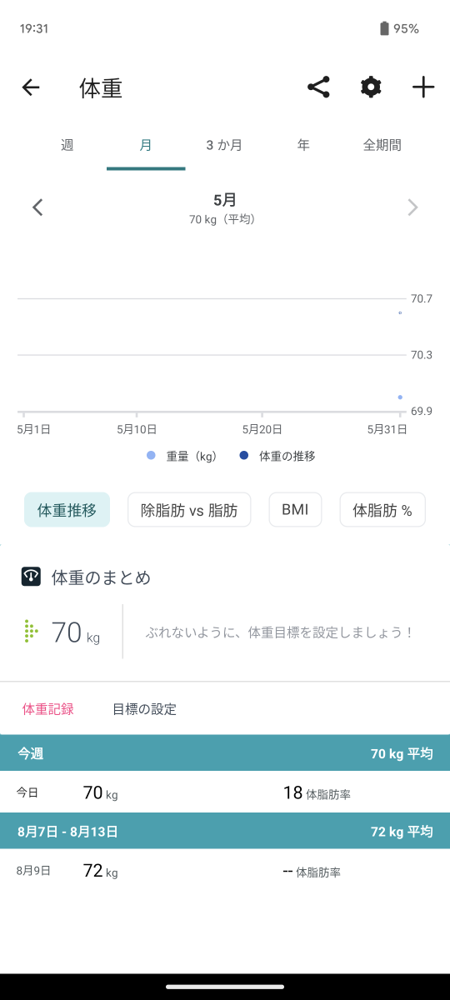 |  |
| ----- | ----- | ----- |


#### Get Body Fat Time Series by Date
指定された期間のすべてのユーザーの体脂肪ログ エントリのリストを取得します。  
- Scope：weight
- Reference：[Get Body Fat Time Series by Date](https://dev.fitbit.com/build/reference/web-api/body-timeseries/get-bodyfat-timeseries-by-date/)
- Procedure：jp.co.vantiq.common.fitbit.webapi.FitbitApi.GetBodyFatTimeSeriesDate
- Response：
    ```json
    {
        "fat": [
            {
                "date": "2023-05-31",
                "fat": 18,
                "logId": 1685577599000,
                "source": "API",
                "time": "23:59:59"
            }
        ]
    }
    ```
アプリで登録可能な項目です。  
`Fitbit` → `体重` → `体重を記録`
|  |  |  |
| ----- | ----- | ----- |


#### Get Body Fat Time Series by Date Range
指定された日付範囲のすべてのユーザーの体脂肪ログ エントリのリストを取得します。  
- Scope：weight
- Reference：[Get Body Fat Time Series by Date Range](https://dev.fitbit.com/build/reference/web-api/body-timeseries/get-bodyfat-timeseries-by-date-range/)
- Procedure：jp.co.vantiq.common.fitbit.webapi.FitbitApi.GetBodyFatTimeSeriesDateRange
- Response：
    ```json
    {
        "fat": [
            {
                "date": "2023-05-29",
                "fat": 18,
                "logId": 1685404799000,
                "source": "API",
                "time": "23:59:59"
            },
            {
                "date": "2023-05-30",
                "fat": 19,
                "logId": 1685491199000,
                "source": "API",
                "time": "23:59:59"
            },
            {
                "date": "2023-05-31",
                "fat": 18,
                "logId": 1685577599000,
                "source": "API",
                "time": "23:59:59"
            }
        ]
    }
    ```
アプリで登録可能な項目です。  
`Fitbit` → `体重` → `体重を記録`
|  |  |  |
| ----- | ----- | ----- |


#### Get Body Goals
ユーザーの体脂肪と体重の目標を取得します。  
- Scope：weight
- Reference：[Get Body Goals](https://dev.fitbit.com/build/reference/web-api/body/get-body-goals/)
- Procedure：jp.co.vantiq.common.fitbit.webapi.FitbitApi.GetBodyGoals
- Response：目標体重（weight）
    ```json
    {
        "goal": {
            "goalType": "LOSE",
            "startDate": "2023-05-31",
            "startWeight": 70,
            "weight": 68,
            "weightThreshold": 0.05
        }
    }
    ```
- Response：体脂肪の目標（fat）
    ```json
    {
        "goal": {
            "fat": 18
        }
    }
    ```
アプリで設定可能な項目です。  
`Fitbit` → `体重` → `設定（目標の体重）`
|  |  | 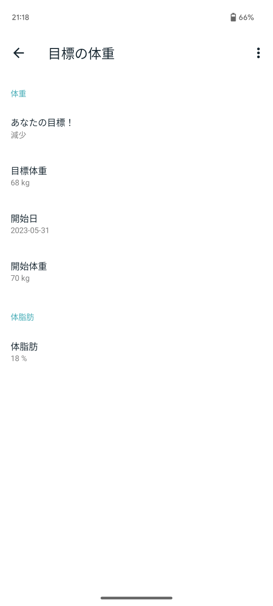 |
| ----- | ----- | ----- |


#### Get Body Time Series by Date
指定された期間のすべてのユーザーの bmi、体脂肪、または体重のリストを取得します。  
- Scope：weight
- Reference：[Get Body Time Series by Date](https://dev.fitbit.com/build/reference/web-api/body-timeseries/get-body-timeseries-by-date/)
- Procedure：jp.co.vantiq.common.fitbit.webapi.FitbitApi.GetBodyTimeSeriesDate
- Response：weight
    ```json
    {
        "body-weight": [
            {
                "dateTime": "2023-05-31",
                "value": "70.0"
            }
        ]
    }
    ```
- Response：fat
    ```json
    {
        "body-fat": [
            {
                "dateTime": "2023-05-31",
                "value": "18.0"
            }
        ]
    }
    ```
- Response：bmi
    ```json
    {
        "body-bmi": [
            {
                "dateTime": "2023-05-31",
                "value": "22.85714340209961"
            }
        ]
    }
    ```
アプリで登録可能な項目です。  
`Fitbit` → `体重` → `＋（体重を記録）`
|  |  |  |
| ----- | ----- | ----- |


#### Get Body Time Series by Date Range
指定された日付範囲におけるすべてのユーザーの bmi、体脂肪、または体重のリストを取得します。  
- Scope：weight
- Reference：[Get Body Time Series by Date Range](https://dev.fitbit.com/build/reference/web-api/body-timeseries/get-body-timeseries-by-date-range/)
- Procedure：jp.co.vantiq.common.fitbit.webapi.FitbitApi.GetBodyTimeSeriesDateRange
- Response：weight
    ```json
    {
        "body-weight": [
            {
                "dateTime": "2023-05-29",
                "value": "70.0"
            },
            {
                "dateTime": "2023-05-30",
                "value": "70.0"
            },
            {
                "dateTime": "2023-05-31",
                "value": "70.0"
            }
        ]
    }
    ```
- Response：fat
    ```json
    {
        "body-fat": [
            {
                "dateTime": "2023-05-29",
                "value": "18.0"
            },
            {
                "dateTime": "2023-05-30",
                "value": "19.0"
            },
            {
                "dateTime": "2023-05-31",
                "value": "18.0"
            }
        ]
    }
    ```
- Response：bmi
    ```json
    {
        "body-bmi": [
            {
                "dateTime": "2023-05-29",
                "value": "22.85714340209961"
            },
            {
                "dateTime": "2023-05-30",
                "value": "22.85714340209961"
            },
            {
                "dateTime": "2023-05-31",
                "value": "22.85714340209961"
            }
        ]
    }
    ```
アプリで登録可能な項目です。  
`Fitbit` → `体重` → `＋（体重を記録）`
|  |  |  |
| ----- | ----- | ----- |


#### Get Breathing Rate Intraday by Date
指定された日付の日内呼吸数データを返します。  
1 日を通して平均呼吸数を測定し、睡眠段階ごとに呼吸数を分類します。  
睡眠段階は、浅い睡眠、深い睡眠、レム睡眠、完全な睡眠の間で異なります。  

単一の日付の測定値は、睡眠期間の終了時に提供されます。  
返されるデータは、前日から始まった睡眠期間を反映している場合が多く、実際に反映されています。  
たとえば、2021 年 12 月 22 日の毎日の呼吸数をリクエストした場合、ユーザーが眠り始めた前夜の 2021 年 12 月 21 日に取得された測定値が含まれる可能性があります。  
- Scope：respiratory_rate
- Reference：[Get Breathing Rate Intraday by Date](https://dev.fitbit.com/build/reference/web-api/intraday/get-br-intraday-by-date/)
- Procedure：jp.co.vantiq.common.fitbit.webapi.FitbitApi.GetBreathingRateIntradayDate
- Response：
    ```json

    ```
- Note：Intraday のアクセス許可が必要


#### Get Breathing Rate Intraday by Interval
日付範囲の日内呼吸数データを返します。  
1 日を通して平均呼吸数を測定し、睡眠段階ごとに呼吸数を分類します。  
睡眠段階は、浅い睡眠、深い睡眠、レム睡眠、完全な睡眠の間で異なります。  

単一の日付の測定値は、睡眠期間の終了時に提供されます。  
返されるデータは、前日から始まった睡眠期間を反映している場合が多く、実際に反映されています。  
たとえば、2021 年 12 月 22 日の毎日の呼吸数をリクエストした場合、ユーザーが眠り始めた前夜の 2021 年 12 月 21 日に取得された測定値が含まれる可能性があります。  
- Scope：respiratory_rate
- Reference：[Get Breathing Rate Intraday by Interval](https://dev.fitbit.com/build/reference/web-api/intraday/get-br-intraday-by-interval/)
- Procedure：jp.co.vantiq.common.fitbit.webapi.FitbitApi.GetBreathingRateIntradayInterval
- Response：
    ```json

    ```
- Note：Intraday のアクセス許可が必要


#### Get Breathing Rate Summary by Date
単一の日付の平均呼吸数データを返します。  
呼吸数データは、ユーザーの「主睡眠」に特に適用されます。  
これは、特定の日にユーザーが眠っていた単一の最長時間です。  

測定は睡眠期間の終わりに行われます。  
返されるデータは、前日から始まった睡眠期間を反映している場合が多く、実際に反映されています。  
たとえば、2021 年 12 月 22 日の毎日の呼吸数をリクエストした場合、ユーザーが眠り始めた前夜の 2021 年 12 月 21 日に取得された測定値が含まれる可能性があります。  
- Scope：respiratory_rate
- Reference：[Get Breathing Rate Summary by Date](https://dev.fitbit.com/build/reference/web-api/breathing-rate/get-br-summary-by-date/)
- Procedure：jp.co.vantiq.common.fitbit.webapi.FitbitApi.GetBreathingRateSummaryDate
- Response：
    ```json
    {
        "br": [
            {
                "value": {
                    "breathingRate": 17.8
                },
                "dateTime": "2023-06-01"
            }
        ]
    }
    ```


#### Get Breathing Rate Summary by Interval
日付範囲の平均呼吸数データを返します。  
呼吸数データは、ユーザーの「主睡眠」に特に適用されます。  
これは、特定の日にユーザーが眠っていた単一の最長時間です。  

単一の日付の測定値は、睡眠期間の終了時に提供されます。  
返されるデータは、前日から始まった睡眠期間を反映している場合が多く、実際に反映されています。  
たとえば、2021 年 12 月 22 日の毎日の呼吸数をリクエストした場合、ユーザーが眠り始めた前夜の 2021 年 12 月 21 日に取得された測定値が含まれる可能性があります。  
- Scope：respiratory_rate
- Reference：[Get Breathing Rate Summary by Interval](https://dev.fitbit.com/build/reference/web-api/breathing-rate/get-br-summary-by-interval/)
- Procedure：jp.co.vantiq.common.fitbit.webapi.FitbitApi.GetBreathingRateSummaryInterval
- Response：
    ```json
    {
        "br": [
            {
                "value": {
                    "breathingRate": 17.8
                },
                "dateTime": "2023-06-01"
            }
        ]
    }
    ```


#### Get Devices
ユーザーのアカウントにペアリングされている Fitbit デバイスのリストを取得します。  
- Scope：settings
- Reference：[Get Devices](https://dev.fitbit.com/build/reference/web-api/devices/get-devices/)
- Procedure：jp.co.vantiq.common.fitbit.webapi.FitbitApi.GetDevices
- Response：
    ```json
    [
        {
            "battery": "Medium",
            "batteryLevel": 47,
            "deviceVersion": "Versa 3",
            "features": [],
            "id": "2082620000",
            "lastSyncTime": "2023-05-23T19:55:34.000",
            "mac": "C7FB84BCXXXX",
            "type": "TRACKER"
        }
    ]
    ```


#### Get ECG Log List
特定の日の前後のユーザーの心電図 (ECG) ログ エントリのリストを取得します。  
- Scope：electrocardiogram
- Reference：[Get ECG Log List](https://dev.fitbit.com/build/reference/web-api/electrocardiogram/get-ecg-log-list/)
- Procedure：jp.co.vantiq.common.fitbit.webapi.FitbitApi.GetECGLogList
- Response：
    ```json
    {
        "ecgReadings": [],
        "pagination": {
            "beforeDate": "2023-01-01T00:00:00.000",
            "limit": 1,
            "next": "",
            "offset": 0,
            "previous": "",
            "sort": "DESC"
        }
    }
    ```


#### Get Friends
アプリケーションは指定された Fitbit ユーザーの友人のリストを取得できます。このスコープでは、友人の Fitbit データへのアクセスは提供されません。  
これらのユーザーは、アプリケーションとデータを共有することに個別に同意する必要があります。  
- Scope：social
- Reference：[Get Friends](https://dev.fitbit.com/build/reference/web-api/friends/get-friends/)
- Procedure：jp.co.vantiq.common.fitbit.webapi.FitbitApi.GetFriends
- Response：
    ```json
    {
        "data": [
            {
                "attributes": {
                    "avatar": "https://asset-service.fitbit.com/xxxxxxxx-xxxx-xxxx-xxxx-xxxxxxxxxxxx_profile_150_square.jpg",
                    "child": false,
                    "friend": true,
                    "name": "XXXXX"
                },
                "id": "XXXXXX",
                "type": "person"
            }
        ]
    }
    ```


#### Get Friends Leaderboard
要求された形式でユーザーの友人リーダーボードを返します。  
このスコープでは、友人の Fitbit データへのアクセスは提供されません。  
これらのユーザーは、アプリケーションとデータを共有することに個別に同意する必要があります。  
- Scope：social
- Reference：[Get Friends Leaderboard](https://dev.fitbit.com/build/reference/web-api/friends/get-friends-leaderboard/)
- Procedure：jp.co.vantiq.common.fitbit.webapi.FitbitApi.GetFriendsLeaderboard
- Response：
    ```json
    {
        "data": [
            {
                "attributes": {
                    "step-average": 5044.5,
                    "step-rank": 1,
                    "step-summary": 35574,
                    "visibleActivity": true
                },
                "id": "XXXXXX",
                "relationships": {
                    "user": {
                        "data": {
                            "id": "XXXXXX",
                            "type": "person"
                        }
                    }
                },
                "type": "ranked-user"
            },
            {
                "attributes": {
                    "step-average": 2251.6666666666665,
                    "step-rank": 2,
                    "step-summary": 10043,
                    "visibleActivity": true
                },
                "id": "XXXXXX",
                "relationships": {
                    "user": {
                        "data": {
                            "id": "XXXXXX",
                            "type": "person"
                        }
                    }
                },
                "type": "ranked-user"
            }
        ],
        "included": [
            {
                "attributes": {
                    "avatar": "https://asset-service.fitbit.com/xxxxxxxx-xxxx-xxxx-xxxx-xxxxxxxxxxxx_profile_150_square.jpg",
                    "child": false,
                    "friend": true,
                    "name": "name"
                },
                "id": "XXXXXX",
                "type": "person"
            },
            {
                "attributes": {
                    "avatar": "https://asset-service.fitbit.com/xxxxxxxx-xxxx-xxxx-xxxx-xxxxxxxxxxxx_profile_150_square.jpg",
                    "child": false,
                    "name": "name"
                },
                "id": "XXXXXX",
                "type": "person"
            }
        ]
    }
    ```


#### Get HRV Intraday by Date
単一の日付の心拍数変動 (HRV) の日内データを返します。  
HRV データは、特定の日付における単一の最長睡眠時間であるユーザーの「主睡眠」に特に適用されます。  
さまざまな時点で HRV レートを測定し、連続差分二乗平均平方根 (rmssd)、低周波数 (LF)、高周波数 (HF)、および特定の測定のカバレッジ データを返します。  
Rmssd は、睡眠中の心拍数の短期変動を測定します。  
LF と HF は、高周波数帯域または低周波数帯域内のビート間間隔の変動のパワーを捕捉します。  
最後に、カバレッジとは、ビート間間隔の数に関するデータの完全性を指します。  

単一の日付の測定値は、睡眠期間の終了時に提供されます。  
返されるデータは通常、前日に始まった睡眠期間を反映しています。  
たとえば、2021 年 12 月 22 日の日次 HRV レートをリクエストした場合、ユーザーが入眠した 2021 年 12 月 21 日の前夜に取得された測定値が含まれる可能性があります。  
- Scope：heartrate
- Reference：[Get HRV Intraday by Date]()
- Procedure：jp.co.vantiq.common.fitbit.webapi.FitbitApi.GetHRVIntradayDate
- Response：
    ```json

    ```
- Note：Intraday のアクセス許可が必要


#### Get HRV Intraday by Interval
日付範囲の心拍数変動 (HRV) の日内データを返します。  
HRV データは、特定の日付における単一の最長睡眠時間であるユーザーの「主睡眠」に特に適用されます。  
さまざまな時点で HRV レートを測定し、連続差分二乗平均平方根 (rmssd)、低周波数 (LF)、高周波数 (HF)、および特定の測定のカバレッジ データを返します。  
Rmssd は、睡眠中の心拍数の短期変動を測定します。  
LF と HF は、高周波数帯域または低周波数帯域内のビート間間隔の変動のパワーを捕捉します。  
最後に、カバレッジとは、ビート間間隔の数に関するデータの完全性を指します。  

単一の日付の測定値は、睡眠期間の終了時に提供されます。  
返されるデータは、前日から始まった睡眠期間を反映している場合が多く、実際に反映されています。  
たとえば、2021 年 12 月 22 日の日次 HRV レートをリクエストした場合、ユーザーが入眠した 2021 年 12 月 21 日の前夜に取得された測定値が含まれる可能性があります。  
- Scope：heartrate
- Reference：[Get HRV Intraday by Interval]()
- Procedure：jp.co.vantiq.common.fitbit.webapi.FitbitApi.GetHRVIntradayInterval
- Response：
    ```json

    ```
- Note：Intraday のアクセス許可が必要


#### Get HRV Summary by Date
単一の日付の心拍数変動 (HRV) データを返します。  
HRV データは、特定の日付における単一の最長睡眠時間であるユーザーの「主睡眠」に特に適用されます。  

測定は睡眠期間の終わりに行われます。  
返されるデータは通常、前日に始まった睡眠期間を反映しています。  
たとえば、2021 年 12 月 22 日の日次 HRV レートをリクエストした場合、ユーザーが入眠した 2021 年 12 月 21 日の前夜に取得された測定値が含まれる可能性があります。  
- Scope：heartrate
- Reference：[Get HRV Summary by Date](https://dev.fitbit.com/build/reference/web-api/heartrate-variability/get-hrv-summary-by-date/)
- Procedure：jp.co.vantiq.common.fitbit.webapi.FitbitApi.GetHRVSummaryDate
- Response：
    ```json
    {
        "hrv": [
            {
                "value": {
                    "dailyRmssd": 44.565,
                    "deepRmssd": 48.558
                },
                "dateTime": "2023-06-01"
            }
        ]
    }
    ```


#### Get HRV Summary by Interval
日付範囲の心拍数変動 (HRV) データを返します。  
HRV データは、特定の日付における単一の最長睡眠時間であるユーザーの「主睡眠」に特に適用されます。  

単一の日付の測定値は、睡眠期間の終了時に提供されます。  
返されるデータは、前日から始まった睡眠期間を反映している場合が多く、実際に反映されています。  
たとえば、2021 年 12 月 22 日の日次 HRV レートをリクエストした場合、ユーザーが入眠した 2021 年 12 月 21 日の前夜に取得された測定値が含まれる可能性があります。  
- Scope：heartrate
- Reference：[Get HRV Summary by Interval](https://dev.fitbit.com/build/reference/web-api/heartrate-variability/get-hrv-summary-by-interval/)
- Procedure：jp.co.vantiq.common.fitbit.webapi.FitbitApi.GetHRVSummaryInterval
- Response：
    ```json
    {
        "hrv": [
            {
                "value": {
                    "dailyRmssd": 44.565,
                    "deepRmssd": 48.558
                },
                "dateTime": "2023-06-01"
            }
        ]
    }
    ```


#### Get Heart Rate Time Series by Date
日付と期間を指定して、一定期間の心拍数の時系列データを取得します。  
応答には、毎日の要約値のみが含まれます。  
- Scope：heartrate
- Reference：[Get Heart Rate Time Series by Date](https://dev.fitbit.com/build/reference/web-api/heartrate-timeseries/get-heartrate-timeseries-by-date/)
- Procedure：jp.co.vantiq.common.fitbit.webapi.FitbitApi.GetHeartRateTimeSeriesDate
- Response：
    ```json
    {
        "activities-heart": [
            {
                "dateTime": "2023-01-01",
                "value": {
                    "customHeartRateZones": [],
                    "heartRateZones": [
                        {
                            "caloriesOut": 2696.768,
                            "max": 115,
                            "min": 30,
                            "minutes": 1431,
                            "name": "Out of Range"
                        },
                        {
                            "caloriesOut": 66.69999999999999,
                            "max": 140,
                            "min": 115,
                            "minutes": 9,
                            "name": "Fat Burn"
                        },
                        {
                            "caloriesOut": 0,
                            "max": 171,
                            "min": 140,
                            "minutes": 0,
                            "name": "Cardio"
                        },
                        {
                            "caloriesOut": 0,
                            "max": 220,
                            "min": 171,
                            "minutes": 0,
                            "name": "Peak"
                        }
                    ],
                    "restingHeartRate": 65
                }
            }
        ]
    }
    ```


#### Get Heart Rate Time Series by Date Range
日付範囲を指定して、一定期間の心拍数の時系列データを取得します。  
応答には、毎日の要約値のみが含まれます。  
- Scope：heartrate
- Reference：[Get Heart Rate Time Series by Date Range](https://dev.fitbit.com/build/reference/web-api/heartrate-timeseries/get-heartrate-timeseries-by-date-range/)
- Procedure：jp.co.vantiq.common.fitbit.webapi.FitbitApi.GetHeartRateTimeSeriesDateRange
- Response：
    ```json
    {
        "activities-heart": [
            {
                "dateTime": "2023-01-01",
                "value": {
                    "customHeartRateZones": [],
                    "heartRateZones": [
                    {
                        "caloriesOut": 2666.31312,
                        "max": 115,
                        "min": 30,
                        "minutes": 1431,
                        "name": "Out of Range"
                    },
                    {
                        "caloriesOut": 65.94675000000001,
                        "max": 140,
                        "min": 115,
                        "minutes": 9,
                        "name": "Fat Burn"
                    },
                    {
                        "caloriesOut": 0,
                        "max": 171,
                        "min": 140,
                        "minutes": 0,
                        "name": "Cardio"
                    },
                    {
                        "caloriesOut": 0,
                        "max": 220,
                        "min": 171,
                        "minutes": 0,
                        "name": "Peak"
                    }
                    ],
                    "restingHeartRate": 65
                }
            },
            {
                "dateTime": "2023-01-02",
                "value": {
                    "customHeartRateZones": [],
                    "heartRateZones": [
                    {
                        "caloriesOut": 1651.536,
                        "max": 115,
                        "min": 30,
                        "minutes": 1440,
                        "name": "Out of Range"
                    },
                    {
                        "caloriesOut": 0,
                        "max": 140,
                        "min": 115,
                        "minutes": 0,
                        "name": "Fat Burn"
                    },
                    {
                        "caloriesOut": 0,
                        "max": 171,
                        "min": 140,
                        "minutes": 0,
                        "name": "Cardio"
                    },
                    {
                        "caloriesOut": 0,
                        "max": 220,
                        "min": 171,
                        "minutes": 0,
                        "name": "Peak"
                    }
                    ]
                }
            },
            {
                "dateTime": "2023-01-03",
                "value": {
                    "customHeartRateZones": [],
                    "heartRateZones": [
                    {
                        "caloriesOut": 2455.7575199999997,
                        "max": 115,
                        "min": 30,
                        "minutes": 1193,
                        "name": "Out of Range"
                    },
                    {
                        "caloriesOut": 1606.2080800000003,
                        "max": 140,
                        "min": 115,
                        "minutes": 222,
                        "name": "Fat Burn"
                    },
                    {
                        "caloriesOut": 253.21344,
                        "max": 171,
                        "min": 140,
                        "minutes": 25,
                        "name": "Cardio"
                    },
                    {
                        "caloriesOut": 0,
                        "max": 220,
                        "min": 171,
                        "minutes": 0,
                        "name": "Peak"
                    }
                    ],
                    "restingHeartRate": 66
                }
            }
        ]
    }
    ```


#### Get Nutrition Time Series by Date
日付と期間を指定して、一定期間にわたる特定のリソースの食料と水の消費量データを取得します。  
応答には、毎日の要約値のみが含まれます。  
- Scope：nutrition
- Reference：[Get Nutrition Time Series by Date](https://dev.fitbit.com/build/reference/web-api/nutrition-timeseries/get-nutrition-timeseries-by-date/)
- Procedure：jp.co.vantiq.common.fitbit.webapi.FitbitApi.GetNutritionTimeSeriesDate
- Response：water
    ```json
    {
        "foods-log-water": [
            {
                "dateTime": "2023-06-05",
                "value": "1550.0"
            }
        ]
    }
    ```
- Response：caloriesIn
    ```json
    {
        "foods-log-caloriesIn": [
            {
                "dateTime": "2023-06-05",
                "value": "370"
            }
        ]
    }
    ```
アプリで登録可能な項目です。  
`Fitbit` → `食事` → `＋（食事を記録）`
|  | 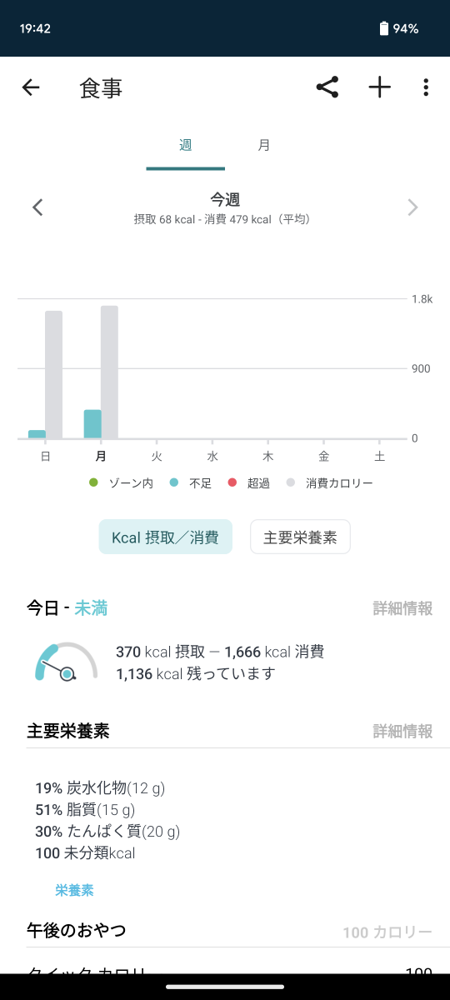 |  |
| ----- | ----- | ----- |

`Fitbit` → `食事` → `123（クイックカロリーを追加）`
|  |  |  |
| ----- | ----- | ----- |

`Fitbit` → `水分` → `＋（摂取水分を記録）`
|  | 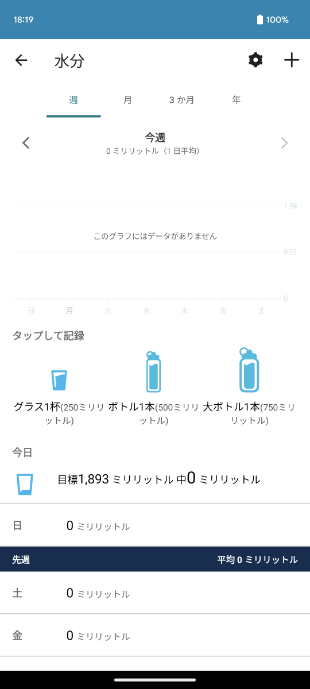 | 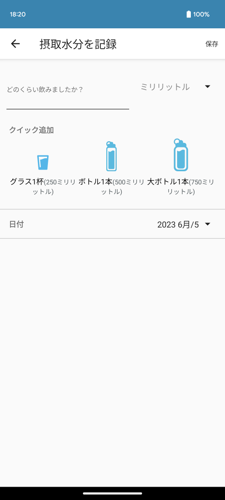 |
| ----- | ----- | ----- |


#### Get Nutrition Time Series by Date Range
日付範囲を指定して、一定期間にわたる特定のリソースの食料と水の消費量データを取得します。  
応答には、毎日の要約値のみが含まれます。  
- Scope：nutrition
- Reference：[Get Nutrition Time Series by Date Range](https://dev.fitbit.com/build/reference/web-api/nutrition-timeseries/get-nutrition-timeseries-by-date-range/)
- Procedure：jp.co.vantiq.common.fitbit.webapi.FitbitApi.GetNutritionTimeSeriesDateRange
- Response：water
    ```json
    {
        "foods-log-water": [
            {
                "dateTime": "2023-06-01",
                "value": "0.0"
            },
            {
                "dateTime": "2023-06-02",
                "value": "1000.0"
            },
            {
                "dateTime": "2023-06-03",
                "value": "0.0"
            },
            {
                "dateTime": "2023-06-04",
                "value": "1500.0"
            },
            {
                "dateTime": "2023-06-05",
                "value": "1550.0"
            }
        ]
    }
    ```
- Response：caloriesIn
    ```json
    {
        "foods-log-caloriesIn": [
            {
                "dateTime": "2023-06-01",
                "value": "0"
            },
            {
                "dateTime": "2023-06-02",
                "value": "54"
            },
            {
                "dateTime": "2023-06-03",
                "value": "0"
            },
            {
                "dateTime": "2023-06-04",
                "value": "108"
            },
            {
                "dateTime": "2023-06-05",
                "value": "370"
            }
        ]
    }
    ```
アプリで登録可能な項目です。  
`Fitbit` → `食事` → `＋（食事を記録）`
|  |  |  |
| ----- | ----- | ----- |

`Fitbit` → `食事` → `123（クイックカロリーを追加）`
|  |  |  |
| ----- | ----- | ----- |

`Fitbit` → `水分` → `＋（摂取水分を記録）`
|  |  |  |
| ----- | ----- | ----- |


#### Get Profile
ユーザーのプロファイル データを取得します。  
- Scope：profile
- Reference：[Get Profile](https://dev.fitbit.com/build/reference/web-api/user/get-profile/)
- Response：
    ```json
    {
        "user": {
            "age": 99,
            "ambassador": false,
            "autoStrideEnabled": true,
            "avatar": "https://asset-service.fitbit.com/xxxxxxxx-xxxx-xxxx-xxxx-xxxxxxxxxxxx_profile_100_square.jpg",
            "avatar150": "https://asset-service.fitbit.com/xxxxxxxx-xxxx-xxxx-xxxx-xxxxxxxxxxxx_profile_150_square.jpg",
            "avatar640": "https://asset-service.fitbit.com/xxxxxxxx-xxxx-xxxx-xxxx-xxxxxxxxxxxx_profile_640_square.jpg",
            "averageDailySteps": 2251,
            "challengesBeta": true,
            "clockTimeDisplayFormat": "24hour",
            "corporate": false,
            "corporateAdmin": false,
            "dateOfBirth": "9999-99-99",
            "displayName": "name",
            "displayNameSetting": "name",
            "distanceUnit": "METRIC",
            "encodedId": "XXXXXX",
            "features": {
                "exerciseGoal": true
            },
            "foodsLocale": "ja_JP",
            "fullName": "name",
            "gender": "MALE",
            "glucoseUnit": "METRIC",
            "height": 175,
            "heightUnit": "METRIC",
            "isBugReportEnabled": false,
            "isChild": false,
            "isCoach": false,
            "languageLocale": "ja_JP",
            "legalTermsAcceptRequired": true,
            "locale": "ja_JP",
            "memberSince": "9999-99-99",
            "mfaEnabled": false,
            "offsetFromUTCMillis": 32400000,
            "sdkDeveloper": false,
            "sleepTracking": "Normal",
            "startDayOfWeek": "SUNDAY",
            "strideLengthRunning": 115.2,
            "strideLengthRunningType": "auto",
            "strideLengthWalking": 72.60000000000001,
            "strideLengthWalkingType": "auto",
            "swimUnit": "METRIC",
            "temperatureUnit": "METRIC",
            "timezone": "Asia/Tokyo",
            "topBadges": [
                {
                    "badgeGradientEndColor": "B0DF2A",
                    "badgeGradientStartColor": "00A550",
                    "badgeType": "DAILY_STEPS",
                    "category": "Minions Badges",
                    "cheers": [],
                    "dateTime": "2022-08-13",
                    "description": "32,100 steps in a day",
                    "earnedMessage": "Congrats on earning your first Minions: Bob badge!",
                    "encodedId": "22B653",
                    "image100px": "https://www.gstatic.com/fitbit/badge/././imgs/fitbit_apis/badges_new/100px/badge_daily_steps32100.png",
                    "image125px": "https://www.gstatic.com/fitbit/badge/././imgs/fitbit_apis/badges_new/125px/badge_daily_steps32100.png",
                    "image300px": "https://www.gstatic.com/fitbit/badge/././imgs/fitbit_apis/badges_new/300px/badge_daily_steps32100.png",
                    "image50px": "https://www.gstatic.com/fitbit/badge/././imgs/fitbit_apis/badges_new/badge_daily_steps32100.png",
                    "image75px": "https://www.gstatic.com/fitbit/badge/././imgs/fitbit_apis/badges_new/75px/badge_daily_steps32100.png",
                    "marketingDescription": "Congratulations on your stellar step count. You\u2019ve earned the last banana-loving Minions badge! You\u2019ve earned all 3 Minions badges!",
                    "mobileDescription": "Congratulations on your stellar step count. You\u2019ve earned the last banana-loving Minion badge!",
                    "name": "Minions: Bob (32,100 steps in a day)",
                    "shareImage640px": "https://www.gstatic.com/fitbit/badge/././imgs/fitbit_apis/badges_new/386px/shareLocalized/en_US/badge_daily_steps32100.png",
                    "shareText": "I took 32,100 steps in a day",
                    "shortDescription": "32,100 steps in a day",
                    "shortName": "Minions: Bob",
                    "timesAchieved": 1,
                    "value": 32100
                },
                {
                    "badgeGradientEndColor": "42C401",
                    "badgeGradientStartColor": "007D3C",
                    "badgeType": "LIFETIME_DISTANCE",
                    "category": "Lifetime Distance",
                    "cheers": [],
                    "dateTime": "2023-03-26",
                    "description": "804 lifetime kilometers",
                    "earnedMessage": "Whoa! You've earned the Serengeti badge!",
                    "encodedId": "22B8LS",
                    "image100px": "https://www.gstatic.com/fitbit/badge/././imgs/fitbit_apis/badges_new/100px/badge_lifetime_miles500.png",
                    "image125px": "https://www.gstatic.com/fitbit/badge/././imgs/fitbit_apis/badges_new/125px/badge_lifetime_miles500.png",
                    "image300px": "https://www.gstatic.com/fitbit/badge/././imgs/fitbit_apis/badges_new/300px/badge_lifetime_miles500.png",
                    "image50px": "https://www.gstatic.com/fitbit/badge/././imgs/fitbit_apis/badges_new/badge_lifetime_miles500.png",
                    "image75px": "https://www.gstatic.com/fitbit/badge/././imgs/fitbit_apis/badges_new/75px/badge_lifetime_miles500.png",
                    "marketingDescription": "By reaching 804 lifetime kilometers, you've earned the Serengeti badge!",
                    "mobileDescription": "Impressive! You've walked distance of the Serengeti\u2014one of the 7 Natural Wonders of the World.",
                    "name": "Serengeti (804 lifetime kilometers)",
                    "shareImage640px": "https://www.gstatic.com/fitbit/badge/././imgs/fitbit_apis/badges_new/386px/shareLocalized/en_US/badge_lifetime_miles500_km.png",
                    "shareText": "I covered 804 kilometers with my #Fitbit and earned the Serengeti badge.",
                    "shortDescription": "804 kilometers",
                    "shortName": "Serengeti",
                    "timesAchieved": 1,
                    "unit": "KILOMETERS",
                    "value": 804
                },
                {
                    "badgeGradientEndColor": "B0DF2A",
                    "badgeGradientStartColor": "00A550",
                    "badgeType": "DAILY_FLOORS",
                    "category": "Daily Climb",
                    "cheers": [],
                    "dateTime": "2023-03-09",
                    "description": "25 floors in a day",
                    "earnedMessage": "Congrats on earning your first Redwood Forest badge!",
                    "encodedId": "228TSZ",
                    "image100px": "https://www.gstatic.com/fitbit/badge/././imgs/fitbit_apis/badges_new/100px/badge_daily_floors25.png",
                    "image125px": "https://www.gstatic.com/fitbit/badge/././imgs/fitbit_apis/badges_new/125px/badge_daily_floors25.png",
                    "image300px": "https://www.gstatic.com/fitbit/badge/././imgs/fitbit_apis/badges_new/300px/badge_daily_floors25.png",
                    "image50px": "https://www.gstatic.com/fitbit/badge/././imgs/fitbit_apis/badges_new/badge_daily_floors25.png",
                    "image75px": "https://www.gstatic.com/fitbit/badge/././imgs/fitbit_apis/badges_new/75px/badge_daily_floors25.png",
                    "marketingDescription": "You've climbed 25 floors to earn the Redwood Forest badge!",
                    "mobileDescription": "The tallest trees on Earth can't top the heights you've been conquering.",
                    "name": "Redwood Forest (25 floors in a day)",
                    "shareImage640px": "https://www.gstatic.com/fitbit/badge/././imgs/fitbit_apis/badges_new/386px/shareLocalized/en_US/badge_daily_floors25.png",
                    "shareText": "I climbed 25 flights of stairs and earned the Redwood Forest badge! #Fitbit",
                    "shortDescription": "25 floors",
                    "shortName": "Redwood Forest",
                    "timesAchieved": 2,
                    "value": 25
                },
                {
                    "badgeGradientEndColor": "FF677C",
                    "badgeGradientStartColor": "D24958",
                    "badgeType": "LIFETIME_FLOORS",
                    "category": "Lifetime Climb",
                    "cheers": [],
                    "dateTime": "2023-05-10",
                    "description": "1,000 lifetime floors",
                    "earnedMessage": "Yipee! You've earned the Skydiver badge!",
                    "encodedId": "228T9C",
                    "image100px": "https://www.gstatic.com/fitbit/badge/././imgs/fitbit_apis/badges_new/100px/badge_lifetime_floors1k.png",
                    "image125px": "https://www.gstatic.com/fitbit/badge/././imgs/fitbit_apis/badges_new/125px/badge_lifetime_floors1k.png",
                    "image300px": "https://www.gstatic.com/fitbit/badge/././imgs/fitbit_apis/badges_new/300px/badge_lifetime_floors1k.png",
                    "image50px": "https://www.gstatic.com/fitbit/badge/././imgs/fitbit_apis/badges_new/badge_lifetime_floors1k.png",
                    "image75px": "https://www.gstatic.com/fitbit/badge/././imgs/fitbit_apis/badges_new/75px/badge_lifetime_floors1k.png",
                    "marketingDescription": "By climbing 1000 lifetime floors, you've earned the Skydiver badge!",
                    "mobileDescription": "That's as high as you'd go to skydive! Cross another one off the ol' fitness bucket list.",
                    "name": "Skydiver (1,000 lifetime floors)",
                    "shareImage640px": "https://www.gstatic.com/fitbit/badge/././imgs/fitbit_apis/badges_new/386px/shareLocalized/en_US/badge_lifetime_floors1k.png",
                    "shareText": "I climbed 1,000 floors with my #Fitbit and earned the Skydiver badge.",
                    "shortDescription": "1,000 floors",
                    "shortName": "Skydiver",
                    "timesAchieved": 1,
                    "value": 1000
                }
            ],
            "visibleUser": true,
            "waterUnit": "METRIC",
            "waterUnitName": "ml",
            "weight": 72,
            "weightUnit": "METRIC"
        }
    }
    ```


#### Get Sleep Goal
ユーザーの現在の睡眠目標を返します。  
- Scope：sleep
- Reference：[Get Sleep Goal](https://dev.fitbit.com/build/reference/web-api/sleep/get-sleep-goals/)
- Procedure：jp.co.vantiq.common.fitbit.webapi.FitbitApi.GetSleepGoal
- Response：
    ```json
    {
        "consistency": {
            "awakeRestlessPercentage": 0.06614505127313476,
            "flowId": 0,
            "recommendedSleepGoal": 210,
            "typicalDuration": 189,
            "typicalWakeupTime": "08:02"
        },
        "goal": {
            "bedtime": "03:45",
            "minDuration": 270,
            "updatedOn": "2023-05-31T07:37:13.100Z",
            "wakeupTime": "08:50"
        }
    }
    ```
アプリで登録可能な項目です。  
`Fitbit` → `睡眠` → `設定（睡眠）`
|  | 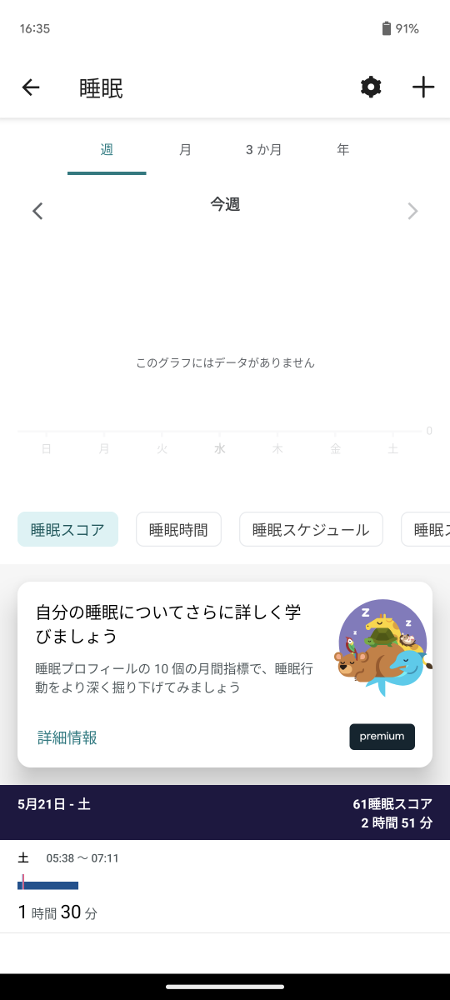 | 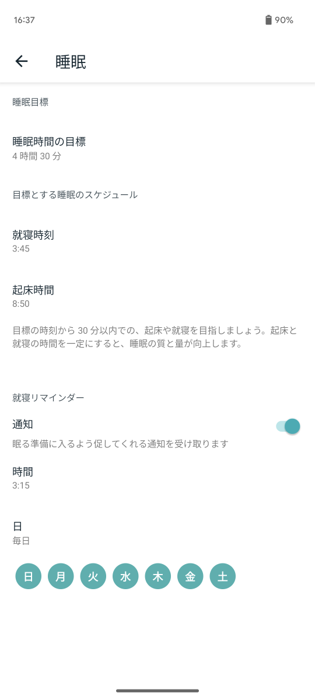 |
| ----- | ----- | ----- |


#### Get Sleep Log by Date
指定された日付のユーザーの睡眠ログ エントリのリストを返します。  
返されるデータには、前の日付から始まった睡眠期間が含まれる場合があります。  
たとえば、2021 年 12 月 22 日の睡眠ログをリクエストすると、前夜 2021 年 12 月 21 日に始まり、2021 年 12 月 22 日に終了したログ エントリが返されることがあります。  
- Scope：sleep
- Reference：[Get Sleep Log by Date](https://dev.fitbit.com/build/reference/web-api/sleep/get-sleep-log-by-date/)
- Procedure：jp.co.vantiq.common.fitbit.webapi.FitbitApi.GetSleepLogDate
- Response：
    ```json
    {
        "sleep": [
            {
                "dateOfSleep": "2023-01-01",
                "duration": 33600000,
                "efficiency": 97,
                "endTime": "2023-01-01T12:21:30.000",
                "infoCode": 0,
                "isMainSleep": true,
                "levels": {
                    "data": [
                        {
                            "dateTime": "2023-01-01T03:01:30.000",
                            "level": "wake",
                            "seconds": 390
                        },
                        {
                            "dateTime": "2023-01-01T03:08:00.000",
                            "level": "light",
                            "seconds": 270
                        },
                        {
                            "dateTime": "2023-01-01T03:12:30.000",
                            "level": "wake",
                            "seconds": 390
                        },
                        {
                            "dateTime": "2023-01-01T03:19:00.000",
                            "level": "light",
                            "seconds": 900
                        },
                        {
                            "dateTime": "2023-01-01T03:34:00.000",
                            "level": "deep",
                            "seconds": 360
                        },
                        {
                            "dateTime": "2023-01-01T03:40:00.000",
                            "level": "light",
                            "seconds": 1650
                        },
                        {
                            "dateTime": "2023-01-01T04:07:30.000",
                            "level": "rem",
                            "seconds": 1380
                        },
                        {
                            "dateTime": "2023-01-01T04:30:30.000",
                            "level": "light",
                            "seconds": 780
                        },
                        {
                            "dateTime": "2023-01-01T04:43:30.000",
                            "level": "deep",
                            "seconds": 1200
                        },
                        {
                            "dateTime": "2023-01-01T05:03:30.000",
                            "level": "light",
                            "seconds": 330
                        },
                        {
                            "dateTime": "2023-01-01T05:09:00.000",
                            "level": "deep",
                            "seconds": 900
                        },
                        {
                            "dateTime": "2023-01-01T05:24:00.000",
                            "level": "light",
                            "seconds": 1020
                        },
                        {
                            "dateTime": "2023-01-01T05:41:00.000",
                            "level": "deep",
                            "seconds": 300
                        },
                        {
                            "dateTime": "2023-01-01T05:46:00.000",
                            "level": "light",
                            "seconds": 210
                        },
                        {
                            "dateTime": "2023-01-01T05:49:30.000",
                            "level": "deep",
                            "seconds": 300
                        },
                        {
                            "dateTime": "2023-01-01T05:54:30.000",
                            "level": "light",
                            "seconds": 1380
                        },
                        {
                            "dateTime": "2023-01-01T06:17:30.000",
                            "level": "deep",
                            "seconds": 540
                        },
                        {
                            "dateTime": "2023-01-01T06:26:30.000",
                            "level": "rem",
                            "seconds": 390
                        },
                        {
                            "dateTime": "2023-01-01T06:33:00.000",
                            "level": "deep",
                            "seconds": 750
                        },
                        {
                            "dateTime": "2023-01-01T06:45:30.000",
                            "level": "light",
                            "seconds": 330
                        },
                        {
                            "dateTime": "2023-01-01T06:51:00.000",
                            "level": "deep",
                            "seconds": 1950
                        },
                        {
                            "dateTime": "2023-01-01T07:23:30.000",
                            "level": "light",
                            "seconds": 1410
                        },
                        {
                            "dateTime": "2023-01-01T07:47:00.000",
                            "level": "deep",
                            "seconds": 840
                        },
                        {
                            "dateTime": "2023-01-01T08:01:00.000",
                            "level": "light",
                            "seconds": 510
                        },
                        {
                            "dateTime": "2023-01-01T08:09:30.000",
                            "level": "wake",
                            "seconds": 390
                        },
                        {
                            "dateTime": "2023-01-01T08:16:00.000",
                            "level": "rem",
                            "seconds": 420
                        },
                        {
                            "dateTime": "2023-01-01T08:23:00.000",
                            "level": "wake",
                            "seconds": 540
                        },
                        {
                            "dateTime": "2023-01-01T08:32:00.000",
                            "level": "light",
                            "seconds": 30
                        },
                        {
                            "dateTime": "2023-01-01T08:32:30.000",
                            "level": "rem",
                            "seconds": 1320
                        },
                        {
                            "dateTime": "2023-01-01T08:54:30.000",
                            "level": "wake",
                            "seconds": 690
                        },
                        {
                            "dateTime": "2023-01-01T09:06:00.000",
                            "level": "light",
                            "seconds": 2280
                        },
                        {
                            "dateTime": "2023-01-01T09:44:00.000",
                            "level": "rem",
                            "seconds": 2310
                        },
                        {
                            "dateTime": "2023-01-01T10:22:30.000",
                            "level": "light",
                            "seconds": 2250
                        },
                        {
                            "dateTime": "2023-01-01T11:00:00.000",
                            "level": "deep",
                            "seconds": 390
                        },
                        {
                            "dateTime": "2023-01-01T11:06:30.000",
                            "level": "light",
                            "seconds": 330
                        },
                        {
                            "dateTime": "2023-01-01T11:12:00.000",
                            "level": "rem",
                            "seconds": 1560
                        },
                        {
                            "dateTime": "2023-01-01T11:38:00.000",
                            "level": "light",
                            "seconds": 450
                        },
                        {
                            "dateTime": "2023-01-01T11:45:30.000",
                            "level": "rem",
                            "seconds": 1350
                        },
                        {
                            "dateTime": "2023-01-01T12:08:00.000",
                            "level": "light",
                            "seconds": 810
                        }
                    ],
                    "shortData": [
                        {
                            "dateTime": "2023-01-01T04:13:00.000",
                            "level": "wake",
                            "seconds": 30
                        },
                        {
                            "dateTime": "2023-01-01T04:30:00.000",
                            "level": "wake",
                            "seconds": 30
                        },
                        {
                            "dateTime": "2023-01-01T04:33:30.000",
                            "level": "wake",
                            "seconds": 30
                        },
                        {
                            "dateTime": "2023-01-01T05:27:30.000",
                            "level": "wake",
                            "seconds": 60
                        },
                        {
                            "dateTime": "2023-01-01T05:30:30.000",
                            "level": "wake",
                            "seconds": 60
                        },
                        {
                            "dateTime": "2023-01-01T05:54:30.000",
                            "level": "wake",
                            "seconds": 120
                        },
                        {
                            "dateTime": "2023-01-01T06:44:00.000",
                            "level": "wake",
                            "seconds": 90
                        },
                        {
                            "dateTime": "2023-01-01T06:47:30.000",
                            "level": "wake",
                            "seconds": 30
                        },
                        {
                            "dateTime": "2023-01-01T07:24:00.000",
                            "level": "wake",
                            "seconds": 30
                        },
                        {
                            "dateTime": "2023-01-01T07:28:30.000",
                            "level": "wake",
                            "seconds": 90
                        },
                        {
                            "dateTime": "2023-01-01T07:41:00.000",
                            "level": "wake",
                            "seconds": 30
                        },
                        {
                            "dateTime": "2023-01-01T07:59:30.000",
                            "level": "wake",
                            "seconds": 90
                        },
                        {
                            "dateTime": "2023-01-01T08:39:30.000",
                            "level": "wake",
                            "seconds": 90
                        },
                        {
                            "dateTime": "2023-01-01T08:43:30.000",
                            "level": "wake",
                            "seconds": 30
                        },
                        {
                            "dateTime": "2023-01-01T08:49:30.000",
                            "level": "wake",
                            "seconds": 90
                        },
                        {
                            "dateTime": "2023-01-01T09:15:00.000",
                            "level": "wake",
                            "seconds": 150
                        },
                        {
                            "dateTime": "2023-01-01T09:23:00.000",
                            "level": "wake",
                            "seconds": 30
                        },
                        {
                            "dateTime": "2023-01-01T09:33:00.000",
                            "level": "wake",
                            "seconds": 30
                        },
                        {
                            "dateTime": "2023-01-01T10:02:30.000",
                            "level": "wake",
                            "seconds": 30
                        },
                        {
                            "dateTime": "2023-01-01T10:11:00.000",
                            "level": "wake",
                            "seconds": 30
                        },
                        {
                            "dateTime": "2023-01-01T10:32:00.000",
                            "level": "wake",
                            "seconds": 90
                        },
                        {
                            "dateTime": "2023-01-01T11:06:00.000",
                            "level": "wake",
                            "seconds": 30
                        },
                        {
                            "dateTime": "2023-01-01T11:08:30.000",
                            "level": "wake",
                            "seconds": 30
                        },
                        {
                            "dateTime": "2023-01-01T11:39:30.000",
                            "level": "wake",
                            "seconds": 30
                        },
                        {
                            "dateTime": "2023-01-01T11:41:30.000",
                            "level": "wake",
                            "seconds": 30
                        },
                        {
                            "dateTime": "2023-01-01T12:05:30.000",
                            "level": "wake",
                            "seconds": 150
                        },
                        {
                            "dateTime": "2023-01-01T12:10:30.000",
                            "level": "wake",
                            "seconds": 90
                        }
                    ],
                    "summary": {
                        "deep": {
                            "count": 10,
                            "minutes": 122,
                            "thirtyDayAvgMinutes": 59
                        },
                        "light": {
                            "count": 32,
                            "minutes": 233,
                            "thirtyDayAvgMinutes": 189
                        },
                        "rem": {
                            "count": 13,
                            "minutes": 138,
                            "thirtyDayAvgMinutes": 86
                        },
                        "wake": {
                            "count": 32,
                            "minutes": 67,
                            "thirtyDayAvgMinutes": 48
                        }
                    }
                },
                "logId": 39633217639,
                "logType": "auto_detected",
                "minutesAfterWakeup": 0,
                "minutesAsleep": 493,
                "minutesAwake": 67,
                "minutesToFallAsleep": 0,
                "startTime": "2023-01-01T03:01:30.000",
                "timeInBed": 560,
                "type": "stages"
            }
        ],
        "summary": {
            "stages": {
                "deep": 122,
                "light": 233,
                "rem": 138,
                "wake": 67
            },
            "totalMinutesAsleep": 493,
            "totalSleepRecords": 1,
            "totalTimeInBed": 560
        }
    }
    ```


#### Get Sleep Log by Date Range
ある日付範囲のユーザーの睡眠ログ エントリのリストを返します。  
どちらの日付でも返されるデータには、その日付で終了し、前の日付に開始した睡眠期間が含まれる場合があります。  
たとえば、2021-12-22 から 2021-12-26 までの睡眠ログをリクエストすると、2021-12-21 から 2021-12-22 にまたがるログ エントリ、および 2021-12-25 から 2021-12-26 までにわたるログ エントリが返される場合があります。  
- Scope：sleep
- Reference：[Get Sleep Log by Date Range](https://dev.fitbit.com/build/reference/web-api/sleep/get-sleep-log-by-date-range/)
- Procedure：jp.co.vantiq.common.fitbit.webapi.FitbitApi.GetSleepLogDateRange
- Response：
    ```json
    {
        "sleep": [
            {
                "dateOfSleep": "2023-01-01",
                "duration": 33600000,
                "efficiency": 97,
                "endTime": "2023-01-01T12:21:30.000",
                "infoCode": 0,
                "isMainSleep": true,
                "levels": {
                    "data": [
                    {
                        "dateTime": "2023-01-01T03:01:30.000",
                        "level": "wake",
                        "seconds": 390
                    },
                    {
                        "dateTime": "2023-01-01T03:08:00.000",
                        "level": "light",
                        "seconds": 270
                    },
                    {
                        "dateTime": "2023-01-01T03:12:30.000",
                        "level": "wake",
                        "seconds": 390
                    },
                    {
                        "dateTime": "2023-01-01T03:19:00.000",
                        "level": "light",
                        "seconds": 900
                    },
                    {
                        "dateTime": "2023-01-01T03:34:00.000",
                        "level": "deep",
                        "seconds": 360
                    },
                    {
                        "dateTime": "2023-01-01T03:40:00.000",
                        "level": "light",
                        "seconds": 1650
                    },
                    {
                        "dateTime": "2023-01-01T04:07:30.000",
                        "level": "rem",
                        "seconds": 1380
                    },
                    {
                        "dateTime": "2023-01-01T04:30:30.000",
                        "level": "light",
                        "seconds": 780
                    },
                    {
                        "dateTime": "2023-01-01T04:43:30.000",
                        "level": "deep",
                        "seconds": 1200
                    },
                    {
                        "dateTime": "2023-01-01T05:03:30.000",
                        "level": "light",
                        "seconds": 330
                    },
                    {
                        "dateTime": "2023-01-01T05:09:00.000",
                        "level": "deep",
                        "seconds": 900
                    },
                    {
                        "dateTime": "2023-01-01T05:24:00.000",
                        "level": "light",
                        "seconds": 1020
                    },
                    {
                        "dateTime": "2023-01-01T05:41:00.000",
                        "level": "deep",
                        "seconds": 300
                    },
                    {
                        "dateTime": "2023-01-01T05:46:00.000",
                        "level": "light",
                        "seconds": 210
                    },
                    {
                        "dateTime": "2023-01-01T05:49:30.000",
                        "level": "deep",
                        "seconds": 300
                    },
                    {
                        "dateTime": "2023-01-01T05:54:30.000",
                        "level": "light",
                        "seconds": 1380
                    },
                    {
                        "dateTime": "2023-01-01T06:17:30.000",
                        "level": "deep",
                        "seconds": 540
                    },
                    {
                        "dateTime": "2023-01-01T06:26:30.000",
                        "level": "rem",
                        "seconds": 390
                    },
                    {
                        "dateTime": "2023-01-01T06:33:00.000",
                        "level": "deep",
                        "seconds": 750
                    },
                    {
                        "dateTime": "2023-01-01T06:45:30.000",
                        "level": "light",
                        "seconds": 330
                    },
                    {
                        "dateTime": "2023-01-01T06:51:00.000",
                        "level": "deep",
                        "seconds": 1950
                    },
                    {
                        "dateTime": "2023-01-01T07:23:30.000",
                        "level": "light",
                        "seconds": 1410
                    },
                    {
                        "dateTime": "2023-01-01T07:47:00.000",
                        "level": "deep",
                        "seconds": 840
                    },
                    {
                        "dateTime": "2023-01-01T08:01:00.000",
                        "level": "light",
                        "seconds": 510
                    },
                    {
                        "dateTime": "2023-01-01T08:09:30.000",
                        "level": "wake",
                        "seconds": 390
                    },
                    {
                        "dateTime": "2023-01-01T08:16:00.000",
                        "level": "rem",
                        "seconds": 420
                    },
                    {
                        "dateTime": "2023-01-01T08:23:00.000",
                        "level": "wake",
                        "seconds": 540
                    },
                    {
                        "dateTime": "2023-01-01T08:32:00.000",
                        "level": "light",
                        "seconds": 30
                    },
                    {
                        "dateTime": "2023-01-01T08:32:30.000",
                        "level": "rem",
                        "seconds": 1320
                    },
                    {
                        "dateTime": "2023-01-01T08:54:30.000",
                        "level": "wake",
                        "seconds": 690
                    },
                    {
                        "dateTime": "2023-01-01T09:06:00.000",
                        "level": "light",
                        "seconds": 2280
                    },
                    {
                        "dateTime": "2023-01-01T09:44:00.000",
                        "level": "rem",
                        "seconds": 2310
                    },
                    {
                        "dateTime": "2023-01-01T10:22:30.000",
                        "level": "light",
                        "seconds": 2250
                    },
                    {
                        "dateTime": "2023-01-01T11:00:00.000",
                        "level": "deep",
                        "seconds": 390
                    },
                    {
                        "dateTime": "2023-01-01T11:06:30.000",
                        "level": "light",
                        "seconds": 330
                    },
                    {
                        "dateTime": "2023-01-01T11:12:00.000",
                        "level": "rem",
                        "seconds": 1560
                    },
                    {
                        "dateTime": "2023-01-01T11:38:00.000",
                        "level": "light",
                        "seconds": 450
                    },
                    {
                        "dateTime": "2023-01-01T11:45:30.000",
                        "level": "rem",
                        "seconds": 1350
                    },
                    {
                        "dateTime": "2023-01-01T12:08:00.000",
                        "level": "light",
                        "seconds": 810
                    }
                    ],
                    "shortData": [
                    {
                        "dateTime": "2023-01-01T04:13:00.000",
                        "level": "wake",
                        "seconds": 30
                    },
                    {
                        "dateTime": "2023-01-01T04:30:00.000",
                        "level": "wake",
                        "seconds": 30
                    },
                    {
                        "dateTime": "2023-01-01T04:33:30.000",
                        "level": "wake",
                        "seconds": 30
                    },
                    {
                        "dateTime": "2023-01-01T05:27:30.000",
                        "level": "wake",
                        "seconds": 60
                    },
                    {
                        "dateTime": "2023-01-01T05:30:30.000",
                        "level": "wake",
                        "seconds": 60
                    },
                    {
                        "dateTime": "2023-01-01T05:54:30.000",
                        "level": "wake",
                        "seconds": 120
                    },
                    {
                        "dateTime": "2023-01-01T06:44:00.000",
                        "level": "wake",
                        "seconds": 90
                    },
                    {
                        "dateTime": "2023-01-01T06:47:30.000",
                        "level": "wake",
                        "seconds": 30
                    },
                    {
                        "dateTime": "2023-01-01T07:24:00.000",
                        "level": "wake",
                        "seconds": 30
                    },
                    {
                        "dateTime": "2023-01-01T07:28:30.000",
                        "level": "wake",
                        "seconds": 90
                    },
                    {
                        "dateTime": "2023-01-01T07:41:00.000",
                        "level": "wake",
                        "seconds": 30
                    },
                    {
                        "dateTime": "2023-01-01T07:59:30.000",
                        "level": "wake",
                        "seconds": 90
                    },
                    {
                        "dateTime": "2023-01-01T08:39:30.000",
                        "level": "wake",
                        "seconds": 90
                    },
                    {
                        "dateTime": "2023-01-01T08:43:30.000",
                        "level": "wake",
                        "seconds": 30
                    },
                    {
                        "dateTime": "2023-01-01T08:49:30.000",
                        "level": "wake",
                        "seconds": 90
                    },
                    {
                        "dateTime": "2023-01-01T09:15:00.000",
                        "level": "wake",
                        "seconds": 150
                    },
                    {
                        "dateTime": "2023-01-01T09:23:00.000",
                        "level": "wake",
                        "seconds": 30
                    },
                    {
                        "dateTime": "2023-01-01T09:33:00.000",
                        "level": "wake",
                        "seconds": 30
                    },
                    {
                        "dateTime": "2023-01-01T10:02:30.000",
                        "level": "wake",
                        "seconds": 30
                    },
                    {
                        "dateTime": "2023-01-01T10:11:00.000",
                        "level": "wake",
                        "seconds": 30
                    },
                    {
                        "dateTime": "2023-01-01T10:32:00.000",
                        "level": "wake",
                        "seconds": 90
                    },
                    {
                        "dateTime": "2023-01-01T11:06:00.000",
                        "level": "wake",
                        "seconds": 30
                    },
                    {
                        "dateTime": "2023-01-01T11:08:30.000",
                        "level": "wake",
                        "seconds": 30
                    },
                    {
                        "dateTime": "2023-01-01T11:39:30.000",
                        "level": "wake",
                        "seconds": 30
                    },
                    {
                        "dateTime": "2023-01-01T11:41:30.000",
                        "level": "wake",
                        "seconds": 30
                    },
                    {
                        "dateTime": "2023-01-01T12:05:30.000",
                        "level": "wake",
                        "seconds": 150
                    },
                    {
                        "dateTime": "2023-01-01T12:10:30.000",
                        "level": "wake",
                        "seconds": 90
                    }
                    ],
                    "summary": {
                    "deep": {
                        "count": 10,
                        "minutes": 122,
                        "thirtyDayAvgMinutes": 0
                    },
                    "light": {
                        "count": 32,
                        "minutes": 233,
                        "thirtyDayAvgMinutes": 0
                    },
                    "rem": {
                        "count": 13,
                        "minutes": 138,
                        "thirtyDayAvgMinutes": 0
                    },
                    "wake": {
                        "count": 32,
                        "minutes": 67,
                        "thirtyDayAvgMinutes": 0
                    }
                    }
                },
                "logId": 39633217639,
                "logType": "auto_detected",
                "minutesAfterWakeup": 0,
                "minutesAsleep": 493,
                "minutesAwake": 67,
                "minutesToFallAsleep": 0,
                "startTime": "2023-01-01T03:01:30.000",
                "timeInBed": 560,
                "type": "stages"
            }
        ]
    }
    ```


#### Get Sleep Log List
オフセット、制限、並べ替え順序を指定して、指定された日付の前後のユーザーの睡眠ログ エントリのリストを返します。  
さまざまな日付に対して返されるデータには、前の日付から始まった睡眠期間が含まれる場合があります。  
たとえば、2018 年 10 月 21 日の睡眠ログ エントリはその日に終了したが、開始したのは前夜の 2018 年 10 月 20 日である可能性があります。  
- Scope：sleep
- Reference：[Get Sleep Log List](https://dev.fitbit.com/build/reference/web-api/sleep/get-sleep-log-list/)
- Procedure：jp.co.vantiq.common.fitbit.webapi.FitbitApi.GetSleepLogList
- Response：
    ```json
    {
        "pagination": {
            "beforeDate": "2023-01-01",
            "limit": 1,
            "next": "https://api.fitbit.com/1.2/user/-/sleep/list.json?offset=1&limit=1&sort=desc&beforeDate=2023-01-01",
            "offset": 0,
            "previous": "",
            "sort": "desc"
        },
        "sleep": [
            {
                "dateOfSleep": "2022-12-31",
                "duration": 18540000,
                "efficiency": 98,
                "endTime": "2022-12-31T10:18:00.000",
                "infoCode": 0,
                "isMainSleep": true,
                "levels": {
                    "data": [
                        {
                            "dateTime": "2022-12-31T05:09:00.000",
                            "level": "wake",
                            "seconds": 240
                        },
                        {
                            "dateTime": "2022-12-31T05:13:00.000",
                            "level": "light",
                            "seconds": 870
                        },
                        {
                            "dateTime": "2022-12-31T05:27:30.000",
                            "level": "rem",
                            "seconds": 1020
                        },
                        {
                            "dateTime": "2022-12-31T05:44:30.000",
                            "level": "light",
                            "seconds": 420
                        },
                        {
                            "dateTime": "2022-12-31T05:51:30.000",
                            "level": "deep",
                            "seconds": 2070
                        },
                        {
                            "dateTime": "2022-12-31T06:26:00.000",
                            "level": "light",
                            "seconds": 2880
                        },
                        {
                            "dateTime": "2022-12-31T07:14:00.000",
                            "level": "deep",
                            "seconds": 360
                        },
                        {
                            "dateTime": "2022-12-31T07:20:00.000",
                            "level": "light",
                            "seconds": 1140
                        },
                        {
                            "dateTime": "2022-12-31T07:39:00.000",
                            "level": "rem",
                            "seconds": 3240
                        },
                        {
                            "dateTime": "2022-12-31T08:33:00.000",
                            "level": "light",
                            "seconds": 2400
                        },
                        {
                            "dateTime": "2022-12-31T09:13:00.000",
                            "level": "rem",
                            "seconds": 990
                        },
                        {
                            "dateTime": "2022-12-31T09:29:30.000",
                            "level": "light",
                            "seconds": 2700
                        },
                        {
                            "dateTime": "2022-12-31T10:14:30.000",
                            "level": "wake",
                            "seconds": 210
                        }
                    ],
                    "shortData": [
                        {
                            "dateTime": "2022-12-31T05:20:30.000",
                            "level": "wake",
                            "seconds": 90
                        },
                        {
                            "dateTime": "2022-12-31T05:24:30.000",
                            "level": "wake",
                            "seconds": 30
                        },
                        {
                            "dateTime": "2022-12-31T05:48:00.000",
                            "level": "wake",
                            "seconds": 60
                        },
                        {
                            "dateTime": "2022-12-31T06:47:00.000",
                            "level": "wake",
                            "seconds": 30
                        },
                        {
                            "dateTime": "2022-12-31T06:51:00.000",
                            "level": "wake",
                            "seconds": 30
                        },
                        {
                            "dateTime": "2022-12-31T07:26:30.000",
                            "level": "wake",
                            "seconds": 60
                        },
                        {
                            "dateTime": "2022-12-31T07:45:30.000",
                            "level": "wake",
                            "seconds": 60
                        },
                        {
                            "dateTime": "2022-12-31T07:52:30.000",
                            "level": "wake",
                            "seconds": 30
                        },
                        {
                            "dateTime": "2022-12-31T08:03:30.000",
                            "level": "wake",
                            "seconds": 30
                        },
                        {
                            "dateTime": "2022-12-31T08:06:00.000",
                            "level": "wake",
                            "seconds": 30
                        },
                        {
                            "dateTime": "2022-12-31T08:17:00.000",
                            "level": "wake",
                            "seconds": 30
                        },
                        {
                            "dateTime": "2022-12-31T08:21:30.000",
                            "level": "wake",
                            "seconds": 60
                        },
                        {
                            "dateTime": "2022-12-31T08:31:00.000",
                            "level": "wake",
                            "seconds": 120
                        },
                        {
                            "dateTime": "2022-12-31T08:35:00.000",
                            "level": "wake",
                            "seconds": 90
                        },
                        {
                            "dateTime": "2022-12-31T08:43:30.000",
                            "level": "wake",
                            "seconds": 60
                        },
                        {
                            "dateTime": "2022-12-31T08:58:30.000",
                            "level": "wake",
                            "seconds": 30
                        },
                        {
                            "dateTime": "2022-12-31T09:27:30.000",
                            "level": "wake",
                            "seconds": 30
                        },
                        {
                            "dateTime": "2022-12-31T09:36:00.000",
                            "level": "wake",
                            "seconds": 60
                        },
                        {
                            "dateTime": "2022-12-31T09:45:00.000",
                            "level": "wake",
                            "seconds": 30
                        },
                        {
                            "dateTime": "2022-12-31T09:49:00.000",
                            "level": "wake",
                            "seconds": 30
                        },
                        {
                            "dateTime": "2022-12-31T09:53:30.000",
                            "level": "wake",
                            "seconds": 30
                        },
                        {
                            "dateTime": "2022-12-31T09:59:30.000",
                            "level": "wake",
                            "seconds": 60
                        },
                        {
                            "dateTime": "2022-12-31T10:05:00.000",
                            "level": "wake",
                            "seconds": 30
                        },
                        {
                            "dateTime": "2022-12-31T10:09:30.000",
                            "level": "wake",
                            "seconds": 30
                        }
                    ],
                    "summary": {
                        "deep": {
                            "count": 2,
                            "minutes": 41,
                            "thirtyDayAvgMinutes": 0
                        },
                        "light": {
                            "count": 22,
                            "minutes": 161,
                            "thirtyDayAvgMinutes": 0
                        },
                        "rem": {
                            "count": 10,
                            "minutes": 81,
                            "thirtyDayAvgMinutes": 0
                        },
                        "wake": {
                            "count": 26,
                            "minutes": 26,
                            "thirtyDayAvgMinutes": 0
                        }
                    }
                },
                "logId": 39620986791,
                "logType": "auto_detected",
                "minutesAfterWakeup": 2,
                "minutesAsleep": 283,
                "minutesAwake": 26,
                "minutesToFallAsleep": 0,
                "startTime": "2022-12-31T05:09:00.000",
                "timeInBed": 309,
                "type": "stages"
            }
        ]
    }
    ```


#### Get SpO2 Intraday by Date
単一の日付の SpO2 日内データを返します。  
SpO2 は、特定の日付における単一の最長睡眠時間であるユーザーの「主睡眠」に特に適用されます。  
Spo2 値は、5 分間の指数移動平均に基づいて計算されます。  

測定は睡眠期間の終わりに行われます。  
返されるデータは通常、前日に始まった睡眠期間を反映しています。  
たとえば、2021 年 12 月 22 日の SpO2 レベルをリクエストした場合、ユーザーが入眠した 2021 年 12 月 21 日の前夜に測定された測定値が含まれる可能性があります。  

返されるデータには、血流中の SpO2 のパーセンテージ値とその測定の正確なタイムスタンプが含まれます。  
- Scope：oxygen_saturation
- Reference：[Get SpO2 Intraday by Date](https://dev.fitbit.com/build/reference/web-api/intraday/get-spo2-intraday-by-date/)
- Procedure：jp.co.vantiq.common.fitbit.webapi.FitbitApi.GetSpO2IntradayDate
- Response：
    ```json

    ```
- Note：Intraday のアクセス許可が必要


#### Get SpO2 Intraday by Interval
指定された日付範囲の SpO2 日内データを返します。  
SpO2 は、特定の日付における単一の最長睡眠時間であるユーザーの「主睡眠」に特に適用されます。  
Spo2 値は、5 分間の指数移動平均に基づいて計算されます。  

測定は睡眠期間の終わりに行われます。  
返されるデータは通常、前日に始まった睡眠期間を反映しています。  
たとえば、2021 年 12 月 22 日の SpO2 レベルをリクエストした場合、ユーザーが入眠した 2021 年 12 月 21 日の前夜に測定された測定値が含まれる可能性があります。  

返されるデータには、血流中の SpO2 のパーセンテージ値とその測定の正確なタイムスタンプが含まれます。  
- Scope：oxygen_saturation
- Reference：[Get SpO2 Intraday by Interval](https://dev.fitbit.com/build/reference/web-api/intraday/get-spo2-intraday-by-interval/)
- Procedure：jp.co.vantiq.common.fitbit.webapi.FitbitApi.GetSpO2IntradayInterval
- Response：
    ```json

    ```
- Note：Intraday のアクセス許可が必要


#### Get SpO2 Summary by Date
単一の日付の SpO2 概要データを返します。  
SpO2 は、特定の日付における単一の最長睡眠時間であるユーザーの「主睡眠」に特に適用されます。  

測定は睡眠期間の終わりに行われます。  
返されるデータは通常、前日に始まった睡眠期間を反映しています。  
たとえば、2021 年 12 月 22 日の SpO2 レベルをリクエストした場合、ユーザーが入眠した 2021 年 12 月 21 日の前夜に測定された測定値が含まれる可能性があります。  

返されるデータには、平均、最小、最大の SpO2 レベルが含まれます。  
- Scope：oxygen_saturation
- Reference：[Get SpO2 Summary by Date](https://dev.fitbit.com/build/reference/web-api/spo2/get-spo2-summary-by-date/)
- Procedure：jp.co.vantiq.common.fitbit.webapi.FitbitApi.GetSpO2SummaryDate
- Response：
    ```json
    {
        "dateTime": "2023-01-01",
        "value": {
            "avg": 96.2,
            "max": 98.3,
            "min": 94
        }
    }
    ```


#### Get SpO2 Summary by Interval
指定された日付範囲の SpO2 概要データを返します。  
SpO2 は、特定の日付における単一の最長睡眠時間であるユーザーの「主睡眠」に特に適用されます。  

測定は睡眠期間の終わりに行われます。  
返されるデータは通常、前日に始まった睡眠期間を反映しています。  
たとえば、2021 年 12 月 22 日の SpO2 レベルをリクエストした場合、ユーザーが入眠した 2021 年 12 月 21 日の前夜に測定された測定値が含まれる可能性があります。  

返されるデータには、平均、最小、最大の SpO2 レベルが含まれます。   
- Scope：oxygen_saturation
- Reference：[Get SpO2 Summary by Interval](https://dev.fitbit.com/build/reference/web-api/spo2/get-spo2-summary-by-interval/)
- Procedure：jp.co.vantiq.common.fitbit.webapi.FitbitApi.GetSpO2SummaryInterval
- Response：
    ```json
    [
        {
            "dateTime": "2023-01-01",
            "value": {
                "avg": 96.2,
                "min": 94,
                "max": 98.3
            }
        },
        {
            "dateTime": "2023-01-03",
            "value": {
                "avg": 95.1,
                "min": 94.5,
                "max": 95.5
            }
        },
        {
            "dateTime": "2023-01-04",
            "value": {
                "avg": 96.3,
                "min": 94.9,
                "max": 98.5
            }
        }
    ]
    ```


#### Get Subscription List
アプリケーションによって特定のユーザーに対して作成されたサブスクリプションのリストを取得します。  
特定のコレクションのサブスクリプションを取得することも、ユーザーのサブスクリプションのリスト全体を取得することもできます。  
ベスト プラクティスとして、アプリケーションがこのリストを側で維持し、データの整合性を定期的に確保するためにのみこのエンドポイントを使用するようにしてください。  
- Scope：activity, weight, nutrition, sleep, profile, settings
- Reference：[Get Subscription List](https://dev.fitbit.com/build/reference/web-api/subscription/get-subscription-list/)
- Procedure：jp.co.vantiq.common.fitbit.webapi.FitbitApi.GetSubscriptionList
- Response：
    ```json
    {
        "apiSubscriptions": []
    }
    ```


#### Get Temperature (Core) Summary by Date
単一の日付の温度 (コア) データを返します。  
温度 (コア) データは、ユーザーが 1 日を通して手動で記録したデータに特に適用されます。  
- Scope：temperature
- Reference：[Get Temperature (Core) Summary by Date](https://dev.fitbit.com/build/reference/web-api/temperature/get-temperature-core-summary-by-date)
- Procedure：jp.co.vantiq.common.fitbit.webapi.FitbitApi.GetTemperatureCoreSummaryDate
- Response：
    ```json
    {
        "tempCore": []
    }
    ```


#### Get Temperature (Core) Summary by Interval
日付範囲の温度 (コア) データを返します。  
温度 (コア) データは、特定の日にユーザーが手動で記録したデータに特に適用されます。  
Fitbit デバイスが温度 (コア) データを記録できた日付の値のみを返します。  
最大日付範囲は 30 日を超えることはできません。  
- Scope：temperature
- Reference：[Get Temperature (Core) Summary by Interval](https://dev.fitbit.com/build/reference/web-api/temperature/get-temperature-core-summary-by-interval)
- Procedure：jp.co.vantiq.common.fitbit.webapi.FitbitApi.GetTemperatureCoreSummaryInterval
- Response：
    ```json
    {
        "tempCore": []
    }
    ```

#### Get Temperature (Skin) Summary by Date
単一の日付の温度 (皮膚) データを返します。  
Fitbit デバイスが温度 (皮膚) データを記録できた日付の値のみを返します。  

温度 (皮膚) データは、特定の日付における単一の最長睡眠時間であるユーザーの「主睡眠」に特に適用されます。  

測定は睡眠期間の終わりに行われます。  
返されるデータは通常、前日に始まった睡眠期間を反映しています。  
たとえば、2021 年 12 月 22 日の毎日の温度 (皮膚) レートをリクエストした場合、ユーザーが入眠した 2021 年 12 月 21 日の前夜に取得された測定値が含まれる可能性があります。  
- Scope：temperature
- Reference：[Get Temperature (Skin) Summary by Date](https://dev.fitbit.com/build/reference/web-api/temperature/get-temperature-skin-summary-by-date)
- Procedure：jp.co.vantiq.common.fitbit.webapi.FitbitApi.GetTemperatureSkinSummaryDate
- Response：
    ```json
    {
        "tempSkin": [
            {
                "dateTime": "2023-06-06",
                "value": {
                    "nightlyRelative": 0.1
                },
                "logType": "other_sensors"
            }
        ]
    }
    ```

#### Get Temperature (Skin) Summary by Interval
日付範囲の温度 (皮膚) データを返します。  
Fitbit デバイスが温度 (皮膚) データを記録できた日付の値のみを返します。  
最大日付範囲は 30 日を超えることはできません。

温度 (皮膚) データは、特定の日付における単一の最長睡眠時間であるユーザーの「主睡眠」に特に適用されます。  

測定は睡眠期間の終わりに行われます。  
返されるデータは通常、前日に始まった睡眠期間を反映しています。  
たとえば、2021 年 12 月 22 日の毎日の温度 (皮膚) レートをリクエストした場合、ユーザーが入眠した 2021 年 12 月 21 日の前夜に取得された測定値が含まれる可能性があります。  
- Scope：temperature
- Reference：[Get Temperature (Skin) Summary by Interval](https://dev.fitbit.com/build/reference/web-api/temperature/get-temperature-skin-summary-by-interval)
- Procedure：jp.co.vantiq.common.fitbit.webapi.FitbitApi.GetTemperatureSkinSummaryInterval
- Response：
    ```json
    {
        "tempSkin": [
            {
                "dateTime": "2023-06-06",
                "value": {
                    "nightlyRelative": 0.1
                },
                "logType": "other_sensors"
            }
        ]
    }
    ```


#### Get VO2 Max Summary by Date
単一の日付のカーディオ フィットネス スコア (VO2 Max とも呼ばれます) データを返します。  
VO2 Max 値は、ランニング データがない場合は範囲​​として表示され、ユーザーがランニングに GPS を使用している場合は単一の数値として表示されます。  
- Scope：cardio_fitness
- Reference：[Get VO2 Max Summary by Date](https://dev.fitbit.com/build/reference/web-api/cardio-fitness-score/get-vo2max-summary-by-date/)
- Procedure：jp.co.vantiq.common.fitbit.webapi.FitbitApi.GetVO2MaxSummaryDate
- Response：
    ```json
    {
        "cardioScore": [
            {
                "dateTime": "2023-01-01",
                "value": {
                    "vo2Max": "47-51"
                }
            }
        ]
    }
    ```


#### Get VO2 Max Summary by Interval
日付範囲のカーディオ フィットネス スコア (VO2 Max とも呼ばれる) データを返します。  
VO2 Max 値は、ランニング データがない場合は範囲​​として表示され、ユーザーがランニングに GPS を使用している場合は単一の数値として表示されます。  
- Scope：cardio_fitness
- Reference：[Get VO2 Max Summary by Interval](https://dev.fitbit.com/build/reference/web-api/cardio-fitness-score/get-vo2max-summary-by-interval/)
- Procedure：jp.co.vantiq.common.fitbit.webapi.FitbitApi.GetVO2MaxSummaryInterval
- Response：
    ```json
    {
        "cardioScore": [
            {
                "dateTime": "2023-01-01",
                "value": {
                    "vo2Max": "47-51"
                }
            }
        ]
    }
    ```


#### Get Weight Log
指定された日付のすべてのユーザーの体重ログ エントリのリストを取得します。  
- Scope：weight
- Reference：[Get Weight Log](https://dev.fitbit.com/build/reference/web-api/body/get-weight-log/)
- Procedure：jp.co.vantiq.common.fitbit.webapi.FitbitApi.GetWeightLog
- Response：
    ```json
    {
        "weight": [
            {
                "bmi": 22.86,
                "date": "2023-05-31",
                "fat": 18,
                "logId": 1685577599000,
                "source": "API",
                "time": "23:59:59",
                "weight": 70
            }
        ]
    }
    ```
アプリで登録可能な項目です。  
`Fitbit` → `体重` → `＋（体重を記録）`
|  |  |  |
| ----- | ----- | ----- |


#### Get Weight Time Series by Date
指定された期間のすべてのユーザーの体重ログ エントリのリストを取得します。  
- Scope：weight
- Reference：[Get Weight Time Series by Date](https://dev.fitbit.com/build/reference/web-api/body-timeseries/get-weight-timeseries-by-date/)
- Procedure：jp.co.vantiq.common.fitbit.webapi.FitbitApi.GetWeightTimeSeriesDate
- Response：
    ```json
    {
        "weight": [
            {
                "bmi": 22.86,
                "date": "2023-05-31",
                "fat": 18,
                "logId": 1685577599000,
                "source": "API",
                "time": "23:59:59",
                "weight": 70
            }
        ]
    }
    ```
アプリで登録可能な項目です。  
`Fitbit` → `体重` → `＋（体重を記録）`
|  |  |  |
| ----- | ----- | ----- |


#### Get Weight Time Series by Date Range
指定された日付範囲のすべてのユーザーの体重ログ エントリのリストを取得します。  
- Scope：weight
- Reference：[Get Weight Time Series by Date Range](https://dev.fitbit.com/build/reference/web-api/body-timeseries/get-weight-timeseries-by-date-range/)
- Procedure：jp.co.vantiq.common.fitbit.webapi.FitbitApi.GetWeightTimeSeriesDateRange
- Response：
    ```json
    {
        "weight": [
            {
                "bmi": 22.86,
                "date": "2023-05-31",
                "fat": 18,
                "logId": 1685577599000,
                "source": "API",
                "time": "23:59:59",
                "weight": 70
            }
        ]
    }
    ```
アプリで登録可能な項目です。  
`Fitbit` → `体重` → `＋（体重を記録）`
|  |  |  |
| ----- | ----- | ----- |


## スマートウォッチのスペック
参考までに掲載したスマートウォッチのスペックを掲載します。  


### Fitbit Versa 3
#### センサーおよびコンポーネント
- 光学式心拍数トラッカー
- 高度の変化を追跡する高度計
- 運動パターンを追跡する 3 軸加速度計
- 周辺光センサー
- GPS 受信機と GLONASS 内蔵（ワークアウト時に位置情報を追跡します）
- デバイス体温センサー（皮膚温の変化は Premium のみ対象）
- 振動モーター
- スピーカー
- マイク

#### ワイヤレス テクノロジー  
- Bluetooth 5.0
- 無線トランシーバ
- Wi-Fi チップ
- NFC チップ

#### バッテリー
- 充電式リチウムポリマー電池

#### ディスプレイ
- カラーAMOLED ディスプレイ

#### ユーザーマニュアル
[Fitbit Versa 3 ユーザーマニュアル](https://help.fitbit.com/manuals/manual_versa_3_ja.pdf)
