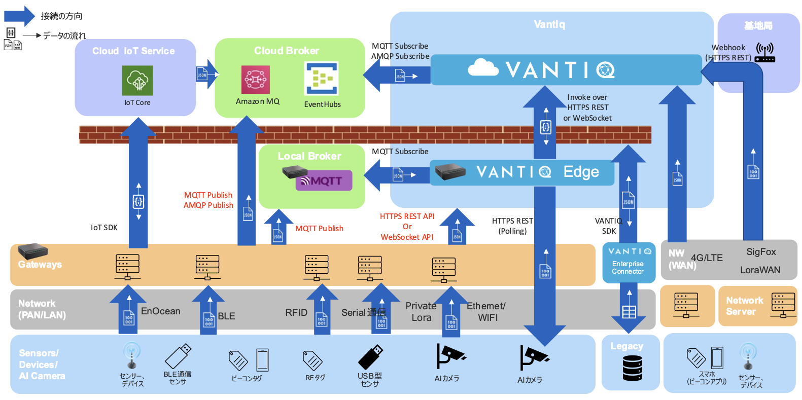

# Vantiqとデバイスとの連携

## 目的
この記事では、センサー/デバイスからVantiqまでのデータ連携パターンと、それぞれの接続コードサンプルを説明します。この記事を正しく表示するには、[mermaid プラグイン](https://github.com/BackMarket/github-mermaid-extension) が必要です。

## Edge ~ Vantiq構成パターン / Integration Map

### Dataflow Patterns
ゲートウェイからRESTでVantiq Topicに送るパターン。

ゲートウェイからMQTT Brokerを使うパターン。

IoT Core/ IoT Hubを使用するパターン。

Vantiq Edgeを使用するパターン。

### ガイドライン / Guideline
- [Edge~Vantiq構成 データ連携 ガイドライン](./docs/jp/device-to-vantiq.md)
- [Edge - Vantiq configuration Data integration Guideline](./docs/en/device-to-vantiq.md)

### コネクターのテンプレート / Connector Template
- [Python Code](./conf/vantiq-restapi-mqtt-amqp-python-sample)
  - HTTPS REST API (Python)
  - WebSocket API (Python)
  - MQTT Publish (Python)
  - AMQP Publish (Python)

- [Vantiq Project](./conf/vantiq-restapi-mqtt-amqp-python-sample/vantiq-project-sample.zip)
  - MQTT Source
  - AMQP Source
  - Topic – Websocket subscribe
  - Topic – Websocket publish
  - Topic - REST

### デバイスの接続サンプルコード / Device Integration Sample Code
- オムロン環境センサー / Omron Ambient Sensor 2JCIE-BU01, 2JCIE-BL01
