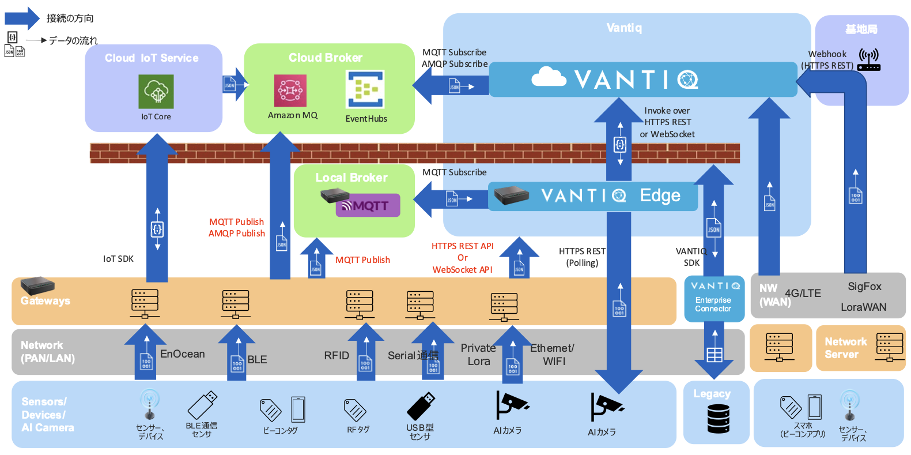
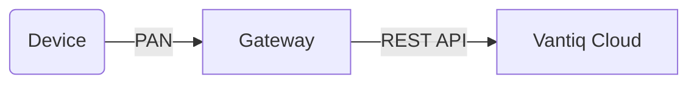
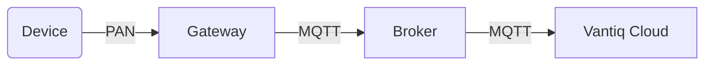
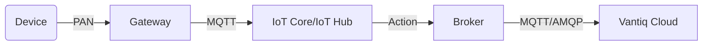
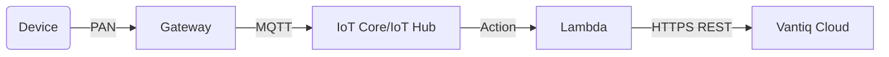
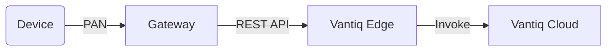

# Vantiq with Devices Integration

## Purpose
This article describes the data integration patterns from sensors/devices to the Vantiq, and the sample connection code for each. To view this article properly, [mermaid plugin](https://github.com/BackMarket/github-mermaid-extension) must be installed.   

## Edge - Vantiq configuration patterns/Integration Map

### Dataflow Patterns
Pattern sending from a Gateway to the Vantiq Topic via REST.

Pattern sending from a Gateway using MQTT Broker.

Pattern using IoT Core/IoT Hub.

Pattern using the Vantiq Edge.

## Guideline
  - [Edge - Vantiq configuration Data integration Guideline](./docs/eng/device-to-vantiq.md)

## Connector Template
  - [Python Code](./conf/vantiq-restapi-mqtt-amqp-python-sample) / [Vantiq Project](./conf/vantiq-restapi-mqtt-amqp-python-sample/vantiq-project-sample.zip)
    - HTTPS REST API
    - WebSocket API
    - MQTT Publish
    - MQTT Subscribe
    - AMQP Publish
  - [fluentd](./docs/eng/fluentd.md) - It is used when the metrics data acquired by the device is output in flat file format to a log file, etc.

## Device Integration Sample Code
  - [Omron Ambient Sensor 2JCIE-BU01, 2JCIE-BL01](./conf/omron-env-sensor-sample/README_en.md) 
